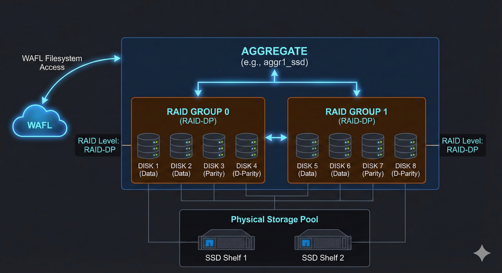

# 🏗️ NetApp ONTAP: The Definitive Aggregate Guide 🚀

This guide covers the entire lifecycle of a NetApp Aggregate: from identifying spare disks and calculating RAID groups to creation, daily maintenance, and safe decommissioning.
## The Aggregate provides the physical storage blocks, and WAFL manages the logical organization of those blocks.


---

## 📋 Table of Contents
1. [Phase 1: Preparation & Planning](#phase-1-preparation--planning)
2. [Phase 2: Creating the Aggregate](#phase-2-creating-the-aggregate)
3. [Phase 3: Verification & Health Checks](#phase-3-verification--health-checks)
4. [Phase 4: Expansion (Adding Disks)](#phase-4-expansion-adding-disks)
5. [Phase 5: Maintenance & Operations](#phase-5-maintenance--operations)
6. [Phase 6: Safe Deletion](#phase-6-safe-deletion)

---

## 🧐 Phase 1: Preparation & Planning
*Before building, you must identify your available resources (bricks).*

### 1. Identify Spare Disks
You need "Spare" disks to build an aggregate. Partitioned disks (ADP) may show as "shared".

```bash
# Show all spare disks in the cluster
storage disk show -container-type spare

# Show spares sorted by type (SSD vs SAS) and usable size
storage disk show -container-type spare -fields type,usable-size,checksum-compatibility

# Check if you have enough spares for a specific RAID type (e.g., RAID-DP requires 2 parity disks)
storage disk show -count
```

### 2. Simulate the Creation (Dry Run)
*Highly Recommended.* This tells you exactly how much usable space you will get after RAID overhead, without actually creating anything.

```bash
# Simulate creating a 20-disk aggregate
storage aggregate create -aggregate aggr_test -diskcount 20 -simulate

# Check the output for "Total Usable Space" vs "Total Physical Space"
```

---

## 🔨 Phase 2: Creating the Aggregate
*Constructing the storage pool. Choose the method that fits your requirements.*

### Option A: Automatic Selection (The "Easy Button")
Let ONTAP choose the best disks and RAID group sizing. Best for standard deployments.

```bash
# Create an SSD aggregate with 24 disks using RAID-DP
storage aggregate create -aggregate aggr1_ssd -diskcount 24 -raidtype raid_dp

# Create an aggregate on a specific node
storage aggregate create -aggregate aggr1_node1 -node <Node_Name> -diskcount 24
```

### Option B: Manual Selection (The "Control Freak")
Use this if you need to pick specific disks (e.g., from a specific shelf or loop).

```bash
# Create using a specific list of disks
storage aggregate create -aggregate aggr2_manual -disklist 1.10.0,1.10.1,1.10.2,1.10.3 -raidtype raid_dp
```

### Option C: Mirrored Aggregate (SyncMirror)
Required for MetroCluster or high-redundancy setups. Requires two distinct pools of disks.

```bash
# Create a mirrored aggregate (requires equal spares on both 'plexes')
storage aggregate create -aggregate aggr3_mirrored -diskcount 20 -mirror true
```

---

## 👀 Phase 3: Verification & Health Checks
*Inspect the foundation immediately after building.*

```bash
# 1. Verify Status (Target: State=online, Status=normal)
storage aggregate show

# 2. Check RAID Layout
# Verify which disks are Data, Parity, or D-Parity
storage aggregate show-status

# 3. Check Space Efficiency
# Ensure you aren't already hitting space warnings (should be 0% used)
storage aggregate show-space
```

---

## 📈 Phase 4: Expansion (Adding Disks)
*Running out of space? Add more disks to the pool.*

> **⚠️ Warning:** You generally **cannot remove** disks once added. Expansion is permanent until you destroy the aggregate.

```bash
# Add 12 spare disks to an existing aggregate
# ONTAP will append them to existing RAID groups or create a new RAID group if needed.
storage aggregate add-disks -aggregate aggr1_ssd -diskcount 12

# (Optional) Manually specify which disks to add
storage aggregate add-disks -aggregate aggr1_ssd -disklist 2.10.0,2.10.1
```

---

## 🔧 Phase 5: Maintenance & Operations
*Day-to-day tasks to keep the aggregate healthy.*

### 1. Renaming
```bash
# Rename to match your naming convention
storage aggregate rename -aggregate aggr1_ssd -newname AGGR_Flash_Prod_01
```

### 2. Scrubbing (RAID Health)
RAID scrubbing reads disk sectors to find latent media errors and correct parity.

```bash
# Manually start a scrub
storage aggregate scrub start -aggregate AGGR_Flash_Prod_01

# Check the status of a running scrub
storage aggregate scrub show
```

### 3. Relocation (HA Failover Test)
Move the aggregate to the HA partner node (only for un-mirrored aggregates).

```bash
# Move aggregate to the other controller
storage aggregate relocation start -aggregate AGGR_Flash_Prod_01 -destination <Partner_Node>
```

### 4. Space Monitoring
```bash
# Show aggregates that are dangerously full (>90%)
storage aggregate show-space -percent-used >90
```

---

## 🧨 Phase 6: Safe Deletion
*Decommissioning an aggregate. This is destructive and irreversible.*

### Step 1: Evacuate Data
You cannot delete an aggregate that contains volumes.

```bash
# Check for existing volumes
volume show -aggregate AGGR_Flash_Prod_01

# Move volumes to another aggregate (if needed)
volume move start -vserver <SVM> -volume <Vol_Name> -destination-aggregate <Other_Aggr>
```

### Step 2: Destroy
```bash
# 1. Take the aggregate offline
storage aggregate offline -aggregate AGGR_Flash_Prod_01

# 2. Delete the aggregate
# This wipes the RAID config and returns disks to the 'Spare' pool.
storage aggregate delete -aggregate AGGR_Flash_Prod_01
```

---
*Sulthan Sharief K S*
