```mermaid
graph TD
    %% --- Dark Mode & Neon Styling ---
    classDef neonCyan fill:#0a1a1a,stroke:#00ffff,stroke-width:3px,color:#00ffff;
    classDef neonPurple fill:#14051a,stroke:#b026ff,stroke-width:3px,color:#b026ff;
    classDef neonPink fill:#1a001a,stroke:#ff00ff,stroke-width:3px,color:#ff00ff;
    classDef neonGreen fill:#051a05,stroke:#39ff14,stroke-width:3px,color:#39ff14;
    classDef neonYellow fill:#1a1a00,stroke:#ccff00,stroke-width:3px,color:#ccff00;
    classDef neonRed fill:#1a0505,stroke:#ff3333,stroke-width:3px,color:#ff3333;
    classDef neonBlue fill:#000a1a,stroke:#0066ff,stroke-width:3px,color:#0066ff;
    classDef neonOrange fill:#1a0f00,stroke:#ff9900,stroke-width:3px,color:#ff9900;
    classDef neonWhite fill:#111111,stroke:#ffffff,stroke-width:3px,color:#ffffff;

    %% --- 1. Client & SAN Layer ---
    subgraph L1 [Client & Network Layer]
        direction LR
        HostA[Host Server A]:::neonCyan
        HostB[Host Server B]:::neonCyan
        SAN((SAN Fabric Switch)):::neonPurple
        HostA --> SAN
        HostB --> SAN
    end

    %% --- 2. Management Layer ---
    subgraph L2 [Out-of-Band Management]
        direction LR
        Admin[Admin PC]:::neonWhite --> MgmtSW[Mgmt Switch]:::neonWhite
        MgmtSW --> SVP[SVP / Storage Navigator]:::neonWhite
    end

    %% --- 3. Hitachi VSP G-Series Controller Chassis ---
    subgraph L3 [Hitachi VSP Controller Chassis - Active/Active]
        direction TB
        
        %% Front End
        FED1[Front-End Dir 1]:::neonPink
        FED2[Front-End Dir 2]:::neonPink
        
        %% Central Fabric
        Fabric{Internal High-Speed Fabric}:::neonRed
        
        %% Processors
        MP1[MP Unit 1]:::neonGreen
        MP2[MP Unit 2]:::neonGreen
        
        %% Cache & Protection
        Cache1[(Volatile RAM 1)]:::neonYellow
        Cache2[(Volatile RAM 2)]:::neonYellow
        CFM[(Cache Flash Memory)]:::neonRed
        BATT[Backup Battery]:::neonRed
        
        %% Back End
        BED1[Back-End Dir 1]:::neonBlue
        BED2[Back-End Dir 2]:::neonBlue

        %% Internal Connections
        FED1 <==> Fabric
        FED2 <==> Fabric
        MP1 <==> Fabric
        MP2 <==> Fabric
        Cache1 <==> Fabric
        Cache2 <==> Fabric
        BED1 <==> Fabric
        BED2 <==> Fabric

        %% Cache specific paths
        Cache1 <.->|Mirroring| Cache2
        BATT -.->|Power on fail| CFM
        Cache1 -.->|Destage| CFM
        Cache2 -.->|Destage| CFM
    end

    %% --- 4. Storage Media Layer ---
    subgraph L4 [Drive Enclosures / DKU]
        direction LR
        FMD[Hitachi FMD]:::neonOrange
        NVMe[NVMe / SAS SSD]:::neonOrange
        HDD10K[10K SAS HDD]:::neonOrange
        HDDNLSAS[7.2K NL-SAS]:::neonOrange
    end

    %% --- Main Architecture Flow Links ---
    %% SAN to FED
    SAN ==>|FC / iSCSI| FED1
    SAN ==>|FC / iSCSI| FED2

    %% Management to Controllers
    SVP -.->|Configuration Data| MP1
    SVP -.->|Configuration Data| MP2

    %% BED to Disks
    BED1 ==>|SAS Paths| FMD & NVMe
    BED2 ==>|SAS Paths| HDD10K & HDDNLSAS

    %% --- General Link Styling ---
    linkStyle default stroke:#ffffff,stroke-width:2px;
```

# 🏗️ Hitachi VSP Hardware Architecture Breakdown ✨

Here is the detailed breakdown of the Hitachi VSP hardware architecture exactly as it is structured in the Mermaid diagram. This explains how the different layers interact to process data and manage the array, now with a bit of visual flair!

## 📑 Table of Contents
1. [1. Client & Network Layer (The Front Door) 🌐](#client-layer)
2. [2. Out-of-Band Management Layer (The Control Room) 🎛️](#mgmt-layer)
3. [3. Controller Chassis Layer (The Brain & Engine) ⚡](#chassis-layer)
4. [4. Storage Media Layer (The Vault) 🗄️](#media-layer)
5. [Putting it all together: The Flow of a Write Operation ✍️](#write-flow)

---

---

### **1. Client & Network Layer (The Front Door) 🌐**
* **Host Servers (A & B) 🖥️:** These are the application servers (ESXi, Windows, Linux) that need storage to run their databases and apps.
* **SAN Fabric Switch 🔀:** The hosts do not connect directly to the storage. They connect to a Fibre Channel (FC) or IP (iSCSI) switch, which acts as the traffic controller. 
* **The Connection 🔗:** The SAN fabric routes the I/O traffic from the hosts directly into the **Front-End Directors (FEDs)** on the storage array.

---

### **2. Out-of-Band Management Layer (The Control Room) 🎛️**
* **Admin PC & Mgmt Switch 💻:** This represents your laptop and your data center's standard internal IP network.
* **SVP (Service Processor) 🧠:** The brain of the management interface. It hosts the Storage Navigator UI where you do all your provisioning.
* **The Connection 📡:** Notice the dotted lines in the diagram. The SVP connects *only* to the internal processors (MPs) to push configuration changes (like creating LUNs). It **never** touches the actual user data (the solid lines). If the SVP goes offline, the SAN keeps running perfectly! 🛡️

---

### **3. Controller Chassis Layer (The Brain & Engine) ⚡**
This is the core of the VSP. It is an "Active/Active" system 🤝, meaning both Controller 1 and Controller 2 are processing data simultaneously to share the load and provide ultimate redundancy.

* **Front-End Directors (FED 1 & 2) 🚪:** These are the target ports. They receive the raw reads and writes from the SAN, translate the FC/iSCSI protocols, and pass the data inside the chassis.
* **Internal High-Speed Fabric 🛣️:** Think of this as the central multi-lane superhighway of the array (PCIe or Hi-Star Crossbar). Every internal component plugs into this fabric, allowing massive amounts of data to move between ports, processors, and memory without bottlenecks.
* **MP Units (Processors 1 & 2) ⚙️:** The heavy lifters. They calculate RAID parity, manage Dynamic Provisioning (thin LUNs), handle deduplication, and figure out exactly where data needs to go. 
* **Cache (Volatile RAM 1 & 2) 🚄:** *All* data written to or read from the array lands here first. Because RAM is lightning-fast, the array acknowledges the write to the host immediately, keeping latency near zero. 
    * **Mirroring 🪞:** Anything written to Cache 1 is instantly copied to Cache 2 so data is never lost if a controller suddenly dies.
* **BATT & CFM (The Safety Net) 🔋:** RAM is volatile (loses data if power drops). If the data center loses power, the **Backup Battery (BATT)** kicks in. It powers the controllers just long enough to take the unwritten data in RAM and "destage" (flush) it into the **Cache Flash Memory (CFM) 💾**, which is permanent. 
* **Back-End Directors (BED 1 & 2) 🔌:** Once data is ready to be permanently stored, it leaves the Cache and hits the BEDs. The BEDs translate the data into SAS commands and push it down the cables to the physical hard drives.

---

### **4. Storage Media Layer (The Vault) 🗄️**
* **Drive Enclosures (DKU) 🏢:** These are the physical shelves holding the disks. They are connected to the BEDs via redundant, looped SAS cables (so if a cable is cut ✂️, the array can still read the drives from the other direction).
* **Media Types 💽:** The array mixes different drives to balance cost and speed:
    * **FMD (Flash Module Drive) 🚀:** Hitachi’s custom flash drives with their own built-in processors to handle compression natively.
    * **NVMe / SAS SSD 🏎️:** Standard high-speed flash for Tier 1 performance.
    * **10K SAS HDD 🏃:** Spinning disks for Tier 2 (everyday workloads).
    * **7.2K NL-SAS 🐢:** Large, slow, cheap spinning disks for Tier 3 (archives/backups).

---

### **Putting it all together: The Flow of a Write Operation ✍️**
1. **Host A** sends a file to save. It travels through the **SAN** to **FED 1** 🌐.
2. **FED 1** pushes the data across the **Fabric** into **Cache 1** ⚡.
3. **Cache 1** instantly mirrors the data to **Cache 2** over the fabric 🪞.
4. The array tells Host A, *"I've saved it!"* ✅ (even though it's technically only in the ultra-fast RAM).
5. Later, the **MP Unit** does the RAID math 🧮, pulls the data from Cache, and sends it to **BED 1**.
6. **BED 1** pushes the data down the SAS cables to be permanently saved on a **SAS SSD** in the drive enclosure 🔒.
