# 📡 Standard Operating Procedure: Hitachi Hi-Track (Remote Ops) Architecture
**System:** Hitachi VSP Series (Mid-Range & Enterprise)  
**Context:** Detailed Architecture, Roles, Connection Flow, and Status Verification  

---

## **Table of Contents 📑**
* [1. Purpose & Evolution (Why it is used) 🎯](#1-purpose-evolution)
* [2. Detailed Architecture Diagram 🏛️](#2-detailed-architecture-diagram)
* [3. Connection Flow (How it connects to the array) 🔌](#3-connection-flow)
* [4. Standard Operating Procedure: Roles & Responsibilities 🧑‍💻](#4-roles-responsibilities)
* [5. SOP: Checking the Status of Remote Ops 🛠️](#5-checking-status)

---

## **1. Purpose & Evolution (Why it is used) 🎯**
Historically known as **Hi-Track**, Hitachi has modernized this critical "call-home" service as **Hitachi Remote Ops**. It is heavily relied upon in enterprise data centers for:
* **Automated Parts Dispatch:** When a hardware component fails, the system generates a Service Information Message (SIM). Remote Ops sends this to the Hitachi Global Support Center (GSC), auto-triggering a replacement part shipment.
* **Predictive Analytics:** Collects telemetry data for trend analysis, allowing Ops Center Clear Sight to identify performance bottlenecks or capacity issues proactively.
* **Remote Maintenance:** Allows Hitachi Support to securely push microcode (firmware) updates and collect system dump files without an on-site technician.

---

## **2. Detailed Architecture Diagram 🏛️**
Here is the logical flow of telemetry and alerts from the physical disks to the Hitachi Cloud, mapped out in detail.

```mermaid
graph LR
    %% Styling Definitions
    classDef array fill:#f0f4f8,stroke:#102a43,stroke-width:2px,color:#102a43
    classDef lan fill:#e3f8fa,stroke:#00848c,stroke-width:2px,color:#004d56
    classDef internet fill:#eff6ff,stroke:#1e3a8a,stroke-width:2px,color:#1e3a8a
    classDef component fill:#ffffff,stroke:#627d98,stroke-width:1px,color:#334e68

    subgraph VSP [🏢 Hitachi VSP Array]
        direction TB
        DKC[💽 Storage DKC <br> Disks & Cache]:::component
        SVP[⚡ SVP / GUM <br> Management Controller]:::component
        DKC -- Internal Maintenance LAN --> SVP
    end

    subgraph CustomerLAN [🌐 Customer Management LAN]
        direction TB
        Agent[🖥️ Remote Ops Monitor Agent <br> Windows/Linux VM]:::component
        Redact[🛡️ Redaction Engine <br> Strips IPs/Hostnames]:::component
        Encrypt[🔐 Encryption Module <br> SSL/TLS]:::component
        FW[🧱 Corporate Firewall <br> Outbound Rule Only]:::component

        Agent --> Redact
        Redact --> Encrypt
        Encrypt --> FW
    end

    subgraph Cloud [☁️ The Internet / Hitachi Cloud]
        GSC[🌐 Hitachi GSC <br> Ops Center Clear Sight]:::component
    end

    %% Network Connections
    SVP -- "SNMP Traps / REST Polling<br>(Port 162 / 443)" --> Agent
    FW == "Secure Outbound Tunnel<br>TCP Port 443 (HTTPS)" ==> GSC

    %% Apply Classes
    class VSP array
    class CustomerLAN lan
    class Cloud internet
```

---

## **3. Connection Flow (How it connects to the array) 🔌**
1. **The Array Generation:** The physical components (DKC) log errors internally.
2. **The SVP/GUM Aggregation:** The Service Processor (SVP) or Gateway (GUM) acts as the local brain, converting these hardware errors into standard SIMs (Service Information Messages).
3. **The Agent Polling:** The **Hitachi Remote Ops Monitor Agent** (installed on a dedicated Windows/Linux VM in your environment) constantly polls the SVP over the local network. 
4. **The Trap Push:** If a critical error occurs, the SVP doesn't wait for a poll; it instantly fires an SNMP Trap to the Monitor Agent.
5. **The Secure Outbound Link:** The Agent encrypts the payload, optionally redacts sensitive hostnames/IPs via its redaction engine, and pushes it outbound via HTTPS (Port 443) through your corporate firewall to Hitachi.

---

## **4. Standard Operating Procedure: Roles & Responsibilities 🧑‍💻**

### **Storage Administrator (Level 2/3) 🖲️**
* **Array Configuration:** Log into the array's Maintenance Utility (MU) and configure the Alert Notifications (SNMP) to point directly to the local Remote Ops Monitor Agent's IP address.
* **Agent Registration:** Log into the Remote Ops Monitor Agent web GUI, input the VSP's SVP IP credentials, and register the array to begin polling.
* **Health Monitoring:** Periodically check the Agent GUI to ensure the array shows as "Registered" and polling is active.

### **Network / Security Administrator 🛡️**
* **Internal Routing:** Ensure routing and internal firewalls allow the array's SVP IP to communicate with the Monitor Agent VM IP.
* **External Firewall Rule:** Create a strict **Outbound-Only** firewall rule allowing the Monitor Agent VM to communicate over TCP Port 443 to Hitachi's specific Gateway IPs. (No inbound connection is required; the Agent establishes the tunnel).

### **Hitachi Vantara Global Support Center (GSC) 🌐**
* **Monitoring & Dispatch:** Receive the encrypted payload, decode the SIM, and dispatch local field engineers with replacement drives/parts.
* **Remote Triage:** Utilize the established secure tunnel to pull detailed dump files for Level 3 engineering analysis during an outage.

---

## **5. SOP: Checking the Status of Remote Ops 🛠️**
If you suspect the call-home feature is failing, you must verify the connection at three different layers.

### **Method A: Checking the Local Monitoring Agent (The Server)**
1. Log in to the Windows/Linux server hosting the **Remote Ops Monitor Agent**.
2. Open a web browser and access the local GUI (typically `https://localhost:443` or `https://[Agent-IP]:443`).
3. Navigate to the **Device Status** or **Dashboard** tab.
4. Verify your VSP array is listed, shows a **Registered** status, and the **Last Polling Date / Last Upload Date** is current (polling occurs daily, or up to every 2.5 minutes during active errors).

### **Method B: Checking the Array via Maintenance Utility (MU)**
1. Log in to the array's **Maintenance Utility**.
2. Navigate to **Administration** -> **Alert Notifications**.
3. Verify that the array's SNMP traps are successfully pointing to the IP address of your Remote Ops Monitor Agent server.
4. *For modern arrays (E-Series/VSP One):* Look for the dedicated **Remote Ops** or **Call Home** tab in the MU and click **Test Call**. Verify it says "Success."

### **Method C: Verification via Hitachi Cloud Dashboard**
1. Log in to the **Hitachi Support Connect** portal using your corporate credentials.
2. Navigate to **Ops Center Clear Sight**.
3. Search for your storage system by its Serial Number. 
4. If the array's configuration data, capacity forecasts, and health status are visible and up-to-date in the cloud dashboard, your Hi-Track/Remote Ops architecture is fully functional.
