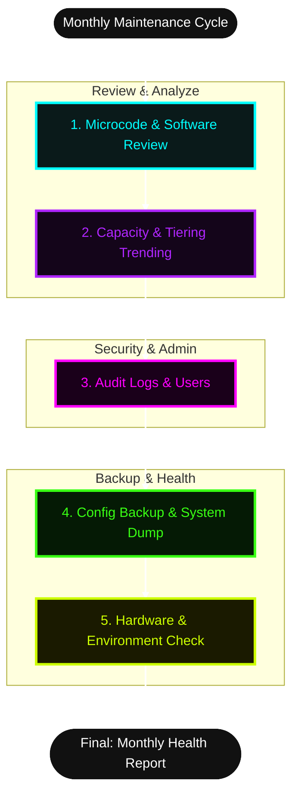

# 📅 Standard Operating Procedure: Monthly Storage Maintenance & Deep-Dive Review
**System:** Hitachi VSP G-Series / F-Series / G1000 / G1500  
**Management Tool:** Hitachi Storage Navigator (SN) / Maintenance Utility (MU)  

## 📑 Table of Contents
1. [1. Purpose 🎯](#purpose)
2. [2. Prerequisites 📋](#prereq)
3. [3. Procedure 🛠️](#procedure)
   * [Step 1: Microcode (Firmware) & Software Version Review 🔄](#step1)
   * [Step 2: Deep-Dive Capacity & Performance Trending 📈](#step2)
   * [Step 3: Security & Audit Log Review 🛡️](#step3)
   * [Step 4: System Configuration Backup & Log Export 💾](#step4)
   * [Step 5: Hardware & Environmental Health Check 🌡️](#step5)
4. [4. Verification & Reporting ✅](#verification)

---

---

## **1. Purpose 🎯**
This SOP defines the monthly administrative tasks required to maintain the long-term health, security, and performance of the Hitachi Virtual Storage Platform (VSP). This includes firmware (microcode) reviews, capacity trending, and configuration backups to ensure compliance with enterprise storage standards.

---

## **2. Prerequisites 📋**
* **Access Level**: **Security Administrator** and **Storage Administrator** privileges are required.
* **Interfaces**: Access to both **Hitachi Device Manager - Storage Navigator (SN)** and the **Maintenance Utility (MU)** via the SVP.
* **Vendor Access**: Active Hitachi Vantara Support portal credentials (to verify current Target Code/Microcode).

---

## **3. Procedure 🛠️**

### **Step 1: Microcode (Firmware) & Software Version Review 🔄**
*VSP arrays require periodic microcode updates to patch vulnerabilities and improve stability.*
* Log in to the **Maintenance Utility (MU)** via the SVP IP address.
* Navigate to **System Management** > **System Information**.
* Record the current **Microcode Version** (e.g., `83-05-xx-xX/XX`).
* Log in to the **Hitachi Vantara Support Connect** portal.
* Cross-reference your recorded microcode against the published **Target Code** for your specific array model.
* **Action**: If your microcode is more than one major release behind the Target Code, schedule a maintenance window and open a Service Request (SR) with Hitachi to plan an upgrade.

### **Step 2: Deep-Dive Capacity & Performance Trending 📈**
*Unlike daily checks, monthly checks focus on growth rates and rebalancing.*
* In **Storage Navigator**, navigate to **Pools**.
* Review the **DP (Dynamic Provisioning) Pools**:
    * Check the **Depletion Threshold** and **Warning Threshold** percentages.
    * Compare current **Used Capacity** against the previous month's data to calculate the 30-day growth rate.
* Navigate to **Analytics / Performance Monitor**.
* Review the **Tiering Policy** effectiveness (if Dynamic Tiering/HDT is enabled):
    * Ensure pages are successfully relocating between Tier 1 (Flash/NVMe), Tier 2 (SAS), and Tier 3 (NL-SAS).
    * Check for "Relocation Failed" or "Bypass" events, which indicate tier bottlenecks.

### **Step 3: Security & Audit Log Review 🛡️**
*Ensure no unauthorized changes were made and clean up stale access.*
* In **Storage Navigator**, navigate to **Administration** > **Audit Log**.
* Click **Download** to export the last 30 days of audit logs as a `.csv` file.
* Review the logs for:
    * Failed login attempts (Lockouts).
    * Unauthorized LDEV deletions or mapping changes.
* Navigate to **Administration** > **User Groups**.
* Review active user accounts. Disable or delete accounts for users who have left the organization or no longer require storage access.

### **Step 4: System Configuration Backup & Log Export 💾**
*Hitachi support requires system dumps for troubleshooting. Monthly backups ensure you have a baseline.*
* **Configuration Backup**:
    * In **Maintenance Utility**, navigate to **Administration** > **Configuration Backup**.
    * Click **Backup** to generate and download the system configuration file. Store this in your secure enterprise password vault or repository.
* **System Dump (Optional/Proactive)**:
    * Navigate to **Administration** > **Export Tool**.
    * Select **Normal Dump** and execute.
    * *Note:* This process can take 30–60 minutes. Once generated, download the file to a local secure server. This drastically speeds up resolution time if a critical hardware failure occurs later.

### **Step 5: Hardware & Environmental Health Check 🌡️**
*Verify the physical environment of the array.*
* In **Maintenance Utility**, navigate to **Hardware** > **Environmental Status**.
* Review the status of:
    * **Power Supplies (PSU)**: Ensure both feeds are drawing balanced power.
    * **Fans**: Check for RPM warnings.
    * **Temperature**: Ensure cache and controller temperatures are within the normal operating range (typically below 35°C / 95°F inlet).
    * **Batteries/Cache Flash**: Check the lifecycle status of the backup batteries (BATT). Hitachi VSP batteries have a lifespan; note any "Replacement Required" warnings.

---

## **4. Verification & Reporting ✅**
* Compile the findings into the **Monthly Storage Health Report**.
* Document the following key metrics:
    1. Current Microcode Version vs. Target Code.
    2. 30-Day Pool Growth Rate (GB/TB consumed).
    3. List of decommissioned User Accounts.
    4. Confirmation of successful Configuration Backup.
* Submit the report to the IT Infrastructure Manager or relevant stakeholders.

---
