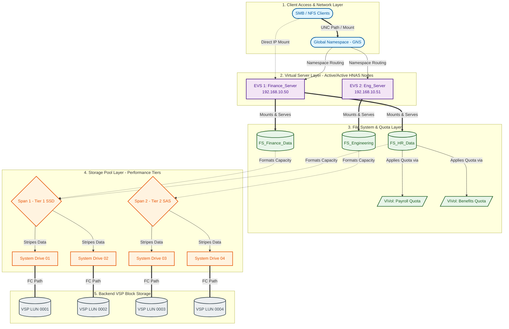

# 🏛️ Hitachi NAS (HNAS) Architecture & Terminology Guide

Understanding Hitachi Network Attached Storage (HNAS) requires thinking in layers. HNAS acts as a high-performance gateway between block storage (the backend SAN) and file storage (the frontend network). 

Here is the detailed architectural breakdown of HNAS terminologies, structured from the physical backend disks up to the logical network shares.

---

## **1. Core Architectural Terminologies**

| Terminology | Abbreviation | Definition & Role |
| :--- | :--- | :--- |
| **System Drive** | SD | The foundational storage building block. An SD is simply a block-level LUN presented from the backend Hitachi VSP array to the HNAS gateway via Fibre Channel. |
| **Span** | - | A storage pool made by aggregating multiple System Drives. Spans stripe data across the underlying SDs for performance and provide a unified pool of raw capacity. |
| **Chunk** | - | The internal allocation unit of a Span (typically 17MB). When HNAS writes data, it allocates chunks from the Span to ensure data is evenly distributed across all SDs. |
| **File System** | FS | A logical, formatted container created *inside* a Span. HNAS uses an object-based file system (WFS) that supports thin provisioning, deduplication, and snapshots. |
| **Virtual Volume** | ViVol | A logical subdivision within a File System. ViVols act like directory quotas or sub-file systems, allowing you to apply specific snapshot policies or size limits to different departments sharing the same File System. |
| **Enterprise Virtual Server** | EVS | A logical, virtualized NAS server. An EVS acts as an independent file server with its own IP addresses, routing tables, active directory computer account, and CIFS/NFS configurations. |
| **Global Namespace** | GNS | A feature that abstracts physical server names, allowing you to present a single, unified directory tree to users, even if the folders physically reside across multiple different EVSs or File Systems. |

---

## **2. How They Are Connected (The Bottom-Up Flow)**

To understand how these components interact, follow the data path from the physical storage array up to the user's laptop.

1. **Provisioning the Backend (SAN Layer):** The storage administrator carves out block-level LUNs on the backend VSP array and maps them to the HNAS gateway's Fibre Channel ports.
2. **Creating the System Drives (SD):** HNAS scans its Fibre Channel ports, discovers these LUNs, and labels them as **System Drives**.
3. **Building the Span (Pool Layer):** You group these System Drives together to form a **Span**. This creates a large, high-performance pool of raw storage.
4. **Formatting the File System (FS Layer):** You carve out a **File System** from the Span's available capacity. You can create multiple File Systems within a single Span.
5. **Assigning to an EVS (Server Layer):** A File System cannot talk to the network on its own. It must be explicitly mounted to an **Enterprise Virtual Server (EVS)**. The EVS acts as the "owner" of that File System.
6. **Creating the Export (Network Layer):** Finally, you create an SMB/CIFS Share or an NFS Export on the File System. Because the File System is bound to the EVS, users access the share by connecting to the EVS's specific IP address.

---

## **3. The Role of the EVS in High Availability (Clustering)**

The **EVS** is the most critical concept for HNAS clustering and failover. 

HNAS gateways are typically deployed in active/active clusters (nodes). 
* An EVS is a logical entity that "floats" on top of the physical HNAS nodes.
* If physical Node 1 fails, the EVS (along with its IP addresses and all its attached File Systems) instantly migrates to physical Node 2.
* Because the users are mapped to the EVS IP address, they experience a brief pause, but the connection remains intact without needing to remap their network drives.

---

Are you currently setting up a new HNAS environment, or are you looking to troubleshoot an existing configuration?
