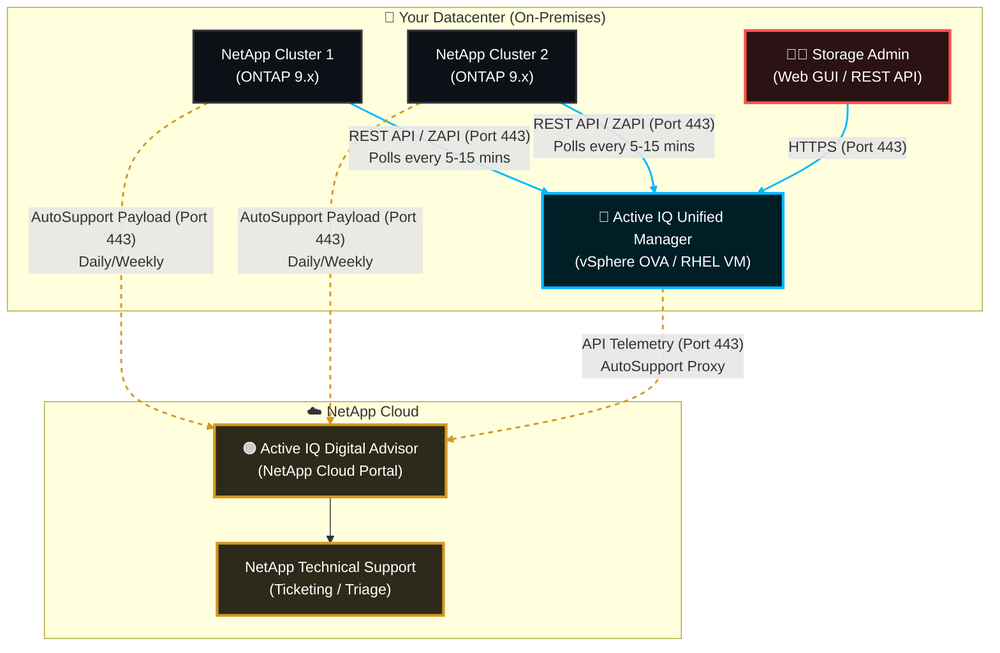

# 🧠 NetApp Active IQ Architecture & Data Collection Deep Dive 📊

To understand "Active IQ," we first have to clear up a common naming confusion in the NetApp ecosystem. Active IQ is actually divided into two distinct but interconnected halves:

1. **Active IQ Unified Manager (AIQUM):** The **on-premises** software you deploy in your datacenter. It provides real-time alerting, performance troubleshooting, and capacity planning.
2. **Active IQ Digital Advisor:** The **cloud-based** NetApp web portal. It uses global machine learning to provide predictive risk analysis, firmware recommendations, and hardware lifecycle tracking.

Here is the complete architecture, deployment strategy, and exact data-gathering mechanics.

---

## 📋 Table of Contents
1. [🏗️ Active IQ Enterprise Architecture Diagram](#architecture)
2. [⚙️ How It Gathers Data (The Mechanics)](#mechanics)
3. [🚀 Deployment Architecture (AIQUM)](#deployment)
4. [🔌 Network & Firewall Port Requirements](#ports)
5. [📚 Official NetApp Documentation Reference](#references)

---

## 🏗️ 1. Active IQ Enterprise Architecture Diagram

---

## ⚙️ 2. How It Gathers Data (The Mechanics)

Active IQ does not use agents installed on your servers or clients. It relies entirely on storage-native APIs and AutoSupport payloads.

### Mechanism A: The On-Premises Polling (AIQUM)
Active IQ Unified Manager acts as the central nervous system for your local datacenter.
1. **The API Connection:** You add a cluster to AIQUM using a dedicated ONTAP Admin account (e.g., `umadmin`).
2. **REST API & ZAPI:** For modern ONTAP (9.6+), AIQUM primarily uses NetApp REST APIs to query the cluster. For older versions, it falls back to proprietary ZAPIs (ONTAPI).
3. **The Polling Cycles:**
   * **Health & Capacity:** AIQUM queries the cluster every **15 minutes** to map out aggregates, volumes, Qtrees, and quotas.
   * **Performance:** AIQUM queries the cluster every **5 minutes** to pull raw IOPS, latency, and throughput counters from every disk, LIF, and volume.
4. **Database:** AIQUM stores this data locally in an embedded MySQL database, holding up to 30 days of high-granularity performance data.

### Mechanism B: The Cloud Telemetry (AutoSupport)
To feed the Machine Learning engine in the Active IQ Digital Advisor cloud, ONTAP uses **AutoSupport (ASUP)**.
1. **Event-Driven:** If a disk fails or a node panics, ONTAP immediately encrypts a diagnostic payload and sends it to `support.netapp.com` via HTTPS. This auto-generates a support ticket.
2. **Scheduled (Daily/Weekly):** ONTAP compiles a massive XML/JSON payload containing system configuration, firmware versions, and aggregated performance trends, sending it to NetApp daily.
3. **The AI Engine:** The NetApp cloud analyzes your ASUP payload against millions of other NetApp systems globally to warn you about known bugs before you hit them.

*(Note: If your clusters are in a highly secure "dark site" without internet access, AIQUM can be configured to act as an AutoSupport Proxy server, brokering the secure connection to NetApp).*

---

## 🚀 3. Deployment Architecture (AIQUM)

Active IQ Unified Manager is deployed on-premises as a dedicated virtual machine or server. NetApp offers three supported deployment form factors:

| Form Factor | Best For | Architecture Notes |
| :--- | :--- | :--- |
| **VMware vApp (OVA)** | 90% of Enterprises | *Recommended.* A pre-packaged virtual appliance built on a hardened Linux kernel. Deploys in minutes via vCenter. Contains embedded MySQL and Java. |
| **Red Hat / CentOS** | Strict Linux OS policies | You provide a bare-metal or VM running RHEL/CentOS/Rocky Linux. You install the `.rpm` package. Allows your team to manage the OS patching. |
| **Windows Server** | Windows-only shops | Installed via `.exe` on Windows Server. Requires you to independently manage OS licensing and patching. *Not recommended unless mandated by policy.* |

**Sizing Requirements (General Rule of Thumb for Mid-Size Environments):**
* **vCPU:** 4 to 8 cores
* **RAM:** 12GB to 24GB (AIQUM is very Java-heavy)
* **Storage:** 150GB to 200GB Thick Provisioned (Requires high IOPS for the MySQL performance database).

---

## 🔌 4. Network & Firewall Port Requirements

To successfully deploy AIQUM and enable data gathering, your network and security teams must open the following firewall ports:

### Internal Datacenter (AIQUM ↔ NetApp Clusters)
| Port | Protocol | Direction | Purpose |
| :--- | :--- | :--- | :--- |
| **443** | TCP | AIQUM ➡️ Cluster | **CRITICAL.** Used for REST API/ZAPI polling to gather all health and performance data. |
| **22** | TCP | AIQUM ➡️ Cluster | Optional. Used for specific advanced diagnostic CLI commands. |
| **514** | UDP/TCP | Cluster ➡️ AIQUM | Optional. Used if you want ONTAP to send raw Syslog data to Unified Manager. |
| **162** | UDP | Cluster ➡️ AIQUM | Optional. Used if you configure ONTAP to send SNMP traps to Unified Manager. |

### External Internet (Clusters/AIQUM ↔ NetApp Cloud)
| Port | Protocol | Direction | Purpose |
| :--- | :--- | :--- | :--- |
| **443** | TCP | Cluster ➡️ `support.netapp.com` | **CRITICAL.** Required for ONTAP to send AutoSupport telemetry to Active IQ Digital Advisor. |
| **443** | TCP | AIQUM ➡️ `support.netapp.com` | Used to download ONTAP firmware baselines, Active IQ risk rules, and upload AIQUM database backups to support. |

---

## 📚 5. Official NetApp Documentation Reference

*All architectural concepts and port requirements are sourced from the official NetApp ONTAP and Active IQ Documentation Centers.*

| Component / Task | Official NetApp Documentation Reference |
| :--- | :--- |
| **AIQUM Architecture & Sizing** | [Docs: Unified Manager System Requirements](https://docs.netapp.com/us-en/active-iq-unified-manager/install-vapp/concept_requirements_for_installing_unified_manager.html) |
| **Port Requirements** | [Docs: Unified Manager Firewall Ports](https://docs.netapp.com/us-en/active-iq-unified-manager/install-vapp/reference_protocol_and_port_requirements.html) |
| **AutoSupport Architecture** | [Docs: AutoSupport Configuration Guide](https://docs.netapp.com/us-en/ontap/system-admin/setup-autosupport-task.html) |
| **Active IQ Digital Advisor** | [Docs: Active IQ Digital Advisor Documentation](https://docs.netapp.com/us-en/active-iq/) |
| **Adding a Cluster to AIQUM** | [Docs: Adding Clusters to Unified Manager](https://docs.netapp.com/us-en/active-iq-unified-manager/config/task_adding_clusters.html) |
