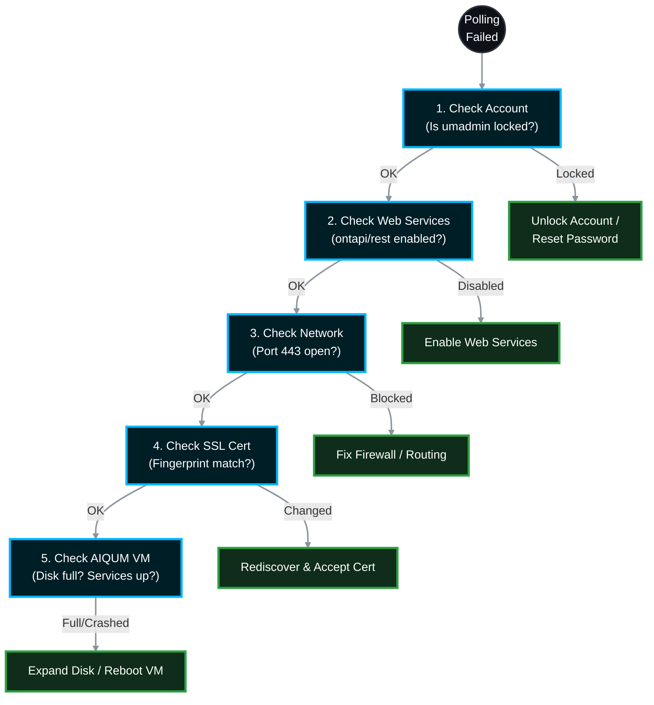

# 🚨 NetApp Active IQ Unified Manager: Detailed Polling Troubleshooting SOP 🛠️

When Active IQ Unified Manager (AIQUM) displays a cluster as **"Unreachable"**, **"Data Collection Failed"**, or **"Performance Data Collection Taking Too Long"**, you lose critical visibility into your storage environment. This Master Standard Operating Procedure (SOP) provides a deep-dive workflow to isolate and resolve API polling failures between AIQUM and your ONTAP clusters.

> 🏷️ **Rule:** Replace placeholders like `<cluster_name>`, `<Cluster_Management_IP>`, and `<username>` with your environment's specific details.

---

## 📋 Table of Contents
1. [🧭 Triage Matrix: Identifying the Symptom](#phase-1)
2. [🔐 Phase 1: Authentication & Account Verification](#phase-2)
3. [🌐 Phase 2: ONTAP Web Services & API Health](#phase-3)
4. [🧱 Phase 3: Network & Firewall Isolation](#phase-4)
5. [🪪 Phase 4: SSL Certificate Mismatch Resolution](#phase-5)
6. [💻 Phase 5: AIQUM Appliance Health (Disk/Services)](#phase-6)
7. [📚 Official NetApp Documentation Reference](#references)

---


---

<a id="phase-1"></a>
## 🧭 Triage Matrix: Identifying the Symptom
*Look at the specific error message in the AIQUM GUI (Storage Management > Cluster Setup) before diving into the CLI.*

| Error Message in AIQUM | Most Likely Culprit | Start Troubleshooting At |
| :--- | :--- | :--- |
| **Authentication Failed** | Account locked, password changed, or AD/LDAP unreachable. | Phase 1 |
| **Cluster Unreachable** | Firewall blocking Port 443, routing issue, or ONTAP web services down. | Phase 2 & 3 |
| **SSL Handshake Exception** | Cluster SSL certificate was recently renewed. AIQUM doesn't trust it. | Phase 4 |
| **Data Collection Taking Too Long** | AIQUM VM is starved for CPU/Disk IOPS, or ONTAP node is pegged at 100% CPU. | Phase 5 |

---

<a id="phase-2"></a>
## 🔐 Phase 1: Authentication & Account Verification
*The most common cause of polling failure is a locked polling account (usually `umadmin`). Security scanners (like Nessus or Qualys) often lock this account by hitting it with bad password attempts.*

### 1.1 Check the Account Status on the Cluster
> * 👥 **Responsible Team:** **Storage Team**
```bash
# Log into the ONTAP cluster CLI via SSH
security login show -vserver <cluster_name> -user-or-group-name umadmin
```

### 1.2 Unlock the Account (If Applicable)
> **🛠️ Action to Take:**
> If the `Is Locked` column says `true`:
```bash
security login unlock -username umadmin
```

### 1.3 Verify Application Permissions
> **🛠️ Action to Take:**
> AIQUM requires specific API access. Verify the `umadmin` user has `ontapi`, `http`, and `console` applications assigned with the `admin` role.
```bash
security login show -username umadmin -fields application,role
```
*(If you reset the password on the cluster, you MUST log into the AIQUM GUI > Cluster Setup, edit the cluster, and update the password there as well).*

---

<a id="phase-3"></a>
## 🌐 Phase 2: ONTAP Web Services & API Health
*AIQUM relies heavily on ONTAP's internal web server to deliver XML/JSON payloads. If the web service is disabled or hung, polling fails immediately.*

### 2.1 Verify Web Services are Enabled
> * 👥 **Responsible Team:** **Storage Team**
```bash
# Check if the web service engine is running on the cluster admin SVM
vserver services web show -vserver <cluster_name> -name ontapi
vserver services web show -vserver <cluster_name> -name rest
```
*Ensure `Enabled` is `true`. If it is `false`, run: `vserver services web modify -vserver <cluster_name> -name ontapi -enabled true`.*

### 2.2 Verify System Node Responsiveness
If the ONTAP management node is experiencing a memory leak or 100% CPU utilization, it will drop API requests to protect data-serving protocols.
```bash
# Check node health and CPU utilization
system node show -health true
node run -node * -command sysstat -c 5
```

---

<a id="phase-4"></a>
## 🧱 Phase 3: Network & Firewall Isolation
*If the account is unlocked and web services are running, the network path might be broken. You must test this **from the AIQUM appliance itself**, not from your laptop.*

### 3.1 Test Port 443 Connectivity from AIQUM
> * 👥 **Responsible Team:** **Storage / Network Team**
> Log into the AIQUM virtual appliance via SSH (using the `maintenance` or `root` user, depending on your OS).
```bash
# Test the API connection to the cluster's management IP
curl -vk https://<Cluster_Management_IP>/servlets/netapp.servlets.admin.XMLrequest_filer
```
**How to interpret the output:**
* **`Connection refused` or Timeout:** The network firewall is blocking Port 443, or there is a routing failure. *Engage Network Team.*
* **`401 Unauthorized`:** Network is perfect; the issue is 100% bad credentials (Go back to Phase 1).
* **`XML Parsing Error / 200 OK`:** Network is perfect; ONTAP is responding properly.

---

<a id="phase-5"></a>
## 🪪 Phase 4: SSL Certificate Mismatch Resolution
*AIQUM caches the SSL certificate footprint of the cluster when it is first added. If a storage admin renews the cluster SSL certificate (as per standard maintenance), AIQUM will instantly stop polling because it suspects a Man-in-the-Middle (MITM) attack.*

### 4.1 Force a Certificate Re-Acceptance
> * 👥 **Responsible Team:** **Storage Team**
1. Log into the **Active IQ Unified Manager Web GUI**.
2. Navigate to **Storage Management > Cluster Setup**.
3. Select the failing cluster and click the **Rediscover** button.
4. The GUI will pop up a warning: `"The SSL certificate for this cluster has changed."`
5. Click **Accept Certificate**. Polling will resume within 5 minutes.

---

<a id="phase-6"></a>
## 💻 Phase 5: AIQUM Appliance Health (Disk/Services)
*If **ALL** clusters suddenly stop polling simultaneously, the ONTAP side is likely fine. The AIQUM virtual appliance has probably crashed or run out of resources.*

### 5.1 Check the AIQUM Disk Space
> * 👥 **Responsible Team:** **Storage / Virtualization Team**
> The embedded MySQL database generates massive amounts of data. If the `/opt/netapp/data` partition hits 100%, the MySQL service crashes, halting all polling.

Log into the AIQUM appliance via SSH:
```bash
# Check disk partition utilization
df -h
```
*If any partition is at 100%, you must expand the VMDK in vCenter, then reboot the AIQUM appliance to expand the filesystem and restart MySQL.*

### 5.2 Restart the AIQUM Services
If disk space is fine, the Java threads might be deadlocked. A simple reboot of the vApp is the cleanest fix.
```bash
# If using the Linux/OVA appliance
systemctl restart ocie
systemctl restart ocieau
```
*(Alternatively, safely reboot the entire VM from vCenter).*

---

<a id="references"></a>
## 📚 Official NetApp Documentation Reference

*All diagnostic steps are aligned with official NetApp KB articles and product documentation.*

| Component / Task | Official NetApp Documentation Reference |
| :--- | :--- |
| **Unlocking User Accounts** | [Docs: security login unlock](https://docs.netapp.com/us-en/ontap-cli/security-login-unlock.html) |
| **Web Services Management** | [Docs: vserver services web](https://docs.netapp.com/us-en/ontap-cli/vserver-services-web-show.html) |
| **Port Requirements** | [Docs: Unified Manager Firewall Ports](https://docs.netapp.com/us-en/active-iq-unified-manager/install-vapp/reference_protocol_and_port_requirements.html) |
| **Adding/Rediscovering Clusters** | [Docs: Adding Clusters to Unified Manager](https://docs.netapp.com/us-en/active-iq-unified-manager/config/task_adding_clusters.html) |
