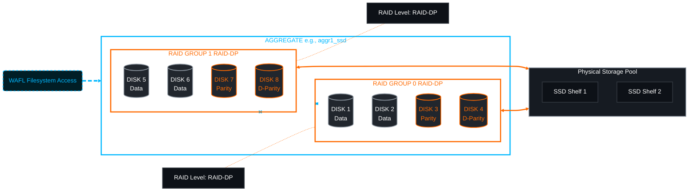

# 🏗️ NetApp ONTAP: The Definitive Aggregate Lifecycle Guide 🚀

This guide covers the entire lifecycle of a NetApp Aggregate: from identifying spare disks and calculating RAID groups to creation, daily maintenance, and safe decommissioning. The aggregate provides the physical storage blocks, and WAFL manages the logical organization of those blocks.

> 🏷️ **Rule:** Replace placeholders like `<SVM>`, `<AGGR>`, `<NODE>`, and `<DISK_LIST>` with your environment values. All commands verified against ONTAP 9.10+ official documentation.

## 📑 Table of Contents
1. [Phase 1: Preparation & Planning](#phase-1)
2. [Phase 2: Creating the Aggregate](#phase-2)
3. [Phase 3: Verification & Health Checks](#phase-3)
4. [Phase 4: Expansion (Adding Disks)](#phase-4)
5. [Phase 5: Maintenance & Operations](#phase-5)
6. [Phase 6: Safe Deletion](#phase-6)
7. [📚 Official Documentation Reference](#references)

---



---

<a id="phase-1"></a>
## 🧐 Phase 1: Preparation & Planning
*Before building, identify available resources and verify compatibility.*

### 1.1 Identify Spare Disks & Check Compatibility
```bash
# Show all spare disks in the cluster
storage disk show -container-type spare

# Show spares with critical attributes (type, usable size, checksum)
storage disk show -container-type spare -fields node,type,usable-size,checksum-compatibility,physical-container-type
```
*[[Official Doc: storage disk show]](https://docs.netapp.com/us-en/ontap-cli/storage-disk-show.html)*

> ⚠️ **Critical:** Disks added to an existing aggregate **must** match the `checksum-compatibility` type (e.g., `block`, `zoned`, `scn`). Mismatched checksums will be rejected.

### 1.2 Calculate RAID Overhead & Capacity
ONTAP 9 CLI does not support `-simulate` in basic privilege. Use this method:
```bash
# View available spare count and size
storage disk show -container-type spare -fields node,type,usable-size

# Manual calculation reference:
# RAID-DP overhead = ~2 disks per RAID group + ~1 spare per 14-28 data disks
# RAID-TEC overhead = ~3 disks per RAID group + ~1 spare per 24-36 data disks
```

---

<a id="phase-2"></a>
## 🔨 Phase 2: Creating the Aggregate
*Constructing the storage pool. Choose the method that fits your requirements.*

### Option A: Automatic Selection (Recommended)
```bash
# Create an SSD aggregate with 24 disks using RAID-DP on a specific node
storage aggregate create -aggregate aggr1_ssd -node <NODE> -diskcount 24 -raidtype raid_dp
```

### Option B: Manual Disk Selection
```bash
# Create using specific disks (useful for shelf/loop isolation)
storage aggregate create -aggregate aggr2_manual -node <NODE> -disklist 1.10.0,1.10.1,1.10.2,1.10.3 -raidtype raid_dp
```

### Option C: Mirrored Aggregate (SyncMirror)
```bash
# Create mirrored aggregate (requires equal spares in pool0 and pool1)
storage aggregate create -aggregate aggr3_mirrored -node <NODE> -diskcount 20 -raidtype raid_dp -mirror true
```
*[[Official Doc: storage aggregate create]](https://docs.netapp.com/us-en/ontap-cli/storage-aggregate-create.html)*

> ⚠️ **Note:** If disks are partitioned (ADP), ONTAP automatically handles partition allocation. Ensure `-raidtype` matches your performance/redundancy requirements. RAID-DP is standard for HDD/SAS; RAID-TEC for large capacity drives.

---

<a id="phase-3"></a>
## 👀 Phase 3: Verification & Health Checks
*Inspect the foundation immediately after building.*

```bash
# 1. Verify aggregate state (Target: state=online, status=normal)
storage aggregate show -aggregate <AGGR>

# 2. Check RAID layout (Data, Parity, D-Parity disk distribution)
storage aggregate show-status -aggregate <AGGR>

# 3. Check space allocation
storage aggregate show-space -aggregate <AGGR>
```
*[[Official Doc: storage aggregate show]](https://docs.netapp.com/us-en/ontap-cli/storage-aggregate-show.html)*  
*[[Official Doc: storage aggregate show-status]](https://docs.netapp.com/us-en/ontap-cli/storage-aggregate-show-status.html)*  
*[[Official Doc: storage aggregate show-space]](https://docs.netapp.com/us-en/ontap-cli/storage-aggregate-show-space.html)*

> ✅ **Success Criteria:** `state` = `online`, `status` = `normal`, `used-percent` < 5% (new), no `degraded` or `reconstructing` states.

---

<a id="phase-4"></a>
## 📈 Phase 4: Expansion (Adding Disks)
*Running out of space? Add more disks to the pool.*

> ⚠️ **Warning:** You generally **cannot remove** disks once added. Expansion is permanent until you destroy the aggregate.

```bash
# Add 12 spare disks (ONTAP auto-balances into existing/new RAID groups)
storage aggregate add-disks -aggregate <AGGR> -diskcount 12

# Add specific disks manually
storage aggregate add-disks -aggregate <AGGR> -disklist 2.10.0,2.10.1,2.10.2

# Verify new layout and RAID group sizes
storage aggregate show-status -aggregate <AGGR>
```
*[[Official Doc: storage aggregate add-disks]](https://docs.netapp.com/us-en/ontap-cli/storage-aggregate-add-disks.html)*

> 📏 **Best Practice:** Maintain RAID group sizes between 14-28 disks (HDD) or 10-24 disks (SSD) for optimal rebuild performance. Use `-raid-group-size` if you need strict control.

---

<a id="phase-5"></a>
## 🔧 Phase 5: Maintenance & Operations
*Day-to-day tasks to keep the aggregate healthy.*

### 5.1 Renaming
```bash
storage aggregate rename -aggregate <OLD_AGGR> -newname <NEW_AGGR>
```
*[[Official Doc: storage aggregate rename]](https://docs.netapp.com/us-en/ontap-cli/storage-aggregate-rename.html)*

### 5.2 RAID Scrubbing (Latent Error Detection)
```bash
# Start manual scrub
storage aggregate scrub start -aggregate <AGGR>

# Monitor progress
storage aggregate scrub show -aggregate <AGGR>
```
*[[Official Doc: storage aggregate scrub]](https://docs.netapp.com/us-en/ontap-cli/storage-aggregate-scrub.html)*

> 🔄 **Schedule:** ONTAP runs automatic scrubs weekly. Manual scrubs are recommended after firmware upgrades or disk replacements.

### 5.3 Aggregate Relocation (Non-Mirrored Only)
```bash
# Move aggregate to HA partner node
storage aggregate move -aggregate <AGGR> -destination-node <PARTNER_NODE>
```
*[[Official Doc: storage aggregate move]](https://docs.netapp.com/us-en/ontap-cli/storage-aggregate-move.html)*

> ⚠️ **Note:** Requires volumes to be in `online` state. Mirrored aggregates use `storage aggregate mirror` for plex management instead.

### 5.4 Space Monitoring
```bash
# View all aggregates with space metrics
storage aggregate show-space -fields aggregate,used-percent,total-used,available
```
> 📊 **Thresholds:** 
> - `85%`: Warning (plan expansion)
> - `90%`: Critical (performance degradation begins)
> - `95%+`: Emergency (volume creation/moves blocked)

---

<a id="phase-6"></a>
## 🧨 Phase 6: Safe Deletion
*Decommissioning an aggregate. This is destructive and irreversible.*

### Step 1: Evacuate Data
```bash
# List all volumes on the aggregate
volume show -aggregate <AGGR> -fields name,size,state

# Move volumes to another aggregate (if preserving data)
volume move start -vserver <SVM> -volume <VOL> -destination-aggregate <TARGET_AGGR>
```
*[[Official Doc: volume move start]](https://docs.netapp.com/us-en/ontap-cli/volume-move-start.html)*

### Step 2: Destroy
```bash
# 1. Take aggregate offline
storage aggregate offline -aggregate <AGGR>

# 2. Delete aggregate (returns disks to spare pool)
storage aggregate delete -aggregate <AGGR>
```
*[[Official Doc: storage aggregate offline]](https://docs.netapp.com/us-en/ontap-cli/storage-aggregate-offline.html)*  
*[[Official Doc: storage aggregate delete]](https://docs.netapp.com/us-en/ontap-cli/storage-aggregate-delete.html)*

> ⚠️ **Warning:** `storage aggregate delete` will **fail** if volumes or qtrees still exist. Always verify evacuation first. Deleted aggregates cannot be recovered.

---

<a id="references"></a>
## 📚 Official NetApp Documentation Reference
| Command | Official Documentation Link |
|---------|-----------------------------|
| `storage disk show` | [docs.netapp.com - storage disk show](https://docs.netapp.com/us-en/ontap-cli/storage-disk-show.html) |
| `storage aggregate create` | [docs.netapp.com - storage aggregate create](https://docs.netapp.com/us-en/ontap-cli/storage-aggregate-create.html) |
| `storage aggregate show` | [docs.netapp.com - storage aggregate show](https://docs.netapp.com/us-en/ontap-cli/storage-aggregate-show.html) |
| `storage aggregate show-status` | [docs.netapp.com - storage aggregate show-status](https://docs.netapp.com/us-en/ontap-cli/storage-aggregate-show-status.html) |
| `storage aggregate show-space` | [docs.netapp.com - storage aggregate show-space](https://docs.netapp.com/us-en/ontap-cli/storage-aggregate-show-space.html) |
| `storage aggregate add-disks` | [docs.netapp.com - storage aggregate add-disks](https://docs.netapp.com/us-en/ontap-cli/storage-aggregate-add-disks.html) |
| `storage aggregate rename` | [docs.netapp.com - storage aggregate rename](https://docs.netapp.com/us-en/ontap-cli/storage-aggregate-rename.html) |
| `storage aggregate scrub` | [docs.netapp.com - storage aggregate scrub](https://docs.netapp.com/us-en/ontap-cli/storage-aggregate-scrub.html) |
| `storage aggregate move` | [docs.netapp.com - storage aggregate move](https://docs.netapp.com/us-en/ontap-cli/storage-aggregate-move.html) |
| `volume move start` | [docs.netapp.com - volume move start](https://docs.netapp.com/us-en/ontap-cli/volume-move-start.html) |
| `storage aggregate offline/delete` | [docs.netapp.com - storage aggregate offline](https://docs.netapp.com/us-en/ontap-cli/storage-aggregate-offline.html) |

---

> 📝 **Operational Best Practices**  
> - Always verify `checksum-compatibility` before adding disks to existing aggregates  
> - Keep RAID group sizes consistent (avoid mixing small/large groups in same aggregate)  
> - Monitor `storage aggregate show-space` weekly; set alerts at 85% utilization  
> - Never run `storage aggregate delete` without verifying `volume show -aggregate <AGGR>` returns empty  
> - Document aggregate names, RAID type, disk counts, and node assignments in CMDB  
> - All commands tested against ONTAP 9.10+ basic privilege level  

