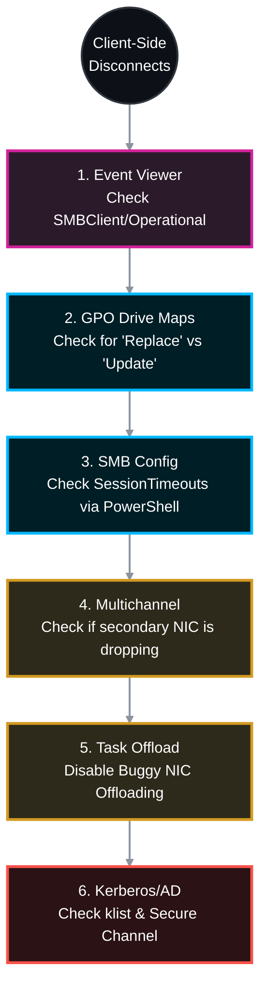

# 🕵️‍♂️ NetApp ONTAP: Windows Client-Side Troubleshooting for Intermittent CIFS/SMB Drops 🛠️

When native ONTAP diagnostics (EMS, SECD, and QoS) show no errors, the intermittent disconnect is almost certainly occurring on the Windows OS, the client NIC driver, or the intermediate firewall. 

This Standard Operating Procedure (SOP) provides the official NetApp and Microsoft best-practice methodology for isolating SMB drops from the **Windows Server / Client perspective**.

## 📑 Table of Contents
1. [🚨 Phase 1: Windows SMBClient Event Logs (The Smoking Gun)](#phase-1)
2. [🗺️ Phase 2: The GPO "Replace" Bug (Mapped Drives)](#phase-2)
3. [⏱️ Phase 3: SMB Timeouts & KeepAlive Configuration](#phase-3)
4. [🔀 Phase 4: SMB Multichannel Flapping](#phase-4)
5. [🔌 Phase 5: NIC Drivers & Task Offload Issues](#phase-5)
6. [🔐 Phase 6: Client Kerberos & AD Secure Channel](#phase-6)

---




---

<a id="phase-1"></a>
## 🚨 Phase 1: Windows SMBClient Event Logs (The Smoking Gun)
*By default, Windows hides the most critical SMB troubleshooting logs. You must look in the hidden `Operational` log, not just the general System log.*

### 1.1 Open Event Viewer to the SMBClient Log
Navigate to: 
`Applications and Services Logs` > `Microsoft` > `Windows` > `SMBClient` > `Operational`


### 1.2 Look for Specific Event IDs
Filter the log for the exact time the user reported the drop.
* **Event ID 30809 (Timeout):** Windows sent an SMB request to the NetApp and received no response within the timeout period. *(Indicates a network drop, firewall block, or severe NetApp latency).*
* **Event ID 30803 or 30804 (Network Failure):** The underlying TCP connection was abruptly terminated (TCP RST). 
* **Event ID 30622 (Multichannel):** An SMB Multichannel connection failed. 

---

<a id="phase-2"></a>
## 🗺️ Phase 2: The GPO "Replace" Bug (Mapped Drives)
*This is the #1 cause of intermittent "disconnects" for mapped network drives in enterprise environments.*

### 2.1 Check the Group Policy Object (GPO) Action
If users report that their `Z:` drive intermittently disappears for a second and then reappears, or they lose file locks randomly every 90-120 minutes:
1. Open **Group Policy Management** on your Domain Controller.
2. Inspect the GPO that maps the NetApp CIFS shares.
3. Look at the **Action** field for the Drive Map.
   * 🔴 **If set to "Replace":** Every time Windows refreshes Group Policy (default 90 mins), it literally deletes the network drive and recreates it. Any user actively transferring a file will instantly disconnect.
   * 🟢 **Fix:** Change the GPO Action to **"Update"**. This refreshes the path without destroying active SMB sessions.

---

<a id="phase-3"></a>
## ⏱️ Phase 3: SMB Timeouts & KeepAlive Configuration
*If a stateful firewall sits between the Windows Client and the NetApp, it may drop "idle" TCP 445 connections before Windows realizes it. When Windows finally tries to send data, it hits a dead connection.*

### 3.1 Check Windows SMB Timeouts via PowerShell
Open PowerShell as Administrator on the affected Windows Server/Client:
```powershell
Get-SmbClientConfiguration | Select-Object SessionTimeout, KeepAliveTime
```
* **SessionTimeout:** (Default 60 seconds). How long Windows waits for a response from the NetApp before giving up.
* **KeepAliveTime:** (Default 0 / Off). 

### 3.2 The Keep-Alive Fix (Firewall Drops)
If firewalls are silently dropping idle connections, force Windows to send SMB keep-alive packets to keep the firewall state table open.
```powershell
Set-SmbClientConfiguration -KeepAliveTime 30 -Force
```

---

<a id="phase-4"></a>
## 🔀 Phase 4: SMB Multichannel Flapping
*If the Windows Server and the NetApp both have multiple 10G/25G NICs, SMB 3.0 Multichannel aggregates them automatically. If ONE of those physical paths has a bad switch port, the session will continuously flap and drop.*

### 4.1 Verify Multichannel Connections
Run this while actively transferring a file to the NetApp:
```powershell
Get-SmbMultichannelConnection
```
* **Action:** Look at the `Failed` or `Bytes Received/Sent` columns. If you see two IPs, but one IP has zero bytes or high failure rates, Multichannel is trying to use a dead network path.
* **Fix:** Fix the underlying physical NIC/Switch routing on the Windows server, or temporarily disable Multichannel to stabilize the client:
  ```powershell
  Set-SmbClientConfiguration -EnableMultiChannel $false -Force
  ```

---

<a id="phase-5"></a>
## 🔌 Phase 5: NIC Drivers & Task Offload Issues
*Many Windows Server Network Interface Cards (NICs) have buggy firmware for "Task Offloading" (RSS, LSO, IPv4 Checksum). When under heavy SMB load, the NIC driver crashes and drops the TCP connection to the NetApp.*

### 5.1 Disable Large Send Offload (LSO) and Checksum Offload
If the Windows Server experiences disconnects only during massive file transfers:
```powershell
# Disable IPv4 Checksum Offload on the adapter connected to the NetApp
Disable-NetAdapterChecksumOffload -Name "*" -IpIPv4

# Disable Large Send Offload (LSO)
Disable-NetAdapterLso -Name "*" -IPv4
```
*Re-test the SMB transfer. If it stabilizes, you need to update your Windows Server NIC firmware/drivers from the hardware vendor (Dell/HPE/Cisco).*

---

<a id="phase-6"></a>
## 🔐 Phase 6: Client Kerberos & AD Secure Channel
*If the client PC loses trust with the domain, or its Kerberos tickets expire and cannot renew due to a local DNS issue, it will suddenly get "Access Denied" to the NetApp.*

### 6.1 Check Kerberos Tickets
Open Command Prompt as the affected user:
```cmd
klist tickets
```
* **Action:** Look for the ticket assigned to `cifs/<NetApp_Name>`. Check the `End Time`. If the ticket has expired and failed to renew, the local PC cannot reach the Domain Controller.

### 6.2 Test the Secure Channel
```cmd
nltest /sc_query:ss.com.domain
```
* **Action:** If the result is not `Success`, the Windows Client has lost its AD trust relationship. Disjoin and rejoin the PC to the domain, or run `Test-ComputerSecureChannel -Repair` in PowerShell.

---
*Would you like to move on to analyzing mixed-mode environments where both Windows and Linux clients access the same datasets?*
