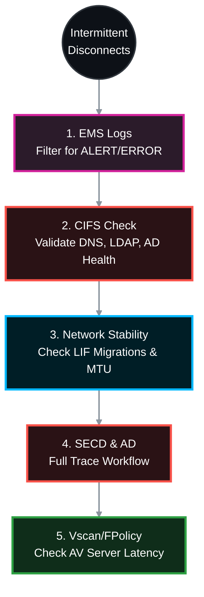

---

### 📋 Improved SOP (Single Copy-Paste Block)


# 🕵️‍♂️ NetApp ONTAP: Native Troubleshooting for Intermittent CIFS/SMB Drops 🛠️

When a user reports intermittent CIFS disconnects, jumping straight to Wireshark is often premature. ONTAP has powerful, native diagnostic tools that track Active Directory health, Security Daemon (SECD) errors, network flapping, and Vscan bottlenecks. 

This Standard Operating Procedure (SOP) strictly utilizes NetApp ONTAP native CLI commands to isolate intermittent SMB drops before resorting to packet captures.

> 🏷️ **Rule:** Replace placeholders like `<SVM>`, `<VOL>`, `<NODE>`, `<CLIENT_IP>`, and `<PORT>` with your specific environment details.

## 📑 Table of Contents
1. [🚨 Phase 1: EMS Event Log Analysis (The Source of Truth)](#phase-1)
2. [🏥 Phase 2: Native CIFS Infrastructure Check](#phase-2)
3. [🌐 Phase 3: Network LIF & Port Stability](#phase-3)
4. [🔐 Phase 4: SECD (Security Daemon) & AD Authentication](#phase-4)
5. [🦠 Phase 5: Vscan & FPolicy Bottlenecks](#phase-5)
6. [⏱️ Phase 6: Performance, Auditing & Timeouts](#phase-6)

---



---

<a id="phase-1"></a>
## 🚨 Phase 1: EMS Event Log Analysis (The Source of Truth)
*ONTAP records almost every intermittent failure in the Event Management System (EMS). This is always step one.*

### 1.1 Query the EMS Logs for the Last 24 Hours
Instead of complex message name filters, filter by **Severity**. Intermittent drops almost always generate `ALERT` or `ERROR` level events.

```bash
# View all Alerts and Errors from the last 24 hours
event log show -time >1d -severity ALERT,ERROR

# Optional: Grep for specific keywords if the output is large
# event log show -time >1d -severity ALERT,ERROR | grep -i "secd\|cifs\|vifmgr"
```
* **Key Indicators to look for:**
  * `secd.cifsAuth.problem`: Intermittent Kerberos/AD failure.
  * `vifmgr.lif.migrated`: The Data LIF moved to another node, causing a TCP reset.
  * `Nblade.cifsNoPrivShare`: User intermittently lost access due to an AD group evaluation failure.
  * `net.link.flap`: Physical link instability.

---

<a id="phase-2"></a>
## 🏥 Phase 2: Native CIFS Infrastructure Check
*ONTAP 9 includes a built-in diagnostic tool to test the entire CIFS stack (Network, DNS, AD, LDAP) from the SVM's perspective.*

### 2.1 Run the CIFS Infrastructure Check
```bash
# This command validates DNS resolution, LDAP bind, AD trust, and Clock Skew
vserver cifs check -vserver <SVM>
```
* **Action:** Review the output for any `Failed` statuses. 
* **Common Failure:** `DNS Resolution Failed`. If ONTAP cannot consistently resolve the Domain Controller's IP, sessions will drop.

### 2.2 Verify DNS Configuration
```bash
# Check DNS servers configured on the SVM
vserver services name-service dns show -vserver <SVM>

# Test DNS resolution manually
vserver services name-service dns check -vserver <SVM> -domain <DOMAIN_NAME>
```

---

<a id="phase-3"></a>
## 🌐 Phase 3: Network LIF & Port Stability
*If the storage network is unstable, CIFS sessions will drop and reconnect.*

### 3.1 Check LIF Status and Home Node
```bash
# Verify the CIFS LIF is on its home node and port
network interface show -vserver <SVM> -data-protocol cifs -fields is-home,curr-node,curr-port,status-oper

# Check if the LIF has auto-revert enabled (recommended for stability)
network interface show -vserver <SVM> -data-protocol cifs -fields auto-revert
```
* **Action:** If `is-home` is `false`, the LIF failed over. Investigate why the original port/node went down.

### 3.2 Check for Physical Interface Errors & MTU Mismatch
```bash
# Check for CRC errors, discards, or drops on the physical port
network port statistics show -node <NODE> -port <PORT>

# Verify MTU consistency (Critical for Jumbo Frames)
# Ensure ONTAP Port MTU matches Switch Port MTU and Client NIC MTU
network port show -node <NODE> -port <PORT> -fields mtu
```
* **Action:** If `CRC Errors` or `Discards` increment during disconnects, replace the cable/SFP or fix the switch port. If MTU mismatches exist (e.g., ONTAP 9000, Switch 1500), large file transfers will intermittently fail.

---

<a id="phase-4"></a>
## 🔐 Phase 4: SECD (Security Daemon) & AD Authentication
*If AD is overloaded or network routing to AD drops, ONTAP's SECD cannot renew Kerberos tickets or evaluate user SIDs, leading to instant "Access Denied" errors.*

### 4.1 Check Domain Controller Reachability
```bash
# Verify all discovered Domain Controllers are in an "OK" state
vserver cifs domain discovered-servers show -vserver <SVM>

# Verify the secure channel trust with the Active Directory domain
vserver cifs domain trusts show -vserver <SVM>
```

### 4.2 Full SECD Trace Workflow (For Deep Dive)
If EMS shows SECD errors, use this complete workflow to capture the root cause.

```bash
# 1. Create the trace filter for the specific client IP
vserver security trace filter create -vserver <SVM> -index 1 -client-ip <CLIENT_IP> -trace-allow yes

# 2. Start the trace
vserver security trace start -vserver <SVM>

# --- ⚠️ REPRODUCE THE ISSUE ON THE CLIENT NOW ---
# Have the user map the drive or open a file until the drop occurs.

# 3. Stop the trace immediately after reproduction
vserver security trace stop -vserver <SVM>

# 4. Show the results (Look for "Authentication Failed" or "KDC Unreachable")
vserver security trace trace-result show -vserver <SVM> -client-ip <CLIENT_IP>

# 5. Cleanup the filter (Important!)
vserver security trace filter delete -vserver <SVM> -index 1
```

---

<a id="phase-5"></a>
## 🦠 Phase 5: Vscan & FPolicy Bottlenecks
*Third-party Antivirus (Vscan) and File Screening (FPolicy) servers are the #1 cause of intermittent CIFS "freezes". If the AV server takes longer than 15-30 seconds to scan a file, Windows drops the SMB session.*

### 5.1 Check Vscan Server Connection & Latency
```bash
vserver vscan connection-status show-all -vserver <SVM>
```
* **Action:** Look at `Disconnect-Reason`. If you see `Timeout` or `Server Unreachable`, the AV server is too slow. 
* **Test:** Temporarily disable Vscan (`vserver vscan modify -vserver <SVM> -enabled false`) to see if drops stop.

### 5.2 Check FPolicy Status
```bash
vserver fpolicy show -vserver <SVM>
```
* **Action:** If FPolicy servers are overloaded, they reject I/O. Check `vserver fpolicy policy show` for any policies set to `required` (blocking) vs `optional` (non-blocking).

---

<a id="phase-6"></a>
## ⏱️ Phase 6: Performance, Auditing & Timeouts

### 6.1 Identify Storage Latency Spikes
```bash
qos statistics volume latency show -vserver <SVM> -volume <VOL>
```
* **Action:** If `Data` or `Disk` latency spikes >100ms intermittently, ONTAP may timeout the SMB request. Check for scheduled SnapMirrors, Deduplication, or Backup jobs running at the time of the drops.

### 6.2 Check CIFS Audit Log Consolidation
If CIFS Auditing is configured to `guarantee` events, and the audit log disk is full/busy, ONTAP blocks new connections.
```bash
vserver audit show -vserver <SVM> -fields state,events-queued
```
* **Action:** Ensure `state` is `true` and `events-queued` is not constantly increasing.

### 6.3 Verify Idle Session Timeouts
```bash
vserver cifs options show -vserver <SVM> -fields client-session-keepalive
```
* **Action:** If users report disconnects only after going to lunch, stateful firewalls are likely dropping the TCP session before ONTAP's default keepalive triggers. Consider enabling `client-session-keepalive` if disabled.

---

*If all native ONTAP diagnostics (EMS, CIFS Check, SECD, and Performance) show perfectly healthy status, the issue is definitively outside the storage array. At that point, proceed to packet tracing (tcpdump).*

