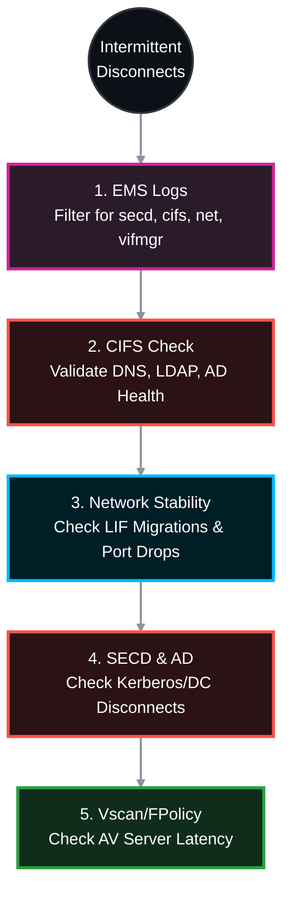

# 🕵️‍♂️ NetApp ONTAP: Native Troubleshooting for Intermittent CIFS/SMB Drops 🛠️

When a user reports intermittent CIFS disconnects, jumping straight to Wireshark is often premature. ONTAP has powerful, native diagnostic tools that track Active Directory health, Security Daemon (SECD) errors, network flapping, and Vscan bottlenecks. 

This Standard Operating Procedure (SOP) strictly utilizes NetApp ONTAP native CLI commands to isolate intermittent SMB drops before resorting to packet captures.

> 🏷️ **Rule:** Replace placeholders like `<SVM>`, `<VOL>`, and `<NODE>` with your specific environment details.

## 📑 Table of Contents
1. [🚨 Phase 1: EMS Event Log Analysis (The Source of Truth)](#phase-1)
2. [🏥 Phase 2: Native CIFS Infrastructure Check](#phase-2)
3. [🌐 Phase 3: Network LIF & Port Stability](#phase-3)
4. [🔐 Phase 4: SECD (Security Daemon) & AD Authentication](#phase-4)
5. [🦠 Phase 5: Vscan & FPolicy Bottlenecks](#phase-5)
6. [⏱️ Phase 6: Performance, Auditing & Timeouts](#phase-6)

---




---

<a id="phase-1"></a>
## 🚨 Phase 1: EMS Event Log Analysis (The Source of Truth)
*ONTAP records almost every intermittent failure in the Event Management System (EMS). This is always step one.*

### 1.1 Query the EMS Logs for the Last 24 Hours
Filter specifically for CIFS, Security Daemon (SECD), network interface (vifmgr), and physical network (net) events.
```bash
event log show -time >1d -messagename secd*|cifs*|net*|vifmgr*|Nblade*
```
* **Key Indicators to look for:**
  * `secd.cifsAuth.problem`: Intermittent Kerberos/AD failure.
  * `vifmgr.lif.migrated`: The Data LIF moved to another node, causing a TCP reset.
  * `Nblade.cifsNoPrivShare`: User intermittently lost access to a share due to an AD group evaluation failure.

---

<a id="phase-2"></a>
## 🏥 Phase 2: Native CIFS Infrastructure Check
*ONTAP 9 includes a built-in diagnostic tool to test the entire CIFS stack (Network, DNS, AD, LDAP) from the SVM's perspective.*

### 2.1 Run the CIFS Infrastructure Check
```bash
vserver cifs check -vserver <SVM>
```
* **Action:** Review the output for any `Failed` statuses. If DNS resolution to the Domain Controller intermittently times out, or the LDAP bind fails, this command will immediately flag it, proving the issue is environmental (AD/DNS) and not the storage configuration.

---

<a id="phase-3"></a>
## 🌐 Phase 3: Network LIF & Port Stability
*If the storage network is unstable, CIFS sessions will drop and reconnect.*

### 3.1 Check LIF Status and History
```bash
# Verify the CIFS LIF is on its home node and port
network interface show -vserver <SVM> -data-protocol cifs -fields is-home,curr-node,curr-port,status-oper

# Check if the port has been link-flapping
network port show -node * -fields link-status,speed,oper-speed
```

### 3.2 Check for Physical Interface Errors
```bash
network port statistics show -node <NODE> -port <PORT>
```
* **Action:** Look at `Discards`, `CRC Errors`, and `Receive Drops`. If these increment during the time of the reported user disconnect, the physical switch port, cable, or SFP is failing.

---

<a id="phase-4"></a>
## 🔐 Phase 4: SECD (Security Daemon) & AD Authentication
*If AD is overloaded or network routing to AD drops, ONTAP's SECD cannot renew Kerberos tickets or evaluate user SIDs, leading to instant "Access Denied" errors.*

### 4.1 Check Domain Controller Reachability & Health
```bash
# Verify all discovered Domain Controllers are in an "OK" state
vserver cifs domain discovered-servers show -vserver <SVM>

# Verify the secure channel trust with the Active Directory domain
vserver cifs domain trusts show -vserver <SVM>
```
* **Action:** If a DC shows as `undiscovered` or `down`, AD load-balancing may be routing ONTAP to a dead DC. 

### 4.2 Increase SECD Log Verbosity (If reproducing the issue)
If the EMS logs show SECD errors, increase the diagnostic logging to see exactly why AD is rejecting the user.
```bash
# Enable diagnostic logging for SECD
vserver security trace filter create -vserver <SVM> -index 1 -client-ip <CLIENT_IP> -trace-allow yes
# (Review results using 'vserver security trace trace-result show')
```

---

<a id="phase-5"></a>
## 🦠 Phase 5: Vscan & FPolicy Bottlenecks
*Third-party Antivirus (Vscan) and File Screening (FPolicy) servers are the #1 cause of intermittent CIFS "freezes". If the AV server takes longer than 15-30 seconds to scan a file, Windows drops the SMB session.*

### 5.1 Check Vscan Server Connection & Latency
```bash
vserver vscan connection-status show-all -vserver <SVM>
```
* **Action:** Look at the `Disconnect-Reason` and `Connection Status`. If AV servers are repeatedly disconnecting and reconnecting, CIFS traffic will halt during those windows.

### 5.2 Check FPolicy Status
```bash
vserver fpolicy show -vserver <SVM>
```
* **Action:** If you use Varonis, Netwrix, or natively configured FPolicy, an overloaded FPolicy server will reject CIFS I/O. If users report hangs, try temporarily disabling FPolicy on a test SVM to see if the issue vanishes.

---

<a id="phase-6"></a>
## ⏱️ Phase 6: Performance, Auditing & Timeouts

### 6.1 Identify Storage Latency Spikes (QoS)
```bash
qos statistics volume latency show -vserver <SVM> -volume <VOL>
```
* **Action:** If you see `Data` or `Disk` latency intermittently spiking >100ms, ONTAP is too busy to answer the SMB request in time. Look for scheduled deduplication, snapmirrors, or backup jobs triggering at the time of the disconnects.

### 6.2 Check CIFS Audit Log Consolidation
If CIFS Auditing is configured to `guarantee` events, and the disk hosting the audit log gets too busy or full, ONTAP will intentionally block all new CIFS connections to prevent un-audited access.
```bash
vserver audit show -vserver <SVM> -fields state,events-queued
```
* **Action:** Ensure the state is `true` and the queue is not backing up. 

### 6.3 Verify Idle Session Timeouts
```bash
vserver cifs options show -vserver <SVM> -fields client-session-keepalive
```
* **Action:** If users report disconnects only after going to lunch or leaving their machine idle, stateful firewalls are likely dropping the TCP session before ONTAP's default keepalive triggers.

---
*If all native ONTAP diagnostics (EMS, CIFS Check, SECD, and Performance) show perfectly healthy status, the issue is definitively outside the storage array. At that point, proceed to packet tracing (tcpdump).*
