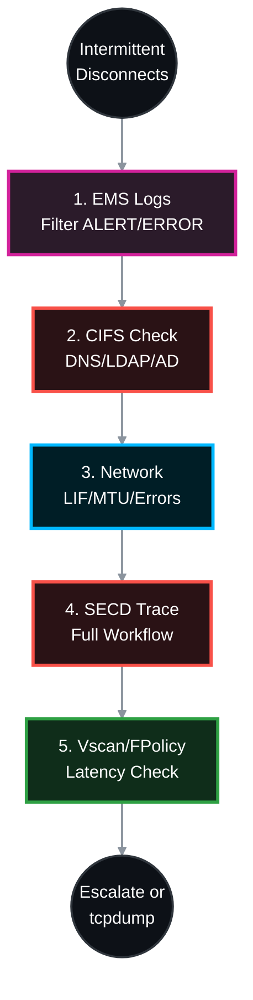

# 🕵️‍♂️ NetApp ONTAP: Native Troubleshooting for Intermittent CIFS/SMB Drops 🛠️

When a user reports intermittent CIFS disconnects, jumping straight to Wireshark is often premature. ONTAP has powerful, native diagnostic tools that track Active Directory health, Security Daemon (SECD) errors, network flapping, and Vscan bottlenecks. 

This Standard Operating Procedure (SOP) strictly utilizes NetApp ONTAP native CLI commands to isolate intermittent SMB drops before resorting to packet captures.

> 🏷️ **Rule:** Replace placeholders like `<SVM>`, `<VOL>`, `<NODE>`, `<CLIENT_IP>`, and `<PORT>` with your specific environment details.

## 📑 Table of Contents
1. [🚨 Phase 1: EMS Event Log Analysis (The Source of Truth)](#phase-1)
2. [🏥 Phase 2: Native CIFS Infrastructure Check](#phase-2)
3. [🌐 Phase 3: Network LIF & Port Stability](#phase-3)
4. [🔐 Phase 4: SECD (Security Daemon) & AD Authentication](#phase-4)
5. [🦠 Phase 5: Vscan & FPolicy Bottlenecks](#phase-5)
6. [⏱️ Phase 6: Performance, Auditing & Timeouts](#phase-6)

---



---

<a id="phase-1"></a>
## 🚨 Phase 1: EMS Event Log Analysis (Source of Truth)
*ONTAP records almost every intermittent failure in the Event Management System (EMS). This is always step one.*

### 1.1 Query the EMS Logs for the Last 24 Hours
⚠️ **Correction:** ONTAP CLI does not support Unix-style piping (`|`) or regex wildcards in a single parameter. Use severity-based filtering or run targeted message-name queries.

```bash
# Primary: Show all critical events from last 24 hours
event log show -time >1d -severity ALERT,ERROR

# Optional: Filter by specific message names (run separately if needed)
event log show -time >1d -message-name secd*
event log show -time >1d -message-name cifs*
event log show -time >1d -message-name vifmgr*
```
*[[Official Doc: event log show]](https://docs.netapp.com/us-en/ontap-cli/event-log-show.html)*

* **Key Indicators to look for:**
  * `secd.cifsAuth.problem`: Intermittent Kerberos/AD failure.
  * `vifmgr.lif.migrated`: The Data LIF moved to another node, causing a TCP reset.
  * `Nblade.cifsNoPrivShare`: User intermittently lost access due to an AD group evaluation failure.
  * `net.link.flap`: Physical link instability.

---

<a id="phase-2"></a>
## 🏥 Phase 2: Native CIFS Infrastructure Check
*ONTAP 9 includes a built-in diagnostic tool to test the entire CIFS stack (Network, DNS, AD, LDAP) from the SVM's perspective.*

### 2.1 Run the CIFS Infrastructure Check
```bash
vserver cifs check -vserver <SVM>
```
*[[Official Doc: vserver cifs check]](https://docs.netapp.com/us-en/ontap-cli/vserver-cifs-check.html)*

* **Action:** Review the output for any `Failed` statuses. If DNS resolution to the Domain Controller intermittently times out, or the LDAP bind fails, this command will immediately flag it, proving the issue is environmental (AD/DNS) and not the storage configuration.

---

<a id="phase-3"></a>
## 🌐 Phase 3: Network LIF & Port Stability
*If the storage network is unstable, CIFS sessions will drop and reconnect.*

### 3.1 Check LIF Status and Home Node
```bash
# Verify the CIFS LIF is on its home node and port
network interface show -vserver <SVM> -data-protocol cifs -fields is-home,curr-node,curr-port,status-oper,auto-revert
```
*[[Official Doc: network interface show]](https://docs.netapp.com/us-en/ontap-cli/network-interface-show.html)*

### 3.2 Check for Physical Interface Errors & MTU Mismatch
```bash
# Check for CRC errors, discards, or drops
network port statistics show -node <NODE> -port <PORT>

# Verify MTU consistency (Critical: Jumbo frame mismatches cause silent SMB drops)
network port show -node <NODE> -port <PORT> -fields mtu
network interface show -vserver <SVM> -lif <CIFS_LIF> -fields mtu
```
*[[Official Doc: network port statistics show]](https://docs.netapp.com/us-en/ontap-cli/network-port-statistics-show.html)*

* **Action:** Look at `Discards`, `CRC Errors`, and `Receive Drops`. If these increment during disconnects, the physical switch port, cable, or SFP is failing. Ensure ONTAP port, LIF, switch port, and client NIC all match MTU (1500 or 9000).

---

<a id="phase-4"></a>
## 🔐 Phase 4: SECD (Security Daemon) & AD Authentication
*If AD is overloaded or network routing to AD drops, ONTAP's SECD cannot renew Kerberos tickets or evaluate user SIDs, leading to instant "Access Denied" errors.*

### 4.1 Check Domain Controller Reachability & Health
```bash
# Verify all discovered Domain Controllers are in an "OK" state
vserver cifs domain discovered-servers show -vserver <SVM>

# Verify the secure channel trust with the Active Directory domain
vserver cifs domain trusts show -vserver <SVM>
```
*[[Official Doc: vserver cifs domain discovered-servers show]](https://docs.netapp.com/us-en/ontap-cli/vserver-cifs-domain-discovered-servers-show.html)*

### 4.2 Full SECD Trace Workflow (Documented Procedure)
*⚠️ Correction: Creating a filter alone does not capture data. You must start/stop the trace and clean up afterward.*
```bash
# 1. Create trace filter for specific client
vserver security trace filter create -vserver <SVM> -index 1 -client-ip <CLIENT_IP> -trace-allow yes

# 2. Start the trace
vserver security trace start -vserver <SVM>

# --- ⚠️ REPRODUCE THE ISSUE ON THE CLIENT NOW ---

# 3. Stop the trace
vserver security trace stop -vserver <SVM>

# 4. Review results for auth/KDC errors
vserver security trace trace-result show -vserver <SVM> -client-ip <CLIENT_IP>

# 5. Mandatory cleanup
vserver security trace filter delete -vserver <SVM> -index 1
```
*[[Official Doc: Perform security traces]](https://docs.netapp.com/us-en/ontap/nas-audit/perform-security-traces-task.html)*

---

<a id="phase-5"></a>
## 🦠 Phase 5: Vscan & FPolicy Bottlenecks
*Third-party Antivirus (Vscan) and File Screening (FPolicy) servers are the #1 cause of intermittent CIFS "freezes". If the AV server takes longer than 15-30 seconds to scan a file, Windows drops the SMB session.*

### 5.1 Check Vscan Server Connection & Latency
```bash
vserver vscan connection-status show-all -vserver <SVM>
```
*[[Official Doc: vserver vscan connection-status show-all]](https://docs.netapp.com/us-en/ontap-cli/vserver-vscan-connection-status-show-all.html)*

* **Action:** Look at `Disconnect-Reason` and `Connection Status`. If AV servers show `Timeout` or repeatedly reconnect, CIFS traffic halts during those windows.

### 5.2 Check FPolicy Status & Enforcement
```bash
vserver fpolicy show -vserver <SVM>
vserver fpolicy policy show -vserver <SVM> -fields enforcement-level
```
*[[Official Doc: vserver fpolicy show]](https://docs.netapp.com/us-en/ontap-cli/vserver-fpolicy-show.html)*

* **Action:** If `enforcement-level` is `required`, an overloaded FPolicy server will block all I/O. Temporarily change to `optional` for testing.

---

<a id="phase-6"></a>
## ⏱️ Phase 6: Performance, Auditing & Timeouts

### 6.1 Identify Storage Latency Spikes
```bash
qos statistics volume latency show -vserver <SVM> -volume <VOL> -interval 1m
```
*[[Official Doc: qos statistics volume latency show]](https://docs.netapp.com/us-en/ontap-cli/qos-statistics-volume-latency-show.html)*

* **Action:** If `Data` or `Disk` latency intermittently spikes >100ms, ONTAP may timeout the SMB request. Check for scheduled SnapMirrors, deduplication, or backup jobs.

### 6.2 Check CIFS Audit Log Queue
```bash
vserver audit show -vserver <SVM> -fields state,events-queued,disk-full-action
```
*[[Official Doc: vserver audit show]](https://docs.netapp.com/us-en/ontap-cli/vserver-audit-show.html)*

* **Action:** If `events-queued` is high and `disk-full-action` is `guarantee`, ONTAP blocks new connections to prevent un-audited access. Switch to `best-effort` temporarily if needed.

### 6.3 Verify Session Keepalives & Idle Timeouts
```bash
vserver cifs options show -vserver <SVM> -fields client-session-keepalive,idle-session-timeout

# Check active sessions and idle duration
vserver cifs session show -vserver <SVM> -fields client-ip,idle-duration,protocol-version
```
*[[Official Doc: vserver cifs options show]](https://docs.netapp.com/us-en/ontap-cli/vserver-cifs-options-show.html)*

* **Action:** If users drop after idle periods, stateful firewalls are likely dropping the TCP session before ONTAP's keepalive triggers. Ensure `client-session-keepalive` is `enabled`.

---

## 📋 Official Documentation Reference Table
| Command / Feature | Official NetApp Documentation |
|-------------------|-------------------------------|
| `event log show` | [ONTAP CLI: event log show](https://docs.netapp.com/us-en/ontap-cli/event-log-show.html) |
| `vserver cifs check` | [ONTAP CLI: vserver cifs check](https://docs.netapp.com/us-en/ontap-cli/vserver-cifs-check.html) |
| `network interface show` | [ONTAP CLI: network interface show](https://docs.netapp.com/us-en/ontap-cli/network-interface-show.html) |
| `network port statistics show` | [ONTAP CLI: network port statistics show](https://docs.netapp.com/us-en/ontap-cli/network-port-statistics-show.html) |
| `vserver security trace` workflow | [Perform security traces](https://docs.netapp.com/us-en/ontap/nas-audit/perform-security-traces-task.html) |
| `vserver vscan connection-status` | [ONTAP CLI: vserver vscan connection-status show-all](https://docs.netapp.com/us-en/ontap-cli/vserver-vscan-connection-status-show-all.html) |
| `vserver fpolicy show` | [ONTAP CLI: vserver fpolicy show](https://docs.netapp.com/us-en/ontap-cli/vserver-fpolicy-show.html) |
| `qos statistics volume latency` | [ONTAP CLI: qos statistics volume latency show](https://docs.netapp.com/us-en/ontap-cli/qos-statistics-volume-latency-show.html) |
| `vserver audit show` | [ONTAP CLI: vserver audit show](https://docs.netapp.com/us-en/ontap-cli/vserver-audit-show.html) |
| `vserver cifs options show` | [ONTAP CLI: vserver cifs options show](https://docs.netapp.com/us-en/ontap-cli/vserver-cifs-options-show.html) |

---

> 📝 **Troubleshooting Best Practices**  
> - Always start with EMS logs (`event log show -severity ALERT,ERROR`) - 80% of intermittent drops are logged here  
> - Document exact timestamps of user-reported drops and correlate with EMS/Performance metrics  
> - Test with a single affected client IP before scaling investigation  
> - **Never leave SECD trace filters active** after troubleshooting (always run delete step)  
> - If all native diagnostics show healthy status, the issue is external. Proceed to `network packet-sniffer` or escalate to network/AD teams.

