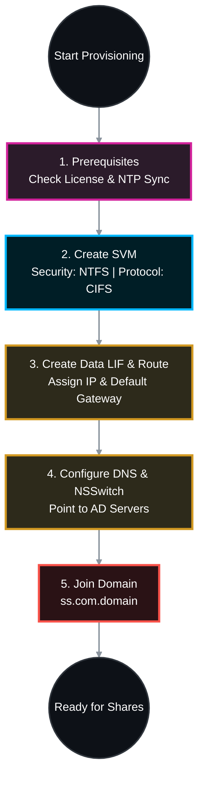

# 🏗️ NetApp ONTAP: Enterprise Guide to Creating a CIFS SVM & AD Domain Join 🌐

## 📑 Table of Contents
1. [🧠 Phase 1: Cluster Prerequisites (Licensing & NTP)](#phase-1)
2. [📦 Phase 2: SVM & Network Provisioning (Including Routing)](#phase-2)
3. [🧭 Phase 3: Name Services (DNS & NSSwitch)](#phase-3)
4. [🤝 Phase 4: CIFS Server Creation & Domain Join](#phase-4)
5. [✅ Phase 5: Verification](#phase-5)

---




---

<a id="phase-1"></a>
## 🧠 Phase 1: Cluster Prerequisites (Licensing & NTP)
*Kerberos authentication (used by Active Directory) strictly requires the storage cluster and the Windows Domain Controllers to be synchronized within 5 minutes of each other. If they are out of sync, the domain join will be explicitly rejected.*

### 1.1 Verify CIFS License
Ensure your cluster is licensed for CIFS.
```bash
system license show -package CIFS
```

### 1.2 Verify Cluster Time Synchronization (NTP)
Ensure the cluster is pointing to the same NTP time sources as your Active Directory Domain Controllers (usually the DCs themselves).
```bash
cluster time-service ntp server show
cluster date show
```
*(If the time is skewed by more than 5 minutes, correct it before proceeding using `cluster time-service ntp server create`).*

---

<a id="phase-2"></a>
## 📦 Phase 2: SVM & Network Provisioning (Including Routing)

### 2.1 Create the Vserver (SVM)
Create the SVM, explicitly restricting it to CIFS and enforcing the NTFS security style.
```bash
# Create the SVM
vserver create -vserver cifs_svm -aggregate <AGGR_NAME> -rootvolume cifs_root_vol -rootvolume-security-style ntfs -allowed-protocols cifs -language C.UTF-8
```

### 2.2 Create the Data LIF
Create the network interface using modern service policies.
```bash
# Create the LIF for CIFS data and AD management traffic
network interface create -vserver cifs_svm -lif cifs_lif01 -service-policy default-data-files -home-node <NODE_NAME> -home-port <PORT_NAME> -address <IP_ADDRESS> -netmask <SUBNET_MASK>
```

### 2.3 Create the Default Route (Critical Step)
*In an enterprise network, the NetApp Data LIF is rarely on the exact same subnet as the Domain Controllers. You MUST give the SVM a default gateway so it knows how to route DNS and Kerberos traffic to the DCs.*
```bash
# Add a default route for the SVM
network route create -vserver cifs_svm -destination 0.0.0.0/0 -gateway <GATEWAY_IP>

# Verify the route
network route show -vserver cifs_svm
```

---

<a id="phase-3"></a>
## 🧭 Phase 3: Name Services (DNS & NSSwitch)

### 3.1 Configure DNS
The SVM must use your Active Directory DNS servers to locate the `_ldap._tcp.dc._msdcs.ss.com.domain` SRV records required for joining.
```bash
# Configure DNS
vserver services name-service dns create -vserver cifs_svm -domains ss.com.domain -name-servers <AD_DNS_IP_1>,<AD_DNS_IP_2>
```

### 3.2 Configure Name Service Switch (NSSwitch)
*Tell the SVM the exact order in which to look up hostnames. It should check its local files first, then query DNS.*
```bash
# Set host name resolution to use local files first, then DNS
vserver services name-service ns-switch modify -vserver cifs_svm -database hosts -sources files,dns
```

---

<a id="phase-4"></a>
## 🤝 Phase 4: CIFS Server Creation & Domain Join
*With the network routed, time synced, and DNS resolving, the SVM is ready to establish the secure channel with Active Directory.*

```bash
# Initiate the Domain Join
# Replace <NETBIOS_NAME> with the desired computer name (e.g., FS-CORP-01)
vserver cifs create -vserver cifs_svm -cifs-server <NETBIOS_NAME> -domain ss.com.domain
```
> ⚠️ **Action Required:** ONTAP will prompt you for Active Directory credentials. Enter the username and password of an account with administrative rights to join computers to `ss.com.domain`.

---

<a id="phase-5"></a>
## ✅ Phase 5: Verification
*Confirm the secure channel is established and Domain Controllers are actively communicating.*

### 5.1 Check CIFS Administrative Status
```bash
vserver cifs show -vserver cifs_svm
```
* **Target:** `Administrative Status: up` and `Authentication Style: domain`.

### 5.2 Verify Active Directory DC Discovery
*If this command shows errors, your SVM routing or DNS is misconfigured.*
```bash
vserver cifs domain discovered-servers show -vserver cifs_svm
```
* **Target:** Status should be `OK` for the discovered Domain Controllers.

### 5.3 Test the Secure Channel
Verify ONTAP can securely communicate with Active Directory.
```bash
vserver cifs domain trusts show -vserver cifs_svm
```
