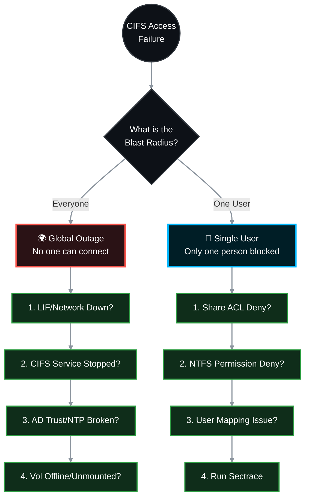

# 🕵️‍♂️ NetApp ONTAP: Ultimate CIFS/SMB Troubleshooting Guide 🛠️

When a CIFS share drops, the troubleshooting approach changes entirely depending on the blast radius. If **no one** can access the share, you have an infrastructure or logical storage failure. If a **single user** cannot access the share, you have an authorization, identity, or permissions issue. 

This SOP splits the troubleshooting workflow into two distinct paths to help you resolve the exact scenario you are facing.

> 🏷️ **Rule:** Replace placeholders like `<SVM>`, `<VOL>`, `<SHARE>`, `<IP>`, and `<CLIENT_IP>` with your specific environment details.

---

## 📑 Table of Contents

1. [🌍 Scenario A: GLOBAL OUTAGE (No One Can Access the Share)](#scenario-a)
   * [🌐 Phase 1: Network & LIF Reachability](#global-phase-1)
   * [⚙️ Phase 2: SVM & CIFS Server Status](#global-phase-2)
   * [⏱️ Phase 3: DNS, NTP & AD Secure Channel](#global-phase-3)
   * [📂 Phase 4: Volume & Junction Path State](#global-phase-4)
   * [🛡️ Phase 5: SVM/Volume Export Policies](#global-phase-5)
2. [👤 Scenario B: SINGLE USER OUTAGE (Only One Person Blocked)](#scenario-b)
   * [🔐 Phase 1: Share-Level ACLs](#single-phase-1)
   * [🗂️ Phase 2: NTFS (File/Folder) Permissions](#single-phase-2)
   * [🆔 Phase 3: User Mapping & Kerberos Bloat](#single-phase-3)
   * [🔬 Phase 4: Advanced Diagnostics (Sectrace)](#single-phase-4)

---



---

<a id="scenario-a"></a>
# 🌍 Scenario A: GLOBAL OUTAGE (No One Can Access the Share)
*Symptom: Every user gets "Network Path Not Found", "Error 0x80070035", or continuous credential prompts that never work.*

<a id="global-phase-1"></a>
### 🌐 Phase 1: Network & LIF Reachability
*If the IP is down, the share is dead to the world.*

**1.1 Verify Data LIF Status**
Ensure the LIF is administratively and operationally UP.
```bash
network interface show -vserver <SVM> -data-protocol cifs -fields status-admin,status-oper,is-home,address
```
* **Fix:** If down: `network interface modify -vserver <SVM> -lif <LIF_NAME> -status-admin up`.

**1.2 Verify Service Policies (ONTAP 9.6+)**
Ensure the LIF is actually allowed to serve CIFS traffic.
```bash
network interface show -vserver <SVM> -fields service-policy
```
* **Target:** Policy must include `data-cifs` and `data-core`.

<a id="global-phase-2"></a>
### ⚙️ Phase 2: SVM & CIFS Server Status
*Is the NetApp SMB engine actually running?*

**2.1 Check CIFS Server Administrative State**
```bash
vserver cifs show -vserver <SVM>
```
* **Fix:** If the `Admin Status` is `down`, start it:
```bash
vserver cifs start -vserver <SVM>
```

<a id="global-phase-3"></a>
### ⏱️ Phase 3: DNS, NTP & AD Secure Channel
*If time is skewed by >5 minutes, or if the NetApp lost trust with AD, Kerberos authentication globally fails.*

**3.1 Check NTP Synchronization**
```bash
cluster date show
```
* **Fix:** Compare with your DC. Fix time via `cluster time-service ntp server create`.

**3.2 Verify Domain Controller Reachability & Trust**
```bash
vserver cifs domain discovered-servers show -vserver <SVM>
vserver cifs domain trusts show -vserver <SVM>
```
* **Target:** Status should be `OK`. If broken, you may need to reset the CIFS computer account password or rejoin the domain.

<a id="global-phase-4"></a>
### 📂 Phase 4: Volume & Junction Path State
*If the volume is offline or unmounted, the data literally does not exist on the network path.*

**4.1 Verify Volume State & Junction Path**
```bash
volume show -vserver <SVM> -volume <VOL> -fields state,junction-path,junction-active
```
* **Target:** `state` = `online`, `junction-active` = `true`.
* **Fix:** If `junction-path` is `-`, mount it:
```bash
volume mount -vserver <SVM> -volume <VOL> -junction-path /<VOL>
```

<a id="global-phase-5"></a>
### 🛡️ Phase 5: SVM/Volume Export Policies
*ONTAP checks Export Policies FIRST, even for CIFS. A bad policy blocks the entire subnet.*

**5.1 Verify Export Policy Rules**
```bash
# Find the policy name
volume show -vserver <SVM> -volume <VOL> -fields policy

# Check the rules
vserver export-policy rule show -vserver <SVM> -policyname <POLICY_NAME>
```
* **Fix:** Ensure there is a rule allowing your client networks (`0.0.0.0/0` or specific subnets) with the `cifs` or `any` protocol. *(Don't forget to check the SVM Root Volume's export policy too!)*

---

<a id="scenario-b"></a>
# 👤 Scenario B: SINGLE USER OUTAGE (Only One Person Blocked)
*Symptom: User A can access `\\Netappdemo\test1$`, but User B gets "Access Denied". The infrastructure is fine; this is an identity or permissions issue.*

<a id="single-phase-1"></a>
### 🔐 Phase 1: Share-Level ACLs
*The first gate the user hits is the Share ACL. If they aren't on the list, they are denied.*

**1.1 Verify CIFS Share ACLs**
```bash
vserver cifs share access-control show -vserver <SVM> -share <SHARE>
```
* **Fix:** If the specific user (or their AD group) is missing, and 'Everyone' was removed, add them:
```bash
vserver cifs share access-control create -vserver <SVM> -share <SHARE> -user-or-group "<DOMAIN>\<User_or_Group>" -permission Change
```

<a id="single-phase-2"></a>
### 🗂️ Phase 2: NTFS (File/Folder) Permissions
*The user passed the Share ACL, but the actual folder on the hard drive denies them.*

**2.1 Check NTFS Permissions from ONTAP**
View the effective NTFS permissions without needing a Windows client.
```bash
vserver security file-directory show -vserver <SVM> -path /<VOL>/<QTREE>/<FOLDER_PATH>
```
* **Fix:** Have an Administrator connect via Windows (`\\<SVM_IP>\c$`), right-click the folder > Properties > Security, and add the user's AD account. 

<a id="single-phase-3"></a>
### 🆔 Phase 3: User Mapping & Kerberos Bloat
*Sometimes the NetApp misidentifies the user, or the user's Kerberos token is too large.*

**3.1 Test User Mapping**
Ensure ONTAP correctly translates the Windows user to an internal identity.
```bash
vserver name-mapping show -vserver <SVM> -direction win-unix -name <DOMAIN>\<username>
```

**3.2 The "Max AD Groups" Issue (Token Bloat)**
If a user belongs to hundreds of Active Directory groups, their Kerberos ticket becomes massive and ONTAP might drop it. By default, ONTAP limits a user to 256 groups. 
* **Fix:** You can increase this limit if necessary:
```bash
set -privilege advanced
vserver cifs options modify -vserver <SVM> -max-mpx 255 -max-opened-connections 1024
# (Consult NetApp docs for specific token size limits based on your ONTAP version)
set -privilege admin
```

<a id="single-phase-4"></a>
### 🔬 Phase 4: Advanced Diagnostics (Sectrace)
*If everything looks perfect and the user STILL gets "Access Denied", use **Security Trace**. It tracks the exact microsecond a request is denied and tells you EXACTLY why.*

**4.1 Create a Trace Filter**
Tell ONTAP to watch for traffic specifically from the blocked user's IP address.
```bash
vserver security trace filter create -vserver <SVM> -index 1 -client-ip <CLIENT_IP> -trace-allow yes
```

**4.2 Reproduce the Error**
Have the user try to access the CIFS share so they trigger the "Access Denied" error on their screen.

**4.3 View the Trace Results**
```bash
vserver security trace trace-result show -vserver <SVM>
```
*Look at the `Reason` column. It will explicitly tell you the exact failure point:*
* `Access denied by export policy`
* `Access denied by share ACL`
* `Access denied by NTFS security descriptor`
* `User mapping failed`

**4.4 Cleanup the Trace (Critical)**
Do not leave the trace running, as it consumes CPU overhead.
```bash
vserver security trace filter delete -vserver <SVM> -index 1
```
