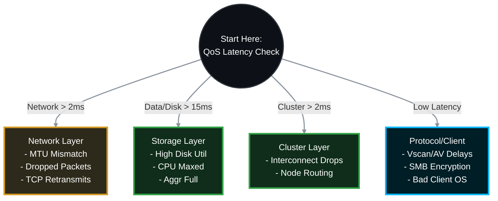

# 🔬 NetApp ONTAP: Deep-Dive CIFS/SMB Performance Troubleshooting Guide 🚀

When CIFS performance issues arise, "it's slow" is not a diagnosis. To find the root cause, you must capture granular metrics across the network, storage hardware, and SMB protocol layers. This guide provides the **exact, highly detailed CLI steps** to isolate and resolve advanced CIFS bottlenecks, including deep-dive network MTU checks.

> 🏷️ **Rule:** Replace placeholders like `<SVM>`, `<VOL>`, `<NODE>`, `<PORT>`, and `<CLIENT_IP>` with your environment's details.

## 📑 Table of Contents
1. [⏱️ Phase 1: Real-Time Latency Isolation (QoS)](#phase-1)
2. [💾 Phase 2: Hardware & Storage Layer Analysis](#phase-2)
3. [🌐 Phase 3: Network, Path & MTU Analysis](#phase-3)
4. [📁 Phase 4: Protocol & Client-Side Analysis](#phase-4)
5. [🔬 Phase 5: Advanced Packet Tracing (tcpdump)](#phase-5)
6. [📋 Phase 6: Perfstat Collection](#phase-6)

---




---

<a id="phase-1"></a>
## ⏱️ Phase 1: Real-Time Latency Isolation (QoS)
*Before touching any hardware, you must ask ONTAP exactly where the delay is happening. ONTAP measures latency in microseconds.*

### 1.1 Run the QoS Volume Latency Command
Run this while the user is actively reproducing the slowness. It updates every 5 seconds.
```bash
qos statistics volume latency show -vserver <SVM> -volume <VOL>
```

### 1.2 How to Interpret the Columns
The output divides total latency into distinct buckets:
* **Network Latency:** Time spent waiting for the TCP ACK from the client. If high (>2-5ms), the issue is the physical network, switch routing, or a slow client NIC. Go to **Phase 3**.
* **Cluster Latency:** Time spent transferring data between Node 1 and Node 2 over the cluster interconnect. If high (>2ms), check cluster switches.
* **Data Latency:** Time spent in the ONTAP CPU processing the request (Dedupe, Compression, Vscan). If high, the Node CPU is overloaded. Go to **Phase 2** or **Phase 4**.
* **Disk Latency:** Time spent waiting for physical hard drives to fetch data not in RAM/Cache. If high (>15ms for SAS, >2ms for SSD), your disks are maxed out. Go to **Phase 2**.

---

<a id="phase-2"></a>
## 💾 Phase 2: Hardware & Storage Layer Analysis
*If Disk or Data latency is high, the node is struggling to keep up with the IOPS demand.*

### 2.1 Analyze Physical Disk Utilization (sysstat)
Drop into the nodeshell to see real-time hardware metrics.
```bash
# Run sysstat with extended stats (-x), refreshing every 1 second
node run -node <NODE> -command sysstat -x 1
```
* **Look at the `Disk Util` column:** If this is consistently 85%-100%, your physical disks are a bottleneck. You must move the volume to a faster aggregate (e.g., from NL-SAS to SSD).
* **Look at the `CPU` column:** If CPU is consistently 90%-100%, the controller is overburdened. You may need to migrate the CIFS LIF to a less utilized node.

### 2.2 Verify Aggregate Health
A nearly full aggregate suffers severe performance degradation because ONTAP struggles to find contiguous free blocks (fragmentation).
```bash
storage aggregate show-space
```
* **Action:** If the aggregate holding the volume is >85% full, you must add disks or free up space immediately.

---

<a id="phase-3"></a>
## 🌐 Phase 3: Network, Path & MTU Analysis
*If Network latency is high, packets are dropping, or MTUs are mismatched.*

### 3.1 Check for Physical Port Drops and CRC Errors
```bash
network port statistics show -node <NODE> -port <PORT>
```
* **Look for `Discards` or `CRC Errors`.** Any number higher than 0 that is actively incrementing means you have a bad SFP, a bad fiber/copper cable, or a dirty optical connection. Replace the physical media.

### 3.2 Deep-Dive: Verify MTU Mismatch (Jumbo Frames)
*If the NetApp is set to MTU 9000, but the client or intermediate switch is 1500, large CIFS packets will be dropped, forcing slow retransmissions. Here is exactly how to verify and test this.*


#### Step A: Find the NetApp MTU (Storage Side)
Run this command to find the IP address serving your CIFS shares and the node/port it is currently living on.
```bash
network interface show -vserver <SVM> -data-protocol cifs -fields address,curr-node,curr-port
```
* Write down the `curr-node` and `curr-port` (e.g., `cluster1-01` and `a0a`).
* Now, check the MTU of that specific port:
```bash
network port show -node <curr-node> -port <curr-port> -fields mtu
```
* Write down the output (e.g., `1500` or `9000`). This is your NetApp MTU.

#### Step B: Find the Windows MTU (Client Side)
1. On the Windows client experiencing slowness, open **Command Prompt as Administrator**.
2. Run the following command:
```cmd
netsh interface ipv4 show subinterfaces
```
3. Look at the **MTU** column for the active network adapter (usually "Ethernet" or "Wi-Fi"). Compare this to the NetApp MTU from Step A. **They MUST match.**

#### Step C: The Ultimate Test (Ping with Do Not Fragment)
Even if Windows says 9000 and NetApp says 9000, the network switches in between them might be set to 1500, silently dropping packets!

* **Test A (If your MTU should be 1500):**
```cmd
ping <NetApp_CIFS_IP> -f -l 1472
```
* **Test B (If your MTU should be 9000):**
```cmd
ping <NetApp_CIFS_IP> -f -l 8972
```
* **Good Result:** `Reply from <IP>...` (Your path is perfect).
* **Bad Result:** `Packet needs to be fragmented but DF set.` OR `Request timed out.` (A switch in the middle is dropping your packets because its MTU is too low).

#### Step D: How to Fix an MTU Mismatch
* **Option A (Fix Network):** Have your network team enable Jumbo Frames (9000) globally on all switches between the client and the NetApp. On Windows, set Jumbo Frames to 9014 Bytes in the adapter's Advanced properties.
* **Option B (The Quick Fix - Revert to 1500):** If you cannot guarantee the network supports 9000 end-to-end, drop the NetApp back down to standard 1500 to immediately fix the slowness.
```bash
# 1. Find which broadcast domain your port belongs to
network port show -node <curr-node> -port <curr-port> -fields broadcast-domain

# 2. Modify the broadcast domain to MTU 1500 (changes all ports in it)
network port broadcast-domain modify -broadcast-domain <Domain_Name> -mtu 1500
```

### 3.3 Verify Interface Group (ifgrp) Load Balancing
If using LACP (ifgrp), ensure traffic isn't pinning to a single link.
```bash
node run -node <NODE> -command ifstat <IFGRP_NAME>
```
* **Action:** Check the byte counters on the underlying physical ports. If one port has 10TB of traffic and the other has 10MB, your switch hashing algorithm (usually MAC or IP+Port) is not distributing the CIFS traffic correctly.

---

<a id="phase-4"></a>
## 📁 Phase 4: Protocol & Client-Side Analysis
*If QoS latency is low, the storage is fine. The issue is in the protocol configuration or the Windows client.*

### 4.1 Check Vscan (Antivirus) Latency
If off-box antivirus is enabled, every file open/read/write request is sent to an external AV server. If the AV server is slow, CIFS is slow.
```bash
# View real-time connection status and latency to AV servers
vserver vscan connection-status show-all -vserver <SVM>
```
* **Action:** If the `Disconnect-Reason` shows drops, or latency is high, your AV servers need more CPU/RAM.

### 4.2 Investigate Directory Enumeration (Large Folders)
* **Symptom:** Opening a folder takes 60 seconds, but opening a file is instant.
* **Cause:** The user has dumped 500,000 files into a single root folder. Windows Explorer attempts to read the metadata for every file simultaneously. CIFS is not designed for flat, massive directories.
* **Action:** Tell the user to organize the files into subfolders. Alternatively, enable SMB3 Directory Leasing.

### 4.3 SMB Encryption & Signing Overhead
SMB 3.0 Encryption and SMB Signing force the client and the NetApp to encrypt/decrypt every packet. This requires heavy CPU cycles.
```bash
vserver cifs security show -vserver <SVM> -fields is-smb-encryption-required, is-smb-signing-required
```
* **Action:** If security policies permit, disable enforced encryption/signing for non-sensitive data shares to massively boost throughput.

---

<a id="phase-5"></a>
## 🔬 Phase 5: Advanced Packet Tracing (tcpdump)
*If all else fails, you must capture the raw network packets to prove whether the client or the storage is causing the delay.*

### 5.1 Start the Packet Trace
Capture traffic specifically between the NetApp node and the complaining client's IP.
```bash
network tcpdump start -node <NODE> -port <PORT> -dst-ip <CLIENT_IP>
```

### 5.2 Reproduce the Issue
Instruct the user to perform the action that causes the slowness (e.g., copying a large file).

### 5.3 Stop the Trace and Extract
```bash
network tcpdump stop -node <NODE> -port <PORT>
```
* **Extraction:** The trace is saved as a `.pcap` file in the node's `/mroot/etc/log/packet_traces/` directory. You can download this via a web browser (if SPI is enabled) or via SCP.
* **Wireshark Analysis:** Open the `.pcap` in Wireshark. 
    * Filter by `tcp.analysis.retransmission`. If you see hundreds of red lines, the network is dropping packets.
    * Look for `TCP Zero Window`. If the *client* sends a Zero Window, it means the Windows machine's CPU/RAM is too slow to ingest the data the NetApp is sending.

---

<a id="phase-6"></a>
## 📋 Phase 6: Perfstat Collection
*If you need to escalate to NetApp Support (TAC), they will refuse to troubleshoot without a Perfstat.*

1. Download the latest **Perfstat** utility from the NetApp Support Site.
2. Run Perfstat from a management jump-box that has network access to the Cluster Management IP.
3. Command syntax example (runs for 5 minutes):
   ```cmd
   perfstat.exe -t 5 -i 1 -l <Admin_User> -f <Cluster_Mgmt_IP> > perfstat_output.out
   ```
4. Upload the resulting `.out` or `.tar.gz` archive directly to your NetApp Support ticket for deep-dive engineering analysis.

---
*--Sulthan Sharief K S*
