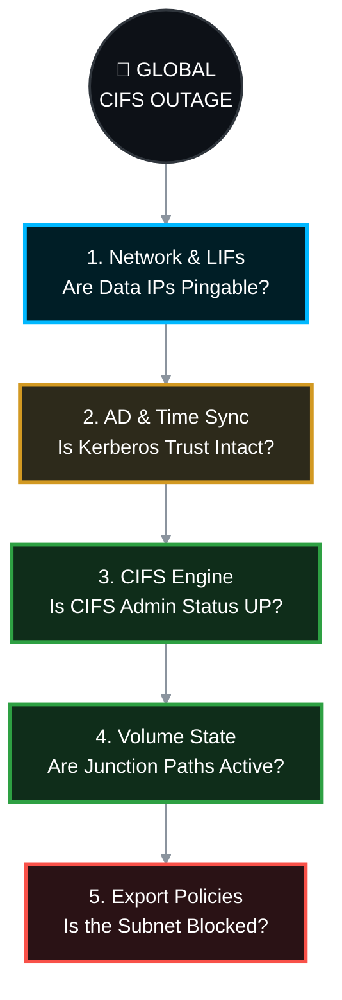

# 🌍 NetApp ONTAP: Global CIFS/SMB Outage Resolution SOP 🚨

A **Global CIFS Outage** means *zero* users can access the shares on a specific Storage Virtual Machine (SVM). Users are experiencing "Network Path Not Found" (Error 0x80070035), continuous credential prompts, or immediate timeouts. 

Because this affects everyone, the issue is not at the file/folder permission level. The failure lies in the core infrastructure: Network, Active Directory Trust, or Logical ONTAP State.

---

## 📑 Table of Contents
1. [🌐 Phase 1: Network & LIF Reachability (The Foundation)](#phase-1)
2. [⏱️ Phase 2: Active Directory, DNS & NTP (The Trust)](#phase-2)
3. [⚙️ Phase 3: SVM & CIFS Server Status (The Engine)](#phase-3)
4. [📂 Phase 4: Volume & Junction Path State (The Map)](#phase-4)
5. [🛡️ Phase 5: SVM/Volume Export Policies (The Bouncer)](#phase-5)

---



---

<a id="phase-1"></a>
## 🌐 Phase 1: Network & LIF Reachability (The Foundation)
*If the storage IP is offline, the share drops for the entire company.*

### 1.1 Verify Data LIF Status
Ensure the CIFS IP addresses are administratively and operationally UP, and residing on healthy physical ports.
```bash
network interface show -vserver <SVM> -data-protocol cifs -fields status-admin,status-oper,is-home,address,curr-port
```
* **Target:** `status-admin` = `up`, `status-oper` = `up`, `is-home` = `true`.

> **🛠️ Action to Take (If LIF is down or displaced):**
> * **If Admin Status is down:**
>     ```bash
>     network interface modify -vserver <SVM> -lif <LIF_NAME> -status-admin up
>     ```
> * **If LIF is not on its home port (is-home = false):**
>     ```bash
>     network interface revert -vserver <SVM> -lif <LIF_NAME>
>     ```

### 1.2 Verify Default Routing
If users are on a different subnet/VLAN than the NetApp, the SVM MUST have a default route back to the core switch.
```bash
network route show -vserver <SVM>
```
* **Target:** A route with destination `0.0.0.0/0` pointing to your core gateway IP must exist.

> **🛠️ Action to Take (If Route is missing):**
> * **Create the default route:**
>     ```bash
>     network route create -vserver <SVM> -destination 0.0.0.0/0 -gateway <GATEWAY_IP>
>     ```

---

<a id="phase-2"></a>
## ⏱️ Phase 2: Active Directory, DNS & NTP (The Trust)
*CIFS relies exclusively on Kerberos authentication. If the NetApp's clock drifts by more than 5 minutes from the Domain Controller, or if the AD computer account password expires, the trust is broken, and ALL authentication requests are dropped.*

### 2.1 Verify NTP Time Synchronization
Check the cluster time against your AD Domain Controllers.
```bash
cluster date show
cluster time-service ntp server show
```
* **Target:** Cluster time must be within 5 minutes of the Windows Domain Controllers.

> **🛠️ Action to Take (If Time is skewed):**
> * **Add the Domain Controller as an NTP server and force sync:**
>     ```bash
>     cluster time-service ntp server create -server <DC_IP>
>     ```

### 2.2 Verify Domain Controller Reachability & DNS
Ensure ONTAP can actively query your DNS servers and locate the Domain Controllers.
```bash
vserver cifs domain discovered-servers show -vserver <SVM>
```
* **Target:** Status should be `OK`. 

> **🛠️ Action to Take (If Status is 'down' or 'undiscovered'):**
> * **Check DNS Configuration:** >     ```bash
>     vserver services name-service dns check -vserver <SVM>
>     ```
> * **Network Team Escalation:** If DNS is fine but DCs are unreachable, request the network team to check firewalls for dropped traffic on ports 53 (DNS), 88 (Kerberos), 389 (LDAP), and 445 (SMB).

### 2.3 Verify the Kerberos Secure Channel (Trust)
This proves if the NetApp is still securely authenticated to the Active Directory domain.
```bash
vserver cifs domain trusts show -vserver <SVM>
```
* **Target:** Trust status should be healthy and established.

> **🛠️ Action to Take (If Trust is Broken):**
> * **Reset the CIFS machine account password:** *(Warning: Requires AD Domain Admin credentials)*
>     ```bash
>     vserver cifs domain password reset -vserver <SVM>
>     ```

---

<a id="phase-3"></a>
## ⚙️ Phase 3: SVM & CIFS Server Status (The Engine)
*Is the actual CIFS protocol engine running on the Storage Virtual Machine?*

### 3.1 Check CIFS Administrative State
```bash
vserver cifs show -vserver <SVM>
```
* **Target:** `Administrative Status` must be `up`.

> **🛠️ Action to Take (If CIFS Admin Status is Down):**
> * **Start the CIFS Server Service:**
>     ```bash
>     vserver cifs start -vserver <SVM>
>     ```

---

<a id="phase-4"></a>
## 📂 Phase 4: Volume & Junction Path State (The Map)
*NetApp uses a unified namespace. If a volume drops offline, or its junction path is removed from the namespace, the Windows share path instantly becomes invalid for everyone.*

### 4.1 Verify Volume Online State & Junction Path
```bash
volume show -vserver <SVM> -fields state,junction-path,junction-active
```
* **Target:** `state` = `online`, `junction-path` = `/<vol_name>` (cannot be `-`), and `junction-active` = `true`.

> **🛠️ Action to Take (If Volume is offline or unmounted):**
> * **If Volume is Offline:**
>     ```bash
>     volume online -vserver <SVM> -volume <VOL_NAME>
>     ```
> * **If Junction Path is Missing/Inactive (`-`):**
>     ```bash
>     volume mount -vserver <SVM> -volume <VOL_NAME> -junction-path /<VOL_NAME>
>     ```

---

<a id="phase-5"></a>
## 🛡️ Phase 5: SVM/Volume Export Policies (The Bouncer)
*Many admins think Export Policies are only for NFS. **This is false.** ONTAP evaluates Export Policies at the IP layer before it even checks CIFS Share ACLs. A misconfigured export policy will block the entire company.*

### 5.1 Check the Assigned Policies
Identify which export policies are attached to both the **Root Volume** and the **Data Volume**.
```bash
# 1. Identify the root volume
vserver show -vserver <SVM> -fields rootvolume

# 2. Check the policy assigned to the root volume
volume show -vserver <SVM> -volume <ROOT_VOL_NAME> -fields policy

# 3. Check the policy assigned to the data volume
volume show -vserver <SVM> -volume <DATA_VOL_NAME> -fields policy
```
* **Target:** Note the names of the policies (e.g., `default` or `cifs_policy`).

> **🛠️ Action to Take (If policies are incorrectly assigned):**
> * **Assign the correct policy to the volume:**
>     ```bash
>     volume modify -vserver <SVM> -volume <VOL_NAME> -policy <CORRECT_POLICY_NAME>
>     ```

### 5.2 Inspect and Fix the Export Rules
Look inside the policies identified in step 5.1 to ensure CIFS is allowed.
```bash
vserver export-policy rule show -vserver <SVM> -policyname <POLICY_NAME>
```
* **Target:** There MUST be a rule that matches your client subnets (e.g., `10.0.0.0/8` or `0.0.0.0/0`) that allows the `cifs` (or `any`) protocol for read/write access.

> **🛠️ Action to Take (If rules are missing or too restrictive):**
> * **Create a rule allowing all internal IPs for CIFS:**
>     ```bash
>     vserver export-policy rule create -vserver <SVM> -policyname <POLICY_NAME> -clientmatch 0.0.0.0/0 -rorule any -rwrule any -protocols cifs
>     ```
> * *(Note: Apply this to both the data volume policy and the root volume policy to ensure traversal is permitted).*
