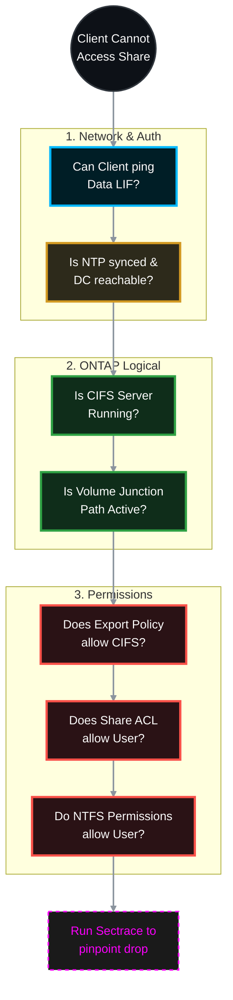

# 🕵️‍♂️ NetApp ONTAP: Ultimate CIFS/SMB Troubleshooting Guide 🛠️

When a CIFS share suddenly becomes inaccessible, the issue can hide in the network, Active Directory, ONTAP logical layers, or file permissions. This guide provides a systematic, top-down approach to isolate and resolve CIFS inaccessibility in ONTAP 9.x.

> 🏷️ **Rule:** Replace placeholders like `<SVM>`, `<VOL>`, `<SHARE>`, `<IP>`, and `<CLIENT_IP>` with your environment's details.

## 📑 Table of Contents
1. [🌐 Phase 1: Network & LIF Reachability](#phase-1)
2. [⏱️ Phase 2: DNS, NTP & Active Directory Health](#phase-2)
3. [⚙️ Phase 3: SVM & CIFS Server Status](#phase-3)
4. [📂 Phase 4: Volume & Junction Path Verification](#phase-4)
5. [🛡️ Phase 5: Share ACLs & Export Policies](#phase-5)
6. [🔐 Phase 6: NTFS Security (File/Folder Permissions)](#phase-6)
7. [🔬 Phase 7: Advanced Diagnostics (Sectrace)](#phase-7)

---




---

<a id="phase-1"></a>
## 🌐 Phase 1: Network & LIF Reachability
*If the client cannot reach the SVM's IP, nothing else matters. The error is usually "Network Path Not Found" or "Error 0x80070035".*

### 1.1 Verify Data LIF Status
Ensure the LIF is administratively and operationally UP, and is hosting the CIFS data protocol.
```bash
# Check if LIF is up and on its home port
network interface show -vserver <SVM> -data-protocol cifs -fields status-admin,status-oper,is-home,address
```
* **Fix:** If down, run `network interface modify -vserver <SVM> -lif <LIF_NAME> -status-admin up`. If not home, run `network interface revert -vserver <SVM> -lif <LIF_NAME>`.

### 1.2 Verify Service/Firewall Policies
Modern ONTAP uses Service Policies. Ensure the data LIF allows CIFS traffic.
```bash
network interface show -vserver <SVM> -fields service-policy
```
* **Fix:** Ensure the policy includes `data-cifs` and `data-core`.

### 1.3 Ping Test from Storage
Can the SVM reach the client?
```bash
network ping -vserver <SVM> -destination <CLIENT_IP>
```

---

<a id="phase-2"></a>
## ⏱️ Phase 2: DNS, NTP & Active Directory Health
*CIFS relies heavily on Kerberos. If time is skewed by >5 minutes between ONTAP and AD, or if DNS fails, authentication will silently drop. Error: "Access Denied" or prompt for credentials that never work.*

### 2.1 Check NTP Synchronization
```bash
cluster date show
```
* **Fix:** Compare with your AD server. If skewed, force sync or fix NTP servers using `cluster time-service ntp server show`.

### 2.2 Verify DNS Resolution
Can the SVM resolve the Domain Controller?
```bash
vserver services name-service dns check -vserver <SVM>
```

### 2.3 Verify Domain Controller Reachability
```bash
vserver cifs domain discovered-servers show -vserver <SVM>
```
* **Fix:** Ensure the status is `OK`. If `down`, check routing to the DC or verify AD firewall rules (ports 53, 88, 135, 139, 389, 445).

---

<a id="phase-3"></a>
## ⚙️ Phase 3: SVM & CIFS Server Status
*Is the CIFS service actually running?*

### 3.1 Check CIFS Server Administrative State
```bash
vserver cifs show -vserver <SVM>
```
* **Fix:** If the `Admin Status` is `down`, start it:
```bash
vserver cifs start -vserver <SVM>
```

---

<a id="phase-4"></a>
## 📂 Phase 4: Volume & Junction Path Verification
*If the volume is offline or unmounted, the share path becomes invalid.*

### 4.1 Verify Volume State & Junction Path
```bash
volume show -vserver <SVM> -volume <VOL> -fields state,junction-path,junction-active
```
* **Target:** `state` = `online`, `junction-active` = `true`.
* **Fix:** If `junction-path` is `-`, mount it:
```bash
volume mount -vserver <SVM> -volume <VOL> -junction-path /<VOL>
```

### 4.2 Verify Qtree (If share is on a Qtree)
```bash
volume qtree show -vserver <SVM> -volume <VOL> -qtree <QTREE> -fields security-style
```
* **Fix:** Ensure security style is `ntfs`. If it's `unix`, Windows ACLs will behave erratically. Change via `volume qtree modify -vserver <SVM> -qtree <QTREE> -security-style ntfs`.

---

<a id="phase-5"></a>
## 🛡️ Phase 5: Share ACLs & Export Policies
*ONTAP checks Export Policies FIRST, even for CIFS. Then it checks Share ACLs.*

### 5.1 Verify Export Policy (The Silent Killer)
By default, the volume uses the `default` export policy. If this policy does not allow CIFS or restricts IPs, access is blocked.
```bash
# 1. Check which policy the volume uses
volume show -vserver <SVM> -volume <VOL> -fields policy

# 2. Inspect the rules of that policy
vserver export-policy rule show -vserver <SVM> -policyname <POLICY_NAME>
```
* **Fix:** Ensure there is a rule allowing your client IP network (or `0.0.0.0/0` for all) with the `cifs` or `any` protocol.
```bash
vserver export-policy rule create -vserver <SVM> -policyname <POLICY_NAME> -clientmatch 0.0.0.0/0 -rorule any -rwrule any -protocols cifs
```
*(Note: Do not forget to check the SVM Root Volume's export policy as well, as traversal relies on it).*

### 5.2 Verify CIFS Share ACLs
```bash
vserver cifs share access-control show -vserver <SVM> -share <SHARE>
```
* **Fix:** If your specific user/group isn't listed (and 'Everyone' was deleted), add them:
```bash
vserver cifs share access-control create -vserver <SVM> -share <SHARE> -user-or-group "<DOMAIN>\<User_or_Group>" -permission Full_Control
```

---

<a id="phase-6"></a>
## 🔐 Phase 6: NTFS Security (File/Folder Permissions)
*The network, CIFS, and Share levels are perfect, but the actual folder on disk denies access.*

### 6.1 Check NTFS Permissions from ONTAP
You can view the effective NTFS permissions directly from the storage CLI without needing Windows.
```bash
vserver security file-directory show -vserver <SVM> -path /<VOL>/<QTREE>
```

### 6.2 Fix Permissions (Take Ownership)
If the NTFS permissions are totally broken and no one can access the folder from Windows to fix them, you can reset permissions from the NetApp CLI or use Computer Management.
* From Windows: Connect to Computer Management (`compmgmt.msc`), connect to the NetApp CIFS server IP, go to System Tools > Shared Folders > Shares. Right-click the share, go to Security, and take ownership.

---

<a id="phase-7"></a>
## 🔬 Phase 7: Advanced Diagnostics (Sectrace)
*If everything above looks perfect and the user STILL gets "Access Denied", use **Security Trace**. This is NetApp's ultimate weapon. It tracks the exact microsecond a request is denied and tells you EXACTLY why.*

### 7.1 Create a Trace Filter
Tell ONTAP to watch for traffic from the specific client IP trying to access the share.
```bash
vserver security trace filter create -vserver <SVM> -index 1 -client-ip <CLIENT_IP> -trace-allow yes
```

### 7.2 Reproduce the Error
Have the user try to access the CIFS share from their Windows machine (`\\<SVM_IP>\<SHARE>`) so they get the "Access Denied" error.

### 7.3 View the Trace Results
```bash
vserver security trace trace-result show -vserver <SVM>
```
Look at the `Reason` column. It will explicitly tell you the failure point. Examples of what you might see:
* `Access denied by export policy`
* `Access denied by share ACL`
* `Access denied by NTFS security descriptor`
* `User mapping failed`

### 7.4 Cleanup the Trace
Don't leave the trace running forever, as it consumes CPU.
```bash
vserver security trace filter delete -vserver <SVM> -index 1
```
