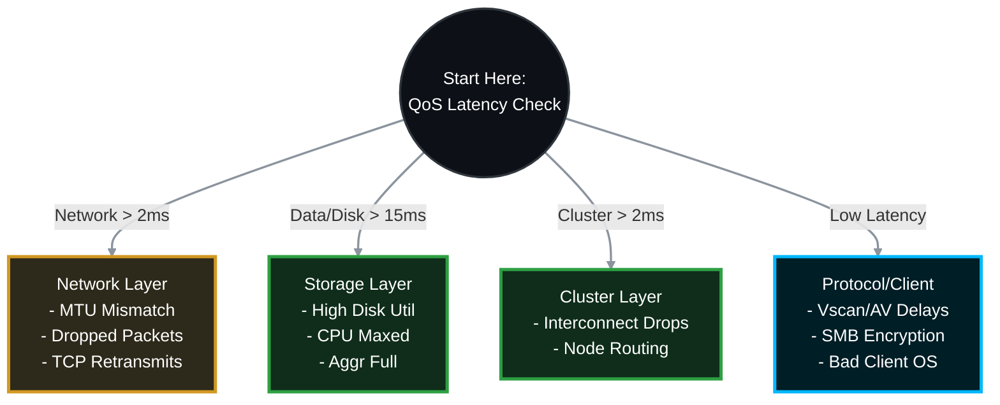

# 🔬 NetApp ONTAP: Deep-Dive CIFS/SMB Performance Troubleshooting Guide 🚀

When CIFS performance issues arise, "it's slow" is not a diagnosis. To find the root cause, you must capture granular metrics across the network, storage hardware, and SMB protocol layers. This guide provides the **exact, highly detailed CLI steps** to isolate and resolve advanced CIFS bottlenecks, and explicitly defines **which team is responsible** for each fix.

> 🏷️ **Rule:** Replace placeholders like `<SVM>`, `<VOL>`, `<NODE>`, `<PORT>`, and `<CLIENT_IP>` with your environment's details.

## 📑 Table of Contents
1. [⏱️ Phase 1: Real-Time Latency Isolation (QoS)](#phase-1)
2. [💾 Phase 2: Hardware & Storage Layer Analysis](#phase-2)
3. [🌐 Phase 3: Network, Path & MTU Analysis](#phase-3)
4. [📁 Phase 4: Protocol & Client-Side Analysis](#phase-4)
5. [🔬 Phase 5: Advanced Packet Tracing (tcpdump)](#phase-5)
6. [📋 Phase 6: Perfstat Collection](#phase-6)

---



---

<a id="phase-1"></a>
## ⏱️ Phase 1: Real-Time Latency Isolation (QoS)
*Before touching any hardware, you must ask ONTAP exactly where the delay is happening. ONTAP measures latency in microseconds.*

### 1.1 Run the QoS Volume Latency Command
Run this while the user is actively reproducing the slowness. It updates every 5 seconds.
```bash
qos statistics volume latency show -vserver <SVM> -volume <VOL>
```

### 1.2 How to Interpret the Columns & Assign Responsibility
The output divides total latency into distinct buckets. Use this to assign the ticket to the correct team:

> **🛠️ Action to Take (Based on QoS Output):**
> * 🔴 **If Network Latency is High (>2-5ms):**
>   * 👥 **Responsible Team:** **Network Team / Windows OS Team**
>   * **Verdict:** ONTAP is waiting for the TCP ACK from the client. The issue is the physical network, switch routing, or a slow client NIC. Go to **Phase 3**.
> * 🔴 **If Cluster Latency is High (>2ms):**
>   * 👥 **Responsible Team:** **Storage Team / Data Center Tech**
>   * **Verdict:** Time spent transferring data between Node 1 and Node 2 over the cluster interconnect is too high. Check cluster switches and ISL cables.
> * 🔴 **If Data Latency is High:**
>   * 👥 **Responsible Team:** **Storage Team / Security Team**
>   * **Verdict:** Time spent in the ONTAP CPU processing the request (Dedupe, Compression, Vscan). The Node CPU is overloaded or AV is slow. Go to **Phase 2** or **Phase 4**.
> * 🔴 **If Disk Latency is High (>15ms for SAS, >2ms for SSD):**
>   * 👥 **Responsible Team:** **Storage Team**
>   * **Verdict:** Time spent waiting for physical hard drives. Your disks are maxed out. Go to **Phase 2**.

---

<a id="phase-2"></a>
## 💾 Phase 2: Hardware & Storage Layer Analysis
*If Disk or Data latency is high, the node is struggling to keep up with the IOPS demand.*

### 2.1 Analyze Physical Disk Utilization (sysstat)
Drop into the nodeshell to see real-time hardware metrics.
```bash
# Run sysstat with extended stats (-x), refreshing every 1 second
node run -node <NODE> -command sysstat -x 1
```

> **🛠️ Action to Take (If Hardware is Bottlenecking):**
> * 👥 **Responsible Team:** **Storage Team**
> * **If `Disk Util` is 85%-100%:** Your physical disks are a bottleneck. You must move the volume (`vol move`) to a faster aggregate (e.g., from NL-SAS to SSD).
> * **If `CPU` is 90%-100%:** The controller is overburdened. You may need to migrate the CIFS data LIF to a less utilized node.

### 2.2 Verify Aggregate Health
A nearly full aggregate suffers severe performance degradation because ONTAP struggles to find contiguous free blocks (fragmentation).
```bash
storage aggregate show-space
```

> **🛠️ Action to Take (If Aggregate is Full):**
> * 👥 **Responsible Team:** **Storage Team**
> * **Fix:** If the aggregate holding the volume is >85% full, you must add disks or free up space immediately to restore performance.

---

<a id="phase-3"></a>
## 🌐 Phase 3: Network, Path & MTU Analysis
*If Network latency is high, packets are dropping, or MTUs are mismatched.*

### 3.1 Check for Physical Port Drops and CRC Errors
```bash
network port statistics show -node <NODE> -port <PORT>
```

> **🛠️ Action to Take (If Errors are Incrementing):**
> * 👥 **Responsible Team:** **Data Center Tech / Network Team**
> * **Fix:** Look for `Discards` or `CRC Errors`. Any number higher than 0 that is actively incrementing means you have a bad SFP, a bad fiber/copper cable, or a dirty optical connection. Replace the physical media.

### 3.2 Deep-Dive: Verify MTU Mismatch (Jumbo Frames)
*If the NetApp is set to MTU 9000, but the client or intermediate switch is 1500, large CIFS packets will be dropped, forcing slow retransmissions.*

#### Step A: Find the NetApp MTU
> * 👥 **Responsible Team:** **Storage Team**
```bash
# Find node and port
network interface show -vserver <SVM> -data-protocol cifs -fields address,curr-node,curr-port
# Check MTU
network port show -node <curr-node> -port <curr-port> -fields mtu
```

#### Step B: Find the Windows MTU
> * 👥 **Responsible Team:** **Windows OS Team / Client**
1. On the Windows client, open **Command Prompt as Administrator**.
2. Run: `netsh interface ipv4 show subinterfaces`
3. Compare the **MTU** column to the NetApp MTU. **They MUST match.**

#### Step C: The Ultimate Test (Ping with Do Not Fragment)
> * 👥 **Responsible Team:** **Windows OS Team / Client**
Even if endpoints match, switches might drop the packets. Test from Windows:
* **If MTU should be 1500:** `ping <NetApp_CIFS_IP> -f -l 1472`
* **If MTU should be 9000:** `ping <NetApp_CIFS_IP> -f -l 8972`
* **Bad Result:** "Packet needs to be fragmented" means a switch is blocking Jumbo Frames.

#### Step D: How to Fix an MTU Mismatch
> **🛠️ Action to Take:**
> * 👥 **Responsible Team:** **Network Team** (To Fix Global Switch Config) OR **Storage Team** (To implement quick fix).
> * **Option A (Network Fix):** Have the Network Team enable Jumbo Frames (9000) globally on all switches between the client and NetApp.
> * **Option B (Storage Quick Fix - Revert to 1500):** If the network cannot support 9000 end-to-end, drop the NetApp back to 1500.
>   ```bash
>   network port show -node <curr-node> -port <curr-port> -fields broadcast-domain
>   network port broadcast-domain modify -broadcast-domain <Domain_Name> -mtu 1500
>   ```

### 3.3 Verify Interface Group (ifgrp) Load Balancing
If using LACP (ifgrp), ensure traffic isn't pinning to a single link.
```bash
node run -node <NODE> -command ifstat <IFGRP_NAME>
```

> **🛠️ Action to Take (If traffic is completely unbalanced):**
> * 👥 **Responsible Team:** **Network Team**
> * **Fix:** Check the byte counters. If one port has 10TB of traffic and the other has 10MB, the switch hashing algorithm (usually MAC or IP+Port) is not distributing the CIFS traffic correctly. The Network Team must adjust the port-channel load-balancing algorithm.

---

<a id="phase-4"></a>
## 📁 Phase 4: Protocol & Client-Side Analysis
*If QoS latency is low, the storage is fine. The issue is in the protocol configuration or the Windows client.*

### 4.1 Check Vscan (Antivirus) Latency
If off-box antivirus is enabled, every file open/read/write request is sent to an external AV server.
```bash
vserver vscan connection-status show-all -vserver <SVM>
```

> **🛠️ Action to Take (If AV is causing delays):**
> * 👥 **Responsible Team:** **Security Team / AV Admins**
> * **Fix:** If the `Disconnect-Reason` shows drops, or latency is high, the AV servers need more CPU/RAM, or the network link to the AV servers is congested.

### 4.2 Investigate Directory Enumeration (Large Folders)
> **🛠️ Action to Take (If opening specific folders takes 60+ seconds):**
> * 👥 **Responsible Team:** **End User / Application Owner**
> * **Fix:** If the user dumped 500,000 files into a single flat folder, Windows Explorer attempts to read metadata for every file simultaneously. Tell the user to organize files into subfolders. Alternatively, the Storage Team can enable SMB3 Directory Leasing.

### 4.3 SMB Encryption & Signing Overhead
SMB Encryption and Signing require heavy CPU cycles to encrypt/decrypt every packet.
```bash
vserver cifs security show -vserver <SVM> -fields is-smb-encryption-required, is-smb-signing-required
```

> **🛠️ Action to Take (To reduce protocol overhead):**
> * 👥 **Responsible Team:** **Storage Team / Security Team**
> * **Fix:** If corporate security policies permit, disable enforced encryption/signing for non-sensitive data shares to massively boost throughput and reduce node CPU load.

---

<a id="phase-5"></a>
## 🔬 Phase 5: Advanced Packet Tracing (tcpdump)
*If all else fails, you must capture the raw network packets to prove whether the client or the storage is causing the delay.*

### 5.1 Capture and Analyze the Trace
> **🛠️ Action to Take:**
> * 👥 **Responsible Team:** **Storage Team** (Capture) & **Network Team** (Analysis)
> * **Storage Action:** Start the trace targeting the client IP, have the user reproduce the slowness, then stop it.
>   ```bash
>   network tcpdump start -node <NODE> -port <PORT> -dst-ip <CLIENT_IP>
>   # ... wait for user to reproduce ...
>   network tcpdump stop -node <NODE> -port <PORT>
>   ```
> * **Network Action:** Download the `.pcap` from `/mroot/etc/log/packet_traces/` and open in Wireshark. 
>   * Filter by `tcp.analysis.retransmission` (indicates network drops).
>   * Look for `TCP Zero Window` (if sent by the Windows client, it means the client CPU/RAM is too slow to ingest the data the NetApp is sending).

---

<a id="phase-6"></a>
## 📋 Phase 6: Perfstat Collection
*If you need to escalate to NetApp Support (TAC), they will refuse to troubleshoot without a Perfstat.*

> **🛠️ Action to Take (To escalate to vendor):**
> * 👥 **Responsible Team:** **Storage Team**
> 1. Download the latest **Perfstat** utility from the NetApp Support Site.
> 2. Run Perfstat from a management jump-box that has network access to the Cluster Management IP.
> 3. Run for 5 minutes during the slowness event:
>    ```cmd
>    perfstat.exe -t 5 -i 1 -l <Admin_User> -f <Cluster_Mgmt_IP> > perfstat_output.out
>    ```
> 4. Upload the `.out` or `.tar.gz` archive directly to your NetApp Support ticket.

---
*--Sulthan Sharief K S*
