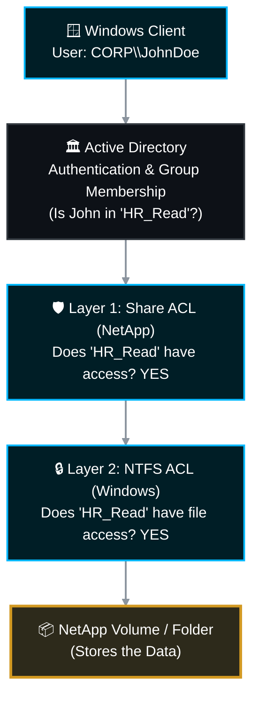

# 🪟 NetApp ONTAP: Master CIFS/SMB Access Control & Security Management SOP 🚀

In NetApp ONTAP, CIFS (SMB) access operates on a fundamentally different security paradigm than NFS. While NFS trusts the host machine's IP address, CIFS explicitly relies on **User-Based Security** backed by Active Directory (AD). 

This comprehensive Master Standard Operating Procedure (SOP) covers the dual-layer security architecture, Active Directory group management, and all day-to-day CLI operations required to securely govern CIFS shares.

> 🏷️ **Rule:** Replace placeholders like `<SVM>`, `<Share_Name>`, and `<DOMAIN\Group>` with your environment's specific details.

---

## 📋 Table of Contents
1. [🧠 Phase 1: The CIFS Security Architecture (AD Integration)](#phase-1)
2. [🛡️ Phase 2: The Dual-Layer Security Model (Share vs. NTFS)](#phase-2)
3. [⚖️ Phase 3: The "Most Restrictive Wins" Rule](#phase-3)
4. [👥 Phase 4: Active Directory Best Practices](#phase-4)
5. [🛠️ Phase 5: Share-Level ACL Management (CLI Operations)](#phase-5)
6. [🔌 Phase 6: Terminating Active Sessions](#phase-6)
7. [📚 Official NetApp Documentation Reference](#references)

---

<a id="phase-1"></a>
## 🧠 Phase 1: The CIFS Security Architecture (AD Integration)

Unlike NFS export rules, CIFS shares do not care about the client's IP address. If a user connects from the corporate LAN, a VPN, or a secure VLAN, ONTAP only cares about their validated Active Directory credentials.



---

## 🛡️ Phase 2: The Dual-Layer Security Model (Share vs. NTFS)

To access a file over CIFS, a user must successfully pass through **two separate security gates**.

### Layer 1: Share-Level ACLs (Managed on NetApp)

This is the "front door" of the share. You configure this via the NetApp CLI. It acts as a broad filter for the entire share.

* **`No_access`**: Explicitly denies all access to the share.
* **`Read`**: Users can view files, copy files out, and execute applications.
* **`Change`**: Users can Read, create new files, modify files, and delete files.
* **`Full_Control`**: Users can do everything in `Change`, PLUS they can alter the NTFS permissions of the files themselves (take ownership).

> 💡 **Enterprise Best Practice:** Set the NetApp Share-Level ACL to **`Authenticated Users - Full_Control`** or **`Everyone - Full_Control`**. Why? Because you should use Layer 2 to actually lock down the specific folders securely.

### Layer 2: File/Folder-Level NTFS ACLs (Managed via Windows)

This is the "interior security." Once the user passes the NetApp Share ACL, they hit the NTFS permissions stored directly on the folders and files.

* **How it's managed:** Storage admins DO NOT manage this via the NetApp CLI. A Windows administrator maps the drive and manages it via Windows Explorer (Right-Click -> Properties -> Security Tab).

---

## ⚖️ Phase 3: The "Most Restrictive Wins" Rule

Because CIFS uses a dual-layer approach, ONTAP evaluates both the Share ACL and the NTFS ACL. **The resulting effective permission is ALWAYS the most restrictive of the two.**

| Scenario | Layer 1: Share-Level ACL (NetApp) | Layer 2: NTFS ACL (Windows) | Effective Result for User |
| --- | --- | --- | --- |
| **A** | `Read` | `Full Control` | **Read-Only.** (Share restricted them). |
| **B** | `Full Control` | `Read-Only` | **Read-Only.** (NTFS restricted them). |
| **C** | `Change` | `Modify` | **Modify/Change.** (Both layers agree). |

---

## 👥 Phase 4: Active Directory Best Practices

* **Never Assign Individual Users:** Do not add individual users (e.g., `CORP\JohnDoe`) to Share ACLs or NTFS ACLs.
* **Always Use AD Groups:** Create dedicated Active Directory Security Groups (e.g., `CORP\App_Finance_RO` and `CORP\App_Finance_RW`). Assign those groups to the NetApp share. When staff changes, the AD team simply updates the group membership; the NetApp requires no changes.
* **Enclose in Quotes:** When typing Active Directory names in the NetApp CLI, always enclose them in double quotes to handle the backslash properly (e.g., `"DOMAIN\Group"`).

---

## 🛠️ Phase 5: Share-Level ACL Management (CLI Operations)

*Use this workflow to manage the "Front Door" Share-Level ACLs via the NetApp CLI.*

### 5.1 View Current Permissions on a CIFS Share

*Check who currently has access to the front door of the share.*

```bash
vserver cifs share access-control show -vserver <SVM_Name> -share <Share_Name>

```

### 5.2 Grant an AD Group Access to a Share

*Adds a specific Active Directory security group to the share.*

```bash
vserver cifs share access-control create -vserver <SVM_Name> -share <Share_Name> -user-or-group "CORP\App_Finance_RW" -permission Change

```

### 5.3 Modify an Existing AD Group's Permission Level

*Upgrade an AD group from Read-Only to Full Control, or downgrade them.*

```bash
vserver cifs share access-control modify -vserver <SVM_Name> -share <Share_Name> -user-or-group "CORP\App_Finance_RW" -permission Full_Control

```

### 5.4 Revoke an AD Group's Access (Delete the ACL)

*Completely removes the AD group from the share's access list.*

```bash
vserver cifs share access-control delete -vserver <SVM_Name> -share <Share_Name> -user-or-group "CORP\App_Finance_RW"

```

---

## 🔌 Phase 6: Terminating Active Sessions

If you revoke a user's or group's access (either via AD or by deleting the Share ACL), **users currently connected will not be kicked out until their session naturally times out or disconnects.** If you are responding to a security incident or need an immediate lockout, you must force-close their active CIFS sessions.

### 6.1 View Active Sessions on a Share

```bash
vserver cifs session show -vserver <SVM_Name> -share <Share_Name>

```

### 6.2 Close All Sessions for a Specific Share

*Instantly terminates all active connections, forcing clients to re-authenticate (where they will be denied if their ACL was removed).*

```bash
vserver cifs session close -vserver <SVM_Name> -share <Share_Name>

```

---

## 📚 Official NetApp Documentation Reference

*All commands and logic pathways are strictly validated against the NetApp ONTAP 9 Documentation Center.*

| Task / Operation | Official NetApp Documentation Reference |
| --- | --- |
| **View Share ACLs** | [Docs: vserver cifs share access-control show](https://docs.netapp.com/us-en/ontap-cli/vserver-cifs-share-access-control-show.html) |
| **Grant / Create Share ACL** | [Docs: vserver cifs share access-control create](https://docs.netapp.com/us-en/ontap-cli/vserver-cifs-share-access-control-create.html) |
| **Modify Share ACL** | [Docs: vserver cifs share access-control modify](https://docs.netapp.com/us-en/ontap-cli/vserver-cifs-share-access-control-modify.html) |
| **Revoke / Delete Share ACL** | [Docs: vserver cifs share access-control delete](https://docs.netapp.com/us-en/ontap-cli/vserver-cifs-share-access-control-delete.html) |
| **Close CIFS Sessions** | [Docs: vserver cifs session close](https://docs.netapp.com/us-en/ontap-cli/vserver-cifs-session-close.html) |

```
