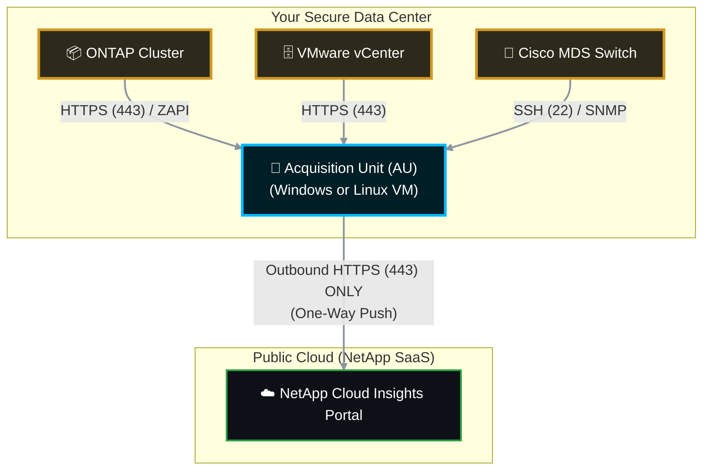

# 📡 NetApp Cloud Insights: Master Acquisition Unit (AU) SOP

When managing NetApp telemetry, particularly with **NetApp Cloud Insights** (formerly OnCommand Insight / OCI), the **Acquisition Unit (AU)** is the most critical piece of the data collection architecture. 

This Standard Operating Procedure (SOP) explains exactly what an AU is, how it operates securely, and provides the step-by-step procedure to deploy, configure, and verify it in an enterprise environment.

---

## 📋 Table of Contents
1. [🧠 Phase 1: What Exactly is an Acquisition Unit?](#phase-1)
2. [🚧 Phase 2: Pre-Flight Readiness & Network Requirements](#phase-2)
3. [💻 Phase 3: Installation & Configuration SOP (Linux/Windows)](#phase-3)
4. [🔗 Phase 4: Adding Data Collectors to the AU](#phase-4)
5. [✅ Phase 5: Confirmation & Troubleshooting](#phase-5)

---

<a id="phase-1"></a>
## 🧠 Phase 1: What Exactly is an Acquisition Unit?

An **Acquisition Unit (AU)** is a lightweight software proxy installed inside your local data center (or local VPC). 

Because your NetApp storage arrays, Cisco switches, and VMware vCenters are highly secure, they cannot (and should not) be exposed to the public internet. The AU solves this problem. 


### How it Works:
1. **Local Polling:** The AU sits safely inside your firewall and talks to your storage arrays locally using standard management protocols (HTTPS, SSH, REST API, ZAPI).
2. **Secure Transmission:** Once it gathers the performance and capacity telemetry, the AU compresses and encrypts the data.
3. **One-Way Push:** The AU pushes the data outbound to the NetApp Cloud Insights SaaS portal over a secure HTTPS (Port 443) connection. 
4. **Zero Inbound Ports:** The Cloud Insights portal *never* initiates a connection into your network. The AU only reaches out.


<a id="phase-2"></a>
## 🚧 Phase 2: Pre-Flight Readiness & Network Requirements
Before installing the AU, you must provision a dedicated Virtual Machine and configure the firewall.
### 2.1 Virtual Machine Requirements
 * **OS:** Red Hat Enterprise Linux (RHEL), CentOS, Ubuntu, or Windows Server.
 * **CPU:** 4 vCPUs (Minimum) to 8 vCPUs (Enterprise).
 * **RAM:** 16 GB (Minimum) to 32 GB (Enterprise).
 * **Disk Space:** 100 GB.
### 2.2 Network Firewall Rules
The firewall team MUST open these ports for the AU Virtual Machine:
 * **Outbound to Internet:** Port 443 (HTTPS) open to your specific Cloud Insights Tenant URL (e.g., https://<your-tenant>.cloudinsights.netapp.com).
 * **Inbound from local network:** No inbound internet ports required.
 * **Local Outbound (To Storage):** Ports 443 (HTTPS), 80 (HTTP), 22 (SSH), and 161 (SNMP) open to the management IPs of your NetApp clusters and switches.
<a id="phase-3"></a>
## 💻 Phase 3: Installation & Configuration SOP
*You generate the installer and secure token directly from the Cloud Insights web portal.*
### Step 3.1: Generate the Installer Token
 1. Log into your **NetApp Cloud Insights** web portal.
 2. Navigate to **Admin** -> **Data Collectors**.
 3. Click the **Acquisition Units** tab.
 4. Click the **+ Acquisition Unit** button.
 5. Select your Operating System (Linux or Windows).
 6. The portal will generate a secure installer snippet (a tokenized script) that is valid for a short time. Copy this entire script to your clipboard.
### Step 3.2: Install the AU (Linux Example)
 1. SSH into the newly provisioned Linux VM as a user with sudo privileges.
 2. Paste the snippet copied from the Cloud Insights portal. It will look similar to this:
   ```bash
   sudo wget -O cloudinsights-install.sh https://<tenant>[.cloudinsights.netapp.com/au-install.sh](https://.cloudinsights.netapp.com/au-install.sh)
   sudo bash cloudinsights-install.sh -token <Long_Secure_Token>
   
   ```
 3. The script will automatically:
   * Download the AU binaries.
   * Install the Java Runtime Environment (JRE).
   * Register the AU securely with your specific Cloud Insights tenant using the token.
   * Start the AU service.
### Step 3.3: Install the AU (Windows Example)
 1. RDP into the Windows Server as a Local Administrator.
 2. Paste the PowerShell snippet copied from the portal into an elevated PowerShell prompt.
 3. The installer will download the .msi, install it quietly, and register the token.
<a id="phase-4"></a>
## 🔗 Phase 4: Adding Data Collectors to the AU
*An AU does nothing until you tell it what storage arrays to poll. We must assign "Data Collectors" to it.*
 1. In the Cloud Insights portal, go back to **Admin** -> **Data Collectors**.
 2. Click **+ Data Collector**.
 3. Search for the vendor/model (e.g., "NetApp ONTAP").
 4. Fill in the connection details:
   * **Name:** DC_Cluster_01
   * **Acquisition Unit:** Select your newly installed AU from the dropdown list.
   * **Host IP:** The Cluster Management IP of the ONTAP array.
   * **Username/Password:** A dedicated read-only service account created on the NetApp cluster (e.g., ci_readonly).
 5. Click **Test Configuration** to ensure the AU can successfully ping and authenticate against the NetApp cluster.
 6. Click **Save**.
<a id="phase-5"></a>
## ✅ Phase 5: Confirmation & Troubleshooting
### 5.1 Verify AU Connection Status
 1. In Cloud Insights, navigate to **Admin** -> **Data Collectors** -> **Acquisition Units**.
 2. Check the **Status** column.
   * It should read: **🟢 Connected**.
   * If it reads **🔴 Disconnected** or **Heartbeat Lost**, the AU cannot reach the internet (Check corporate proxy or firewall port 443).
### 5.2 Verify Data Collector Polling
 1. Navigate to **Admin** -> **Data Collectors**.
 2. Look at the specific ONTAP Data Collector you added.
 3. Check the **Inventory** and **Performance** status columns.
   * They should say **🟢 Success**.
   * It may take 15-30 minutes for the first performance poll to complete and for data to populate your dashboards.
### 5.3 Troubleshooting the AU Locally (Linux)
If the AU says disconnected in the portal, log into the local AU VM and check the service status.
```bash
# Check if the AU service is actively running
sudo systemctl status cloudinsights-au

# Restart the service if it is hung
sudo systemctl restart cloudinsights-au

# View the local AU logs to see why it cannot connect to the array or the cloud
tail -f /var/log/netapp/cloudinsights/acq/acq.log

```
