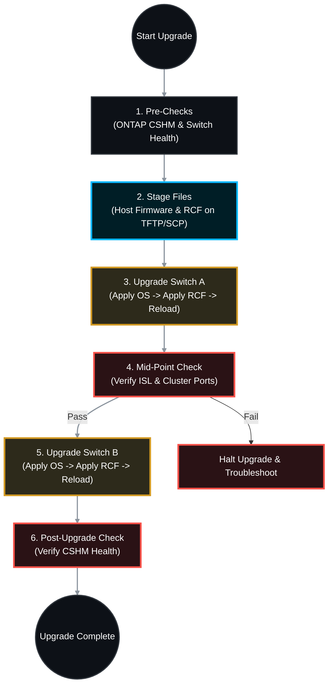

# 🖧 NetApp ONTAP: Master Cluster Switch Upgrade & RCF Deployment SOP 🚀

Upgrading the backend Cluster Network Switches (Cisco Nexus or Broadcom BES) is a critical task. The cluster network is the heartbeat of ONTAP; if both switches go down simultaneously, the entire cluster will halt to protect data integrity.

This Standard Operating Procedure (SOP) outlines the Non-Disruptive Upgrade (NDU) process, ensuring one switch maintains full cluster traffic while the other is upgraded and reconfigured with the latest Reference Configuration File (RCF).

---

## 📋 Table of Contents
1. [🧠 Upgrade Architecture & Strategy](#architecture)
2. [🕵️ Phase 1: Pre-Flight Checks (ONTAP & Switch)](#phase-1)
3. [📦 Phase 2: Downloading & Staging Firmware and RCF](#phase-2)
4. [💾 Phase 3: Configuration Backup](#phase-3)
5. [🔄 Phase 4: Upgrading Switch A (Firmware & RCF)](#phase-4)
6. [✅ Phase 5: Mid-Point Verification (Crucial)](#phase-5)
7. [🔄 Phase 6: Upgrading Switch B](#phase-6)
8. [🩺 Phase 7: Post-Upgrade Verification](#phase-7)

---

<a id="architecture"></a>
## 🧠 1. Upgrade Architecture & Strategy

The upgrade is performed strictly in a serial manner (Switch A, then Switch B). ONTAP's multi-pathing handles the failover seamlessly as long as the Inter-Switch Link (ISL) and cluster ports are healthy.


<a id="phase-1"></a>
## 🕵️ Phase 2: Pre-Flight Checks (ONTAP & Switch)
*Do not touch the switches until you confirm the ONTAP cluster is completely healthy and redundant.*
### 1.1 Verify Cluster Network Health (ONTAP)
```bash
# Check if ONTAP sees both switches and their current versions
system cluster-switch show

# Verify all cluster ports are online and healthy
network port show -ipspace Cluster

```
### 1.2 Verify Cluster Ring Status
```bash
# Ensure the cluster ring is fully replicated and in quorum
cluster ring show

```
### 1.3 Verify Switch Health (Run on both switches)
Log into both Cluster Switches (via SSH) and check the ISL (Inter-Switch Link) status.
 * **Cisco Nexus:** show port-channel summary (Ensure the ISL port-channel is Up).
 * **Broadcom:** show port-channel all
<a id="phase-2"></a>
## 📦 Phase 3: Downloading & Staging Firmware and RCF
*The RCF (Reference Configuration File) is a NetApp-provided script that automatically configures MTU, ISL, port roles, and VLANs specifically for ONTAP cluster traffic.*
### 2.1 Download the Files
 1. Go to the **NetApp Support Site** -> **Downloads** -> **Switches**.
 2. Download the supported **Firmware OS** (e.g., NX-OS for Cisco, EFOS for Broadcom).
 3. Download the specific **RCF File** matching your switch model and ONTAP version.
### 2.2 Stage the Files
 1. Place the Firmware and the RCF text file onto a local **TFTP, SCP, or HTTP server** that is reachable by the cluster switches' management IP addresses.
<a id="phase-3"></a>
## 💾 Phase 4: Configuration Backup
*Always back up the existing working configuration before applying a new RCF.*
### 3.1 Backup Switch A and Switch B
Log into each switch via SSH and copy the running configuration to your remote server.
**Cisco Nexus Example:**
```text
copy running-config scp://user@<SCP_Server_IP>/SwitchA_Backup.cfg vrf management

```
**Broadcom Example:**
```text
copy running-config tftp://<TFTP_Server_IP>/SwitchA_Backup.cfg

```
<a id="phase-4"></a>
## 🔄 Phase 5: Upgrading Switch A (Firmware & RCF)
*We will perform the upgrade on Switch A. All cluster traffic will automatically traverse Switch B.*
### 4.1 Install the Firmware OS
Follow the vendor-specific command to download and set the boot variable for the new OS.
 * **Cisco Nexus:**
   ```text
   copy tftp://<TFTP_IP>/<NXOS_File> bootflash: vrf management
   install all nxos bootflash:<NXOS_File>
   
   ```
 * **Broadcom:**
   ```text
   copy tftp://<TFTP_IP>/<EFOS_File> active
   
   ```
### 4.2 Apply the NetApp RCF File
Applying the RCF ensures the switch conforms to NetApp's exact specifications for the new firmware.
**Cisco Nexus:**
```text
copy tftp://<TFTP_IP>/<RCF_File> bootflash: vrf management
copy bootflash:<RCF_File> running-config
copy running-config startup-config

```
**Broadcom:**
```text
copy tftp://<TFTP_IP>/<RCF_File> nvram:script <RCF_Name>.scr
script apply <RCF_Name>.scr
write memory

```
### 4.3 Reload Switch A
Reboot the switch to load the new OS and initialize the RCF.
```text
reload

```
<a id="phase-5"></a>
## ✅ Phase 6: Mid-Point Verification (Crucial)
⚠️ **STOP!** Do not proceed to Switch B until Switch A is fully back online, the ISL has reformed, and ONTAP confirms redundancy.
### 5.1 Verify Switch A Status (Via Switch CLI)
 1. Ping Switch B over the ISL to ensure connectivity.
 2. **Cisco:** show port-channel summary (Verify ISL is UP).
 3. **Broadcom:** show port-channel all
### 5.2 Verify Cluster Health (Via ONTAP CLI)
Wait 5-10 minutes, then log into the ONTAP cluster.
```bash
# Confirm Switch A shows the new Firmware Version and RCF Version
system cluster-switch show

# Ping across the cluster network to verify full mesh connectivity
network ping -vserver <Cluster_Name> -lif <Node1_Cluster_LIF> -destination <Node2_Cluster_LIF>

```
*If any cluster ports are down or the ISL is broken, **troubleshoot Switch A immediately**. Do not touch Switch B.*
<a id="phase-6"></a>
## 🔄 Phase 7: Upgrading Switch B
*Once Switch A is confirmed 100% healthy, repeat the exact same procedure for Switch B.*
 1. Install Firmware OS on Switch B.
 2. Apply the RCF to Switch B.
 3. Save Configuration (copy run start or write memory).
 4. Reload Switch B.
<a id="phase-7"></a>
## 🩺 Phase 8: Post-Upgrade Verification
*Final checks to ensure the cluster network is fully optimal.*
### 8.1 Verify Final Switch Health (ONTAP CLI)
Check the Cluster Switch Health Monitor (CSHM) to ensure it recognizes the new configurations on both switches without errors.
```bash
system cluster-switch show

```
*Both switches should display the correct OS Version and RCF File Version.*
### 8.2 Verify Cluster Ports
Ensure no cluster ports were left in a degraded state.
```bash
network port show -ipspace Cluster -link-status down

```
*(This command should return no results. If ports are down, check the physical cabling and switchport status).*
### 8.3 Verify AutoSupport (Optional)
Trigger an AutoSupport to NetApp to log the successful upgrade.
```bash
system node autosupport invoke -node * -type all -message "Cluster Switch Upgrade Completed"

```

