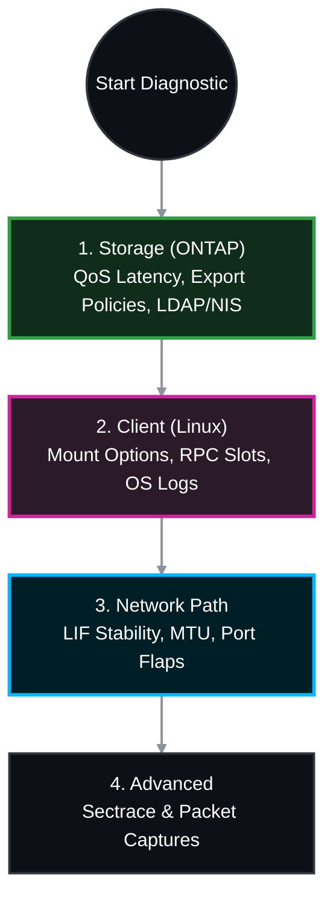

# 🔬 NetApp ONTAP: Comprehensive Storage & Client-Side NFS Troubleshooting Checklist 🛠️

When troubleshooting intermittent NFS access, both the NetApp storage and the Linux client must be examined in tandem. Misconfigurations on the client side (like soft mounts or small RPC slot tables) are just as likely to cause issues as backend storage latency or network flapping.

This guide provides the official NetApp and Linux enterprise best-practice checklists to systematically evaluate both sides of the connection.

## 📑 Table of Contents
1. [🗄️ Phase 1: Storage Side Checks (NetApp ONTAP)](#storage-side)
2. [💻 Phase 2: Client Side Checks (Linux/UNIX)](#client-side)
3. [🌐 Phase 3: Network & Path Validation](#network-path)
4. [🔬 Phase 4: Advanced Diagnostics](#advanced)

---




---

<a id="storage-side"></a>
## 🗄️ Phase 1: Storage Side Checks (NetApp ONTAP)
*Verify that the SVM is healthy, the backend disks are not saturated, and identity management services are reachable.*

### 1.1 Storage Latency & QoS (The #1 cause of intermittent drops)
If backend latency exceeds the client's RPC timeout, the client will drop the connection.
```bash
# Monitor real-time latency breakdown for the affected volume
qos statistics volume latency show -vserver <SVM> -volume <VOL>
```
* **Target:** `Disk` latency should consistently be under 15-20ms. If you see intermittent spikes >100ms, ONTAP is too busy.

### 1.2 Export Policy Verification
Ensure the client hasn't been blocked by a modified policy or a missing SVM Root Traversal rule.
```bash
# Verify the client IP is allowed with the correct permissions (sys)
vserver export-policy rule show -vserver <SVM> -policyname <POLICY_NAME> -clientmatch <CLIENT_IP>
```

### 1.3 Name Services (LDAP/NIS) Health
If ONTAP intermittently cannot resolve UNIX UIDs to GIDs via Active Directory or LDAP, it will deny access.
```bash
# Check the status of the LDAP/NIS connection
vserver services name-service ldap check -vserver <SVM>
vserver services name-service nis-domain show -vserver <SVM>

# Check EMS logs for SECD timeouts indicating AD/LDAP reachability issues
event log show -messagename secd* -time >1d
```

### 1.4 Volume & Junction Path Status
```bash
# Ensure the volume is online and the junction path is active
volume show -vserver <SVM> -volume <VOL> -fields state,junction-active
```

---

<a id="client-side"></a>
## 💻 Phase 2: Client Side Checks (Linux/UNIX)
*Client-side misconfigurations are responsible for the vast majority of "NFS server not responding" errors.*

### 2.1 Verify Mount Options (Hard vs. Soft & Protocol)
```bash
# Show the exact mount options actively being used by the kernel
nfsstat -m
# OR
cat /proc/mounts | grep nfs
```
* **Required Best Practices:**
  * `hard`: **Never** use `soft` for read/write enterprise databases or applications. Soft mounts will corrupt data if the network stutters.
  * `proto=tcp`: Ensure TCP is used. UDP over modern high-speed networks causes massive packet loss.
  * `timeo=600`: (60 seconds). If set too low (e.g., `timeo=10`), the client will impatiently drop connections during minor storage latency spikes.
  * `rsize=65536,wsize=65536` (or up to `1048576`): Ensure block sizes are optimized.

### 2.2 TCP RPC Slot Table Limits (`sunrpc`)
By default, Linux limits the number of concurrent NFS requests to 16 or 64. High-throughput applications will hit this limit and bottleneck, causing intermittent application freezes.
```bash
# Check current slot limit
sysctl sunrpc.tcp_slot_table_entries

# Increase to 128 or 256 for heavy workloads
sudo sysctl -w sunrpc.tcp_slot_table_entries=128
```

### 2.3 Inspect OS Logs for RPC Errors
```bash
# Look for "NFS server not responding" or "Stale file handle"
grep -i nfs /var/log/messages
# OR on systemd systems:
journalctl -k | grep -i nfs
```

### 2.4 Multi-Connection NFS (nconnect)
If using newer Linux kernels (5.3+) connecting to ONTAP over a high-bandwidth link (25G/100G), a single TCP session might max out a single CPU core.
* **Optimization:** Add `nconnect=4` or `nconnect=8` to the mount options to multiplex the NFS traffic across multiple TCP connections.

---

<a id="network-path"></a>
## 🌐 Phase 3: Network & Path Validation
*Intermittent drops often occur at the physical or routing layers between the client and the SVM.*

### 3.1 Verify NetApp LIF Stability
```bash
# Ensure the Data LIF is not bouncing between nodes (causing TCP Resets)
network interface show -vserver <SVM> -data-protocol nfs -fields is-home,curr-node
event log show -messagename vifmgr.lif.migrated -time >1d
```

### 3.2 Verify MTU Mismatches (End-to-End Jumbo Frames)
If the NetApp is 9000, but the Linux client or intermediate switch is 1500, large read/write payloads will be fragmented and dropped.
* **On NetApp:** `network port show -node <NODE> -port <PORT> -fields mtu`
* **On Linux:** `ip link show | grep mtu`
* **The Test (from Linux):** ```bash
  ping -M do -s 8972 <NetApp_NFS_IP>
  ```
  *(If it fails with "Message too long", you have a switch dropping Jumbo Frames).*

### 3.3 Check Physical Port Errors (NetApp)
```bash
# Look for incrementing CRC Errors or Discards
network port statistics show -node <NODE> -port <PORT>
```

---

<a id="advanced"></a>
## 🔬 Phase 4: Advanced Diagnostics
*If the storage is fast, the mount options are perfect, and the network is clean, you must use packet and security traces.*

### 4.1 Sectrace (Permission Denied Drops)
If the intermittent issue is purely authentication-based (EACCES), track the client IP to see why ONTAP rejects it.
```bash
vserver security trace filter create -vserver <SVM> -index 1 -client-ip <CLIENT_IP> -trace-allow yes
# Wait for the issue to occur, then review:
vserver security trace trace-result show -vserver <SVM>
```

### 4.2 Packet Capture (tcpdump)
Capture the raw traffic to definitively prove if the client or the storage is dropping the connection.
```bash
network tcpdump start -node <NODE> -port <PORT> -dst-ip <CLIENT_IP>
```
* **Wireshark Analysis:** Filter for `tcp.analysis.retransmission` (Network dropping packets) or `tcp.analysis.zero_window` (Client or Storage RAM buffers are overwhelmed).
