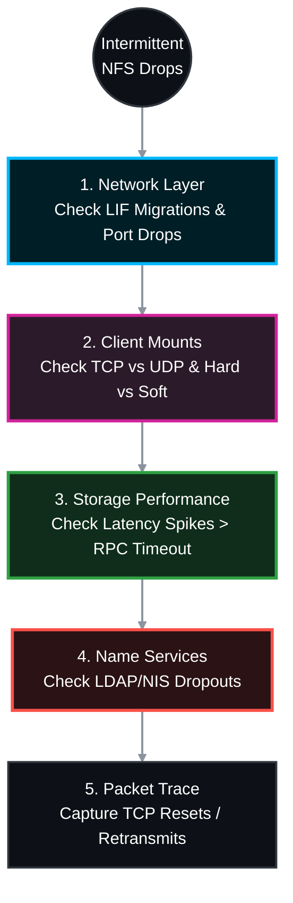

# 🕵️‍♂️ NetApp ONTAP: Intermittent NFS Export Access Troubleshooting Guide 🛠️

Intermittent NFS access issues usually manifest as hanging terminal sessions, frozen applications, or logs filled with "NFS server not responding" errors that magically resolve themselves minutes later. 

Because NFS is largely stateless (in v3) or relies heavily on complex state IDs (in v4.1), pinning down the exact cause requires isolating the physical network, the storage latency, and the Linux client's RPC (Remote Procedure Call) timeouts. This official Standard Operating Procedure (SOP) provides the end-to-end methodology.

> 🏷️ **Rule:** Replace placeholders like `<SVM>`, `<VOL>`, `<NODE>`, `<PORT>`, and `<CLIENT_IP>` with your environment's details.

## 📑 Table of Contents
1. [🗣️ Phase 1: Scoping Questions (Pre-Troubleshooting)](#phase-1)
2. [⚙️ Phase 2: End-to-End Troubleshooting Procedure](#phase-2)
    * [Step 1: Network & LIF Stability (Flapping)](#step-1)
    * [Step 2: Client Mount Options (The "Soft" Mount Trap)](#step-2)
    * [Step 3: Storage Performance (RPC Timeouts)](#step-3)
    * [Step 4: Name Services (Intermittent Permission Denied)](#step-4)
    * [Step 5: Advanced Packet Tracing & Sectrace](#step-5)

---



---

<a id="phase-1"></a>
## 🗣️ Phase 1: Scoping Questions (Pre-Troubleshooting)
*Before touching the CLI, ask the Linux administrator or application owner these exact questions to narrow the fault domain:*

1. **Exact Error Message in `/var/log/messages` or `dmesg`:** * *"NFS server not responding, still trying"* = Network drop, port flap, or severe NetApp disk latency.
   * *"Stale file handle" (ESTALE)* = A file/directory was deleted on the NetApp by another user, OR the volume junction path temporarily went offline.
   * *"Permission Denied" (EACCES)* = Intermittent LDAP/NIS failure to resolve the user's UID to the correct GID.
2. **Scope of Impact:** Is this affecting a single Linux host, an entire VMware ESXi cluster, or all hosts across a specific subnet?
3. **Load vs. Idle:** Do the disconnects happen during massive batch processing/database dumps, or when the system is completely idle?
4. **Mount Protocol:** Are they mounting via NFSv3 or NFSv4.1? (NFSv4.1 introduces stateful sessions, lease expirations, and ID domain mapping that can cause intermittent drops).
5. **Transport Protocol:** Are they using TCP or UDP? (UDP over a WAN or busy LAN will cause massive packet loss and intermittent freezing).

---

<a id="phase-2"></a>
## ⚙️ Phase 2: End-to-End Troubleshooting Procedure

<a id="step-1"></a>
### Step 1: Network & LIF Stability (Flapping)
*If a physical port is flapping or a Data LIF is migrating between nodes (due to a failover or auto-balance), Linux clients will freeze while the TCP connection resets.*


```bash
# Check if the NFS Data LIF is currently on its home node and port
network interface show -vserver <SVM> -data-protocol nfs -fields is-home,curr-node,curr-port

# Check the event logs for recent network link down/up events or LIF migrations (Last 24 hours)
event log show -messagename *net* -time >1d
event log show -messagename *vifmgr* -time >1d

# Check the physical port for incrementing CRC errors or drops
network port statistics show -node <NODE> -port <PORT>
```

> **🛠️ Action to Take:**
> * 👥 **Responsible Team:** **Storage Team** & **Network Team**
> * **👀 What to Look For:** >   * `is-home` shows `false`.
>   * `vifmgr` event logs show LIFs rapidly migrating between nodes.
>   * `CRC Errors` or `Discards` are actively incrementing.
> * **🎯 Exact Actions:**
>   * **Storage:** Run `network interface revert -vserver <SVM> -lif <LIF_NAME>` to send the IP back to its proper home port.
>   * **Storage:** Disable auto-revert if the port is unstable: `network interface modify -vserver <SVM> -lif <LIF_NAME> -auto-revert false`.
>   * **Network/DC:** If CRC errors exist, replace the SFP or fiber cable immediately.

---

<a id="step-2"></a>
### Step 2: Client Mount Options (The "Soft" Mount Trap)
*Incorrect mount options are the leading cause of intermittent NFS application failures.*


* **On the Linux Client:** Run `cat /proc/mounts | grep nfs`

> **🛠️ Action to Take:**
> * 👥 **Responsible Team:** **Linux OS Team / App Owner**
> * **👀 What to Look For:** >   * The protocol is set to `proto=udp`.
>   * The mount options contain `soft` instead of `hard`.
> * **🎯 Exact Actions:**
>   * **Linux Team:** If using `udp`, network congestion will cause packet drops. Force TCP by remounting with `-o tcp`.
>   * **Linux Team:** If using a `soft` mount, the Linux kernel permanently fails the I/O if the NetApp is slightly delayed. Enterprise datastores must **always** use `hard,intr,tcp`. Unmount and remount with these exact flags to force the client to wait patiently during micro-outages.

---

<a id="step-3"></a>
### Step 3: Storage Performance (RPC Timeouts)
*If the Linux client's RPC timeout (`timeo`) is set to 600 (60 seconds), but the NetApp aggregate is saturated by a backup job and takes 65 seconds to acknowledge a write, the Linux client logs "NFS server not responding".*


```bash
# Monitor real-time latency during the reported issue times
qos statistics volume latency show -vserver <SVM> -volume <VOL>
```

> **🛠️ Action to Take:**
> * 👥 **Responsible Team:** **Storage Team**
> * **👀 What to Look For:** >   * The `Disk` or `Data` latency column spiking above 50ms-100ms intermittently (correlating with the exact times the user reports freezes).
> * **🎯 Exact Actions:**
>   * **Storage:** If Disk latency is high, the physical drives are saturated. Use `vol move` to migrate the volume to a faster aggregate (Flash/NVMe).
>   * **Storage:** If Data/CPU latency is high, throttle the noisy neighbor volume using QoS limits (`qos policy-group create -max-throughput...`).

---

<a id="step-4"></a>
### Step 4: Name Services (Intermittent Permission Denied)
*If users intermittently get "Permission Denied" writing to a folder they usually have access to, ONTAP is likely failing to reach the LDAP or NIS server to look up their UNIX group memberships.*

```bash
# Check the status of the LDAP client connection on the SVM
vserver services name-service ldap check -vserver <SVM>

# Review EMS logs for Name Service (SECD) timeouts
event log show -messagename secd.ldap*|secd.nis* -time >1d
```

> **🛠️ Action to Take:**
> * 👥 **Responsible Team:** **Active Directory / Identity Team** & **Storage Team**
> * **👀 What to Look For:** >   * The LDAP check shows `down` or `unreachable`.
>   * `secd.ldap` logs show timeout events or negative lookups cached.
> * **🎯 Exact Actions:**
>   * **Storage:** Flush the SECD name-service cache to force a fresh lookup: `vserver services name-service cache group-membership clear-all -vserver <SVM>`.
>   * **AD/Network:** Ensure firewalls are not dropping LDAP traffic (Port 389/636) and verify the LDAP servers configured on the SVM are healthy and load-balanced.

---

<a id="step-5"></a>
### Step 5: Advanced Packet Tracing & Sectrace
*If all performance and network metrics look clean, you must trace the packets to see if the network is dropping the RPC calls, or use Sectrace to see if ONTAP is silently rejecting the request.*

#### 5A: Packet Trace (tcpdump)
Capture traffic between the node and the specific Linux client experiencing drops.
```bash
network tcpdump start -node <NODE> -port <PORT> -dst-ip <CLIENT_IP>
# (Wait for drop to occur)
network tcpdump stop -node <NODE> -port <PORT>
```


> **🛠️ Action to Take:**
> * 👥 **Responsible Team:** **Network Team**
> * **👀 What to Look For:** Export the `.pcap` to Wireshark and filter by `tcp.analysis.retransmission` or `tcp.window_size == 0`.
> * **🎯 Exact Actions:** >   * If you see floods of retransmissions from the Linux client with no ACKs from the NetApp, a firewall, routing device, or MTU mismatch in the middle is blackholing the traffic. Fix the network path.

#### 5B: Security Trace (Sectrace)
If the intermittent issue is strictly "Permission Denied", tell ONTAP to watch that specific client IP and log exactly *why* it denies an operation.
```bash
vserver security trace filter create -vserver <SVM> -index 1 -client-ip <CLIENT_IP> -trace-allow yes
# (Wait for error to occur)
vserver security trace trace-result show -vserver <SVM>
vserver security trace filter delete -vserver <SVM> -index 1
```

> **🛠️ Action to Take:**
> * 👥 **Responsible Team:** **Storage Team**
> * **👀 What to Look For:** The `Reason` column in the output will explicitly state why access was blocked.
> * **🎯 Exact Actions:** >   * If `Access denied by export policy`: Ensure the client IP hasn't changed or isn't routing through a NAT firewall not allowed in the policy.
>   * If `User mapping failed`: The client is using NFSv4, and the ID Domain in ONTAP (`vserver nfs show`) doesn't match the Linux `/etc/idmapd.conf` file. Make them match.
