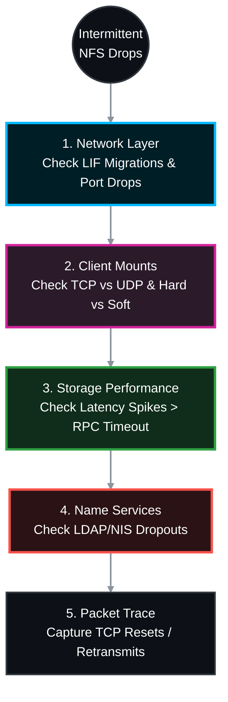

# 🕵️‍♂️ NetApp ONTAP: Intermittent NFS Export Access Troubleshooting Guide 🛠️

Intermittent NFS access issues usually manifest as hanging terminal sessions, frozen applications, or logs filled with "NFS server not responding" errors that magically resolve themselves minutes later. 

Because NFS is largely stateless (in v3) or relies heavily on complex state IDs (in v4.1), pinning down the exact cause requires isolating the physical network, the storage latency, and the Linux client's RPC (Remote Procedure Call) timeouts. This official Standard Operating Procedure (SOP) provides the end-to-end methodology.

> 🏷️ **Rule:** Replace placeholders like `<SVM>`, `<VOL>`, `<NODE>`, `<PORT>`, and `<CLIENT_IP>` with your environment's details.

## 📑 Table of Contents
1. [🗣️ Phase 1: Scoping Questions (Pre-Troubleshooting)](#phase-1)
2. [⚙️ Phase 2: End-to-End Troubleshooting Procedure](#phase-2)
    * [Step 1: Network & LIF Stability (Flapping)](#step-1)
    * [Step 2: Client Mount Options (The "Soft" Mount Trap)](#step-2)
    * [Step 3: Storage Performance (RPC Timeouts)](#step-3)
    * [Step 4: Name Services (Intermittent Permission Denied)](#step-4)
    * [Step 5: Advanced Packet Tracing & Sectrace](#step-5)

---




---

<a id="phase-1"></a>
## 🗣️ Phase 1: Scoping Questions (Pre-Troubleshooting)
*Before touching the CLI, ask the Linux administrator or application owner these exact questions to narrow the fault domain:*

1. **Exact Error Message in `/var/log/messages` or `dmesg`:** * *"NFS server not responding, still trying"* = Network drop, port flap, or severe NetApp disk latency.
   * *"Stale file handle" (ESTALE)* = A file/directory was deleted on the NetApp by another user, OR the volume junction path temporarily went offline.
   * *"Permission Denied" (EACCES)* = Intermittent LDAP/NIS failure to resolve the user's UID to the correct GID.
2. **Scope of Impact:** Is this affecting a single Linux host, an entire VMware ESXi cluster, or all hosts across a specific subnet?
3. **Load vs. Idle:** Do the disconnects happen during massive batch processing/database dumps, or when the system is completely idle?
4. **Mount Protocol:** Are they mounting via NFSv3 or NFSv4.1? (NFSv4.1 introduces stateful sessions, lease expirations, and ID domain mapping that can cause intermittent drops).
5. **Transport Protocol:** Are they using TCP or UDP? (UDP over a WAN or busy LAN will cause massive packet loss and intermittent freezing).

---

<a id="phase-2"></a>
## ⚙️ Phase 2: End-to-End Troubleshooting Procedure

<a id="step-1"></a>
### Step 1: Network & LIF Stability (Flapping)
*If a physical port is flapping or a Data LIF is migrating between nodes (due to a failover or auto-balance), Linux clients will freeze while the TCP connection resets.*

```bash
# Check if the NFS Data LIF is currently on its home node and port
network interface show -vserver <SVM> -data-protocol nfs -fields is-home,curr-node,curr-port

# Check the event logs for recent network link down/up events or LIF migrations (Last 24 hours)
event log show -messagename *net* -time >1d
event log show -messagename *vifmgr* -time >1d

# Check the physical port for incrementing CRC errors or drops
network port statistics show -node <NODE> -port <PORT>
```
* **Action:** If the LIF is migrating frequently, disable `auto-revert` or investigate the underlying switch port stability.

<a id="step-2"></a>
### Step 2: Client Mount Options (The "Soft" Mount Trap)
*Incorrect mount options are the leading cause of intermittent NFS application failures.*


* **On the Linux Client:** Run `cat /proc/mounts | grep nfs`
* **Check Transport:** Ensure `proto=tcp`. If it says `proto=udp`, network congestion is causing packet drops. Force TCP.
* **Check Hard vs. Soft:** * If the mount is `soft` with a low `timeo` (timeout) and `retrans` (retransmit) value, the Linux kernel will permanently fail the I/O if the NetApp takes slightly too long to respond. 
  * **Fix:** Enterprise datastores should **always** use `hard,intr,tcp`. This forces the client to wait patiently if the network stutters, rather than crashing the application.

<a id="step-3"></a>
### Step 3: Storage Performance (RPC Timeouts)
*If the Linux client's RPC timeout (`timeo`) is set to 600 (60 seconds), but the NetApp aggregate is saturated by a backup job and takes 65 seconds to acknowledge a write, the Linux client logs "NFS server not responding".*

```bash
# Monitor real-time latency during the reported issue times
qos statistics volume latency show -vserver <SVM> -volume <VOL>
```
* **Action:** Look at the `Disk` latency column. If it spikes above 50-100ms intermittently (especially during backup windows or virus scans), the issue is storage performance, not the network. You must move the volume to a faster aggregate or throttle the competing workload.

<a id="step-4"></a>
### Step 4: Name Services (Intermittent Permission Denied)
*If users intermittently get "Permission Denied" writing to a folder they usually have access to, ONTAP is likely failing to reach the LDAP or NIS server to look up their UNIX group memberships.*

```bash
# Check the status of the LDAP client connection on the SVM
vserver services name-service ldap check -vserver <SVM>

# Review EMS logs for Name Service (SECD) timeouts
event log show -messagename secd.ldap*|secd.nis* -time >1d
```
* **Action:** If LDAP servers are unreachable or timing out, ONTAP will cache a "negative lookup" or fail the write. Work with the Active Directory/LDAP team to ensure highly available, load-balanced LDAP endpoints.

<a id="step-5"></a>
### Step 5: Advanced Packet Tracing & Sectrace
*If all performance and network metrics look clean, you must trace the packets to see if the network is dropping the RPC calls, or use Sectrace to see if ONTAP is silently rejecting the request.*

#### 5A: Packet Trace (tcpdump)
Capture traffic between the node and the specific Linux client experiencing drops.
```bash
network tcpdump start -node <NODE> -port <PORT> -dst-ip <CLIENT_IP>
# (Wait for drop to occur)
network tcpdump stop -node <NODE> -port <PORT>
```
* **Analysis:** Open the `.pcap` in Wireshark. Filter by `tcp.analysis.retransmission`. If you see a flood of retransmissions from the Linux client, but no ACKs from the NetApp, a firewall or routing device in the middle is dropping the traffic.

#### 5B: Security Trace (Sectrace)
If the intermittent issue is strictly "Permission Denied", tell ONTAP to watch that specific client IP and log exactly *why* it denies an operation.
```bash
# Start the trace
vserver security trace filter create -vserver <SVM> -index 1 -client-ip <CLIENT_IP> -trace-allow yes

# After the user gets the intermittent "Permission Denied" error, read the result:
vserver security trace trace-result show -vserver <SVM>

# Clean up
vserver security trace filter delete -vserver <SVM> -index 1
```
* **Analysis:** The `Reason` column will state exactly if it was dropped by an Export Policy rule mismatch, a UNIX permissions (rwxr-xr-x) mismatch, or an ID mapping failure.
