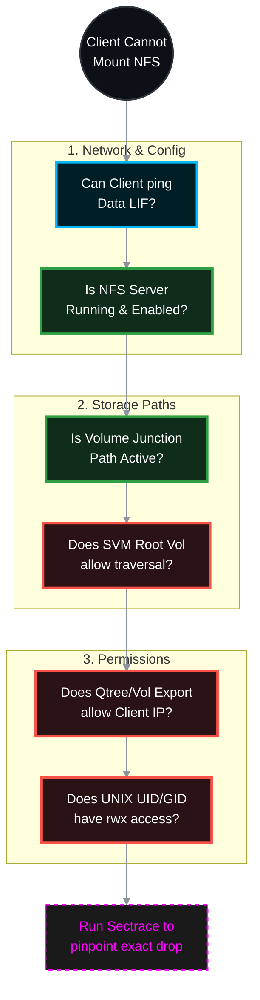

# 🕵️‍♂️ NetApp ONTAP: Ultimate NFS Inaccessibility Troubleshooting Guide 🛠️

When a Linux or UNIX client receives "Access Denied," "Permission Denied," or "Stale File Handle" while trying to mount an NFS export, the issue is almost always a combination of **Export Policies**, **Junction Paths**, or **UNIX UID/GID permissions**. 

This guide provides the official top-down methodology to isolate and resolve NFS inaccessibility in ONTAP 9.x, clearly defining **which team is responsible** for the fix based on the diagnostic output.

> 🏷️ **Rule:** Replace placeholders like `<SVM>`, `<VOL>`, `<LIF_IP>`, and `<CLIENT_IP>` with your environment's details.

## 📑 Table of Contents
1. [🌐 Phase 1: Network & LIF Reachability](#phase-1)
2. [⚙️ Phase 2: ONTAP Logical State (NFS & Volumes)](#phase-2)
3. [🛡️ Phase 3: Export Policies (The #1 Cause)](#phase-3)
4. [🔐 Phase 4: UNIX Permissions (UID/GID)](#phase-4)
5. [🐧 Phase 5: Client-Side Mount Issues](#phase-5)
6. [🔬 Phase 6: Advanced Diagnostics (Sectrace)](#phase-6)
7. [📚 Phase 7: Official NetApp Documentation Reference](#phase-7)

---



---

<a id="phase-1"></a>
## 🌐 Phase 1: Network & LIF Reachability
*If the client cannot reach the SVM's IP, the mount command will simply hang and eventually time out.*

### 1.1 Verify Data LIF Status
Ensure the LIF is UP, on its home port, and hosting the NFS protocol.
```bash
network interface show -vserver <SVM> -data-protocol nfs -fields status-admin,status-oper,is-home,address
```
* **Target:** `status-admin` is `up`, `status-oper` is `up`, `is-home` is `true`.

> **🛠️ Action to Take (If LIF is down or displaced):**
> * 👥 **Responsible Team:** **Storage Team**
> * **If Admin Status is down:**
>   ```bash
>   network interface modify -vserver <SVM> -lif <LIF_NAME> -status-admin up
>   ```
> * **If LIF is not on its home port:**
>   ```bash
>   network interface revert -vserver <SVM> -lif <LIF_NAME>
>   ```

### 1.2 Verify Service Policies (ONTAP 9.10+)
Ensure the Data LIF allows NFS traffic through the host firewall.
```bash
network interface show -vserver <SVM> -fields service-policy
```
* **Target:** The assigned policy includes `data-nfs` and `data-core`.

> **🛠️ Action to Take (If policy is missing NFS):**
> * 👥 **Responsible Team:** **Storage Team**
> * **Change the LIF policy to allow NFS:**
>   ```bash
>   network interface modify -vserver <SVM> -lif <LIF_NAME> -service-policy default-data-files
>   ```

### 1.3 Ping Test from Storage
Prove the SVM can route back to the Linux client.
```bash
network ping -vserver <SVM> -destination <CLIENT_IP>
```

> **🛠️ Action to Take (If ping fails):**
> * 👥 **Responsible Team:** **Network Team** (Routing/Firewall) & **Storage Team** (SVM Routes)
> * **Storage Action:** Ensure a default route or subnet route exists on the SVM (`network route show`). If missing, create it (`network route create -vserver <SVM> -destination 0.0.0.0/0 -gateway <GW_IP>`).
> * **Network Action:** If the SVM route is correct, check upstream firewalls/routers for dropped ICMP/NFS (TCP/UDP port 2049, 111, 635) packets.

---

<a id="phase-2"></a>
## ⚙️ Phase 2: ONTAP Logical State (NFS & Volumes)
*Is the NFS protocol actually running, and is the volume mounted?*

### 2.1 Check NFS Server Status
```bash
vserver nfs show -vserver <SVM>
```
* **Target:** `Administrative Status` is `up` and the requested NFS version (NFSv3 or NFSv4.1) is `enabled`.

> **🛠️ Action to Take (If NFS Admin is Down or Version Disabled):**
> * 👥 **Responsible Team:** **Storage Team**
> * **Start the NFS Server:**
>   ```bash
>   vserver nfs start -vserver <SVM>
>   ```
> * **Enable Specific Version:**
>   ```bash
>   vserver nfs modify -vserver <SVM> -v3 enabled -v4.1 enabled
>   ```

### 2.2 Verify Volume State & Junction Path
If the volume is offline or unmounted, the mount path becomes invalid, resulting in "Stale File Handle" or "No such file or directory".
```bash
volume show -vserver <SVM> -volume <VOL> -fields state,junction-path,junction-active
```
* **Target:** `state` = `online`, `junction-active` = `true`, and a valid path exists.

> **🛠️ Action to Take (If volume is unmounted or inactive):**
> * 👥 **Responsible Team:** **Storage Team**
> * **Online the volume:**
>   ```bash
>   volume online -vserver <SVM> -volume <VOL>
>   ```
> * **Mount the volume (if junction-path is `-`):**
>   ```bash
>   volume mount -vserver <SVM> -volume <VOL> -junction-path /<VOL>
>   ```

---

<a id="phase-3"></a>
## 🛡️ Phase 3: Export Policies (The #1 Cause)
*NFS relies entirely on Export Policies to authenticate IP addresses. If these are wrong, you will get "Access Denied".*

### 3.1 The SVM Root Volume Traversal Rule (Crucial!)
To mount `/vol_data/qtree1`, the client must virtually walk through `/`. If the SVM Root Volume's export policy blocks the client, the mount fails immediately.
*(Note: Corrected the command to dynamically find the Root Volume and fixed the singular `-protocol` and `-ruleindex` syntax).*

```bash
# 1. Find the SVM Root Volume name
vserver show -vserver <SVM> -fields rootvolume

# 2. Check the policy assigned to the root volume
volume show -vserver <SVM> -volume <ROOT_VOL_NAME> -fields policy

# 3. Check the rules on that policy
vserver export-policy rule show -vserver <SVM> -policyname <ROOT_POLICY_NAME>
```
* **Target:** The root volume MUST have a rule allowing your `<CLIENT_IP>` (or `0.0.0.0/0`) with at least `-rorule sys` or `-rorule any`.

> **🛠️ Action to Take (If Root Volume blocks traverse):**
> * 👥 **Responsible Team:** **Storage Team**
> * **Add a read-only traversal rule:**
>   ```bash
>   vserver export-policy rule create -vserver <SVM> -policyname <ROOT_POLICY_NAME> -ruleindex 1 -clientmatch 0.0.0.0/0 -rorule any -rwrule none -protocol nfs
>   or
>   vserver export-policy rule create -vserver <SVM> -policyname <ROOT_POLICY> -ruleindex 1 -protocol nfs -clientmatch 0.0.0.0/0 -rorule sys -rwrule never -superuser none
>   ```

### 3.2 Verify the Target Volume / Qtree Export Policy
```bash
# 1. Find the policy attached to the target volume or Qtree
volume show -vserver <SVM> -volume <VOL> -fields policy

# 2. Inspect the rules
vserver export-policy rule show -vserver <SVM> -policyname <POLICY_NAME>
```
* **Target:** A rule must exist where `-clientmatch` matches the Linux `<CLIENT_IP>`, and allows `-rwrule` and `-superuser`.

> **🛠️ Action to Take (If rules deny access or squash root):**
> * 👥 **Responsible Team:** **Storage Team**
> * **Fix Client Match:** Ensure the subnet or IP is explicitly allowed.
> * **Fix Root Squashing (Permission Denied for root user):** If the Linux client mounts as `root`, `-superuser` must be `sys` (or `any`). If it is `none`, ONTAP squashes root to the `nobody` user.
>   ```bash
>   vserver export-policy rule modify -vserver <SVM> -policyname <POLICY_NAME> -ruleindex <INDEX> -superuser sys
>   ```

---

<a id="phase-4"></a>
## 🔐 Phase 4: UNIX Permissions (UID/GID)
*The network and Export Policies allowed the client inside, but the actual folder on the hard drive says "No."*

### 4.1 Check NTFS vs. UNIX Security Style
NFS volumes should use `unix` security style. If set to `ntfs` or `mixed`, Windows ACLs will interfere with Linux mounts.
```bash
volume show -vserver <SVM> -volume <VOL> -fields security-style
```

> **🛠️ Action to Take (If set to NTFS/Mixed):**
> * 👥 **Responsible Team:** **Storage Team**
> * **Change Security Style:**
>   ```bash
>   volume modify -vserver <SVM> -volume <VOL> -security-style unix
>   ```

### 4.2 Check Folder Permissions from ONTAP
Check the actual `rwxr-xr-x` permissions on the NetApp disk without needing a client.
*(Note: ONTAP CLI cannot natively `chmod` UNIX directories. It must be done via a mounted client).*
```bash
vserver security file-directory show -vserver <SVM> -path /<VOL>
```

> **🛠️ Action to Take (If UNIX permissions are blocking access):**
> * 👥 **Responsible Team:** **Linux OS Team** & **Storage Team**
> * **Linux OS Action (The Fix):** The Storage Team must ensure the volume's export policy allows `-superuser sys` (Phase 3.2). Once allowed, the Linux admin mounts the volume as `root` and executes standard UNIX commands (`chmod`, `chown`) to set the correct UID/GID ownership on the target directory.
>   ```bash
>   mount -t nfs <SVM_IP>:/<VOL> /mnt/troubleshoot
>   chown -R 1000:1000 /mnt/troubleshoot
>   chmod -R 775 /mnt/troubleshoot
>   ```

---

<a id="phase-5"></a>
## 🐧 Phase 5: Client-Side Mount Issues
*Sometimes the issue is exactly how the Linux administrator is typing the command.*

### 5.1 The `showmount` Command Fails
If a Linux admin types `showmount -e <LIF_IP>` and gets an RPC error, they might falsely assume NFS is broken. 
* **Cause:** In ONTAP 9.2+, `showmount` is disabled by default for security. 

> **🛠️ Action to Take (To enable showmount):**
> * 👥 **Responsible Team:** **Storage Team**
> * **Enable on SVM:**
>   ```bash
>   vserver nfs modify -vserver <SVM> -showmount enabled
>   ```

### 5.2 NFSv4 Domain Mismatch
If you mount via NFSv4 and all files show up as owned by `nobody:nobody`, your NFSv4 ID domains do not match between Linux and ONTAP.
* **Storage Check:** `vserver nfs show -vserver <SVM> -fields v4-id-domain`
* **Linux Check:** `cat /etc/idmapd.conf | grep Domain`

> **🛠️ Action to Take (If domains mismatch):**
> * 👥 **Responsible Team:** **Storage Team** & **Linux OS Team**
> * **Storage Action:** Update ONTAP to match the company domain:
>   ```bash
>   vserver nfs modify -vserver <SVM> -v4-id-domain <company.com>
>   ```
> * **Linux OS Action:** Update `/etc/idmapd.conf` to match ONTAP, clear the idmapd cache (`nfsidmap -c`), and restart the `nfs-idmapd` service.

---

<a id="phase-6"></a>
## 🔬 Phase 6: Advanced Diagnostics (Sectrace)
*If everything above looks perfect and the Linux client STILL gets "Access Denied", use **Security Trace**. This tracks the exact microsecond a request is denied and tells you exactly why.*

### 6.1 Create a Trace Filter
> * 👥 **Responsible Team:** **Storage Team**
> * Tell ONTAP to watch for NFS traffic from the specific Linux client IP.
```bash
vserver security trace filter create -vserver <SVM> -index 1 -client-ip <CLIENT_IP> -trace-allow yes
```

### 6.2 Reproduce the Error
> * 👥 **Responsible Team:** **Linux OS Team / User**
> * Have the Linux admin run the `mount` command or `touch` command that generates the "Permission Denied" error.

### 6.3 View the Trace Results
> * 👥 **Responsible Team:** **Storage Team**
```bash
vserver security trace trace-result show -vserver <SVM>
```
Look at the `Reason` column. It will explicitly tell you the failure point. Delegate the fix:
* `Access denied by export policy` -> Storage Team (Fix Phase 3.2).
* `Access denied by Volume Export Policy` -> Storage Team (Fix Phase 3.1 - you forgot to allow the Root Volume!).
* `Access denied by UNIX permissions` -> Storage/Linux Team (Fix Phase 4.2 - the `rwxr-xr-x` permissions are blocking the user's UID).

### 6.4 Cleanup the Trace
> * 👥 **Responsible Team:** **Storage Team**
> * Always clean up traces to prevent CPU overhead.
```bash
vserver security trace filter delete -vserver <SVM> -index 1
```

---

<a id="phase-7"></a>
## 📚 Phase 7: Official NetApp Documentation Reference
*Below are the verified ONTAP 9 official documentation links for the diagnostic commands utilized in this SOP.*

| Command / Protocol | Official NetApp Documentation Reference |
| :--- | :--- |
| `network interface` & `network route` | [ONTAP 9 Network Management Guide](https://docs.netapp.com/us-en/ontap/network-management/index.html) |
| `vserver nfs show` / `modify` | [Docs: vserver nfs commands](https://docs.netapp.com/us-en/ontap-cli/vserver-nfs-show.html) |
| `volume show` / `online` | [Docs: volume commands](https://docs.netapp.com/us-en/ontap-cli/volume-show.html) |
| `vserver export-policy rule` | [Docs: vserver export-policy rule create](https://docs.netapp.com/us-en/ontap-cli/vserver-export-policy-rule-create.html) |
| `vserver security file-directory show` | [Docs: vserver security file-directory](https://docs.netapp.com/us-en/ontap-cli/vserver-security-file-directory-show.html) |
| `vserver security trace` | [Docs: vserver security trace filter create](https://docs.netapp.com/us-en/ontap-cli/vserver-security-trace-filter-create.html) |
