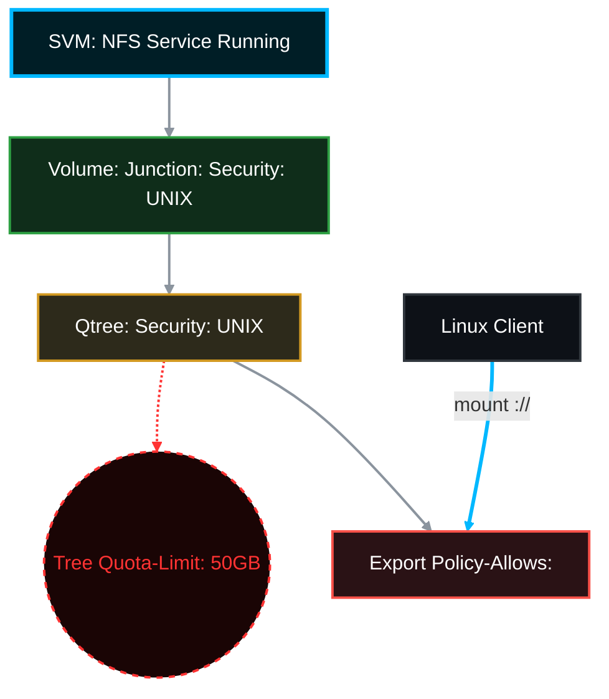

# 🐧 NetApp ONTAP: Complete NFS Export on a Qtree (with 50GB Quota) 🚀

This Standard Operating Procedure (SOP) provides the exact, end-to-end steps to create a new Volume, create a Qtree inside it, apply a strict **50GB Tree Quota**, and export that specific Qtree via **NFS** to a Linux client.

> ✅ **Rule:** This guide adheres strictly to NetApp ONTAP 9.x official documentation.
> 🏷️ **Placeholders:** Replace `<SVM>`, `<AGGR>`, `<VOL>`, `<QTREE>`, `<CLIENT_IP>`, and `<LIF_IP>` with your environment's actual values.

## 📑 Table of Contents
1. [🧠 Prerequisites & Architecture](#prereq)
2. [📦 Step 1: Create the Volume (UNIX Security)](#create-vol)
3. [🌳 Step 2: Create the Qtree](#create-qtree)
4. [🧾 Step 3: Apply the 50GB Quota](#apply-quota)
5. [🛡️ Step 4: Create and Apply the Export Policy (RO, RW, Root Rules)](#export-policy)
6. [🐧 Step 5: Mount the NFS Export (Linux Client)](#mount-client)
7. [✅ Step 6: Verification](#verification)

---




---

<a id="prereq"></a>
## 🧠 Prerequisites & Architecture
* **NFS Service:** Ensure NFS is running on the SVM (`vserver nfs show -vserver <SVM>`).
* **Data LIF:** You must have a Data LIF configured with the `nfs` protocol.
* **Security Style:** For NFS, the Volume and Qtree **must** use the `unix` security style to ensure Linux UID/GID permissions work correctly.

---

<a id="create-vol"></a>
## 📦 Step 1: Create the Volume (UNIX Security)
*First, we create the parent volume. We will make it 100GB, but remember, the Qtree inside it will be restricted to 50GB.*

```bash
# Create the volume, mount it to the namespace, and force UNIX security style
volume create -vserver <SVM> -volume <VOL> -aggregate <AGGR> -size 100GB -security-style unix -junction-path /<VOL> -state online

# Verify the volume is online and mounted
volume show -vserver <SVM> -volume <VOL> -fields state,junction-path,security-style
```

---

<a id="create-qtree"></a>
## 🌳 Step 2: Create the Qtree
*Next, we create the Qtree inside the newly created volume.*

```bash
# Create the Qtree and set its security style to UNIX
volume qtree create -vserver <SVM> -volume <VOL> -qtree <QTREE> -security-style unix

# Verify the Qtree creation
volume qtree show -vserver <SVM> -volume <VOL> -qtree <QTREE>
```

---

<a id="apply-quota"></a>
## 🧾 Step 3: Apply the 50GB Quota
*Now we lock down the Qtree so it can never exceed 50GB.*

```bash
# 1. Create a new Quota Policy for this SVM (if you don't already have one you want to use)
volume quota policy create -vserver <SVM> -policy-name Qtree_NFS_Policy

# 2. Create the Tree Rule specifying the 50GB hard limit for our specific Qtree
volume quota policy rule create -vserver <SVM> -policy-name Qtree_NFS_Policy -volume <VOL> -type tree -target <QTREE> -disk-limit 50GB

# 3. Assign this policy to the parent volume
volume modify -vserver <SVM> -volume <VOL> -quota-policy Qtree_NFS_Policy

# 4. Turn the quota engine ON for the volume
volume quota on -vserver <SVM> -volume <VOL> -foreground

# 5. Verify the quota is active
volume quota report -vserver <SVM> -volume <VOL> -qtree <QTREE>
```

---

<a id="export-policy"></a>
## 🛡️ Step 4: Create and Apply the Export Policy (RO, RW, Root Rules)
*Unlike CIFS which uses Shares and ACLs, NFS uses Export Policies to control which IP addresses are allowed to mount the path and what privileges they are granted.*

```bash
# 1. Create a new Export Policy specifically for this Qtree
vserver export-policy create -vserver <SVM> -policyname <EXP_POLICY_NAME>

# -------------------------------------------------------------------------
# 2. Add Rules to the Policy (Real-World Examples)
# 'sys' means standard UNIX AUTH_SYS (UID/GID) authentication.
# -------------------------------------------------------------------------

# Example A: Read-Only (RO) access for an entire subnet (Index 1)
vserver export-policy rule create -vserver <SVM> -policyname <EXP_POLICY_NAME> -ruleindex 1 -protocol nfs -clientmatch 10.10.10.0/24 -rorule sys -rwrule never -superuser never

# Example B: Read/Write (RW) access but NO Root access for a specific web server (Index 2)
# (If a user acts as 'root' on the client, they are squashed to the 'nobody' user on the NetApp)
vserver export-policy rule create -vserver <SVM> -policyname <EXP_POLICY_NAME> -ruleindex 2 -protocol nfs -clientmatch 192.168.1.50 -rorule sys -rwrule sys -superuser never

# Example C: Full Read/Write AND Root (Superuser) access for an Admin/App Server (Index 3)
vserver export-policy rule create -vserver <SVM> -policyname <EXP_POLICY_NAME> -ruleindex 3 -protocol nfs -clientmatch 192.168.1.100 -rorule sys -rwrule sys -superuser sys

# -------------------------------------------------------------------------

# 3. Assign the Export Policy directly to the Qtree
# (ONTAP 9 allows granular export policies directly on Qtrees!)
volume qtree modify -vserver <SVM> -volume <VOL> -qtree <QTREE> -export-policy <EXP_POLICY_NAME>

# 4. Verify the policy is attached to the Qtree
volume qtree show -vserver <SVM> -volume <VOL> -qtree <QTREE> -fields export-policy
```
> ⚠️ **Crucial Note:** In ONTAP, a client must traverse the SVM Root Volume to reach the Qtree. Ensure your SVM Root Volume's export policy allows at least `read-only` access to the client IP (or `0.0.0.0/0`), or the mount will fail with "Access Denied" or "Stale File Handle".

---

<a id="mount-client"></a>
## 🐧 Step 5: Mount the NFS Export (Linux Client)
*Now we move to the Linux server to mount the storage.*

1. Log in to your Linux client via SSH.
2. Create the local mount point directory:
```bash
sudo mkdir -p /mnt/nfs_qtree
```
3. Mount the Qtree using the NetApp Data LIF IP and the full junction path:
```bash
sudo mount -t nfs <LIF_IP>:/<VOL>/<QTREE> /mnt/nfs_qtree
```
*(Example: `sudo mount -t nfs 10.0.0.50:/vol_data/qtree_nfs /mnt/nfs_qtree`)*

---

<a id="verification"></a>
## ✅ Step 6: Verification
*Prove that the mount was successful and the 50GB quota is actively enforced.*

1. **Verify the Mount:**
```bash
df -h /mnt/nfs_qtree
```
* **Expected Output:** The `Size` column should show exactly **50G** (because the ONTAP Tree Quota limits the reported size to the client), even though the parent volume is 100GB.

2. **Verify Read/Write Permissions:**
```bash
sudo touch /mnt/nfs_qtree/test_file.txt
ls -l /mnt/nfs_qtree/test_file.txt
```
* If the file is created successfully without a "Permission Denied" error, your NFS export and `superuser=sys` rules are working perfectly.

3. **Make it Persistent (Optional):**
To ensure the mount survives a Linux reboot, add it to `/etc/fstab`:
```text
<LIF_IP>:/<VOL>/<QTREE>    /mnt/nfs_qtree    nfs    defaults,_netdev    0 0
```
