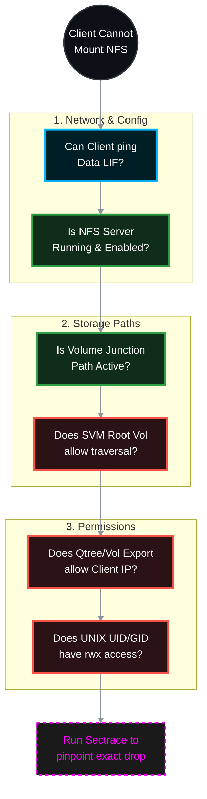

# 🕵️‍♂️ NetApp ONTAP: Ultimate NFS Inaccessibility Troubleshooting Guide 🛠️

When a Linux or UNIX client receives "Access Denied," "Permission Denied," or "Stale File Handle" while trying to mount an NFS export, the issue is almost always a combination of **Export Policies**, **Junction Paths**, or **UNIX UID/GID permissions**. 

This guide provides the official top-down methodology to isolate and resolve NFS inaccessibility in ONTAP 9.x.

> 🏷️ **Rule:** Replace placeholders like `<SVM>`, `<VOL>`, `<LIF_IP>`, and `<CLIENT_IP>` with your environment's details.

## 📑 Table of Contents
1. [🌐 Phase 1: Network & LIF Reachability](#phase-1)
2. [⚙️ Phase 2: ONTAP Logical State (NFS & Volumes)](#phase-2)
3. [🛡️ Phase 3: Export Policies (The #1 Cause)](#phase-3)
4. [🔐 Phase 4: UNIX Permissions (UID/GID)](#phase-4)
5. [🐧 Phase 5: Client-Side Mount Issues](#phase-5)
6. [🔬 Phase 6: Advanced Diagnostics (Sectrace)](#phase-6)

---




---

<a id="phase-1"></a>
## 🌐 Phase 1: Network & LIF Reachability
*If the client cannot reach the SVM's IP, the mount command will simply hang and eventually time out.*

### 1.1 Verify Data LIF Status
Ensure the LIF is UP, on its home port, and hosting the NFS protocol.
```bash
network interface show -vserver <SVM> -data-protocol nfs -fields status-admin,status-oper,is-home,address
```
* **Fix:** If down, run `network interface modify -vserver <SVM> -lif <LIF_NAME> -status-admin up`.

### 1.2 Verify Service Policies (ONTAP 9.10+)
Ensure the Data LIF allows NFS traffic through the host firewall.
```bash
network interface show -vserver <SVM> -fields service-policy
```
* **Fix:** Ensure the assigned policy includes `data-nfs` and `data-core`.

### 1.3 Ping Test from Storage
Prove the SVM can route back to the Linux client.
```bash
network ping -vserver <SVM> -destination <CLIENT_IP>
```

---

<a id="phase-2"></a>
## ⚙️ Phase 2: ONTAP Logical State (NFS & Volumes)
*Is the NFS protocol actually running, and is the volume mounted?*

### 2.1 Check NFS Server Status
```bash
vserver nfs show -vserver <SVM>
```
* **Fix:** If the `Administrative Status` is `down`, start it:
```bash
vserver nfs start -vserver <SVM>
```
* **Version Check:** Ensure the version your client is requesting (NFSv3 or NFSv4.1) is set to `enabled` in this output.

### 2.2 Verify Volume State & Junction Path
If the volume is offline or unmounted, the mount path becomes invalid, resulting in "Stale File Handle" or "No such file or directory".
```bash
volume show -vserver <SVM> -volume <VOL> -fields state,junction-path,junction-active
```
* **Target:** `state` = `online`, `junction-active` = `true`.
* **Fix:** If `junction-path` is `-`, mount it:
```bash
volume mount -vserver <SVM> -volume <VOL> -junction-path /<VOL>
```

---

<a id="phase-3"></a>
## 🛡️ Phase 3: Export Policies (The #1 Cause)
*NFS relies entirely on Export Policies to authenticate IP addresses. If these are wrong, you will get "Access Denied".*

### 3.1 The SVM Root Volume Traversal Rule (Crucial!)
To mount `/vol_data/qtree1`, the client must virtually walk through `/`. If the SVM Root Volume's export policy blocks the client, the mount fails immediately.
```bash
# 1. Find the SVM Root Volume name (usually <SVM>_root)
volume show -vserver <SVM> -volume *_root -fields policy

# 2. Check the rules on that policy
vserver export-policy rule show -vserver <SVM> -policyname <ROOT_POLICY_NAME>
```
* **Fix:** The root volume MUST have a rule allowing your `<CLIENT_IP>` (or `0.0.0.0/0`) with at least `-rorule sys` or `-rorule any`.

### 3.2 Verify the Target Volume / Qtree Export Policy
```bash
# 1. Find the policy attached to the target volume or Qtree
volume show -vserver <SVM> -volume <VOL> -fields policy
# OR if targeting a Qtree:
volume qtree show -vserver <SVM> -volume <VOL> -qtree <QTREE> -fields export-policy

# 2. Inspect the rules
vserver export-policy rule show -vserver <SVM> -policyname <POLICY_NAME>
```
* **Target:** You must have a rule where `-clientmatch` matches your Linux `<CLIENT_IP>` (e.g., `192.168.1.100` or `192.168.1.0/24`).
* **Fix:** If the client is trying to mount as the `root` user, ensure the rule has `-superuser sys`. If it is set to `none` or `never`, the root user is squashed to `nobody` and denied access.
```bash
vserver export-policy rule modify -vserver <SVM> -policyname <POLICY_NAME> -ruleindex <INDEX> -superuser sys
```

---

<a id="phase-4"></a>
## 🔐 Phase 4: UNIX Permissions (UID/GID)
*The network and Export Policies allowed the client inside, but the actual folder on the hard drive says "No."*

### 4.1 Check NTFS vs. UNIX Security Style
NFS volumes should use `unix` security style. If set to `ntfs` or `mixed`, Windows ACLs will interfere with Linux mounts.
```bash
volume show -vserver <SVM> -volume <VOL> -fields security-style
```
* **Fix:** `volume modify -vserver <SVM> -volume <VOL> -security-style unix`

### 4.2 Check Folder Permissions from ONTAP
Check the actual `rwxr-xr-x` permissions on the NetApp disk without needing a client.
```bash
vserver security file-directory show -vserver <SVM> -path /<VOL>
```
* **Fix:** If the folder is owned by UID 0 (root) with `drwxr-xr-x` (755), regular users cannot write to it. If you need to change permissions from the NetApp CLI to grant access:
```bash
# Example: Change permissions to 777 to test if it's a UID/GID block
vserver security file-directory set -vserver <SVM> -path /<VOL> -security-style unix -permissions 0777
```

---

<a id="phase-5"></a>
## 🐧 Phase 5: Client-Side Mount Issues
*Sometimes the issue is exactly how the Linux administrator is typing the command.*

### 5.1 The `showmount` Command Fails
If a Linux admin types `showmount -e <LIF_IP>` and gets an RPC error, they might assume NFS is broken. 
* **Cause:** In ONTAP 9.2+, `showmount` is disabled by default for security. 
* **Fix:** Enable it on the SVM so clients can discover exports:
```bash
vserver nfs modify -vserver <SVM> -showmount enabled
```

### 5.2 NFSv4 Domain Mismatch
If you mount via NFSv4 and all files show up as owned by `nobody:nobody`, your NFSv4 ID domains do not match between Linux and ONTAP.
* **Storage Check:** `vserver nfs show -vserver <SVM> -fields v4-id-domain`
* **Linux Check:** `cat /etc/idmapd.conf | grep Domain`
* **Fix:** Make them match exactly, then restart the `idmapd` service on Linux.

---

<a id="phase-6"></a>
## 🔬 Phase 6: Advanced Diagnostics (Sectrace)
*If everything above looks perfect and the Linux client STILL gets "Access Denied", use **Security Trace**. This tracks the exact microsecond a request is denied and tells you exactly why.*

### 6.1 Create a Trace Filter
Tell ONTAP to watch for NFS traffic from the specific Linux client IP.
```bash
vserver security trace filter create -vserver <SVM> -index 1 -client-ip <CLIENT_IP> -trace-allow yes
```

### 6.2 Reproduce the Error
Have the Linux admin run the `mount` command or `touch` command that generates the "Permission Denied" error.

### 6.3 View the Trace Results
```bash
vserver security trace trace-result show -vserver <SVM>
```
Look at the `Reason` column. It will explicitly tell you the failure point. Examples:
* `Access denied by export policy` (You missed a rule or rule index is wrong).
* `Access denied by Volume Export Policy` (You forgot to allow the SVM Root Volume!).
* `Access denied by UNIX permissions` (The `rwxr-xr-x` permissions are blocking the user's UID).

### 6.4 Cleanup the Trace
```bash
vserver security trace filter delete -vserver <SVM> -index 1
```
