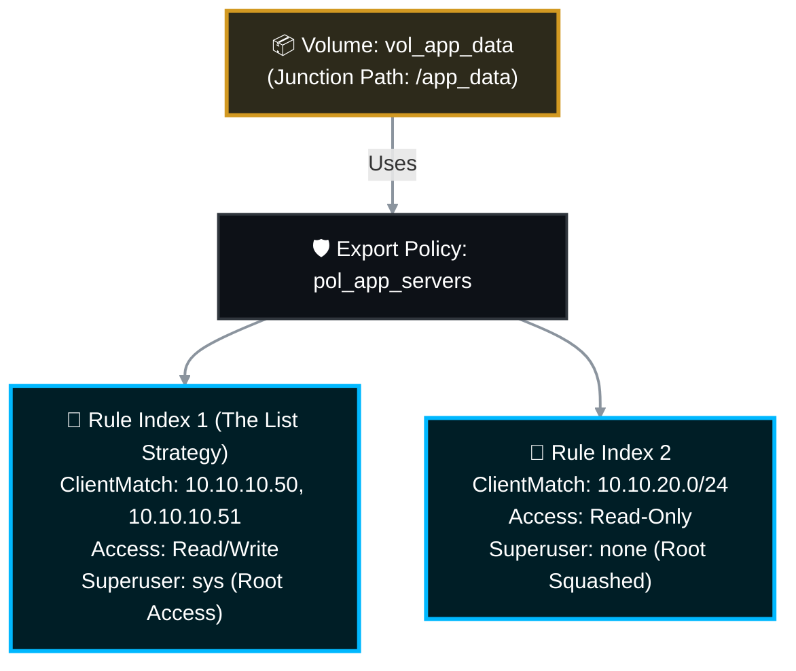

# 📁 NetApp ONTAP: Master NFS & Export Policy Management SOP 🚀

In NetApp ONTAP, NFS (Network File System) access is controlled by **Export Policies** and **Export Rules**. Unlike CIFS/SMB which relies heavily on Active Directory ACLs, NFS primarily relies on verifying the client's IP address against a set of rules.

This Master Standard Operating Procedure (SOP) covers all advanced and day-to-day operations required to manage NFS access securely and efficiently, including the modern ONTAP 9 commands for safely modifying large IP lists.

> 🏷️ **Rule:** Replace placeholders like `<SVM>`, `<Policy_Name>`, `<Volume>`, and `<IP>` with your environment's specific details.

---

## 📋 Table of Contents
1. [🧠 Enterprise Rule Architecture Strategies](#architecture)
2. [🛡️ Phase 1: Policy Container Management (Create/Rename/Delete)](#phase-1)
3. [📜 Phase 2: Rule Creation & Advanced Rule Management](#phase-2)
4. [🛠️ Phase 3: Modifying Rules (The Modern `clientmatches` Method)](#phase-3)
5. [🔗 Phase 4: Assignment & Revocation (Volumes & Qtrees)](#phase-4)
6. [⚙️ Phase 5: SVM NFS Protocol Operations](#phase-5)
7. [🐧 Phase 6: Client-Side Verification (Linux)](#phase-6)
8. [🩺 Phase 7: Troubleshooting & Access Simulation](#phase-7)
9. [📚 Official NetApp Documentation Reference](#references)

---

<a id="architecture"></a>
## 🧠 1. Enterprise Rule Architecture Strategies

When assigning multiple IPs to a volume, Storage Admins must choose between two strategies. This SOP covers how to manage both.

| Strategy | How it Works | Pros | Cons |
| :--- | :--- | :--- | :--- |
| **The "List" Strategy** | A single rule index (e.g., Index 1) contains a comma-separated list of multiple IPs/hostnames in the `-clientmatch` string. | Keeps the policy clean with very few rule indexes. Easy to manage using modern ONTAP 9 `add/remove-clientmatches` commands. | If managed incorrectly using legacy commands, you risk wiping out the entire list. |
| **The "Index" Strategy** | Every single IP gets its own rule index (e.g., Index 1 = 10.0.0.1, Index 2 = 10.0.0.2). | Granular tracking of individual IPs. Legacy safe. | Can result in hundreds of rule indexes, making `show` outputs massive and hard to audit. |



---

<a id="phase-1"></a>
## 🛡️ Phase 1: Policy Container Management

*An export policy is the master container. It must exist before rules can be added or applied to a volume.*

### 1.1 Create a New Export Policy
```bash
vserver export-policy create -vserver <SVM_Name> -policyname <Policy_Name>
```

### 1.2 View Existing Export Policies
```bash
vserver export-policy show -vserver <SVM_Name>
```

### 1.3 Rename an Existing Policy
```bash
vserver export-policy rename -vserver <SVM_Name> -policyname <Old_Policy_Name> -newname <New_Policy_Name>
```

### 1.4 Delete an Export Policy
⚠️ *You cannot delete a policy if it is currently assigned to any Volume or Qtree.*
```bash
vserver export-policy delete -vserver <SVM_Name> -policyname <Policy_Name>
```

---

<a id="phase-2"></a>
## 📜 Phase 2: Rule Creation & Advanced Rule Management

### 2.1 Create a Rule with Read/Write & Root Access
*This is typical for trusted application servers where the Linux `root` user needs full control.*
```bash
vserver export-policy rule create -vserver <SVM_Name> -policyname <Policy_Name> -clientmatch <10.10.10.50> -rorule sys -rwrule sys -superuser sys -ruleindex 1
```

### 2.2 Create a Rule with MULTIPLE IP Addresses (The "List" Strategy)
*Provide a comma-separated list with NO SPACES to grant multiple hosts the exact same access level under a single rule index.*
```bash
vserver export-policy rule create -vserver <SVM_Name> -policyname <Policy_Name> -clientmatch 10.10.10.50,10.10.10.51,192.168.1.0/24 -rorule sys -rwrule sys -superuser sys -ruleindex 1
```

### 2.3 Create a Rule with specific "Squash" Settings (Read-Only)
*Grant a subnet Read/Write access, but block `root` access (squash root to anonymous UID).*
```bash
vserver export-policy rule create -vserver <SVM_Name> -policyname <Policy_Name> -clientmatch 10.20.0.0/16 -rorule sys -rwrule sys -superuser none -ruleindex 2
```

### 2.4 View Rules and their ClientMatch Lists
*Crucial step before modifying. This shows you exactly what IPs are currently inside a specific rule index.*
```bash
vserver export-policy rule show -vserver <SVM_Name> -policyname <Policy_Name> -ruleindex <Index_Number> -fields clientmatch,rorule,rwrule,superuser
```

---

<a id="phase-3"></a>
## 🛠️ Phase 3: Modifying Rules (The Modern `clientmatches` Method)

*In ONTAP 9, NetApp introduced the `add-clientmatches` and `remove-clientmatches` commands to solve the headache of managing massive comma-separated lists. Use these commands to surgically add or remove specific IP addresses from a large rule index without touching the rest of the list.*

### 3.1 Safely ADD a New IP to a Multiple-IP Rule
Instead of modifying and overwriting the entire list, simply append the new IP.

```bash
# 1. Append the IP
vserver export-policy rule add-clientmatches -vserver <SVM_Name> -policyname <Policy_Name> -ruleindex <Index_Number> -clientmatch <New_IP_to_Add>

# Note: You can add multiple new IPs at once: -clientmatch 10.1.1.50,10.1.1.51

# 2. Verify the Addition
vserver export-policy rule show -vserver <SVM_Name> -policyname <Policy_Name> -ruleindex <Index_Number> -fields clientmatch
```

### 3.2 Safely REMOVE a Specific IP from a Multiple-IP Rule
Surgically extract a specific IP while leaving the rest of the production servers untouched.

```bash
# 1. Remove the IP
vserver export-policy rule remove-clientmatches -vserver <SVM_Name> -policyname <Policy_Name> -ruleindex <Index_Number> -clientmatch <IP_to_Remove>

# 2. Verify the Removal
vserver export-policy rule show -vserver <SVM_Name> -policyname <Policy_Name> -ruleindex <Index_Number> -fields clientmatch
```

### 3.3 Changing Permissions for an Entire Rule
*Changing a specific rule from Read-Only to Read/Write without altering the IP list.*
```bash
vserver export-policy rule modify -vserver <SVM_Name> -policyname <Policy_Name> -ruleindex <Index_Number> -rwrule sys -superuser sys
```

### 3.4 Deleting an Entire Rule Index
*If the rule only had one IP, or if you want to wipe out the entire list of IPs at that index in one shot.*
```bash
vserver export-policy rule delete -vserver <SVM_Name> -policyname <Policy_Name> -ruleindex <Index_Number>
```

---

<a id="phase-4"></a>
## 🔗 Phase 4: Assignment & Revocation (Volumes & Qtrees)

### 4.1 Assign a Policy to a Volume
```bash
volume modify -vserver <SVM_Name> -volume <Volume_Name> -policy <Policy_Name>
```

### 4.2 Verify Volume Policy and Junction Path
*You need the Junction Path to give to the Linux admin so they know what to mount.*
```bash
volume show -vserver <SVM_Name> -volume <Volume_Name> -fields policy,junction-path
```

### 4.3 Revoke Access Completely (Revert to Default)
*To instantly lock down a volume, switch its policy back to the SVM's `default` policy (which is typically empty or highly restricted).*
```bash
volume modify -vserver <SVM_Name> -volume <Volume_Name> -policy default
```

### 4.4 Assign a Policy to a Specific Qtree
*Allows granular security. A volume can be open to the whole network, but a specific Qtree inside it can have a highly restrictive policy.*
```bash
qtree modify -vserver <SVM_Name> -volume <Volume_Name> -qtree <Qtree_Name> -export-policy <Qtree_Specific_Policy>
```

---

<a id="phase-5"></a>
## ⚙️ Phase 5: SVM NFS Protocol Operations

### 5.1 Verify NFS is Enabled on the SVM
```bash
vserver nfs show -vserver <SVM_Name> -fields v3,v4.0,v4.1,state
```

### 5.2 Enable/Disable NFS Versions
```bash
vserver nfs modify -vserver <SVM_Name> -v3 enabled -v4.1 disabled
```

### 5.3 Verify Data LIFs Support NFS
*Ensure the network interfaces are actually configured to listen for NFS traffic.*
```bash
network interface show -vserver <SVM_Name> -data-protocol nfs
```

---

<a id="phase-6"></a>
## 🐧 Phase 6: Client-Side Verification (Linux)
*Provide these commands to the server team to mount the NFS export.*

```bash
# 1. Create a mount point directory
sudo mkdir -p /mnt/app_data

# 2. Mount the NetApp volume (NFSv3 example)
sudo mount -t nfs -o nfsvers=3,hard,sync <SVM_Data_LIF_IP>:/<Junction_Path> /mnt/app_data

# 3. Verify it's mounted and check size
df -h | grep nfs
```

---

<a id="phase-7"></a>
## 🩺 Phase 7: Troubleshooting & Access Simulation

### 7.1 The "Check Access" Simulator 🚀 (The Ultimate Triage Tool)
*If a client complains they cannot mount the share, DO NOT guess. Use the built-in simulator. It calculates the active policy, rule index, and UNIX permissions to tell you exactly why it is failing.*
```bash
vserver export-policy check-access -vserver <SVM_Name> -volume <Volume_Name> -client-ip <Failing_Client_IP> -authentication-method sys -protocol nfs3 -access-type read-write
```
*If it returns `Access Denied`, check the output for the exact `Rule Index` that triggered the block.*

### 7.2 Flush Export Policy Cache (Mandatory for immediate effect)
*ONTAP heavily caches export rules to reduce CPU load. Whenever you modify client matches on a heavily accessed volume, flush the cache to ensure the changes are enforced immediately.*
```bash
vserver export-policy cache flush -vserver <SVM_Name> -node *
```

### 7.3 Verify Volume Security Style
*If the export rule is perfect but the user still gets "Permission Denied" when touching files, the volume security style might be set to NTFS instead of UNIX.*
```bash
volume show -vserver <SVM_Name> -volume <Volume_Name> -fields security-style
```

---

<a id="references"></a>
## 📚 8. Official NetApp Documentation Reference

*All commands and logic pathways are strictly validated against the NetApp ONTAP 9 Documentation Center.*

| Task / Operation | Official NetApp Documentation Reference |
| :--- | :--- |
| **Safely Add IPs to List** | [Docs: vserver export-policy rule add-clientmatches](https://docs.netapp.com/us-en/ontap-cli/vserver-export-policy-rule-add-clientmatches.html) |
| **Safely Remove IPs from List** | [Docs: vserver export-policy rule remove-clientmatches](https://docs.netapp.com/us-en/ontap-cli/vserver-export-policy-rule-remove-clientmatches.html) |
| **Manage Export Rules (Lists & Indexes)** | [Docs: vserver export-policy rule create](https://docs.netapp.com/us-en/ontap-cli/vserver-export-policy-rule-create.html) |
| **Manage Export Policies (Create/Rename)** | [Docs: vserver export-policy commands](https://docs.netapp.com/us-en/ontap-cli/vserver-export-policy-create.html) |
| **Delete Entire Rule** | [Docs: vserver export-policy rule delete](https://docs.netapp.com/us-en/ontap-cli/vserver-export-policy-rule-delete.html) |
| **Assign Policies to Volumes/Qtrees** | [Docs: volume modify](https://docs.netapp.com/us-en/ontap-cli/volume-modify.html) |
| **Access Simulator (check-access)** | [Docs: vserver export-policy check-access](https://docs.netapp.com/us-en/ontap-cli/vserver-export-policy-check-access.html) |
| **Flush Policy Cache** | [Docs: export-policy cache flush](https://docs.netapp.com/us-en/ontap-cli/vserver-export-policy-cache-flush.html) |
