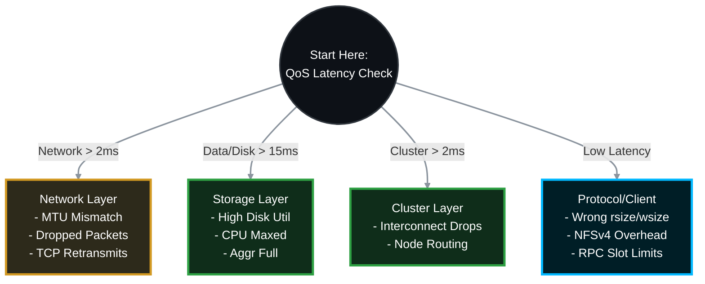

# 🐌 NetApp ONTAP: Deep-Dive NFS Performance & Slowness Troubleshooting Guide 🚀

When a Linux or UNIX client reports that an NFS export is slow, the root cause could be anything from a mismatched `rsize`/`wsize` on the client, to a dropped packet on a switch, to maxed-out physical disks on the NetApp. 

This Standard Operating Procedure (SOP) provides the official, top-down methodology to **isolate the fault domain** and resolve NFS performance issues in ONTAP 9.x.

> 🏷️ **Rule:** Replace placeholders like `<SVM>`, `<VOL>`, `<NODE>`, `<PORT>`, and `<CLIENT_IP>` with your environment's specific details.

## 📑 Table of Contents
1. [🕵️ Phase 1: Real-Time Latency Isolation (QoS)](#phase-1)
2. [💾 Phase 2: Hardware & Storage Layer Analysis](#phase-2)
3. [🌐 Phase 3: Network & Path Analysis (MTU & Drops)](#phase-3)
4. [🐧 Phase 4: NFS Protocol & Client-Side Mount Options](#phase-4)
5. [🔬 Phase 5: Advanced Diagnostics (Packet Trace & Perfstat)](#phase-5)

---




---

<a id="phase-1"></a>
## 🕵️ Phase 1: Real-Time Latency Isolation (QoS)
*Stop guessing. ONTAP's Quality of Service (QoS) engine tracks every microsecond of an I/O request. We will use QoS to instantly determine if the delay is in the Network, the Cluster, the Protocol, or the Disks.*

### 1.1 The Magic QoS Command
Run this command on the NetApp CLI during the exact time the user is experiencing slowness. It refreshes every 5 seconds.
```bash
# View real-time latency breakdown for your NFS volume
qos statistics volume latency show -vserver <SVM> -volume <VOL>
```

### 1.2 How to Read the Output
Look at the latency columns (`Network`, `Cluster`, `Data`, `Disk`).
* 🔴 **Disk Latency is High (>15-20ms):** The physical drives are maxed out. Proceed to **Phase 2**.
* 🔴 **Data/CPU Latency is High:** The node's CPU is overwhelmed processing the NFS requests. Proceed to **Phase 2**.
* 🔴 **Network Latency is High:** ONTAP has the file ready, but the TCP acknowledgment from the Linux client took too long. Proceed to **Phase 3**.
* 🟢 **All Latencies are LOW (<2ms):** The storage is fine! The issue is entirely on the Linux client OS, the application, or the specific NFS mount options. Proceed to **Phase 4**.

---

<a id="phase-2"></a>
## 💾 Phase 2: Hardware & Storage Layer Analysis
*If the QoS command showed high `Disk` or `Data` latency, the bottleneck is inside the NetApp hardware.*

### 2.1 Check Aggregate & Disk Utilization
Are your hard drives spinning at 100% capacity?
```bash
# Check aggregate utilization (Target: under 80-85%)
storage aggregate show-space

# Check real-time disk and CPU utilization (refreshing every 1 second)
node run -node <NODE> -command sysstat -x 1
```
* **Action:** Look at the `Disk Util` column in the `sysstat` output. If it is sitting at 95-100%, your physical disks cannot keep up with the IOPS. You need to move the volume to a faster aggregate (Flash/NVMe) or add more disks.

### 2.2 Check CPU Bottlenecks
* **Action:** Look at the `CPU` column in `sysstat`. If CPU is consistently above 85%, the node is overburdened. You may need to migrate the NFS data LIF to a less busy node in the cluster to balance the load.

---

<a id="phase-3"></a>
## 🌐 Phase 3: Network & Path Analysis (MTU & Drops)
*If QoS showed high `Network` latency, packets are dropping on the wire or MTUs are mismatched.*

### 3.1 Check for Physical Port Errors (CRC / Drops)
A bad cable or optical transceiver will cause massive packet retransmissions, killing NFS performance.
```bash
# View physical port statistics for errors
network port statistics show -node <NODE> -port <PORT>
```
* **Fix:** Look for `CRC Errors` or `Discards`. If these numbers are actively climbing, replace the physical cable or SFP, and check the upstream switch port.

### 3.2 Verify MTU Mismatches (Jumbo Frames)
If the NetApp is set to MTU 9000 (Jumbo Frames) but the Linux client or switch is set to 1500, large NFS payloads will be fragmented or dropped.
```bash
# Check the MTU of the NetApp ports
network port show -fields mtu
```
* **Linux Client Check:** Run `ip link show` on the Linux client and check the `mtu` value for the active adapter.
* **The Ping Test (From Linux):** Prove the path supports 9000 bytes without fragmentation.
  ```bash
  ping -M do -s 8972 <NetApp_NFS_IP>
  ```
* **Fix:** Ensure the Client, Switch, and NetApp all match exactly. If the ping fails with "Message too long", drop the NetApp port's broadcast domain back to 1500 to restore performance.

---

<a id="phase-4"></a>
## 🐧 Phase 4: NFS Protocol & Client-Side Mount Options
*The storage is fast, the network is clean, but NFS is still slow. The issue is usually how the Linux client is asking for the data.*

### 4.1 Check Mount Block Sizes (`rsize` and `wsize`)
This is the #1 cause of NFS slowness. If a client negotiates a tiny block size (like 4K), it has to send thousands of requests to read a 1MB file.
* **On the Linux Client:**
  ```bash
  cat /proc/mounts | grep nfs
  ```
* **Action:** Look for `rsize=` and `wsize=`. For modern ONTAP systems over Gigabit/10G networks, these should be **65536** (64K) or **1048576** (1MB). If you see `rsize=4096`, unmount and remount the export explicitly forcing a larger size:
  ```bash
  sudo mount -t nfs -o rsize=65536,wsize=65536 <IP>:/<VOL> /mnt/data
  ```

### 4.2 NFSv3 vs. NFSv4 Overhead
NFSv4 is stateful and includes features like ID mapping and ACLs. This adds overhead. NFSv3 is stateless and often significantly faster for raw throughput if you don't need v4's advanced security features.
* **Action:** If the client is mounting via NFSv4.1 and experiencing high CPU or locking delays, try forcing a downgrade to NFSv3 to see if performance improves:
  ```bash
  sudo mount -t nfs -o vers=3 <IP>:/<VOL> /mnt/data
  ```

### 4.3 Check Client TCP RPC Slots (`sunrpc`)
Linux limits how many concurrent RPC requests it will send to the NetApp. If your application is highly threaded, it might hit this artificial limit.
* **On the Linux Client:**
  ```bash
  cat /proc/sys/sunrpc/tcp_slot_table_entries
  ```
* **Action:** The default is often 16 or 64. If you have a high-performance database or clustered app, increase this to 128 or 256.
  ```bash
  sudo sysctl -w sunrpc.tcp_slot_table_entries=128
  ```

---

<a id="phase-5"></a>
## 🔬 Phase 5: Advanced Diagnostics (Packet Trace & Perfstat)
*If you have exhausted all options, you must capture the raw data to see exactly what the TCP conversation looks like.*

### 5.1 Run a Packet Trace (tcpdump)
Capture the raw network traffic directly from the NetApp port to see if the Linux client is dropping packets or experiencing TCP Zero Window events.
```bash
# Start a packet trace on the node hosting the NFS LIF targeting the client IP
network tcpdump start -node <NODE> -port <PORT> -dst-ip <CLIENT_IP>

# Stop it after the user reproduces the slowness
network tcpdump stop -node <NODE> -port <PORT>
```
* **Analysis:** Export the `.pcap` file from the `/mroot/etc/log/packet_traces/` directory. Open it in Wireshark. Filter for `tcp.analysis.retransmission` or `nfs`.

### 5.2 Generate a Perfstat
If escalating to NetApp Support (TAC), they will require a Perfstat to analyze the cluster's deepest counters.
1. Download the latest **Perfstat** utility from the NetApp Support Site.
2. Run it from a jump-box with access to the Cluster Management IP during the slow period:
   ```cmd
   perfstat.exe -t 5 -i 1 -l <Admin_User> -f <Cluster_Mgmt_IP> > nfs_perfstat.out
   ```
3. Upload the archive to your NetApp Support ticket.
