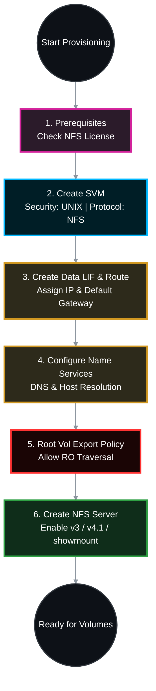

# 🏗️ NetApp ONTAP: Enterprise Guide to Creating an NFS SVM 🌐

For NetApp professionals, deploying an NFS Storage Virtual Machine (SVM) requires strict attention to detail regarding security styles, allowed protocols, service policies, and the often-overlooked SVM Root Volume export policy (traversal rights). 

This Standard Operating Procedure (SOP) is built strictly from NetApp ONTAP 9.x official documentation for production-grade NFS environments.

## 📑 Table of Contents
1. [🧠 Phase 1: Cluster Prerequisites (Licensing)](#phase-1)
2. [📦 Phase 2: SVM & Network Provisioning (Including Routing)](#phase-2)
3. [🧭 Phase 3: Name Services (DNS & NSSwitch)](#phase-3)
4. [🛡️ Phase 4: The SVM Root Volume Export Policy (Critical)](#phase-4)
5. [⚙️ Phase 5: NFS Server Configuration (v3, v4.1, & Showmount)](#phase-5)
6. [✅ Phase 6: Verification](#phase-6)

---




---

<a id="phase-1"></a>
## 🧠 Phase 1: Cluster Prerequisites (Licensing)
*Before provisioning, verify the cluster is actively licensed to serve the NFS protocol.*

### 1.1 Verify NFS License
```bash
system license show -package NFS
```
*(If the license is missing or expired, you cannot start the NFS service on the SVM).*

---

<a id="phase-2"></a>
## 📦 Phase 2: SVM & Network Provisioning (Including Routing)

### 2.1 Create the Vserver (SVM)
*We must enforce the `unix` security style for the root volume and strictly limit the allowed protocols to `nfs` to prevent multiprotocol mapping issues later.*
```bash
# Create the dedicated NFS SVM
vserver create -vserver nfs_svm -aggregate <AGGR_NAME> -rootvolume nfs_root_vol -rootvolume-security-style unix -allowed-protocols nfs -language C.UTF-8
```

### 2.2 Create the Data LIF
*Use modern ONTAP Service Policies to ensure the LIF can handle NFS data and core routing.*
```bash
# Create the LIF for NFS data traffic
network interface create -vserver nfs_svm -lif nfs_lif01 -service-policy default-data-files -home-node <NODE_NAME> -home-port <PORT_NAME> -address <IP_ADDRESS> -netmask <SUBNET_MASK>
```

### 2.3 Create the Default Route
*Storage and clients rarely share the same broadcast domain. Provide a gateway so the SVM can respond to clients across routed subnets.*
```bash
# Add a default route for the SVM
network route create -vserver nfs_svm -destination 0.0.0.0/0 -gateway <GATEWAY_IP>

# Verify the route
network route show -vserver nfs_svm
```

---

<a id="phase-3"></a>
## 🧭 Phase 3: Name Services (DNS & NSSwitch)
*While NFSv3 can operate purely on IP addresses, NFSv4 requires accurate ID domains and DNS resolution for proper UID/GID to string mapping. DNS is an enterprise best practice.*

### 3.1 Configure DNS
```bash
# Point the SVM to enterprise DNS servers
vserver services name-service dns create -vserver nfs_svm -domains ss.com.domain -name-servers <DNS_IP_1>,<DNS_IP_2>
```

### 3.2 Configure Name Service Switch (NSSwitch)
*Ensure the SVM checks local files before querying external DNS for host resolution.*
```bash
# Set host name resolution priority
vserver services name-service ns-switch modify -vserver nfs_svm -database hosts -sources files,dns
```

---

<a id="phase-4"></a>
## 🛡️ Phase 4: The SVM Root Volume Export Policy (Critical)
*The #1 reason NFS mounts fail in new SVMs is a restrictive root volume policy. Clients MUST be able to traverse the SVM Root Volume (`/`) to reach their data volumes (e.g., `/vol_data`). We must grant Read-Only traversal rights.*

### 4.1 Apply the Traversal Rule to the Default Policy
*The SVM root volume uses the `default` export policy upon creation.*
```bash
# Create a rule allowing ALL clients (0.0.0.0/0) to traverse the root volume.
# They are granted Read-Only (RO) access, but strictly NO Read/Write (RW) and NO Root (Superuser) access.
vserver export-policy rule create -vserver nfs_svm -policyname default -ruleindex 1 -protocol nfs -clientmatch 0.0.0.0/0 -rorule any -rwrule never -superuser never

# Verify the rule was successfully applied
vserver export-policy rule show -vserver nfs_svm -policyname default
```

---

<a id="phase-5"></a>
## ⚙️ Phase 5: NFS Server Configuration (v3, v4.1, & Showmount)
*Now we instantiate the actual NFS service on the SVM and define which NFS protocol versions it will accept.*

### 5.1 Create the NFS Server
*In a modern enterprise, NFSv3 and NFSv4.1 (with pNFS for parallel data paths) are typically enabled, while the older NFSv4.0 is disabled.*
```bash
# Create the NFS server and specify active versions
vserver nfs create -vserver nfs_svm -v3 enabled -v4.0 disabled -v4.1 enabled -v4.1-pnfs enabled

# If using NFSv4, ensure the ID domain matches your Linux clients (e.g., ss.com.domain)
vserver nfs modify -vserver nfs_svm -v4-id-domain ss.com.domain
```

### 5.2 Enable `showmount` (Optional but Recommended for Admin ease)
*In ONTAP 9.2+, NetApp disabled `showmount` by default for security. Enabling it allows Linux admins to run `showmount -e <NetApp_IP>` to discover exported paths.*
```bash
vserver nfs modify -vserver nfs_svm -showmount enabled
```

---

<a id="phase-6"></a>
## ✅ Phase 6: Verification
*Confirm the SVM is fully operational and ready to host data volumes.*

### 6.1 Check NFS Server Status
```bash
vserver nfs show -vserver nfs_svm
```
* **Target:** `Administrative Status: up` and your desired versions (V3, V4.1) show as `enabled`.

### 6.2 Verify Network and DNS Reachability
```bash
# Verify the LIF is up and responding
network interface show -vserver nfs_svm

# Verify DNS can resolve an external host
vserver services name-service dns check -vserver nfs_svm
```

The SVM is now successfully provisioned, highly available, and ready for you to create volumes, Qtrees, and custom export policies!
