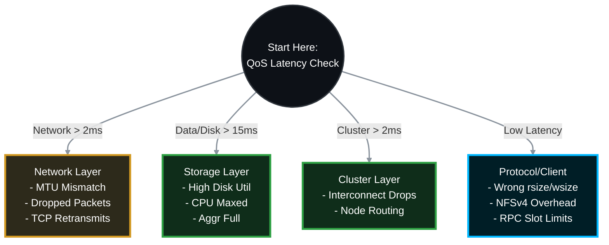

# 🐌 NetApp ONTAP: Deep-Dive NFS Performance & Slowness Troubleshooting Guide 🚀

When a Linux or UNIX client reports that an NFS export is slow, the root cause could be anything from a mismatched `rsize`/`wsize` on the client, to a dropped packet on a switch, to maxed-out physical disks on the NetApp. 

This Standard Operating Procedure (SOP) provides the official, top-down methodology to **isolate the fault domain**, explicitly define **which team is responsible** for each layer, and resolve NFS performance issues in ONTAP 9.x.

> 🏷️ **Rule:** Replace placeholders like `<SVM>`, `<VOL>`, `<NODE>`, `<PORT>`, and `<CLIENT_IP>` with your environment's specific details.

## 📑 Table of Contents
1. [🕵️ Phase 1: Real-Time Latency Isolation (QoS)](#phase-1)
2. [💾 Phase 2: Hardware & Storage Layer Analysis](#phase-2)
3. [🌐 Phase 3: Network & Path Analysis (MTU & Drops)](#phase-3)
4. [🐧 Phase 4: NFS Protocol & Client-Side Mount Options](#phase-4)
5. [🔬 Phase 5: Advanced Diagnostics (Packet Trace & Perfstat)](#phase-5)
6. [📚 Phase 6: Official NetApp Documentation Reference](#phase-6)

---



---

<a id="phase-1"></a>
## 🕵️ Phase 1: Real-Time Latency Isolation (QoS)
*Stop guessing. ONTAP's Quality of Service (QoS) engine tracks every microsecond of an I/O request. We will use QoS to instantly determine if the delay is in the Network, the Cluster, the Protocol, or the Disks.*

### 1.1 The Magic QoS Command
Run this command on the NetApp CLI during the exact time the user is experiencing slowness. It refreshes every 5 seconds.
```bash
# View real-time latency breakdown for your NFS volume
qos statistics volume latency show -vserver <SVM> -volume <VOL>
```

### 1.2 How to Read the Output & Assign Responsibility
Look at the latency columns (`Network`, `Cluster`, `Data`, `Disk`).

> **🛠️ Action to Take (Based on QoS Output):**
> * 🔴 **If Disk Latency is High (>15-20ms):**
>   * 👥 **Responsible Team:** **Storage Team**
>   * **Verdict:** The physical drives are maxed out. Proceed to **Phase 2**.
> * 🔴 **If Data/CPU Latency is High:**
>   * 👥 **Responsible Team:** **Storage Team**
>   * **Verdict:** The node's CPU is overwhelmed processing the NFS requests. Proceed to **Phase 2**.
> * 🔴 **If Network Latency is High:**
>   * 👥 **Responsible Team:** **Network Team / Linux OS Team**
>   * **Verdict:** ONTAP has the file ready, but the TCP acknowledgment from the Linux client took too long (packet loss, TCP windowing). Proceed to **Phase 3**.
> * 🟢 **If All Latencies are LOW (<2ms):**
>   * 👥 **Responsible Team:** **Linux OS Team / Application Owners**
>   * **Verdict:** The storage is responding instantly! The issue is entirely on the Linux client OS, the application logic, or the specific NFS mount options. Proceed to **Phase 4**.

---

<a id="phase-2"></a>
## 💾 Phase 2: Hardware & Storage Layer Analysis
*If the QoS command showed high `Disk` or `Data` latency, the bottleneck is inside the NetApp hardware.*

### 2.1 Check Aggregate & Disk Utilization
Are your hard drives spinning at 100% capacity?
```bash
# Check aggregate utilization (Target: under 80-85%)
storage aggregate show-space

# Check real-time disk and CPU utilization (refreshing every 1 second)
node run -node <NODE> -command sysstat -x 1
```

> **🛠️ Action to Take (If Storage is Bottlenecking):**
> * 👥 **Responsible Team:** **Storage Team**
> * **If `Disk Util` is 95-100%:** The physical disks cannot keep up with the IOPS. You must utilize `vol move` to migrate the volume to a faster aggregate (e.g., Flash/NVMe) or expand the aggregate with more disks.

### 2.2 Check CPU Bottlenecks
> **🛠️ Action to Take (If CPU is Bottlenecking):**
> * 👥 **Responsible Team:** **Storage Team**
> * **If `CPU` is consistently > 85%:** The node is overburdened. You may need to migrate the NFS data LIF to a less busy node in the cluster to balance the network and CPU load.

---

<a id="phase-3"></a>
## 🌐 Phase 3: Network & Path Analysis (MTU & Drops)
*If QoS showed high `Network` latency, packets are dropping on the wire or MTUs are mismatched.*

### 3.1 Check for Physical Port Errors (CRC / Drops)
A bad cable or optical transceiver will cause massive packet retransmissions, killing NFS performance.
```bash
# View physical port statistics for errors
network port statistics show -node <NODE> -port <PORT>
```

> **🛠️ Action to Take (If CRC/Discards are incrementing):**
> * 👥 **Responsible Team:** **Data Center Tech / Network Team**
> * **Fix:** If `CRC Errors` or `Discards` are actively climbing, the physical layer is failing. Replace the physical fiber cable, swap the optical SFP, or have the network team check the upstream switch port for hardware faults.

### 3.2 Verify MTU Mismatches (Jumbo Frames)
If the NetApp is set to MTU 9000 (Jumbo Frames) but the Linux client or switch is set to 1500, large NFS payloads will be fragmented or dropped.
```bash
# Check the MTU of the NetApp ports
network port show -fields mtu
```

> **🛠️ Action to Take (To Isolate MTU Issues):**
> * 👥 **Responsible Team:** **Linux OS Team (Client) / Network Team (Switch) / Storage Team (NetApp)**
> * **Linux Action:** Run `ip link show` on the Linux client and check the `mtu` value. Then, prove the path supports 9000 bytes without fragmentation by pinging the NetApp:
>   ```bash
>   ping -M do -s 8972 <NetApp_NFS_IP>
>   ```
> * **Network/Storage Action:** If the ping fails with "Message too long", there is a mismatch. Either fix the Switch/Client to support 9000, or the Storage Team must drop the NetApp port's broadcast domain back to 1500 to restore reliable performance.

---

<a id="phase-4"></a>
## 🐧 Phase 4: NFS Protocol & Client-Side Mount Options
*The storage is fast, the network is clean, but NFS is still slow. The issue is usually how the Linux client is asking for the data.*

### 4.1 Check Mount Block Sizes (`rsize` and `wsize`)
This is the #1 cause of NFS slowness. If a client negotiates a tiny block size (like 4K), it has to send thousands of requests to read a 1MB file.

> **🛠️ Action to Take (If block sizes are too small):**
> * 👥 **Responsible Team:** **Linux OS / UNIX Team**
> * **Check Client:**
>   ```bash
>   cat /proc/mounts | grep nfs
>   ```
> * **Fix:** Look for `rsize=` and `wsize=`. Over Gigabit/10G networks, these should be **65536** (64K) or **1048576** (1MB). If you see `rsize=4096`, unmount and remount forcing a larger size:
>   ```bash
>   sudo mount -t nfs -o rsize=1048576,wsize=1048576 <IP>:/<VOL> /mnt/data
>   ```

### 4.2 NFSv3 vs. NFSv4 Overhead
NFSv4 is stateful and includes features like ID mapping and ACLs. This adds processing overhead. NFSv3 is stateless and often faster for raw throughput.

> **🛠️ Action to Take (If testing protocol overhead):**
> * 👥 **Responsible Team:** **Linux OS / UNIX Team**
> * **Fix:** If mounting via NFSv4.1 yields high CPU/locking delays on the client, test a downgrade to NFSv3 to see if performance drastically improves:
>   ```bash
>   sudo mount -t nfs -o vers=3 <IP>:/<VOL> /mnt/data
>   ```

### 4.3 Check Client TCP RPC Slots (`sunrpc`)
Linux limits how many concurrent RPC requests it will send to the NetApp. If your application is highly threaded, it might hit this artificial bottleneck.

> **🛠️ Action to Take (If app is highly concurrent):**
> * 👥 **Responsible Team:** **Linux OS / UNIX Team**
> * **Check Client:**
>   ```bash
>   cat /proc/sys/sunrpc/tcp_slot_table_entries
>   ```
> * **Fix:** The default is often 16 or 64. Increase this to 128 or 256 for high-performance databases:
>   ```bash
>   sudo sysctl -w sunrpc.tcp_slot_table_entries=128
>   ```

---

<a id="phase-5"></a>
## 🔬 Phase 5: Advanced Diagnostics (Packet Trace & Perfstat)
*If you have exhausted all options, you must capture the raw data to analyze the exact TCP conversation.*

### 5.1 Run a Packet Trace (tcpdump)
Capture the raw network traffic directly from the NetApp port to see if the Linux client is dropping packets or experiencing TCP Zero Window events. *(Note: The syntax has been corrected to use the native `-address` parameter instead of the invalid `-dst-ip`).*

> **🛠️ Action to Take (To Capture Packets):**
> * 👥 **Responsible Team:** **Storage Team** (Capture) & **Network Team** (Analysis)
> * **Storage Action:**
>   ```bash
>   # Start trace targeting the client IP
>   network tcpdump start -node <NODE> -port <PORT> -address <CLIENT_IP>
>   
>   # Stop it after the user reproduces the slowness
>   network tcpdump stop -node <NODE> -port <PORT>
>   ```
> * **Network Action:** Export the `.pcap` file from `/mroot/etc/log/packet_traces/` and open it in Wireshark. Filter for `tcp.analysis.retransmission`, `tcp.window_size == 0`, or `nfs` to find the delay.

### 5.2 Generate a Perfstat
If escalating to NetApp Support (TAC), they will require a Perfstat to analyze the cluster's deepest, hidden counters.

> **🛠️ Action to Take (To Escalate to Vendor):**
> * 👥 **Responsible Team:** **Storage Team**
> * **Fix:** >   1. Download the latest **Perfstat** utility from the NetApp Support Site.
>   2. Run it from a Windows jump-box during the slow period:
>      ```cmd
>      perfstat.exe -t 5 -i 1 -l <Admin_User> -f <Cluster_Mgmt_IP> > nfs_perfstat.out
>      ```
>   3. Upload the resulting `.out` or `.tar.gz` archive to your NetApp Support ticket.

---

<a id="phase-6"></a>
## 📚 Phase 6: Official NetApp Documentation Reference
*Below are the verified ONTAP 9 official documentation links and technical reports for the diagnostic commands utilized in this SOP.*

| Command / Topic | Official NetApp Documentation Reference |
| :--- | :--- |
| `qos statistics volume latency` | [Docs: qos statistics volume latency show](https://docs.netapp.com/us-en/ontap-cli/qos-statistics-volume-latency-show.html) |
| `storage aggregate show-space` | [Docs: storage aggregate show-space](https://docs.netapp.com/us-en/ontap-cli/storage-aggregate-show-space.html) |
| `network port statistics` | [Docs: network port statistics show](https://docs.netapp.com/us-en/ontap-cli/network-port-statistics-show.html) |
| `network tcpdump start` | [Docs: ONTAP commands to diagnose network problems](https://docs.netapp.com/us-en/ontap/networking/commands_for_diagnosing_network_problems.html) |
| `network tcpdump` (Syntax KB) | [KB: How to capture packet traces (tcpdump) on ONTAP](https://kb.netapp.com/on-prem/ontap/da/NAS/NAS-KBs/How_to_capture_packet_traces_tcpdump_on_ONTAP_92_to_99_systems) |
| NFS Best Practices | [TR-4067: NFS Best Practices and Implementation Guide](https://www.netapp.com/pdf.html?item=/media/10720-tr-4067.pdf) |
