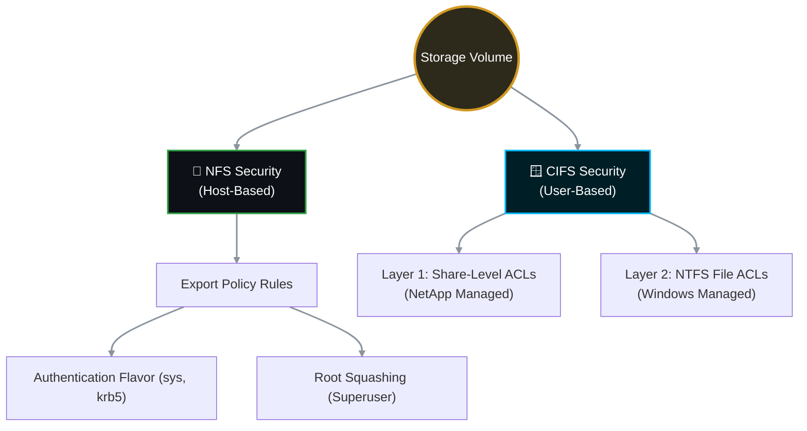

# 🔐 NetApp ONTAP: Deep Dive into NFS Export Policies vs. CIFS Access Control

Understanding permissions in a multiprotocol environment like NetApp ONTAP requires a fundamental mindset shift. **NFS** primarily relies on **Host-Based Security** (trusting the IP address/subnet), whereas **CIFS/SMB** relies on **User-Based Security** (trusting Active Directory identities). 

This comprehensive guide breaks down the exact permission types, parameters, and access controls available for both protocols.

---

## 📋 Table of Contents
1. [🧠 The Security Mindset: NFS vs. CIFS](#mindset)
2. [🐧 NFS Permissions: Export Policy Rules Deep Dive](#nfs-perms)
3. [🪟 CIFS Permissions: The Dual-Layer Architecture](#cifs-perms)
4. [⚖️ The "Most Restrictive Wins" Rule (CIFS)](#restrictive)

---

<a id="mindset"></a>
## 🧠 1. The Security Mindset: NFS vs. CIFS



---

<a id="nfs-perms"></a>
## 🐧 2. NFS Permissions: Export Policy Rules Deep Dive

In NFS (specifically NFSv3), ONTAP doesn't care *who* the user is (Bob or Alice); it only cares *where* the request is coming from (the IP address). If the IP is trusted, ONTAP relies on the Linux client to enforce user permissions.

When you create an export rule, you assign permissions using **Security Flavors**.

### The Core Permission Parameters
Every rule index in an export policy has three primary permission settings:

| Parameter | What it controls | Available Settings |
| :--- | :--- | :--- |
| `-rorule` | **Read-Only Access:** Which authentication methods are allowed to read data. | `sys`, `krb5`, `none`, `any` |
| `-rwrule` | **Read/Write Access:** Which authentication methods are allowed to read and write data. | `sys`, `krb5`, `none`, `any` |
| `-superuser` | **Root Access:** How to handle requests from the Linux `root` user (UID 0). | `sys`, `krb5`, `none`, `any` |

### Understanding the "Security Flavors" (Values)
When you set `-rorule sys`, what does `sys` actually mean?

1. **`sys` (AUTH_SYS):** The standard, legacy UNIX security. The NetApp completely trusts the UID/GID (User ID / Group ID) sent by the Linux client. *This is the most common setting in enterprise networks.*
2. **`krb5` / `krb5i` / `krb5p`:** Kerberos authentication. Highly secure. The NetApp forces the Linux client to prove its identity using a Kerberos ticket. (`i` adds integrity checking, `p` adds payload encryption).
3. **`none`:** Explicitly denies access for this rule type. (e.g., `-rwrule none` means nobody gets write access).
4. **`any`:** Allows any authentication method (both `sys` and `krb5`).

### The Most Critical Setting: "Root Squashing" (`-superuser`)
By default, the Linux `root` user can do anything. In a shared storage environment, you might not want a rogue Linux server admin deleting data. 
* **`-superuser sys` (No Squash):** The NetApp honors the `root` user. They have god-mode access to the export.
* **`-superuser none` (Root Squashed):** If a Linux `root` user tries to write a file, ONTAP automatically demotes them to an anonymous user (usually UID 65534 / `pcuser`). They lose all special privileges and get "Permission Denied" if the folder requires root access.

### Example Rules
```bash
# Trusted App Server: Read/Write allowed, Root access allowed.
vserver export-policy rule create -policyname app_pol -clientmatch 10.0.0.50 -rorule sys -rwrule sys -superuser sys

# General Subnet: Read-Only allowed, Root access denied (squashed).
vserver export-policy rule create -policyname app_pol -clientmatch 10.0.1.0/24 -rorule sys -rwrule never -superuser none
```

---

<a id="cifs-perms"></a>
## 🪟 3. CIFS Permissions: The Dual-Layer Architecture

CIFS (SMB) security is vastly different. It integrates deeply with Active Directory and uses a **Two-Layered Security Model**. To access a file, a Windows user must successfully pass through BOTH layers.

### Layer 1: Share-Level ACLs (Managed on NetApp)
This is the "front door" of the share. You configure this via the NetApp CLI or System Manager. It acts as a broad filter for the entire share.

**Available Share-Level Permissions:**
1. **`No_access`**: Explicitly denies all access to the share.
2. **`Read`**: Users can view files, copy files out, and execute applications.
3. **`Change`**: Users can Read, create new files, modify files, and delete files.
4. **`Full_Control`**: Users can do everything in `Change`, PLUS they can alter the NTFS permissions of the files themselves (take ownership).

**Best Practice Setup for Layer 1:**
NetApp and Microsoft strongly recommend setting the Share-Level ACL to **`Everyone - Full_Control`** or **`Authenticated Users - Full_Control`**. Why? Because you use Layer 2 to actually lock down the files.

```bash
# How to set it via NetApp CLI
vserver cifs share access-control create -share <Share_Name> -user-or-group "Everyone" -permission Full_Control
```

### Layer 2: File/Folder-Level NTFS ACLs (Managed via Windows)
This is the "interior security." Once the user passes the Share ACL, they hit the NTFS permissions stored directly on the folders and files. 

* **How it's managed:** Storage admins usually DO NOT manage this via the NetApp CLI. A Windows administrator maps the drive and right-clicks the folder -> **Properties** -> **Security Tab**.
* **Available Permissions:** Standard Windows permissions apply here (Read, Write, Modify, Read & Execute, Full Control, and highly granular Special Permissions like "Append Data" or "Delete Subfolders").

---

<a id="restrictive"></a>
## ⚖️ 4. The "Most Restrictive Wins" Rule (CIFS)

Because CIFS uses a dual-layer approach, ONTAP evaluates both the Share ACL and the NTFS ACL. **The resulting effective permission is ALWAYS the most restrictive of the two.**

| Scenario | Layer 1: Share-Level ACL (NetApp) | Layer 2: NTFS ACL (Windows) | Effective Result for User |
| :--- | :--- | :--- | :--- |
| **A** | `Read` | `Full Control` | **Read-Only.** (Share restricted them). |
| **B** | `Full Control` | `Read-Only` | **Read-Only.** (NTFS restricted them). |
| **C** | `Change` | `Modify` | **Modify/Change.** (Both layers agree). |

### Summary Comparison
* **NFS Security:** Administered 100% on the NetApp via Export Policies. Controls *Hosts/IPs*.
* **CIFS Security:** Administered via a partnership. NetApp controls the broad Share ACLs, while Windows Admins control the granular NTFS ACLs. Controls *Active Directory Users/Groups*.


