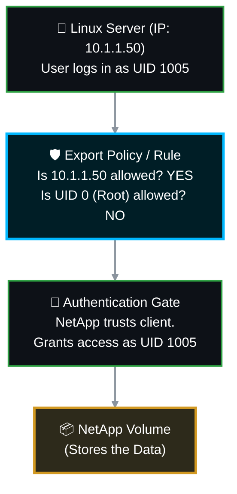

# 🛡️ NetApp ONTAP: Master NFS Export Policy & Security Management SOP 🚀

In NetApp ONTAP, NFS (Network File System) access is controlled by **Export Policies** and **Export Rules**. Unlike user-based protocols, NFS primarily relies on **Host-Based Security**, meaning it verifies the client's IP address against a set of rules and trusts the client machine to handle user identities.

This comprehensive Master Standard Operating Procedure (SOP) combines all advanced security concepts, architectural strategies, and modern ONTAP 9 day-to-day operational commands into a single, definitive guide for NFS management.

> 🏷️ **Rule:** Replace placeholders like `<SVM>`, `<Policy_Name>`, `<Volume>`, and `<IP>` with your environment's specific details.

---

## 📋 Table of Contents
1. [🧠 Phase 1: The NFS Security Architecture](#phase-1)
2. [🔐 Phase 2: Understanding Permissions & Parameters](#phase-2)
3. [🏗️ Phase 3: Rule Architecture Strategies (List vs. Index)](#phase-3)
4. [🛡️ Phase 4: Policy & Rule Management (Creation & Assignment)](#phase-4)
5. [🛠️ Phase 5: Modifying Rules (The Modern `clientmatches` Method)](#phase-5)
6. [🩺 Phase 6: Troubleshooting & Access Simulation](#phase-6)
7. [📚 Official NetApp Documentation Reference](#references)

---

<a id="phase-1"></a>
## 🧠 Phase 1: The NFS Security Architecture

Before typing commands, you must understand how NetApp authenticates NFS connections. ONTAP trusts the **Machine (IP Address)**. If the IP is explicitly allowed in the export policy, the NetApp trusts the Linux client's UID/GID (User ID / Group ID) mappings.



---

<a id="phase-2"></a>
## 🔐 Phase 2: Understanding Permissions & Parameters

An export rule dictates *who* (IP) can connect, and *how* (Authentication Flavor) they are allowed to read, write, or execute root-level commands.

### 2.1 The Two Security Gates (`rorule` and `rwrule`)
To grant standard Read/Write access, you must set **both** parameters.
* **`rorule` (The Front Door):** Gives the client permission to mount the volume and read directories.
* **`rwrule` (The Interior):** Gives the client elevated permission to modify and write data.
* *Note: If you set `rorule never` but `rwrule sys`, access breaks. A client cannot write to a volume it is not allowed to read/mount.*

### 2.2 Authentication Flavors: `sys` vs. `any`
When creating a rule, always explicitly define the authentication type.
* **`sys` (AUTH_SYS / Best Practice):** Forces the client to use standard UNIX UID/GID authentication. It is highly predictable and rejects unauthorized Kerberos attempts.
* **`any` (Not Recommended):** Allows all authentication types. This can cause mount delays as Linux clients try to negotiate complex protocols before falling back to basic UNIX authentication.

### 2.3 The Danger of Root Access & "Root Squashing"
By default, a Linux `root` user (UID 0) has "God Mode" and can delete any file or bypass permissions.
* **`-superuser sys` (No Squash / Dangerous):** NetApp honors the client's `root` user. Highly dangerous if the Linux server gets hacked.
* **`-superuser none` (Root Squashed / Best Practice):** If a Linux `root` user tries to act on the NetApp, ONTAP intercepts them and demotes their identity to an anonymous user (UID `65534`). They will receive "Permission Denied" if they attempt unauthorized actions (like changing file ownership).

---

<a id="phase-3"></a>
## 🏗️ Phase 3: Rule Architecture Strategies (List vs. Index)

When granting access to multiple IPs, you must choose a management strategy.

| Strategy | How it Works | Pros / Cons |
| :--- | :--- | :--- |
| **The "List" Strategy** | Multiple IPs in one rule (e.g., Index 1 = `10.0.0.1, 10.0.0.2`). | **Pros:** Keeps policies clean with few indexes. **Cons:** Requires modern ONTAP 9 commands to safely edit. |
| **The "Index" Strategy** | Every IP gets its own rule (e.g., Index 1 = `10.0.0.1`, Index 2 = `10.0.0.2`). | **Pros:** Easy to audit single IPs. **Cons:** Can create hundreds of cluttered rules on a single volume. |

---

<a id="phase-4"></a>
## 🛡️ Phase 4: Policy & Rule Management (Creation & Assignment)

### 4.1 Create the Master Policy Container
```bash
vserver export-policy create -vserver <SVM_Name> -policyname pol_secure_app
```

### 4.2 Create Best Practice Read/Write (RW) Rule (Root Squashed)
*Grants standard Read/Write to specific IPs, but protects the volume from Rogue Root users.*
```bash
vserver export-policy rule create -vserver <SVM_Name> -policyname pol_secure_app \
-clientmatch 10.10.10.50,10.10.10.51 \
-rorule sys \
-rwrule sys \
-superuser none \
-ruleindex 1
```

### 4.3 Create Best Practice Read-Only (RO) Rule (Root Squashed)
*Grants Read-Only access to a broader subnet. Explicitly denies write capabilities.*
```bash
vserver export-policy rule create -vserver <SVM_Name> -policyname pol_secure_app \
-clientmatch 10.20.20.0/24 \
-rorule sys \
-rwrule never \
-superuser none \
-ruleindex 2
```

### 4.4 Assign the Policy to a Volume
```bash
volume modify -vserver <SVM_Name> -volume <Volume_Name> -policy pol_secure_app
```

---

<a id="phase-5"></a>
## 🛠️ Phase 5: Modifying Rules (The Modern `clientmatches` Method)

If you are using the "List Strategy" (multiple IPs in Rule 1), **DO NOT** attempt to copy/paste the entire string to update it. Use ONTAP 9's surgical append/remove commands.

### 5.1 Safely ADD a New IP to an Existing List
```bash
# Add a single IP (or comma-separated list of IPs) to rule index 1
vserver export-policy rule add-clientmatches -vserver <SVM_Name> -policyname pol_secure_app -ruleindex 1 -clientmatch 10.10.10.99
```

### 5.2 Safely REMOVE a Specific IP from an Existing List
```bash
# Surgically remove a specific IP without dropping the rest of the servers
vserver export-policy rule remove-clientmatches -vserver <SVM_Name> -policyname pol_secure_app -ruleindex 1 -clientmatch 10.10.10.50
```

### 5.3 Flush the Export Cache (CRITICAL AFTER ANY CHANGE)
*ONTAP caches IP rules for performance. If you add or remove an IP, you MUST flush the cache to enforce the change immediately across all nodes.*
```bash
vserver export-policy cache flush -vserver <SVM_Name> -node *
```

---

<a id="phase-6"></a>
## 🩺 Phase 6: Troubleshooting & Access Simulation

### 6.1 The "Check Access" Simulator 🚀 (The Ultimate Triage Tool)
*Never guess why a client is getting "Access Denied." Ask the NetApp to simulate the connection and tell you exactly which rule is blocking it.*
```bash
vserver export-policy check-access -vserver <SVM_Name> -volume <Volume_Name> -client-ip <Failing_Client_IP> -authentication-method sys -protocol nfs3 -access-type read-write
```

### 6.2 Temporary Root Un-Squashing (Break-Glass Procedure)
*If a Linux Admin complains they cannot use `chown` or install software because of "Permission Denied", you can temporarily elevate their rule to allow Root, then immediately revert it.*
```bash
# 1. Elevate to root-level trust
vserver export-policy rule modify -vserver <SVM_Name> -policyname pol_secure_app -ruleindex 1 -superuser sys

# 2. Revert back to secure squashed mode when they finish
vserver export-policy rule modify -vserver <SVM_Name> -policyname pol_secure_app -ruleindex 1 -superuser none
```

### 6.3 Verify Volume Security Style
*If the export rules are perfect but the user still cannot write, ensure the volume is actually formatted for UNIX, not NTFS.*
```bash
volume show -vserver <SVM_Name> -volume <Volume_Name> -fields security-style
```

---

<a id="references"></a>
## 📚 Official NetApp Documentation Reference

| Task / Concept | Official NetApp Documentation Reference |
| :--- | :--- |
| **Safely Add IPs to List** | [Docs: vserver export-policy rule add-clientmatches](https://docs.netapp.com/us-en/ontap-cli/vserver-export-policy-rule-add-clientmatches.html) |
| **Safely Remove IPs from List** | [Docs: vserver export-policy rule remove-clientmatches](https://docs.netapp.com/us-en/ontap-cli/vserver-export-policy-rule-remove-clientmatches.html) |
| **Root Squashing (Superuser)**| [Docs: Export Policy Superuser Concept](https://docs.netapp.com/us-en/ontap/nfs-admin/export-rules-superuser-concept.html) |
| **Access Simulator** | [Docs: vserver export-policy check-access](https://docs.netapp.com/us-en/ontap-cli/vserver-export-policy-check-access.html) |
| **Flush Policy Cache** | [Docs: export-policy cache flush](https://docs.netapp.com/us-en/ontap-cli/vserver-export-policy-cache-flush.html) |
