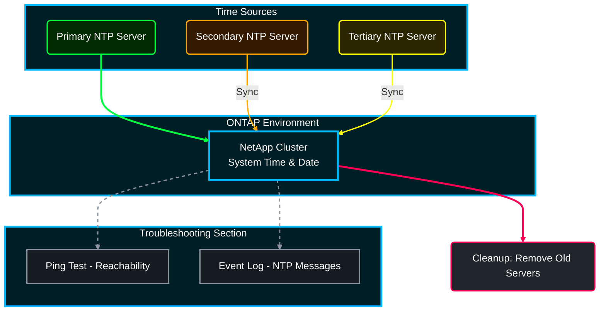

# ⏱️ NetApp ONTAP: The Ultimate NTP Setup Guide 🌍

**Time is money.** But in storage, time is also log consistency, Kerberos authentication, and Snapshot schedules. If your NetApp cluster drifts even by a few minutes, your Active Directory users might get locked out! 😱

Follow this guide to set up Network Time Protocol (NTP) from scratch.

## 📑 Table of Contents
1. [🧐 1. The "Before We Start" Check](#before-we-start)
2. [🛠️ 2. Setting the Time Zone (Crucial Step!)](#setting-timezone)
3. [🔗 3. Adding NTP Servers (The Meat & Potatoes)](#adding-ntp)
4. [✅ 4. Verification: Is It Actually Working?](#verification)
5. [🕵️‍♂️ 5. Troubleshooting: "It's Still Not Syncing!"](#troubleshooting)
6. [🧹 6. Cleanup (Removing Bad Servers)](#cleanup)

---




---

<a id="before-we-start"></a>
## 🧐 1. The "Before We Start" Check
*Is your cluster currently living in the past (or future)? Let's find out.*

```bash
# Check the current cluster date and time
cluster date show

# Check if any NTP servers are already configured (and failing?)
cluster time-service ntp server show

# Check the current time zone setting
cluster date show -fields timezone
```

---

<a id="setting-timezone"></a>
## 🛠️ 2. Setting the Time Zone (Crucial Step!)
*Before syncing time, tell the cluster WHERE it lives. If this is wrong, your logs will be a nightmare to read.*

```bash
# 1. List available time zones to find yours (e.g., 'America/New_York' or 'Asia/Kolkata')
cluster date system timezone show

# 2. Set the time zone for the entire cluster
cluster date modify -timezone <Your_Timezone>
# Example: cluster date modify -timezone Asia/Kolkata
```

---

<a id="adding-ntp"></a>
## 🔗 3. Adding NTP Servers (The Meat & Potatoes)
*Point your NetApp cluster to reliable time sources. Use at least 3 for redundancy!*

```bash
# 1. Add your primary NTP server (Internal DC or Public Pool)
cluster time-service ntp server create -server <IP_or_FQDN> -version auto
# Example: cluster time-service ntp server create -server 0.pool.ntp.org -version auto

# 2. Add a secondary server (Redundancy is key 🔑)
cluster time-service ntp server create -server <IP_or_FQDN_2> -version auto

# 3. Add a tertiary server (The tie-breaker)
cluster time-service ntp server create -server <IP_or_FQDN_3> -version auto
```

> **Pro Tip:** If you use Active Directory, point your NetApp to your Domain Controllers. They are usually the authoritative time source for your network.

---

<a id="verification"></a>
## ✅ 4. Verification: Is It Actually Working?
*Trust, but verify. Don't assume it's working just because you typed the command.*

```bash
# 1. Check the status of the NTP associations
cluster time-service ntp server show

# LOOK FOR THE '*' (Asterisk)! 
# The server marked with '*' is the one currently being used.
# '+' means it's a candidate.
# ' ' (blank) means it's unreachable or jittery.
```

---

<a id="troubleshooting"></a>
## 🕵️‍♂️ 5. Troubleshooting: "It's Still Not Syncing!"
*If your time is drifting or the server show command returns nothing, check these:*

```bash
# 1. Check if the Cluster Management LIF can reach the NTP server (Ping test)
network ping -lif <Cluster_Mgmt_LIF> -destination <NTP_Server_IP>

# 2. Check the event logs for NTP-specific errors
event log show -messagename *ntp*

# 3. Force an immediate sync (Use with caution in production!)
# Note: ONTAP usually drifts slowly to correct time. 
# If the gap is HUGE, you might need to set it manually once closer to real time.
cluster date modify -date <MM/DD/YYYY> -time <HH:MM:SS>
```

---

<a id="cleanup"></a>
## 🧹 6. Cleanup (Removing Bad Servers)
*Got an old, dead NTP server cluttering your config? Nuke it.*

```bash
# Delete a specific NTP server
cluster time-service ntp server delete -server <Old_Server_IP>
```

---

*--Sulthan Sharief K S*
