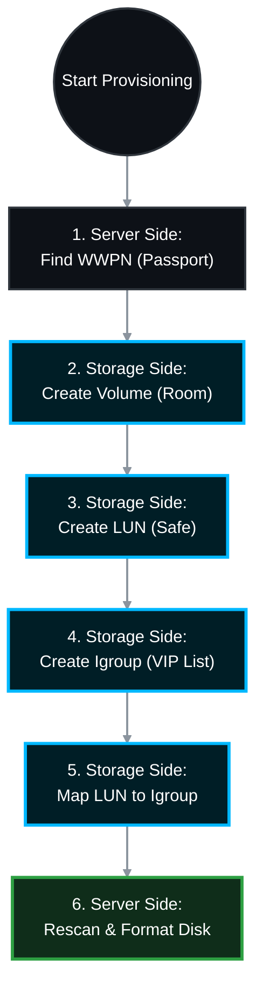

# 🏗️ NetApp SAN 101: Complete LUN Provisioning Guide (Beginner to Expert)

Welcome to the world of Storage Area Networks (SAN)! Provisioning storage in a SAN environment is fundamentally different from creating a shared folder (NAS/CIFS/NFS). In SAN, you are not sharing a folder; you are providing a **raw, unformatted virtual hard drive** directly to a server over a high-speed network. 

[attachment_0](attachment)

This Standard Operating Procedure (SOP) will break down every concept as if you are completely new, and then provide the exact enterprise-grade commands to allocate a 10 GB LUN.

---

## 📖 Part 1: The SAN Dictionary (Terminologies & Parameters)

Before typing any commands, you must understand the building blocks. Think of this process like delivering a safe (LUN) to a specific person (Server) inside a secure building (SVM).

| Terminology | What it means in plain English | Analogy |
| :--- | :--- | :--- |
| **SAN (Storage Area Network)** | A dedicated, high-speed network connecting servers to block-level storage. Usually runs on **Fibre Channel (FC)** or **iSCSI**. | The secure highway exclusively for data trucks. |
| **LUN (Logical Unit Number)** | The actual 10 GB virtual hard drive you are creating. The server will see this as a physical disk. | The actual "Safe" we are delivering. |
| **Aggregate** | A physical pool of hard drives grouped together with RAID protection. | The concrete foundation of the building. |
| **Volume** | A logical container built on top of the aggregate. **Rule:** In SAN, you put the LUN inside a Volume. | The "Room" that holds the Safe. |
| **SVM (Storage Virtual Machine)** | The logical storage array. It holds the network addresses and the storage volumes. | The "Building" itself. |
| **WWPN (World Wide Port Name)** | A 16-character unique ID (like a MAC address) for the server's Fibre Channel card (HBA). Example: `21:00:00:e0:8b:05:05:04` | The Server's unique "Passport Number." |
| **Igroup (Initiator Group)** | A security list on the NetApp. It contains the WWPNs of the servers allowed to see the LUN. | The VIP Guest List held by the Bouncer. |
| **LUN Mapping** | The final step. Tying the specific LUN to the specific Igroup. | Telling the bouncer: "Let this specific guest access this specific safe." |

---

## 🗺️ Part 2: The Provisioning Workflow


## 💻 Part 3: Step-by-Step SOP
> 🏷️ **Scenario:** We are allocating a 10 GB LUN to a Linux server over Fibre Channel.
>  * Replace placeholders like <SVM_Name>, <Vol_Name>, and <WWPN> with your actual data.
> 
### 🏢 Phase 1: Server-Side Preparation (The Ask)
*Before the storage admin can do anything, the server admin must provide their WWPN.*
**Step 1.1: Find the WWPN on a Linux Server**
```bash
# Run this on the Linux server to find the Fibre Channel HBA WWPNs
cat /sys/class/fc_host/host*/port_name

```
*(Copy the output, e.g., 0x21000014ff08b2a6. This is your initiator.)*
### 🗄️ Phase 2: Storage-Side Execution (NetApp CLI)
*Now, log into your NetApp cluster via SSH to build the storage.*
**Step 2.1: Create the Volume**
*We create a 12 GB volume to hold a 10 GB LUN. Best practice is to make the volume slightly larger than the LUN to accommodate snapshot metadata.*
```bash
volume create -vserver <SVM_Name> -volume <Vol_Name> -aggregate <Aggr_Name> -size 12GB -state online -type RW -space-guarantee none

```
 * **Parameters Explained:**
   * -space-guarantee none: Thin provisioning. Only consume physical space as the server writes data.
**Step 2.2: Create the LUN**
*Now we create the 10 GB virtual drive inside that volume.*
```bash
lun create -vserver <SVM_Name> -path /vol/<Vol_Name>/<LUN_Name> -size 10GB -ostype linux -space-allocation enabled

```
 * **Parameters Explained:**
   * -path: The exact location of the LUN (/vol/VolumeName/LunName).
   * -ostype: Crucial! Tells NetApp how to align the data blocks for the specific server OS (e.g., linux, windows, vmware).
   * -space-allocation enabled: Allows the server to tell NetApp when files are deleted so NetApp can reclaim the physical space (SCSI UNMAP).
**Step 2.3: Create the Igroup (The VIP List)**
*Create the security group and define what protocol it uses.*
```bash
igroup create -vserver <SVM_Name> -igroup <Igroup_Name> -protocol fcp -ostype linux

```
 * **Parameters Explained:**
   * -protocol fcp: Specifies Fibre Channel Protocol. (Use iscsi if using Ethernet).
**Step 2.4: Add the Server to the Igroup**
*Add the WWPN you found in Phase 1 to the VIP list.*
```bash
igroup add -vserver <SVM_Name> -igroup <Igroup_Name> -initiator 21:00:00:14:ff:08:b2:a6

```
**Step 2.5: Map the LUN (The Final Handshake)**
*Grant the Igroup access to the LUN. NetApp will automatically assign a LUN ID (usually starting at 0).*
```bash
lun map -vserver <SVM_Name> -path /vol/<Vol_Name>/<LUN_Name> -igroup <Igroup_Name>

```
### 🏢 Phase 3: Server-Side Discovery (The Receive)
*The storage is now presented. The server admin must now tell the server to "look" for the new drive.*
**Step 3.1: Rescan the SCSI Bus (Linux)**
```bash
# Force the Linux server to scan for new SAN disks
echo "- - -" > /sys/class/scsi_host/host0/scan
echo "- - -" > /sys/class/scsi_host/host1/scan

```
**Step 3.2: Verify the Disk is Visible**
```bash
# List block devices. You should now see a new 10GB drive (e.g., /dev/sdb or a multipath device like /dev/mapper/mpatha)
lsblk

```
**Step 3.3: Format and Mount**
*Because SAN provides raw storage, the server admin must format it with a filesystem (ext4/xfs).*
```bash
# Create a filesystem on the new drive
mkfs.xfs /dev/mapper/mpatha

# Create a mount point and mount the drive
mkdir /mnt/appdata
mount /dev/mapper/mpatha /mnt/appdata

```
## 📚 Official NetApp Documentation Reference
| Task | Official NetApp Documentation Reference |
|---|---|
| **Volume Creation** | Docs: volume create |
| **LUN Creation** | Docs: lun create |
| **Igroup Management** | Docs: igroup create |
| **LUN Mapping** | Docs: lun map |
```


