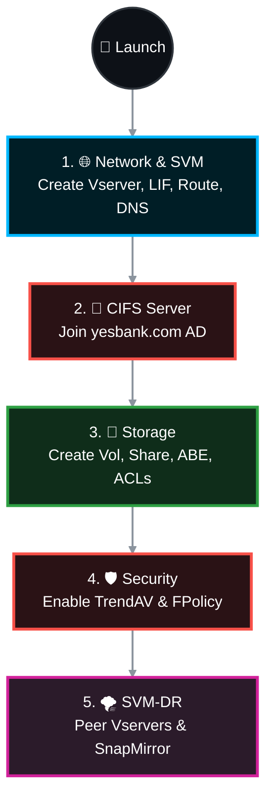

# 🌟 NetApp ONTAP: The Ultimate CIFS SVM & DR Master Playbook (YBL Edition) 🚀

Welcome to your step-by-step mission control guide for provisioning a highly secure, disaster-ready CIFS Storage Virtual Machine (SVM). This SOP takes you from bare-metal network routing all the way to cross-cluster SnapMirror replication, armed with FPolicy and Vscan defenses! 🛡️⚔️

> 🏢 **Environment Briefing:**
> * 🏭 **Production Cluster:** `YBACS1A994NAS01`
> * 🚑 **DR Cluster:** `YBBCS1A994NAS01`
> * 🏦 **Active Directory Domain:** `yesbank.com`

---

## 📑 The Mission Board (Table of Contents)
1. [🌐 Phase 1: SVM & Network Ignition](#phase-1)
2. [🔐 Phase 2: Active Directory Handshake](#phase-2)
3. [💾 Phase 3: Volume Provisioning & Share Magic](#phase-3)
4. [🛡️ Phase 4: Fortress Mode (Vscan & FPolicy)](#phase-4)
5. [🗜️ Phase 5: Storage Efficiency & Time Travel (Snapshots)](#phase-5)
6. [🌪️ Phase 6: Disaster Recovery (SVM-DR Shield)](#phase-6)
7. [🛠️ Phase 7: Day 2 Ops (Growing & Pruning)](#phase-7)

---




---

<a id="phase-1"></a>
## 🌐 Phase 1: SVM & Network Ignition
*Laying down the digital highways. Execute these on your **Production Cluster** (`YBACS1A994NAS01`).*

### 🏗️ 1.1 Forge the Vserver (SVM)
Create the logical container, hardcoded with NTFS security and UTF-8 translation.
```bash
vserver create Demo -subtype default -rootvolume svm_root_demo -rootvolume-security-style ntfs -language C.UTF-8 -snapshot-policy default -aggregate n2_sas_ssd
```

### 🚦 1.2 Wire the Network (LIF & Failover)
Give it an IP and ensure it can seamlessly fail over if a node trips.
```bash
# Spin up the Data LIF 🔌
net int create -vserver Demo -lif n2_demo -role data -data-protocol cifs -home-node Node2 -home-port a0d-8 -address 10.0.184.28 -netmask 255.255.192.0 -status-admin up

# Build the Safety Net (Failover Group) 🕸️
failover-groups create -vserver Demo -failover-group fg_Demo -targets Node1:a0d-8, Node2:a0d-8

# Double-check our work 👀
net int show
failover-groups show
```

### 🗺️ 1.3 Map the Routes & DNS
Tell the SVM how to find its way home (and how to talk to the Domain Controllers).
```bash
# Chart the Default Route 🧭
route create -vserver Demo -destination 0.0.0.0/0 -gateway 10.0.128.2 -metric 20
route show

# Plug into the Matrix (DNS) 🧠
dns create -domains yesbank.com -name-servers 10.0.11.40,10.0.30.40,10.0.11.39 -vserver Demo
dns show
```

---

<a id="phase-2"></a>
## 🔐 Phase 2: Active Directory Handshake
*Time to get the SVM its official company badge.*

### 🤝 2.1 Join the Domain
```bash
cifs server create -vserver Demo -cifs-server Netappdemo -domain yesbank.com -ou CN=Computers -default-site ""
```
> 🔑 **Heads Up!** ONTAP is going to ask for credentials. Have your `yesbank.com` Domain Administrator username and password ready to authenticate the join! 

---

<a id="phase-3"></a>
## 💾 Phase 3: Volume Provisioning & Share Magic
*Carving out the actual storage space and putting it on the network.*

### 📦 3.1 Carve and Mount the Volume
Spinning up a sleek, 10GB thin-provisioned container.
```bash
# Create the Volume 🏗️
vol create -vserver Demo -volume test1 -aggregate n2_sas_ssd -size 10GB -state online -policy default -security-style ntfs -type RW -snapshot-policy default -space-guarantee none

# Mount it to the namespace 📌
vol mount -vserver Demo -volume test1 -junction-path /test1
```
> 💡 **Pro Tip:** Need guaranteed space (Thick Provisioning)? Just flip `-space-guarantee none` to `-space-guarantee volume`.

### 🕵️‍♂️ 3.2 Expose the Share & Lock it Down
Create the CIFS share, hide folders users shouldn't see (ABE), and set AD permissions.
```bash
# Expose the Share 📢
cifs share create -vserver Demo -share-name test1$ -path /test1

# Enable Stealth Mode (Access-Based Enumeration) 🥷
cifs share properties add -vserver Demo -share-name test1$ -share-properties access-based-enumeration

# Hand the keys to the AD Group 🗝️
cifs share access-control create -vserver Demo -share test1$ -user-or-group yesbank\winclus -user-group-type windows -permission Full_Control

# Verify the locks 🔍
cifs share show -vserver Demo
cifs share access-control show -vserver Demo
```

---

<a id="phase-4"></a>
## 🛡️ Phase 4: Fortress Mode (Vscan & FPolicy)
*Equipping the SVM with anti-malware armor and a strict bouncer at the door.*

### 🦠 4.1 Arm the Antivirus (Vscan)
Connect to the `TrendAV` pool and ensure files are scanned *as they are written*.
```bash
# Link the Vserver to the AV Pool 🔗
vscan scanner-pool apply-policy -vserver Demo -scanner-pool TrendAV -scanner-policy primary -cluster YBACS1A994NAS01

# Set the share to "Scan on Write" ✍️
cifs share modify -vserver Demo -share-name test1$ -path /test1 -vscan-fileop-profile writes-only

# Flip the switch! 🟢
vscan enable -vserver Demo
```

### 🚫 4.2 Deploy the Bouncer (FPolicy)
Block `.exe`, `.dll`, and other risky files from ever touching the disk.
```bash
# Define what the bouncer watches (Create, Open, Rename) 👀
fpolicy policy event create -vserver Demo -event-name event_test1 -volume-operation false -protocol cifs -file-operations create,open,rename

# Draft the Bouncer's Rulebook 📜
fpolicy policy create -vserver Demo -policy-name demo_blockext -events event_test1 -engine native -is-mandatory true -allow-privileged-access no

# Give the Bouncer the VIP Blacklist (Blocked Extensions) 🛑
fpolicy policy scope create -vserver Demo -policy-name demo_blockext -volumes-to-include "*" -shares-to-include "*" -file-extensions-to-include app,arj,bas,cmd,com,crx,dll,exe,ost,pst

# Put the Bouncer on duty! 👮‍♂️
fpolicy enable -vserver Demo -policy-name blockext -sequence-number 1
```

---

<a id="phase-5"></a>
## 🗜️ Phase 5: Storage Efficiency & Time Travel
*Squeezing the data (Dedupe/Compression) and setting up our snapshot time machine.*

### 📸 5.1 Schedules and Snapshots
```bash
# Set the Midnight Alarm (Cron Schedule) ⏰
job schedule cron create -name Night_1145 -hour 23 -minute 45

# Schedule the Data Squeezer (Efficiency Policy) 🗜️
vol efficiency policy create -vserver Demo -policy efficiency_Demo -type scheduled -schedule Night_1145 -enabled true

# Program the Time Machine (192 snapshots, every 15 mins) ⏪
snapshot policy create -policy Demo_Snapshot -enabled true -schedule1 15min -count1 192
```

---

<a id="phase-6"></a>
## 🌪️ Phase 6: Disaster Recovery (SVM-DR Shield)
*Creating an identical twin of our SVM on the DR cluster (`YBBCS1A994NAS01`) to survive the apocalypse.*

### 🪞 6.1 Create the Twin & Establish Trust
```bash
# [DR CLUSTER] Create the empty shell 🐚
vserver create -vserver Demo_DR -subtype dp-destination

# [PROD CLUSTER] Send the friend request 🤝
vserver peer create -vserver Demo -peer-vserver Demo_DR -applications snapmirror -peer-cluster YBBCS1A994NAS01

# [DR CLUSTER] Accept the friend request ✅
vserver peer accept -vserver Demo_DR -peer-vserver Demo
```

### 🚀 6.2 Ignite the Replication Engine
```bash
# [DR CLUSTER] Draft the Mirror Policy (Drop the network configs!) 📝
snapmirror policy create -vserver Demo_DR -policy exclude_LIF_Demo -tries 8 -transfer-priority normal -type async-mirror -is-network-compression-enabled true -discard-configs network

# [DR CLUSTER] Bind the twin to the original 🔗
snapmirror create -source-path Demo: -destination-path Demo_DR: -vserver Demo_DR -throttle unlimited -identity-preserve true -type DP -policy exclude_LIF_Demo

# [DR CLUSTER] Start the massive data clone! 🌊
snapmirror initialize -destination-path Demo_DR:
```
> ⚠️ **Post-Replication Alert:** Because we used `-discard-configs network`, you must manually recreate the LIFs, Routes, and DNS on the DR cluster using your DR-specific IP schemes. Don't forget the Failover Groups!

---

<a id="phase-7"></a>
## 🛠️ Phase 7: Day 2 Ops (Growing & Pruning)
*Routine maintenance commands for the road ahead.*

### 📈 7.1 Feeding the Volume (Resize)
Need more space? Easy.
```bash
vol size -vserver <vservername> -volume <volumename> -new-size <sizeMB/GB/TB>
```

### 🗑️ 7.2 Nuking a Volume (Delete)
*Remember, ONTAP forces you to take it offline before it lets you destroy it. Safety first!*
```bash
# 1. Pull the plug 🔌
vol offline -vserver <vservername> -volume <volumename>

# 2. Incinerate 🔥
vol delete -vserver <vservername> -volume <volumename>
```

---
*Would you like me to walk through the exact steps to perform an actual DR failover for this newly created SVM?*
