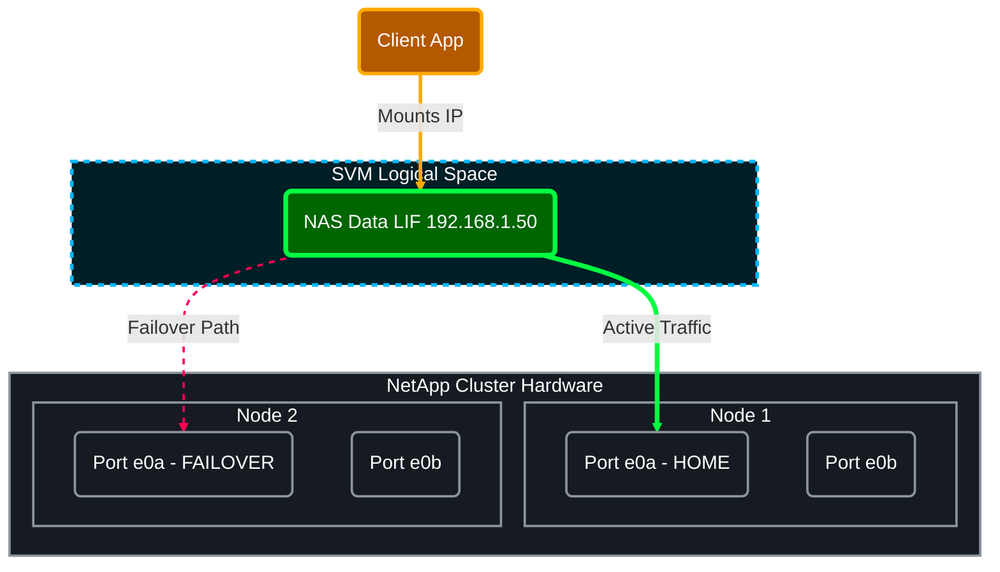

# 🌐 NetApp ONTAP (9.x) — LIF Operations (Scratch ➜ Advanced) 🚀
> ✅ **Rule:** This cheat-sheet sticks to **interface-scoped commands** (mostly `network interface ...`).
> 🏷️ Replace placeholders like `<SVM> <LIF> <NODE> <PORT> <IP>` etc.

## 📑 Table of Contents
1. [🧰 0) Quick CLI Helpers (Exceptions to the rule)](#section-0)
2. [🆕 1) Create a LIF (from scratch)](#section-1)
3. [👀 2) Show / Inventory / Inspect](#section-2)
4. [🟢🔴 3) State Operations (Up/Down)](#section-3)
5. [🔁 4) Migration & Revert (Moving LIFs)](#section-4)
6. [✍️ 5) Modify Attributes (IPs, Home Ports)](#section-5)
7. [🛡️ 6) Failover Groups & Policies](#section-6)
8. [🚦 7) Service Policies (ONTAP 9.10+)](#section-7)
9. [🕸️ 8) Subnets (Automated IP Assignment)](#section-8)
10. [🔎 9) Diagnostics & Reachability](#section-9)
11. [🗑️ 10) Delete & Cleanup](#section-10)
12. [🧠 11) "Power" One-Liners (LIF-only)](#section-11)

---

---

## 🧰 0) Quick CLI Helpers (Exceptions to the rule)
- `man network interface`
- `network interface ?`
- `network interface create ?`
- `network port show` 🔌 *(Check physical ports first)*
- `network port show -node <NODE> -type physical`

---

## 🆕 1) Create a LIF (from scratch)
### 1.1 Basic Data LIF (NAS/SAN)
> *Modern ONTAP uses `-service-policy` instead of `-role`.*
- `network interface create -vserver <SVM> -lif <LIF> -service-policy default-data-files -home-node <NODE> -home-port <PORT> -address <IP> -netmask <MASK>`

  **Example:**
-  `network interface create -vserver vs1.example.com -lif datalif1 -role data -data-protocol cifs -home-node node-4 -home-port e1c -address 192.0.2.145 -netmask 255.255.255.0 -firewall-policy data -auto-revert true`

### 1.2 Cluster Management LIF
- `network interface create -vserver <CLUSTER_SVM> -lif <LIF> -service-policy default-management -home-node <NODE> -home-port <PORT> -address <IP> -netmask <MASK>`

### 1.3 Intercluster LIF (for SnapMirror)
- `network interface create -vserver <CLUSTER_SVM> -lif <LIF> -service-policy default-intercluster -home-node <NODE> -home-port <PORT> -address <IP> -netmask <MASK>`

### 1.4 iSCSI/FC Specifics (Data Protocols)
- `network interface create -vserver <SVM> -lif <LIF> -service-policy default-data-blocks -home-node <NODE> -home-port <PORT> -address <IP> -netmask <MASK>`
- `network interface create -vserver <SVM> -lif <LIF> -data-protocol fcp -home-node <NODE> -home-port <PORT>` *(FC uses WWPN, no IP)*

---

## 👀 2) Show / Inventory / Inspect
### 2.1 List LIFs
- `network interface show`
- `network interface show -vserver <SVM>`
- `network interface show -lif <LIF>`

### 2.2 Show useful fields (Home vs Current)
- `network interface show -fields home-node,home-port,curr-node,curr-port,is-home`
- `network interface show -vserver <SVM> -fields lif,address,service-policy,failover-policy,status-admin,status-oper`

### 2.3 Deep detail (everything)
- `network interface show -vserver <SVM> -lif <LIF> -instance`

### 2.4 Check for "Not at Home" LIFs (Health Check) 🩺
- `network interface show -is-home false`

---

## 🟢🔴 3) State Operations (Up/Down)
- `network interface modify -vserver <SVM> -lif <LIF> -status-admin up`
- `network interface modify -vserver <SVM> -lif <LIF> -status-admin down`

---

## 🔁 4) Migration & Revert (Moving LIFs)
> ⚠️ **Note:** Moving a LIF keeps the IP active but changes the physical path.

### 4.1 Manual Migrate (Failover)
- `network interface migrate -vserver <SVM> -lif <LIF> -destination-node <DEST_NODE> -destination-port <DEST_PORT>`

### 4.2 Migrate ALL data LIFs off a node (Maintenance Prep)
- `network interface migrate-all -node <NODE>`

### 4.3 Revert (Send back to Home Port)
- `network interface revert -vserver <SVM> -lif <LIF>`

### 4.4 Revert ALL (Cluster-wide fix)
- `network interface revert *`

---

## ✍️ 5) Modify Attributes (IPs, Home Ports)
### 5.1 Change IP Address
- `network interface modify -vserver <SVM> -lif <LIF> -address <NEW_IP> -netmask <NEW_MASK>`

### 5.2 Change Home Port (Permanently move "Home")
- `network interface modify -vserver <SVM> -lif <LIF> -home-node <NEW_HOME_NODE> -home-port <NEW_HOME_PORT>`

### 5.3 MTU Size (Jumbo Frames)
- `network interface modify -vserver <SVM> -lif <LIF> -mtu 9000`

---

## 🛡️ 6) Failover Groups & Policies
### 6.1 Show Failover status
- `network interface show -vserver <SVM> -lif <LIF> -failover`

### 6.2 Create a custom Failover Group
- `network interface failover-groups create -vserver <SVM> -failover-group <FG_NAME> -targets <NODE1:PORT1>,<NODE2:PORT2>`

### 6.3 Assign Failover Policy
- `network interface modify -vserver <SVM> -lif <LIF> -failover-policy broadcast-domain-wide` *(Standard for NAS)*
- `network interface modify -vserver <SVM> -lif <LIF> -failover-policy disabled` *(Standard for iSCSI/SAN)*
- `network interface modify -vserver <SVM> -lif <LIF> -failover-group <FG_NAME>`

---

## 🚦 7) Service Policies (ONTAP 9.10+)
> 💡 Replaces the old `-role` and `-firewall-policy` commands. Controls strictly what traffic (SSH, NFS, CIFS, DNS) flows through a LIF.

### 7.1 Show Policies
- `network interface service-policy show`
- `network interface service-policy show -vserver <SVM>`

### 7.2 Create Custom Policy (Hybrid traffic)
- `network interface service-policy create -vserver <SVM> -policy <POLICY_NAME> -services data-nfs,data-cifs,management-ssh`

### 7.3 Add a service to existing policy
- `network interface service-policy add-service -vserver <SVM> -policy <POLICY_NAME> -service data-s3-server`

### 7.4 Assign Policy to LIF
- `network interface modify -vserver <SVM> -lif <LIF> -service-policy <POLICY_NAME>`

---

## 🕸️ 8) Subnets (Automated IP Assignment)
### 8.1 Create Subnet
- `network subnet create -subnet-name <SUBNET> -broadcast-domain <BD> -subnet <10.0.0.0/24> -gateway <10.0.0.1> -ip-ranges <10.0.0.50-10.0.0.100>`

### 8.2 Create LIF using Subnet (No IP needed)
- `network interface create -vserver <SVM> -lif <LIF> -service-policy default-data-files -home-node <NODE> -home-port <PORT> -subnet-name <SUBNET>`

---

## 🔎 9) Diagnostics & Reachability
### 9.1 Ping from LIF
- `network ping -lif <LIF> -vserver <SVM> -destination <REMOTE_IP>`

### 9.2 Traceroute from LIF
- `network traceroute -lif <LIF> -vserver <SVM> -destination <REMOTE_IP>`

### 9.3 Packet Trace (tcpdump on interface)
- `network tcpdump start -node <NODE> -port <PORT>`
- `network tcpdump stop -node <NODE> -port <PORT>`

---

## 🗑️ 10) Delete & Cleanup
### 10.1 Standard Delete
1. **Down the LIF:**
   - `network interface modify -vserver <SVM> -lif <LIF> -status-admin down`
2. **Delete:**
   - `network interface delete -vserver <SVM> -lif <LIF>`

---

## 🧠 11) "Power" One-Liners (LIF-only)
- `network interface show -fields lif,address,netmask,home-node,home-port,curr-node,curr-port,is-home,status-admin,status-oper`
- `network interface show -is-home false`
- `network interface show -failover`
- `network interface service-policy show`
- `network interface revert *`
