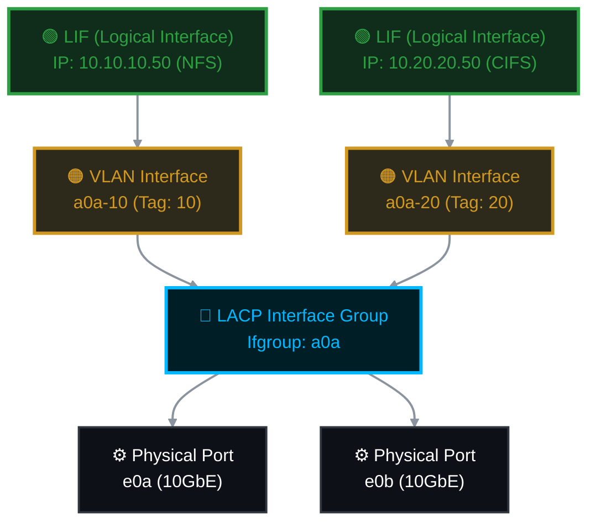
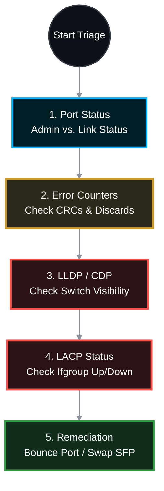

# 🌐 NetApp ONTAP: Enterprise Networking & Troubleshooting Guide 🛠️

Before diving into physical port troubleshooting, it is critical to understand how NetApp ONTAP structures its network stack. In enterprise environments, clients never connect directly to a raw physical port. Instead, they connect through a stacked architecture of LACP bundles, VLANs, and Logical Interfaces.

---

## 📋 Table of Contents

1. [🧠 Part 1: The NetApp Network Stack (LACP & VLANs)](#network-stack)
   * [🔗 What is LACP (Interface Groups)?](#lacp)
   * [🏷️ What is a VLAN?](#vlan)
   * [🟢 The Final Layer: The LIF](#lif)
2. [🔌 Part 2: Physical Network Port Troubleshooting SOP](#troubleshooting)
   * [🧭 Quick Reference: Fault Isolation Matrix](#matrix)
   * [🚨 Phase 1: Triage & Port Status Verification](#phase-1)
   * [📊 Phase 2: Layer 1 Health & Error Counters](#phase-2)
   * [👁️ Phase 3: Switch Visibility (CDP/LLDP)](#phase-3)
   * [🔗 Phase 4: Interface Group (LACP) Validation](#phase-4)
   * [🛠️ Phase 5: Remediation & Isolation Steps](#phase-5)

---

<a id="network-stack"></a>
## 🧠 Part 1: The NetApp Network Stack (LACP & VLANs)



<a id="lacp"></a>
### 🔗 What is LACP (Interface Groups / Ifgroups)?
**LACP (Link Aggregation Control Protocol)** is an IEEE standard (802.3ad) that allows you to bundle multiple physical network cables into a single, logical pipe. 
* **The NetApp Context:** In ONTAP, this is called an **Interface Group (ifgroup)**. Storage admins usually name it `a0a`. 
* **Why we use it:** 1. **Redundancy:** If port `e0a` dies, or the cable is cut, traffic instantly fails over to `e0b` without the client ever dropping their connection.
  2. **Throughput:** Bundling two 10GbE ports creates a 20GbE logical pipe.

<a id="vlan"></a>
### 🏷️ What is a VLAN?
**VLAN (Virtual Local Area Network)** is a technology (IEEE 802.1Q) that logically segments a single physical network into multiple isolated broadcast domains by adding a "tag" to the network packets.
* **The NetApp Context:** In ONTAP, VLAN interfaces are created *on top of* the LACP ifgroup. If your ifgroup is `a0a` and your switch VLAN ID is `100`, the NetApp VLAN interface is named `a0a-100`.
* **Why we use it:** Security and traffic management. You can host NFS traffic on VLAN 10, CIFS on VLAN 20, and iSCSI on VLAN 30—all traveling over the same physical `a0a` cable bundle, but completely invisible to one another.

<a id="lif"></a>
### 🟢 The Final Layer: The LIF
The **Logical Interface (LIF)** is the actual IP address that your users and servers connect to (e.g., `10.10.10.50`). A LIF is a floating IP that sits on top of the VLAN (`a0a-100`). If a NetApp node completely dies, the LIF gracefully unbinds and floats to a surviving node's VLAN interface to keep data flowing!

---

<a id="troubleshooting"></a>
## 🔌 Part 2: Physical Network Port Troubleshooting SOP 🕵️‍♂️

When a network outage occurs, the immediate challenge is the "blame game" between the storage administrators and the network administrators. This Standard Operating Procedure (SOP) provides the exact diagnostic steps to isolate a physical network issue, prove whether the fault lies with the NetApp controller, the physical media (Cable/SFP), or the upstream switch, and take corrective action.



<a id="matrix"></a>
### 🧭 Quick Reference: Fault Isolation Matrix
*Use this table to immediately identify whose domain the problem falls under.*

| 🚨 Symptom / Command Output | 🎯 Likely Culprit | ⚖️ Responsibility / Domain | 🛠️ Next Step |
| :--- | :--- | :--- | :--- |
| **Admin: Down** / **Link: Down** | Port was manually disabled | 🔵 **NetApp** | Run `network port modify -up-admin true` |
| **Admin: Up** / **Link: Down** | Dead Cable, SFP, or Switch Port is Shut | 🟡 **Media** / 🔴 **Switch** | Verify switch port status, swap cable/SFP |
| **CRC Errors Incrementing** | Dirty fiber, bad SFP, failing switch hardware | 🟡 **Media** / 🔴 **Switch** | Clean fiber, replace SFP, test different switch port |
| **Discarded Frames Incrementing** | MTU mismatch or VLAN tag mismatch | 🔴 **Switch** (Config) | Verify Switch MTU (Jumbo frames) and allowed VLANs |
| **No LLDP/CDP Neighbors** | LLDP disabled on switch, or dead link | 🔴 **Switch** | Enable LLDP/CDP on switch, check physical link |
| **Link Up, but LACP Ifgroup Down**| Switch port-channel suspended or misconfigured | 🔴 **Switch** (Config) | Set switch port-channel to LACP "Active" |

---

<a id="phase-1"></a>
### 🚨 Phase 1: Triage & Port Status Verification
*The first step is to determine if ONTAP has administratively disabled the port or if the physical electrical/optical link has dropped.*

**Check the high-level status of the port:**
```bash
network port show -node <node_name> -port <port_name>
```

**How to Interpret the Output:**
* **`Admin Status: up` / `Link Status: up`**: The port is perfectly healthy at Layer 1. If traffic is failing, it is a routing, VLAN, or LACP configuration issue.
* **`Admin Status: down` / `Link Status: down`**: An administrator manually disabled the port. 
  * *Fix:* Run `network port modify -node <node> -port <port> -up-admin true`
* **`Admin Status: up` / `Link Status: down`**: **This is a physical Layer 1 failure.** The NetApp port is turned on, but it sees no light/electricity from the switch. The issue is a dead cable, dead SFP, or the switch port is shut down.

---

<a id="phase-2"></a>
### 📊 Phase 2: Layer 1 Health & Error Counters
*If the link is "up" but performance is terrible or packets are dropping, you must check the physical interface counters for CRC errors and frame drops.*

**View detailed port statistics:**
```bash
network port show -node <node_name> -port <port_name> -instance
```
*(Scroll down in the output to the MAC/Hardware statistics section)*

**Key Metrics to Investigate:**
* **`CRC Errors` (Cyclic Redundancy Check):** If this counter is actively incrementing, you have a physical layer issue. 
  * *Verdict:* The NetApp port is receiving corrupted frames. This is almost always a dirty fiber optic cable, a failing SFP transceiver, or a bad switch port. **It is rarely a NetApp hardware failure.**
* **`Discarded Frames`**: The port is receiving traffic, but discarding it. 
  * *Verdict:* This usually indicates a VLAN mismatch (the switch is sending tagged frames the NetApp doesn't expect) or an MTU (Jumbo Frames) mismatch between the switch and the NetApp.

---

<a id="phase-3"></a>
### 👁️ Phase 3: Switch Visibility (CDP/LLDP)
*This is the ultimate tool to prove if the NetApp and the upstream switch can "see" each other. ONTAP passively listens for Cisco Discovery Protocol (CDP) and Link Layer Discovery Protocol (LLDP) broadcasts.*

**Check what switch is connected to the physical port:**
```bash
network device-discovery show -node <node_name> -port <port_name>
```

**How to Interpret the Output:**
* **If a switch name and port appear:** The physical link is healthy, and the cable is good. The NetApp is successfully receiving Layer 2 management frames from the switch. 
  * *Verdict:* If data traffic is still failing, the issue is 100% a Switch configuration issue (wrong VLAN allowed on trunk, LACP suspended, etc.).
* **If the table is empty:** The NetApp is not receiving discovery frames. 
  * *Verdict:* Either LLDP/CDP is disabled on the switch, or the link/cable is dead.

---

<a id="phase-4"></a>
### 🔗 Phase 4: Interface Group (LACP) Validation
*In enterprise environments, physical ports (e.g., `e0a`, `e0b`) are bundled into logical Interface Groups (e.g., `a0a`). If the physical port is up but the ifgroup is down, the switch is refusing to bundle the port.*

**Check the LACP status of the interface group:**
```bash
network port ifgrp show -node <node_name> -ifgrp <ifgrp_name> -instance
```

**Key Metrics to Investigate:**
* **`Up Ports` vs. `Down Ports`**: Shows which physical ports are actively participating in the bundle.
* **`Port Participation` (Active/Active):** If a port shows as `participating: false`, it means the NetApp is not receiving LACP PDUs from the switch for that specific port.
  * *Verdict:* Contact the Network team. Instruct them to verify the switch port channel is configured as "LACP Active" (not static `on`) and that the specific switch port is not in a suspended state.

---

<a id="phase-5"></a>
### 🛠️ Phase 5: Remediation & Isolation Steps
*Actionable steps to isolate the fault if a physical defect is suspected.*

**Step 1: The "Soft Reset" (Bounce the Port) 🔄**
Sometimes the port transceiver logic hangs. Bounce the port administratively to force a re-negotiation of the physical link.
```bash
# 1. Bring the port down
network port modify -node <node_name> -port <port_name> -up-admin false

# 2. Wait 10 seconds, then bring it back up
network port modify -node <node_name> -port <port_name> -up-admin true
```

**Step 2: SFP / Optical Power Verification (Advanced) 🔦**
If you suspect the SFP (transceiver) is dying, you can pull the raw hardware data to check optical transmit/receive power levels using the advanced node shell.
```bash
# Enter the node run shell
system node run -node <node_name>

# Run the physical sysconfig command for the specific slot (e.g., slot 0)
sysconfig -a 0
```
*(Look for the specific port and check if it says "SFP Not Present" or shows extremely low Rx/Tx power levels, indicating a bent fiber or dead optic).*

**Step 3: Physical Swap Isolation (The Swap Test) 🔁**
If the link remains down, you must perform the swap test to isolate the hardware:
1. **Swap the Cable:** Replace the fiber/copper cable with a known good one. If the link comes up, the cable was bad.
2. **Swap the Switch Port:** Move the cable to a different port on the upstream switch. If the link comes up, the switch port was dead.
3. **Swap the SFP (NetApp Side):** If the switch port and cable are proven good, replace the SFP in the NetApp controller. 
4. **NetApp Motherboard/NIC:** If all above steps fail, the physical NIC or port on the NetApp controller is dead. Open a NetApp Support case to dispatch a replacement NIC or controller motherboard.
