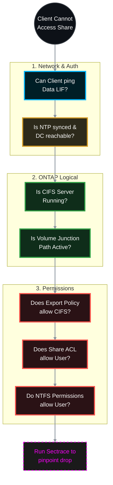

# 🕵️‍♂️ NetApp ONTAP: Ultimate CIFS/SMB Troubleshooting Guide 🛠️

When a CIFS share suddenly becomes inaccessible, the issue can hide in the network, Active Directory, ONTAP logical layers, or file permissions. This guide provides a systematic, top-down approach to isolate and resolve CIFS inaccessibility in ONTAP 9.x, clearly defining **which team is responsible** for the fix based on the diagnostic output.

> 🏷️ **Rule:** Replace placeholders like `<SVM>`, `<VOL>`, `<SHARE>`, `<IP>`, and `<CLIENT_IP>` with your environment's details.

## 📑 Table of Contents
1. [🌐 Phase 1: Network & LIF Reachability](#phase-1)
2. [⏱️ Phase 2: DNS, NTP & Active Directory Health](#phase-2)
3. [⚙️ Phase 3: SVM & CIFS Server Status](#phase-3)
4. [📂 Phase 4: Volume & Junction Path Verification](#phase-4)
5. [🛡️ Phase 5: Share ACLs & Export Policies](#phase-5)
6. [🔐 Phase 6: NTFS Security (File/Folder Permissions)](#phase-6)
7. [🔬 Phase 7: Advanced Diagnostics (Sectrace)](#phase-7)

---



---

<a id="phase-1"></a>
## 🌐 Phase 1: Network & LIF Reachability
*If the client cannot reach the SVM's IP, nothing else matters. The error is usually "Network Path Not Found" or "Error 0x80070035".*

### 1.1 Verify Data LIF Status
Ensure the LIF is administratively and operationally UP, and is hosting the CIFS data protocol.
```bash
# Check if LIF is up and on its home port
network interface show -vserver <SVM> -data-protocol cifs -fields status-admin,status-oper,is-home,address
```
* **Target:** `status-admin` is `up`, `status-oper` is `up`, `is-home` is `true`.

> **🛠️ Action to Take (If LIF is down or displaced):**
> * 👥 **Responsible Team:** **Storage Team**
> * **If Admin Status is down:**
>   ```bash
>   network interface modify -vserver <SVM> -lif <LIF_NAME> -status-admin up
>   ```
> * **If LIF is not on its home port:**
>   ```bash
>   network interface revert -vserver <SVM> -lif <LIF_NAME>
>   ```
> * *(Note: If `status-oper` is down, escalate to the **Network Team** to check physical switch ports).*

### 1.2 Verify Service/Firewall Policies
Modern ONTAP uses Service Policies. Ensure the data LIF allows CIFS traffic.
```bash
network interface show -vserver <SVM> -fields service-policy
```
* **Target:** Policy includes `data-cifs` and `data-core`.

> **🛠️ Action to Take (If policy is missing CIFS):**
> * 👥 **Responsible Team:** **Storage Team**
> * **Change the LIF to the default data files policy:**
>   ```bash
>   network interface modify -vserver <SVM> -lif <LIF_NAME> -service-policy default-data-files
>   ```

### 1.3 Ping Test from Storage
Can the SVM reach the client?
```bash
network ping -vserver <SVM> -destination <CLIENT_IP>
```

> **🛠️ Action to Take (If ping fails):**
> * 👥 **Responsible Team:** **Network Team** (with Storage Team assisting on SVM routes)
> * **Storage Action:** Verify a default route exists back to the client subnet.
>   ```bash
>   network route show -vserver <SVM>
>   ```
> * **Network Action:** If the SVM route exists, the Network Team must investigate dropped packets, missing VLANs, or ACLs on the core switch blocking traffic to the NetApp subnet.

---

<a id="phase-2"></a>
## ⏱️ Phase 2: DNS, NTP & Active Directory Health
*CIFS relies heavily on Kerberos. If time is skewed by >5 minutes between ONTAP and AD, or if DNS fails, authentication will silently drop. Error: "Access Denied" or prompt for credentials that never work.*

### 2.1 Check NTP Synchronization
```bash
cluster date show
```

> **🛠️ Action to Take (If time is skewed > 5 mins):**
> * 👥 **Responsible Team:** **Storage Team** (to fix ONTAP) or **Windows/AD Team** (if DC time is wrong)
> * **Storage Action:** Fix NTP servers to match Domain Controllers:
>   ```bash
>   cluster time-service ntp server create -server <DC_IP>
>   ```

### 2.2 Verify DNS Resolution
Can the SVM resolve the Domain Controller?
```bash
vserver services name-service dns check -vserver <SVM>
```

> **🛠️ Action to Take (If DNS check fails):**
> * 👥 **Responsible Team:** **Windows/AD Team** (to verify DNS server health) or **Storage Team** (to fix SVM config)
> * **Storage Action:** Update or fix DNS server IPs if they are incorrect on the SVM:
>   ```bash
>   vserver services name-service dns modify -vserver <SVM> -domains <DOMAIN> -name-servers <DNS_IP_1>,<DNS_IP_2>
>   ```

### 2.3 Verify Domain Controller Reachability
```bash
vserver cifs domain discovered-servers show -vserver <SVM>
```
* **Target:** Status is `OK`.

> **🛠️ Action to Take (If status is 'down'):**
> * 👥 **Responsible Team:** **Network / Security Team**
> * **Network Action:** Verify AD firewall rules are open for the NetApp LIF IPs. Traffic must flow bidirectionally on TCP/UDP ports 53 (DNS), 88 (Kerberos), 135 (RPC), 139 (NetBIOS), 389 (LDAP), and 445 (SMB).

---

<a id="phase-3"></a>
## ⚙️ Phase 3: SVM & CIFS Server Status
*Is the CIFS service actually running?*

### 3.1 Check CIFS Server Administrative State
```bash
vserver cifs show -vserver <SVM>
```

> **🛠️ Action to Take (If Admin Status is down):**
> * 👥 **Responsible Team:** **Storage Team**
> * **Start the CIFS service:**
>   ```bash
>   vserver cifs start -vserver <SVM>
>   ```

---

<a id="phase-4"></a>
## 📂 Phase 4: Volume & Junction Path Verification
*If the volume is offline or unmounted, the share path becomes invalid.*

### 4.1 Verify Volume State & Junction Path
```bash
volume show -vserver <SVM> -volume <VOL> -fields state,junction-path,junction-active
```
* **Target:** `state` = `online`, `junction-active` = `true`.

> **🛠️ Action to Take (If volume is offline or unmounted):**
> * 👥 **Responsible Team:** **Storage Team**
> * **Online the volume:**
>   ```bash
>   volume online -vserver <SVM> -volume <VOL>
>   ```
> * **Mount the volume (if junction-path is `-`):**
>   ```bash
>   volume mount -vserver <SVM> -volume <VOL> -junction-path /<VOL>
>   ```

### 4.2 Verify Qtree (If share is on a Qtree)
```bash
volume qtree show -vserver <SVM> -volume <VOL> -qtree <QTREE> -fields security-style
```
* **Target:** Security style is `ntfs`. If it's `unix`, Windows ACLs will behave erratically.

> **🛠️ Action to Take (If security style is UNIX):**
> * 👥 **Responsible Team:** **Storage Team**
> * **Change security style to NTFS:**
>   ```bash
>   volume qtree modify -vserver <SVM> -volume <VOL> -qtree <QTREE> -security-style ntfs
>   ```

---

<a id="phase-5"></a>
## 🛡️ Phase 5: Share ACLs & Export Policies
*ONTAP checks Export Policies FIRST, even for CIFS. Then it checks Share ACLs.*

### 5.1 Verify Export Policy (The Silent Killer)
By default, the volume uses the `default` export policy. If this policy does not allow CIFS or restricts IPs, access is blocked.
```bash
# 1. Check which policy the volume uses
volume show -vserver <SVM> -volume <VOL> -fields policy

# 2. Inspect the rules of that policy
vserver export-policy rule show -vserver <SVM> -policyname <POLICY_NAME>
```

> **🛠️ Action to Take (If rules block the client IP):**
> * 👥 **Responsible Team:** **Storage Team**
> * **Create a rule allowing the client network (or all IPs):**
>   ```bash
>   vserver export-policy rule create -vserver <SVM> -policyname <POLICY_NAME> -clientmatch 0.0.0.0/0 -rorule any -rwrule any -protocols cifs
>   ```
> *(Note: Verify the SVM Root Volume's export policy allows traversal as well).*

### 5.2 Verify CIFS Share ACLs
```bash
vserver cifs share access-control show -vserver <SVM> -share <SHARE>
```

> **🛠️ Action to Take (If user/group is missing):**
> * 👥 **Responsible Team:** **Storage Team**
> * **Add the specific user or AD group:**
>   ```bash
>   vserver cifs share access-control create -vserver <SVM> -share <SHARE> -user-or-group "<DOMAIN>\<User_or_Group>" -permission Full_Control
>   ```

---

<a id="phase-6"></a>
## 🔐 Phase 6: NTFS Security (File/Folder Permissions)
*The network, CIFS, and Share levels are perfect, but the actual folder on disk denies access.*

### 6.1 Check NTFS Permissions from ONTAP
You can view the effective NTFS permissions directly from the storage CLI without needing Windows.
```bash
vserver security file-directory show -vserver <SVM> -path /<VOL>/<QTREE>
```

> **🛠️ Action to Take (If permissions are broken):**
> * 👥 **Responsible Team:** **Windows/AD Admins** or **Data Owners**
> * **Take Ownership via Windows MMC (Best Practice):**
>   1. Open Computer Management (`compmgmt.msc`) on a Windows machine logged in as a Domain Admin.
>   2. Connect to the NetApp CIFS server IP (Action > Connect to another computer).
>   3. Go to System Tools > Shared Folders > Shares. 
>   4. Right-click the problem share > Properties > Security tab > Advanced.
>   5. Change the Owner to Domain Admins, push inheritance, and grant Full Control to the required users/groups.

---

<a id="phase-7"></a>
## 🔬 Phase 7: Advanced Diagnostics (Sectrace)
*If everything above looks perfect and the user STILL gets "Access Denied", use **Security Trace**. This is NetApp's ultimate weapon. It tracks the exact microsecond a request is denied and tells you EXACTLY why.*

### 7.1 Create a Trace Filter
Tell ONTAP to watch for traffic from the specific client IP trying to access the share.
```bash
vserver security trace filter create -vserver <SVM> -index 1 -client-ip <CLIENT_IP> -trace-allow yes
```

### 7.2 Reproduce the Error
> **🛠️ Action to Take:**
> * 👥 **Responsible Team:** **Helpdesk / End User**
> * Have the user try to access the CIFS share from their Windows machine (`\\<SVM_IP>\<SHARE>`) to trigger the "Access Denied" error.

### 7.3 View the Trace Results
```bash
vserver security trace trace-result show -vserver <SVM>
```
> **🛠️ Action to Take:** > * 👥 **Responsible Team:** **Storage Team** (to analyze and delegate)
> * Look at the `Reason` column. It will explicitly tell you the failure point. Delegate the fix to the corresponding team:
>   * `Access denied by export policy` -> Storage Team (Fix Phase 5.1)
>   * `Access denied by share ACL` -> Storage Team (Fix Phase 5.2)
>   * `Access denied by NTFS security descriptor` -> Windows Team (Fix Phase 6)
>   * `User mapping failed` -> Storage/AD Team (Check `vserver name-mapping show` or Kerberos token bloat).

### 7.4 Cleanup the Trace
Don't leave the trace running forever, as it consumes CPU.
> **🛠️ Action to Take:**
> * 👥 **Responsible Team:** **Storage Team**
> ```bash
> vserver security trace filter delete -vserver <SVM> -index 1
> ```
