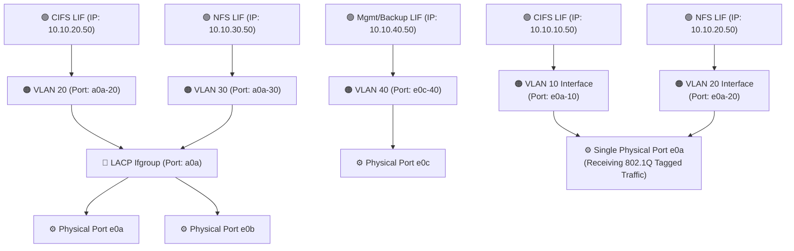

# 🌐 NetApp ONTAP: From Scratch—Ifgroups, VLANs, and LIFs 🚀

When racking a new NetApp controller, you don't assign IP addresses directly to physical ports. You must stack your network architecture for maximum redundancy and security. 

First, you bond physical cables together into an **Interface Group (ifgroup)**. Next, you slice that ifgroup into logical segments called **VLANs**. Finally, you assign an **IP Address (LIF)** to that VLAN.

This guide provides the complete, start-to-finish Standard Operating Procedure (SOP) to build this entire stack, defining exactly **which team is responsible** for each step.

---

## 📋 Table of Contents

1. [🧠 Part 1: The Concept (Explain Like I'm 5)](#concept)
2. [🏗️ Part 2: Step-by-Step Configuration SOP](#sop)
   * [🚨 Phase 1: Switch Prerequisites (Network Team)](#phase-1)
   * [🔗 Phase 2: Create the Ifgroup / LACP Bundle (Storage Team)](#phase-2)
   * [🚧 Phase 3: Create the VLAN on the Ifgroup (Storage Team)](#phase-3)
   * [📡 Phase 4: Add to a Broadcast Domain (Storage Team)](#phase-4)
   * [🟢 Phase 5: Create the Logical Interface / LIF (Storage Team)](#phase-5)
   * [🕵️‍♂️ Phase 6: Verification & Testing (Whole Team)](#phase-6)

---

<a id="concept"></a>
## 🧠 Part 1: The Concept (Explain Like I'm 5)

Imagine your network traffic is a highway system.

1. **The Ifgroup (LACP):** One physical cable (`e0a`) is a single-lane dirt road. If a tree falls on it, traffic stops. An **Ifgroup** (`a0a`) bundles two cables (`e0a` and `e0b`) together to create a massive, multi-lane, paved superhighway. If one cable is cut, traffic instantly shifts to the other lane without users noticing.
2. **The VLAN:** If everyone drives anywhere on the superhighway, it's chaos. You have CIFS, NFS, and Management traffic mixing. A **VLAN** is the painted lines on the road. You paint one lane orange (VLAN 20) for CIFS, and purple (VLAN 30) for NFS. They share the same concrete, but cannot crash into each other.
3. **The LIF:** The **Logical Interface (LIF)** is the actual car (IP address) driving in that specific painted lane, picking up data and delivering it to the user.

### The Architecture Stack


---

<a id="sop"></a>
## 🏗️ Part 2: Step-by-Step Configuration SOP

*Scenario: We are bonding ports `e0a` and `e0b` into an LACP ifgroup named `a0a`. We will then create VLAN 20 on top of it, and assign IP 10.10.20.50.*

<a id="phase-1"></a>
### 🚨 Phase 1: Switch Prerequisites (Network Team)
Before you touch the NetApp, the Network Team MUST prepare the switch.

> **🛠️ Action to Take:**
> * 👥 **Responsible Team:** **Network Team**
> * **Execution:** The switch ports connected to `e0a` and `e0b` MUST be configured as a **Port-Channel (LACP Active)** and configured as an **802.1Q Trunk** explicitly allowing VLAN 20. If the switch isn't configured for LACP, the NetApp ifgroup will fail to come online.

---

<a id="phase-2"></a>
### 🔗 Phase 2: Create the Ifgroup / LACP Bundle (Storage Team)
*Now we bond the raw physical ports together on the NetApp side to match the switch.*

> **🛠️ Action to Take:**
> * 👥 **Responsible Team:** **Storage Team**
> * **1. Create the empty Interface Group:**
>   *(We use `multimode_lacp` for active LACP negotiation, and `port` for the load-balancing distribution function).*
>   ```bash
>   network port ifgrp create -node cluster1-01 -ifgrp a0a -distr-func port -mode multimode_lacp
>   network port ifgrp create -node cluster1-02 -ifgrp a0a -distr-func port -mode multimode_lacp
>   ```
>
> * **2. Add the physical ports to the Ifgroup:**
>   ```bash
>   # Add ports for Node 1
>   network port ifgrp add-port -node cluster1-01 -ifgrp a0a -port e0a
>   network port ifgrp add-port -node cluster1-01 -ifgrp a0a -port e0b
>   
>   # Add ports for Node 2
>   network port ifgrp add-port -node cluster1-02 -ifgrp a0a -port e0a
>   network port ifgrp add-port -node cluster1-02 -ifgrp a0a -port e0b
>   ```
>
> * **3. Verify the Ifgroup is healthy:**
>   ```bash
>   network port ifgrp show -instance
>   ```
>   *Target:* Look for `Port Participation: true`. This proves the NetApp and the Network Switch have successfully negotiated the LACP bundle.

---

<a id="phase-3"></a>
### 🚧 Phase 3: Create the VLAN on the Ifgroup (Storage Team)
*We tell the NetApp to start listening for "VLAN 20" tags on our newly created `a0a` bundle.*

> **🛠️ Action to Take:**
> * 👥 **Responsible Team:** **Storage Team**
> * **1. Create the VLAN port:**
>   ```bash
>   # Syntax: network port vlan create -node <node_name> -vlan-name <ifgroup_name>-<vlan_id>
>   network port vlan create -node cluster1-01 -vlan-name a0a-20
>   network port vlan create -node cluster1-02 -vlan-name a0a-20
>   ```
>
> * **2. Verify the VLAN exists:**
>   ```bash
>   network port vlan show
>   ```
>   *Target:* You should see `a0a-20` listed under both nodes.

---

<a id="phase-4"></a>
### 📡 Phase 4: Add to a Broadcast Domain (Storage Team)
*ONTAP uses Broadcast Domains to group ports together that share the same Layer 2 subnet. This tells ONTAP where an IP address is allowed to failover to if a node dies.*

> **🛠️ Action to Take:**
> * 👥 **Responsible Team:** **Storage Team**
> * **1. Create a new Broadcast Domain for this subnet:**
>   ```bash
>   # Use MTU 1500 (standard) or 9000 (Jumbo Frames)
>   network port broadcast-domain create -broadcast-domain Data_VLAN_20 -mtu 1500
>   ```
>
> * **2. Add your newly created VLAN ports into this domain:**
>   ```bash
>   network port broadcast-domain add-ports -broadcast-domain Data_VLAN_20 -ports cluster1-01:a0a-20,cluster1-02:a0a-20
>   ```

---

<a id="phase-5"></a>
### 🟢 Phase 5: Create the Logical Interface / LIF (Storage Team)
*Now that the ifgroup is built, the VLAN is tagged, and the domain is zoned, we put the IP Address (LIF) on it so clients can connect.*

> **🛠️ Action to Take:**
> * 👥 **Responsible Team:** **Storage Team**
> * **1. Create the LIF:**
>   ```bash
>   network interface create -vserver cifs_svm -lif lif_cifs_vlan20 -service-policy default-data-files -home-node cluster1-01 -home-port a0a-20 -address 10.10.20.50 -netmask 255.255.255.0
>   ```
>
> * **2. Verify the LIF is UP:**
>   ```bash
>   network interface show -lif lif_cifs_vlan20
>   ```
>   *Target:* `Admin Status` and `Oper Status` should both be `up`.

---

<a id="phase-6"></a>
### 🕵️‍♂️ Phase 6: Verification & Testing (Whole Team)
*Trust, but verify.*

> **🛠️ Action to Take:**
> * 👥 **Responsible Team:** **Storage Team** (To run test) & **Network Team** (If it fails)
> * **1. Can the NetApp reach the outside world on this new VLAN?**
>   ```bash
>   # Ping the default gateway of VLAN 20
>   network ping -vserver cifs_svm -destination 10.10.20.1
>   ```
> * **Verdict 🟢 (If it replies):** Success! The switch LACP trunk is correct, the VLAN tag is working, and the network is passing traffic.
> * **Verdict 🔴 (If it fails / Request timed out):** Stop here. The Network Team either didn't allow VLAN 20 on the trunk port, the LACP bundle is suspended on the switch side, or there is a routing issue. Escalate back to the **Network Team**.
