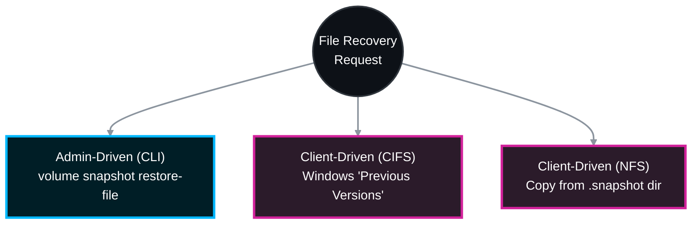

# ⏪ NetApp ONTAP: Single File Snapshot Restore SOP 🛠️

Restoring a single file from a snapshot is one of the most common, yet critical, tasks for a storage administrator. In ONTAP, you have two primary methods to accomplish this: utilizing the native ONTAP CLI (Admin-Driven) or utilizing the hidden snapshot directories (Client-Driven/Self-Service).

This Standard Operating Procedure (SOP) covers both methodologies, strictly adhering to official NetApp ONTAP 9 documentation, and explicitly defines **which team is responsible** for each recovery phase.

> 🏷️ **Rule:** Replace placeholders like `<SVM_Name>`, `<Volume_Name>`, and `<Snapshot_Name>` with your environment's specific details.

---

## 📋 Table of Contents
1. [🔍 Phase 1: Snapshot Discovery & Validation (Storage Team)](#phase-1)
2. [💻 Phase 2: Admin-Driven Restore via ONTAP CLI (Storage Team)](#phase-2)
3. [🪟 Phase 3: Client-Driven Restore via Windows/CIFS (End User / Windows Team)](#phase-3)
4. [🐧 Phase 4: Client-Driven Restore via Linux/NFS (Linux Team)](#phase-4)

---



---

<a id="phase-1"></a>
## 🔍 Phase 1: Snapshot Discovery & Validation
*Before restoring, you must identify the exact volume and the specific snapshot containing the uncorrupted file.*

### 1.1 List Available Snapshots
Use this command to list all snapshots for the specific volume, sorted by creation time.
```bash
# List snapshots to find the desired recovery point
volume snapshot show -vserver <SVM_Name> -volume <Volume_Name> -fields snapshot,creation-time
```

> **🛠️ Action to Take (To find the recovery point):**
> * 👥 **Responsible Team:** **Storage Team**
> * **Fix:** Identify the exact name of the snapshot corresponding to the time *before* the file was deleted/corrupted (e.g., `hourly.2026-04-09_1405`).

### 1.2 Verify Snapshot Directory Access
To allow clients to see the snapshot directory (required for Phases 3 & 4), verify this volume setting is enabled.
```bash
# Check if the .snapshot directory is visible to clients
volume show -vserver <SVM_Name> -volume <Volume_Name> -fields snapdir-access
```

> **🛠️ Action to Take (If snapdir-access is false):**
> * 👥 **Responsible Team:** **Storage Team**
> * **Fix:** Enable it to allow Client-Driven restores:
>   ```bash
>   volume modify -vserver <SVM_Name> -volume <Volume_Name> -snapdir-access true
>   ```

---

<a id="phase-2"></a>
## 💻 Phase 2: Admin-Driven Restore (ONTAP CLI)
*The `volume snapshot restore-file` command allows the storage admin to instantly revert a single file directly on the storage backend without consuming network bandwidth.*

> ⚠️ **CRITICAL GOTCHA:** The `-path` parameter must be **relative to the root of the volume**, NOT the junction path or the SVM namespace. If your volume `vol_data` is mounted at `/app/data` and the file is at `/app/data/reports/Q1.pdf`, the relative path is just `/reports/Q1.pdf`.

### 2.1 In-Place Restore (Overwriting the current file)
Use this if you want to completely overwrite the corrupted/modified file with the version from the snapshot.

> **🛠️ Action to Take (To overwrite the live file):**
> * 👥 **Responsible Team:** **Storage Team**
> * **Execution:**
>   ```bash
>   # Restore the file directly over the existing one
>   volume snapshot restore-file -vserver <SVM_Name> -volume <Volume_Name> -snapshot <Snapshot_Name> -path /<relative_path_to_file>
>   ```
> * **Example:** `volume snapshot restore-file -vserver svm_cifs -volume vol_finance -snapshot daily.2026-04-08 -path /reports/Q1.pdf`

### 2.2 Alternate Location Restore (Side-by-Side)
*Best Practice:* Restore the file to a different name so the user can compare the new and old versions. Use the `-restore-path` parameter.

> **🛠️ Action to Take (To safely restore a copy):**
> * 👥 **Responsible Team:** **Storage Team**
> * **Execution:**
>   ```bash
>   # Restore the file as a new file name in the same directory
>   volume snapshot restore-file -vserver <SVM_Name> -volume <Volume_Name> -snapshot <Snapshot_Name> -path /<relative_path_to_file> -restore-path /<relative_path_to_NEW_file>
>   ```
> * **Example:** `volume snapshot restore-file -vserver svm_cifs -volume vol_finance -snapshot daily.2026-04-08 -path /reports/Q1.pdf -restore-path /reports/Q1_RESTORED.pdf`

---

<a id="phase-3"></a>
## 🪟 Phase 3: Client-Driven Restore (Windows/CIFS)
*For CIFS shares, the most efficient method is teaching users or Windows Server admins to use the "Previous Versions" tab, which taps directly into NetApp snapshots.*

### 3.1 The Windows "Previous Versions" Method

> **🛠️ Action to Take (To recover a Windows file via self-service):**
> * 👥 **Responsible Team:** **End User / Windows OS Team / Helpdesk**
> * **Execution Steps:**
>   1. Open **Windows File Explorer** and navigate to the mapped network drive or UNC path (e.g., `\\svm_cifs\finance\reports\`).
>   2. Right-click the corrupted file (or the folder where a file was deleted) and select **Restore previous versions** (or **Properties** -> **Previous Versions** tab).
>   3. Windows will query the NetApp `.snapshot` directory and present a list of available timestamps.
>   4. Select the desired timestamp.
>   5. Click **Copy...** to extract the file to the desktop, or **Restore...** to overwrite the live file on the NetApp.
>
> *(Note: If the "Previous Versions" tab is entirely empty, escalate to the **Storage Team** to verify `show-previous-versions` is enabled on the CIFS share via `vserver cifs share properties show`).*

---

<a id="phase-4"></a>
## 🐧 Phase 4: Client-Driven Restore (Linux/NFS)
*For Linux/UNIX environments, NetApp exposes a hidden directory named `.snapshot` at the root of every volume and every subdirectory.*

### 4.1 The Hidden Directory Method

> **🛠️ Action to Take (To recover a Linux file via self-service):**
> * 👥 **Responsible Team:** **Linux OS Team / Application Owner**
> * **Execution Steps:**
>   1. SSH into the Linux client that has the NFS export mounted.
>   2. Navigate to the directory where the file was lost or corrupted.
>      ```bash
>      cd /mnt/finance/reports/
>      ```
>   3. Change directory into the hidden `.snapshot` folder. *(Note: `ls -a` will NOT show this folder by design, but you can explicitly `cd` into it).*
>      ```bash
>      cd .snapshot
>      ```
>   4. List the snapshots (they appear as standard directories).
>      ```bash
>      ls -l
>      ```
>   5. Navigate into the specific snapshot and copy the file back to the live directory under a new name.
>      ```bash
>      # Syntax: cp <snapshot_dir>/<filename> <live_destination>
>      cp hourly.2026-04-09_1405/Q1.pdf /mnt/finance/reports/Q1_RESTORED.pdf
>      ```
