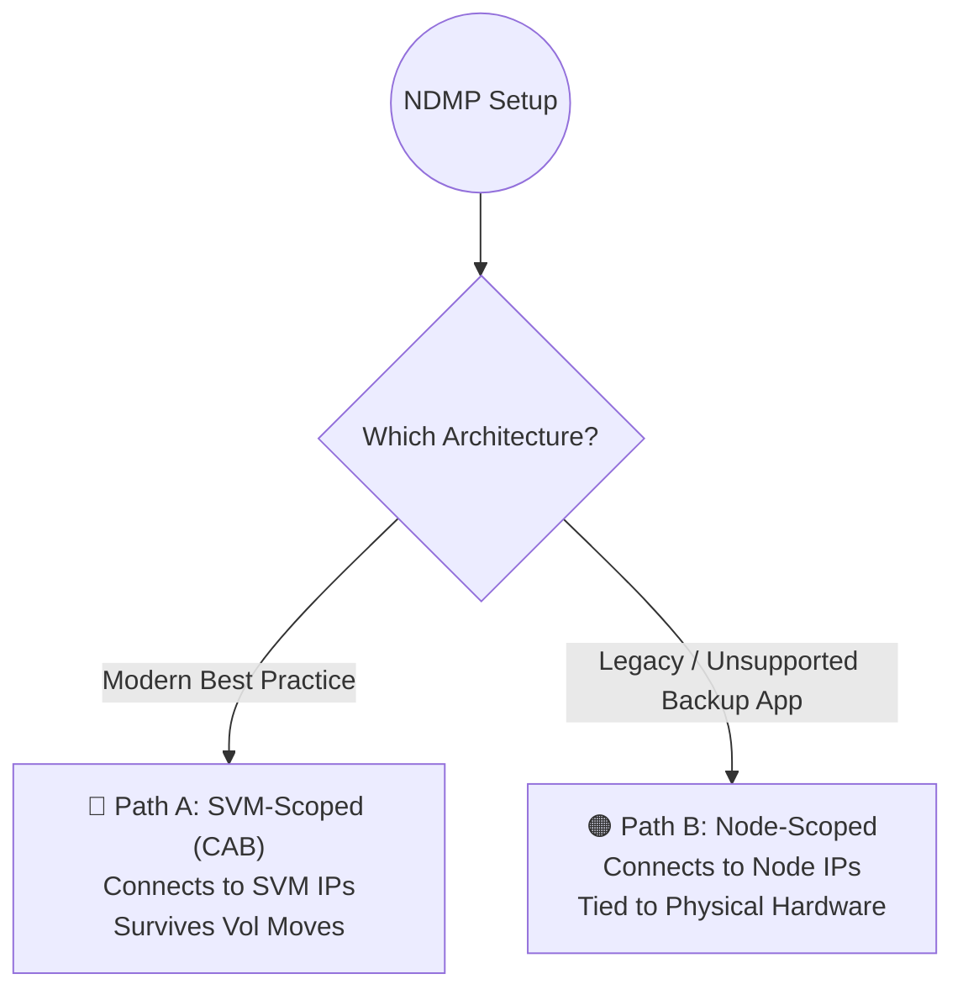

# 📼 NetApp ONTAP: Comprehensive NDMP Backup Configuration SOP (SVM & Node Scoped) 🚀

Network Data Management Protocol (NDMP) allows enterprise backup software (Commvault, NetBackup, Veeam, Rubrik) to instruct the NetApp to back up its own volumes natively over the network or directly to tape. This bypasses the need for proxy servers, preserving file metadata and ACLs.

In ONTAP 9.x, you face a critical architectural choice: **SVM-Scoped NDMP** (Modern/Best Practice) or **Node-Scoped NDMP** (Legacy/Physical). This single, comprehensive SOP covers how to configure *both* architectures from scratch.

> 🏷️ **Rule:** Replace placeholders like `<SVM>`, `<NODE>`, `<IP>`, and `<PASSWORD>` with your environment's details. **A cluster can only operate in one scoping mode at a time.**

## 📑 Table of Contents
1. [🧠 Phase 1: Architecture & The Scoping Decision](#phase-1)
2. [🔵 Phase 2 (Path A): SVM-Scoped NDMP Configuration (Modern / CAB)](#path-a)
3. [🟠 Phase 3 (Path B): Node-Scoped NDMP Configuration (Legacy)](#path-b)
4. [🖥️ Phase 4: Backup Software Integration (Backup Team)](#phase-4)
5. [🕵️‍♂️ Phase 5: Verification & Troubleshooting](#phase-5)

---

<a id="phase-1"></a>
## 🧠 Phase 1: Architecture & The Scoping Decision

Before configuring anything, the Storage Team and Backup Team must agree on the architecture.

* **SVM-Scoped (Node-Scope = OFF):** The backup software connects to the logical SVM. It uses the "Cluster Aware Backup (CAB)" extension. If a volume moves to another node, the backup doesn't break. This is required for multi-tenancy.
* **Node-Scoped (Node-Scope = ON):** The backup software connects to the physical Node Management IP. It only sees volumes hosted on that specific node. If a volume migrates (`vol move`), the backup job fails until reconfigured.



**🛠️ Action to Take (Set the Cluster Mode):**
* 👥 **Responsible Team:** **Storage Team**

**1. Check current mode:**
```bash
system services ndmp node-scope-mode status
```

**2. To prepare for Path A (SVM-Scoped):**
```bash
system services ndmp node-scope-mode off
```

**3. To prepare for Path B (Node-Scoped):**
```bash
system services ndmp node-scope-mode on
```

---

<a id="path-a"></a>
## 🔵 Phase 2 (Path A): SVM-Scoped NDMP Configuration (Modern / CAB)
*Execute this section if you set `node-scope-mode off`.*

### A.1 Enable the Service on the SVM
*You must turn the NDMP protocol engine on for the specific SVM that holds your data volumes.*

**🛠️ Action to Take:**
* 👥 **Responsible Team:** **Storage Team**

```bash
vserver services ndmp on -vserver <SVM>
vserver services ndmp status -vserver <SVM>
```

### A.2 Authentication & Passwords
*In SVM-scoped mode, we use the SVM's `vsadmin` account. ONTAP will generate a 16-character randomized string.*

**🛠️ Action to Take:**
* 👥 **Responsible Team:** **Storage Team**

**1. Unlock the vsadmin account (if locked):**
```bash
security login unlock -vserver <SVM> -username vsadmin
```

**2. Generate the NDMP Password (Copy the output immediately!):**
```bash
vserver services ndmp generate-password -vserver <SVM> -user vsadmin
```

### A.3 Networking & Firewalls
*The Backup Server must be able to reach the SVM over TCP Port 10000.*

**🛠️ Action to Take:**
* 👥 **Responsible Team:** **Storage Team & Network Team**

**Storage Action:** Ensure the SVM Data/Mgmt LIF's Service Policy includes `data-core` or `management-ndmp`.
```bash
network interface show -vserver <SVM> -fields service-policy
```

**Network Action:** Allow TCP Port `10000` from the Backup Server to the SVM IP.

---

<a id="path-b"></a>
## 🟠 Phase 3 (Path B): Node-Scoped NDMP Configuration (Legacy)
*Execute this section if you set `node-scope-mode on` because your backup software does not support CAB.*

### B.1 Enable the Service on the Nodes
*Turn on NDMP globally across all physical nodes in the cluster.*

**🛠️ Action to Take:**
* 👥 **Responsible Team:** **Storage Team**

```bash
system services ndmp on -node *
system services ndmp status -node *
```

### B.2 Authentication & Passwords
*In Node-scoped mode, we authenticate against the physical cluster nodes using a cluster-level admin account (usually `root` or a dedicated backup user).*

**🛠️ Action to Take:**
* 👥 **Responsible Team:** **Storage Team**

**Generate the NDMP Password for the root user (Copy the output immediately!):**
```bash
system services ndmp generate-password -user root
```
*(Note: This password applies to all nodes in the cluster).*

### B.3 Networking & Firewalls
*The Backup Server will connect directly to the Node Management LIFs (e.g., `Node1-Mgmt`, `Node2-Mgmt`) or Intercluster LIFs.*

**🛠️ Action to Take:**
* 👥 **Responsible Team:** **Storage Team & Network Team**

**Storage Action:** Identify the Node Management IPs.
```bash
network interface show -role node-mgmt
```

**Network Action:** Allow TCP Port `10000` from the Backup Server to **ALL** Node Management IPs.

---

<a id="phase-4"></a>
## 🖥️ Phase 4: Backup Software Integration
*Now that the NetApp is ready, hand the configuration over to the Backup Administrators to add it to their console (Commvault, NetBackup, Veeam).*

**🛠️ Action to Take:**
* 👥 **Responsible Team:** **Backup Team**

**If using Path A (SVM-Scoped):**
1. Add a new NAS Client or NDMP Host.
2. **Hostname/IP:** Enter the SVM LIF IP address identified in Phase 2.
3. **Username:** `vsadmin`
4. **Password:** Paste the 16-character generated password.
5. **Advanced Options:** Ensure **"Cluster Aware Backup (CAB)"** is ENABLED in the backup software settings.
6. Run a "Discover" or "Browse" operation.

**If using Path B (Node-Scoped):**
1. Add a new NAS Client or NDMP Host.
2. **Hostname/IP:** Enter the Node 1 Mgmt IP (You must add a separate client for Node 2, Node 3, etc.).
3. **Username:** `root` (or the cluster-admin user you generated the password for).
4. **Password:** Paste the 16-character generated password.
5. **Advanced Options:** Ensure "Cluster Aware Backup (CAB)" is DISABLED.
6. Run a "Discover" or "Browse" operation.

---

<a id="phase-5"></a>
## 🕵️‍♂️ Phase 5: Verification & Troubleshooting
*How to verify backups are running, or figure out why they are failing.*

### 5.1 Check Active NDMP Sessions
Verify that ONTAP sees the active connection from the backup server.

**For SVM-Scoped (Path A):**
```bash
vserver services ndmp status -vserver <SVM>
```

**For Node-Scoped (Path B):**
```bash
system services ndmp status -node *
```

### 5.2 Common Errors & Fixes
* **Error: "Authentication Failed" in Backup Software**
  * *Fix:* The account is locked or the password drifted. Regenerate the password using the correct command for your path (`vserver services...` vs `system services...`) and update the backup software.
* **Error: "Connection Refused / Timeout"**
  * *Fix:* The Backup Server cannot reach the NetApp on TCP port 10000. Verify the network firewall, and verify the SVM/Node LIF's service policy allows NDMP. 
* **Error: "Volume Not Found" or "Cannot Browse" (in SVM mode)**
  * *Fix:* The Backup Software is attempting a legacy node-level discovery. Ensure the Backup Team enabled "Cluster Aware Backup (CAB)" in their software properties.
* **Error: Backup fails after a `volume move` (in Node mode)**
  * *Fix:* This is the major flaw of Node-Scoped NDMP. If you moved a volume from Node 1 to Node 2, the backup software is still looking for it on Node 1. The Backup Team must update their client targets, or you must migrate to SVM-Scoped NDMP.

### 5.3 Audit NDMP Events
If jobs are mysteriously failing, check the EMS logs specifically for NDMP errors over the last 24 hours.
```bash
event log show -messagename *ndmp* -time >1d
```
