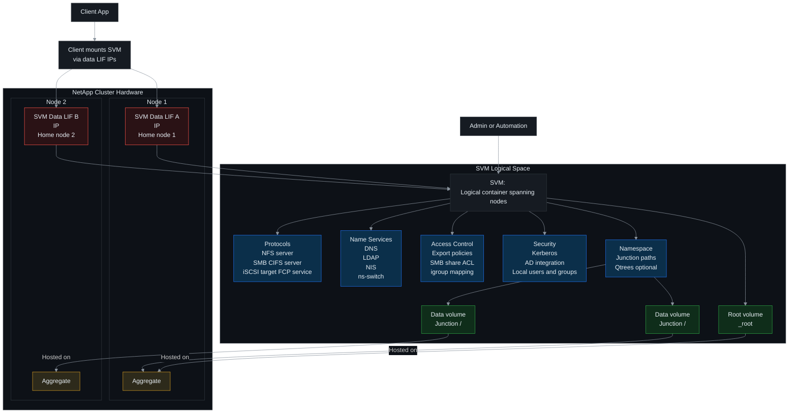

# 🧠 NetApp ONTAP (9.x) — SVM / vserver Operations (Scratch ➜ Advanced) 🚀
> ✅ **Rule:** This cheat-sheet sticks to **SVM/vserver-scoped CLI commands** (commands that start with `vserver ...`).
> 🏷️ Replace placeholders like `<SVM> <AGGR> <IPSPACE> <DOMAIN> <DNS1> ...`

## 📑 Table of Contents
1. [🧰 0) Quick CLI Helpers](#🧰-0-quick-cli-helpers)
2. [🆕 1) Create an SVM (vserver) — from scratch](#🆕-1-create-an-svm-vserver-from-scratch)
3. [👀 2) Show / Inventory / Inspect](#👀-2-show--inventory--inspect)
4. [🟢🔴 3) Start / Stop SVM (admin state)](#🟢🔴-3-start--stop-svm-admin-state)
5. [✍️ 4) Modify / Rename / Delete SVM](#✍️-4-modify--rename--delete-svm)
6. [🌐 5) Name Services (DNS / LDAP / NIS / ns-switch)](#🌐-5-name-services-dns--ldap--nis--ns-switch)
7. [✅ Mini Tips](#✅-mini-tips)

---

---

## 🧰 0) Quick CLI Helpers
- `man vserver`
- `man vserver create`
- `vserver ?`
- `vserver create ?`
- `set -privilege advanced`  ⚙️
- `set -privilege admin`    ✅

---

## 🆕 1) Create an SVM (vserver) — from scratch

### 1.1 Basic SVM create (explicit root volume + aggregate)
- `vserver create -vserver <SVM> -rootvolume <SVM>_root -aggregate <AGGR> -rootvolume-security-style unix -language C.UTF-8`

### 1.2 Common create options (pick what you need)
- `vserver create -vserver <SVM> -rootvolume <SVM>_root -aggregate <AGGR> -rootvolume-security-style unix -language C.UTF-8 -comment "App SVM"`
- `vserver create -vserver <SVM> -rootvolume <SVM>_root -aggregate <AGGR> -rootvolume-security-style ntfs -language C.UTF-8`
- `vserver create -vserver <SVM> -rootvolume <SVM>_root -aggregate <AGGR> -rootvolume-security-style mixed -language C.UTF-8`
- `vserver create -vserver <SVM> -rootvolume <SVM>_root -aggregate <AGGR> -ipspace <IPSPACE>`
- `vserver create -vserver <SVM> -rootvolume <SVM>_root -aggregate <AGGR> -snapshot-policy <SNAP_POLICY>`
- `vserver create -vserver <SVM> -rootvolume <SVM>_root -aggregate <AGGR> -quota-policy <QUOTA_POLICY_NAME>`  (policy must exist)

### 1.3 Allowed/Disallowed protocols at creation (optional)
- `vserver create -vserver <SVM> -rootvolume <SVM>_root -aggregate <AGGR> -allowed-protocols nfs,cifs`
- `vserver create -vserver <SVM> -rootvolume <SVM>_root -aggregate <AGGR> -allowed-protocols nfs,iscsi`
- `vserver create -vserver <SVM> -rootvolume <SVM>_root -aggregate <AGGR> -disallowed-protocols s3`

---

## 👀 2) Show / Inventory / Inspect

### 2.1 List SVMs
- `vserver show`
- `vserver show -vserver <SVM>`

### 2.2 Show fields (pick useful ones)
- `vserver show -fields vserver,type,subtype,admin-state,operational-state,rootvolume,aggregate,language,snapshot-policy,quota-policy,comment`
- `vserver show -vserver <SVM> -fields allowed-protocols,disallowed-protocols,ipspace,admin-state,operational-state`

### 2.3 Deep detail (everything)
- `vserver show -vserver <SVM> -instance`

### 2.4 Show protocols quickly
- `vserver show-protocols -vserver <SVM>`
- `vserver show -protocols`

---

## 🟢🔴 3) Start / Stop SVM (admin state)

### 3.1 Start / Stop
- `vserver start -vserver <SVM>`
- `vserver stop  -vserver <SVM>`

### 3.2 Run in background (optional)
- `vserver start -vserver <SVM> -foreground false`
- `vserver stop  -vserver <SVM> -foreground false`

---

## ✍️ 4) Modify / Rename / Delete SVM

### 4.1 Common modifies
- `vserver modify -vserver <SVM> -comment "Owned by AppTeam"`
- `vserver modify -vserver <SVM> -language C.UTF-8`
- `vserver modify -vserver <SVM> -snapshot-policy <SNAP_POLICY>`
- `vserver modify -vserver <SVM> -quota-policy <QUOTA_POLICY_NAME>`

### 4.2 Protocol control (safe patterns)
✅ Add protocols:
- `vserver add-protocols -vserver <SVM> -protocols nfs`
- `vserver add-protocols -vserver <SVM> -protocols cifs`
- `vserver add-protocols -vserver <SVM> -protocols iscsi`

⚠️ Remove protocols (disrupts access):
- `vserver remove-protocols -vserver <SVM> -protocols cifs`
- `vserver remove-protocols -vserver <SVM> -protocols nfs`

⚠️ Disallow protocols (also can disrupt if you mess up lists):
- `vserver modify -vserver <SVM> -disallowed-protocols nfs`
- `vserver modify -vserver <SVM> -disallowed-protocols cifs,iscsi`

### 4.3 Rename SVM
- `vserver rename -vserver <OLD_SVM> -newname <NEW_SVM>`

### 4.4 Delete SVM (destructive)
⚠️ You must delete all volumes (including root + mirrors) first.
- `vserver delete -vserver <SVM>`
- `vserver delete -vserver <SVM> -foreground false`

---

## 🌐 5) Name Services (DNS / LDAP / NIS / ns-switch)

### 5.1 DNS (create / show / modify / delete / check)
Create:
- `vserver services name-service dns create -vserver <SVM> -domains <DOMAIN1>,<DOMAIN2> -name-servers <DNS1>,<DNS2>`

Show:
- `vserver services name-service dns show -vserver <SVM>`
- `vserver services name-service dns show -vserver <SVM> -instance`

Modify:
- `vserver services name-service dns modify -vserver <SVM> -domains <DOMAIN1>,<DOMAIN2> -name-servers <DNS1>,<DNS2>`
- `vserver services name-service dns modify -vserver <SVM> -timeout 2 -attempts 1`

Delete (removes mapping completely):
- `vserver services name-service dns delete -vserver <SVM>`

Check:
- `vserver services name-service dns check -vserver <SVM>`

### 5.2 LDAP Client (IMPORTANT: use -ldap-servers)
Create LDAP client config:
- `vserver services name-service ldap client create -vserver <SVM> -client-config <LDAP_CLIENT_NAME> -schema RFC-2307 -ldap-servers <LDAP1>,<LDAP2> -base-dn <BASE_DN>`

Show:
- `vserver services name-service ldap client show -vserver <SVM>`
- `vserver services name-service ldap client show -vserver <SVM> -client-config <LDAP_CLIENT_NAME> -instance`

Modify:
- `vserver services name-service ldap client modify -vserver <SVM> -client-config <LDAP_CLIENT_NAME> -ldap-servers <LDAP1>,<LDAP2>`
- `vserver services name-service ldap client modify -vserver <SVM> -client-config <LDAP_CLIENT_NAME> -base-dn <BASE_DN>`

Delete:
- `vserver services name-service ldap client delete -vserver <SVM> -client-config <LDAP_CLIENT_NAME>`

### 5.3 LDAP (enable LDAP for the SVM)
Create:
- `vserver services name-service ldap create -vserver <SVM> -client-config <LDAP_CLIENT_NAME>`

Show:
- `vserver services name-service ldap show -vserver <SVM>`
- `vserver services name-service ldap show -vserver <SVM> -instance`

Modify:
- `vserver services name-service ldap modify -vserver <SVM> -client-config <LDAP_CLIENT_NAME>`

Delete:
- `vserver services name-service ldap delete -vserver <SVM>`

Check:
- `vserver services name-service ldap check -vserver <SVM>`

### 5.4 NIS
Create:
- `vserver services name-service nis-domain create -vserver <SVM> -domain <NIS_DOMAIN> -nis-servers <NIS1>,<NIS2>`

Show:
- `vserver services name-service nis-domain show -vserver <SVM>`

Modify:
- `vserver services name-service nis-domain modify -vserver <SVM> -domain <NIS_DOMAIN> -nis-servers <NIS1>,<NIS2>`

Delete:
- `vserver services name-service nis-domain delete -vserver <SVM> -domain <NIS_DOMAIN>`

### 5.5 ns-switch (controls lookup order: files/ldap/nis/dns)
Show:
- `vserver services name-service ns-switch show -vserver <SVM>`

Create / Modify (examples):
- `vserver services name-service ns-switch create -vserver <SVM> -database passwd -sources files,ldap`
- `vserver services name-service ns-switch create -vserver <SVM> -database group  -sources files,ldap`
- `vserver services name-service ns-switch create -vserver <SVM> -database hosts  -sources files,dns`

- `vserver services name-service ns-switch modify -vserver <SVM> -database passwd -sources files,ldap`
- `vserver services name-service ns-switch modify -vserver <SVM> -database hosts  -sources files,dns`

---

## ✅ Mini Tips
- 🧭 Always verify on your cluster: `man <command>` / `<command> ?` (options vary a bit across 9.x).
- ⚠️ Protocol changes can disrupt client access—use `vserver show-protocols` before/after.
- 🧩 This file is **vserver-only** by design. Network LIFs/routes/firewall/service-policies live under `network ...` commands (not included here).
