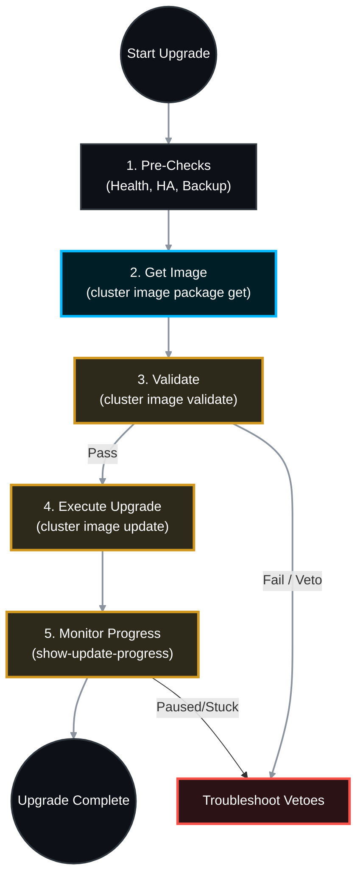

# 🚀 NetApp ONTAP: Master CLI Upgrade & Troubleshooting SOP

While the GUI is convenient, enterprise Storage Administrators often prefer the Command Line Interface (CLI) for ONTAP upgrades. The CLI provides granular control, immediate visibility into background processes, and direct access to troubleshoot vetoes without relying on a web interface that might momentarily disconnect during node reboots.

This Master Standard Operating Procedure (SOP) covers the Automated Non-Disruptive Upgrade (ANDU) process entirely via the CLI, including staging, execution, and troubleshooting.

> 🏷️ **Rule:** Replace placeholders like `<Web_Server_IP>`, `<Image_Name.tgz>`, and `<Target_Version>` with your specific details.

---

## 📋 Table of Contents
1. [🕵️ Phase 1: Pre-Upgrade Readiness Checks](#phase-1)
2. [📦 Phase 2: Staging the Software Image](#phase-2)
3. [💻 Phase 3: Executing the Automated Upgrade (ANDU)](#phase-3)
4. [✅ Phase 4: Post-Upgrade Verification](#phase-4)
5. [🚨 Phase 5: Common Upgrade Errors & Troubleshooting](#phase-5)
6. [📚 Official NetApp Documentation Reference](#references)

---



---

## 🕵️ Phase 1: Pre-Upgrade Readiness Checks

*Never start an upgrade without verifying the baseline health of the cluster.*

### 1.1 Verify Cluster Health & High Availability

Ensure all nodes are healthy and HA is fully operational.

```bash
# Check overall cluster health
cluster show
system health status show

# Verify HA is enabled and connected
storage failover show

```

### 1.2 Verify Disks and Network

```bash
# Ensure there are no broken or unassigned disks
storage disk show -broken
storage disk show -container-type unassigned

# Verify all LIFs are on their home ports
network interface show -is-home false

```

### 1.3 Take a Pre-Upgrade Backup

*Always force a fresh configuration backup before modifying the OS.*

```bash
system configuration backup create -node * -backup-name Pre_Upgrade_Backup_9x

```

---

## 📦 Phase 2: Staging the Software Image

*To use the CLI, you must host the ONTAP `.tgz` file on an internal web server (HTTP/HTTPS) or FTP server so the cluster can download it.*

### 2.1 Download the Image to the Cluster Workspace

```bash
# Instruct the cluster to fetch the image from your web server
cluster image package get -url http://<Web_Server_IP>/<Image_Name.tgz>

```

### 2.2 Verify the Package is Loaded

```bash
# Confirm the package is successfully loaded into the cluster repository
cluster image package show-repository

```

---

## 💻 Phase 3: Executing the Automated Upgrade (ANDU)

### 3.1 Run the Validation Pre-Check

*This command simulates the upgrade to catch capacity, LIF, or CIFS issues before touching any nodes.*

```bash
cluster image validate -version <Target_Version>

```

*Wait for the validation to finish. Run `cluster image show-update-progress` to see the validation results. Address any warnings or errors.*

### 3.2 Start the Upgrade

*Once validation passes, trigger the rolling upgrade.*

```bash
cluster image update -version <Target_Version>

```

### 3.3 Monitor the Upgrade Progress

*This is the most important command during the upgrade window. Run it repeatedly to watch the cluster migrate LIFs, takeover, reboot, and giveback.*

```bash
cluster image show-update-progress

```

---

## ✅ Phase 4: Post-Upgrade Verification

*Once `show-update-progress` reports "Completed", verify the environment.*

### 4.1 Confirm the New Version

```bash
version
cluster image show

```

### 4.2 Revert Network LIFs

*Sometimes LIFs do not automatically migrate back to their home ports after the final node reboots.*

```bash
# Check for displaced LIFs
network interface show -is-home false

# Revert them home
network interface revert -vserver * -lif *

```

### 4.3 Verify HA and Storage

```bash
storage failover show
storage aggregate show -state !online

```

---

## 🚨 Phase 5: Common Upgrade Errors & Troubleshooting

During the `cluster image show-update-progress` monitoring, the status might change to **"Paused-on-Error"**. Here is how to fix the most common issues.

### ❌ Error 1: Validation Fails - Insufficient Space on Root Volume

* **Symptom:** The validation phase fails, stating `vol0` (the root aggregate) lacks space to extract the image.
* **Resolution:**
```bash
# 1. Delete the previous (now obsolete) ONTAP image from the node
system node image delete -node <Node_Name> -image <Old_Image_Name>

# 2. Delete old core dump files
system node coredump delete-all -node <Node_Name>

# 3. Resume the update
cluster image resume-update

```


### ❌ Error 2: "Takeover of Node X is Vetoed"

* **Symptom:** The upgrade pauses before rebooting a node because a process refuses to be interrupted.
* **Resolution:**
```bash
# 1. Check exactly what is vetoing the takeover
storage failover show-takeover

```


* **NDMP Veto:** A backup is running. Cancel the backup job on your backup server, then run `cluster image resume-update`.
* **CIFS Veto:** Active SMB3 Continuous Availability sessions exist. If acceptable, force the takeover (⚠️ *Causes brief CIFS pause*):
```bash
storage failover takeover -ofnode <Node_Name> -override-vetoes true

```


### ❌ Error 3: "Giveback of Node X is Vetoed / Failed"

* **Symptom:** Node 1 reboots onto the new version perfectly, but Node 2 refuses to give the aggregates back. The upgrade halts.
* **Resolution:**
```bash
# 1. Check exactly what is vetoing the giveback
storage failover show-giveback

```


* **Disk Inventory Veto:** Node 1 booted up but cannot see all its disk shelves. **DO NOT OVERRIDE.** Check physical SAS cables.
* **Background Process Veto:** A minor process (like disk scrub) is running. It is safe to override:
```bash
storage failover giveback -ofnode <Node_1> -override-vetoes true

```


* Once giveback completes, resume the overall upgrade:
```bash
cluster image resume-update

```


### ❌ Error 4: Network LIF Migration Veto

* **Symptom:** Validation or upgrade fails because a LIF cannot migrate to the partner node.
* **Root Cause:** A LIF is missing a failover group, or the target port is down.
* **Resolution:**
```bash
# Check failover rules for the problem LIF
network interface show -failover

# Ensure the LIF has a path to the partner node. If it is a SAN (FC/iSCSI) LIF, ignore the warning (SAN LIFs do not migrate) and resume:
cluster image resume-update

```


---

## 📚 Official NetApp Documentation Reference

| Task / Operation | Official NetApp Documentation Reference |
| --- | --- |
| **Download Image (CLI)** | [Docs: cluster image package get](https://docs.netapp.com/us-en/ontap-cli/cluster-image-package-get.html) |
| **Execute Upgrade (CLI)** | [Docs: cluster image update](https://docs.netapp.com/us-en/ontap-cli/cluster-image-update.html) |
| **Monitor Upgrade (CLI)** | [Docs: cluster image show-update-progress](https://docs.netapp.com/us-en/ontap-cli/cluster-image-show-update-progress.html) |
| **Troubleshoot Vetoes** | [Docs: Takeover and Giveback Vetoes](https://www.google.com/search?q=https://docs.netapp.com/us-en/ontap/high-availability/ha_commands_for_troubleshooting_takeover_and_giveback_vetoes.html) |
| **Freeing Root Space** | [Docs: Free space on the root volume](https://www.google.com/search?q=https://docs.netapp.com/us-en/ontap/upgrade/task_free_space_on_root_vol.html) |


