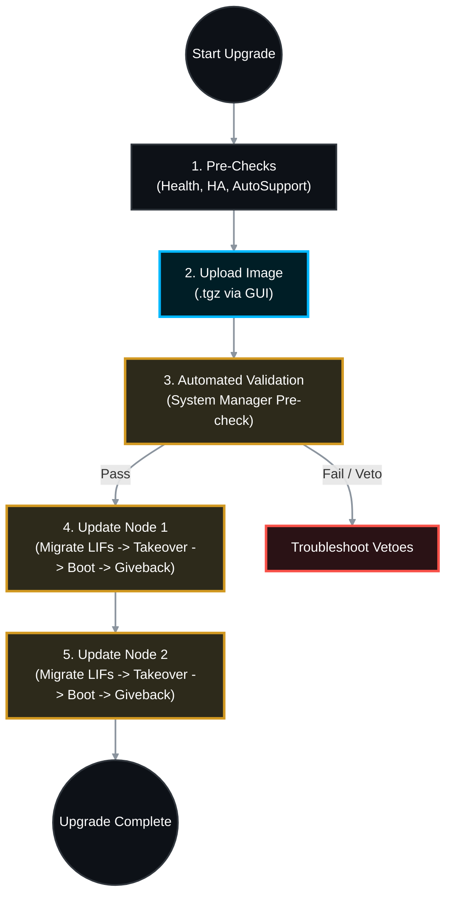

# 🚀 NetApp ONTAP: Master GUI Upgrade & Troubleshooting SOP

Upgrading NetApp ONTAP via the graphical System Manager is an Automated Non-Disruptive Upgrade (NDU). The cluster automatically handles moving data LIFs, taking over nodes, updating the software, and giving back storage, ensuring zero downtime for client applications.

This comprehensive Standard Operating Procedure (SOP) covers the entire lifecycle of a GUI-based upgrade, including pre-flight checks, the update process, and a deep dive into common upgrade errors and their resolutions.

---

## 📋 Table of Contents
1. [🕵️ Phase 1: Pre-Upgrade Readiness Checks](#phase-1)
2. [📦 Phase 2: Downloading & Staging the Image](#phase-2)
3. [💻 Phase 3: The GUI Upgrade Process (System Manager)](#phase-3)
4. [✅ Phase 4: Post-Upgrade Verification](#phase-4)
5. [🚨 Phase 5: Common Upgrade Errors & Troubleshooting](#phase-5)
6. [📚 Official NetApp Documentation Reference](#references)

---

---

## 🕵️ Phase 1: Pre-Upgrade Readiness Checks

*Before touching the GUI, ensure the cluster is perfectly healthy. An unhealthy cluster will fail the upgrade validation.*

1. **Verify High Availability (HA):** Both nodes must be connected and ready for takeover.
* *CLI Verification:* `storage failover show` (Must say `true` and `Connected to <Partner>`).

2. **Resolve Hardware Faults:** Fix any failed disks, faulty power supplies, or disconnected SAS cables.
* *CLI Verification:* `system health status show` and `storage disk show -broken`.

3. **Check Active IQ Upgrade Advisor:** Generate an Upgrade Advisor report from the NetApp Active IQ portal to verify your upgrade path (e.g., 9.8 -> 9.12.1) is supported.
4. **Backup Configuration:** Generate a fresh cluster configuration backup.
* *CLI Verification:* `system configuration backup create -node * -backup-name Pre-Upgrade_Backup`

5. **Acknowledge/Clear Existing Alerts:** Clear stale alerts so new upgrade-related alerts are highly visible.

---

## 📦 Phase 2: Downloading & Staging the Image

1. Go to the [NetApp Support Site](https://mysupport.netapp.com/site/products/all/details/ontap9/downloads-tab).
2. Download the target ONTAP 9 software image.
* **Important:** Download the `.tgz` file (not the `.zip` or netboot file).

3. Save the `.tgz` file to your local workstation (or a local HTTP/Web server if preferred).

---

## 💻 Phase 3: The GUI Upgrade Process (System Manager)

*This process uses the modern ONTAP System Manager interface (ONTAP 9.8 and later).*

### Step 3.1: Navigate to the Update Interface

1. Log into ONTAP System Manager via your web browser (`https://<Cluster_Management_IP>`).
2. Navigate to **Cluster** -> **Overview**.
3. In the right-hand pane, look for the **Version** card. Click the **More Options** (three vertical dots) icon, and select **ONTAP Update**.

### Step 3.2: Add the Software Image

1. Click **+ Add Image**.
2. Select **From Local Client** (and browse to the `.tgz` file on your laptop) OR **From Server** (if hosting it on an internal HTTP server).
3. Wait for the upload to complete. System Manager will unpack the image to the cluster's memory.

### Step 3.3: Run the Automated Validation

1. Select the newly uploaded image and click **Update**.
2. System Manager will run a series of **Validation Pre-checks** (checking HA readiness, root volume space, CIFS active sessions, LIF migration paths).
3. Review any warnings. (e.g., "Active CIFS sessions detected" is a standard warning, but "Takeover not possible" is a hard stop).

### Step 3.4: Execute the Update

1. Check the box for **"Update the cluster"** (If you have a strict maintenance window, you can optionally pause after Node 1, but automated is usually best).
2. Click **Update**.
3. **The Automated Sequence Begins:**
* Node 1 LIFs migrate to Node 2.
* Node 2 takes over Node 1.
* Node 1 installs the new image and reboots.
* Node 2 gives back storage to Node 1.
* *The process repeats for Node 2.*

> ⚠️ **Warning:** You will lose connection to the System Manager GUI momentarily when the node hosting the Cluster Management LIF reboots. This is normal. Refresh the page after 2-3 minutes.

---

## ✅ Phase 4: Post-Upgrade Verification

1. **Verify ONTAP Version:** Check **Cluster > Overview** to ensure all nodes reflect the new target version.
2. **Verify HA Status:** Ensure HA is re-enabled and both nodes are communicating.
* *CLI Verification:* `storage failover show`

3. **Verify Network LIFs:** Ensure all Data and Node Management LIFs have successfully reverted to their home ports.
* *CLI Verification:* `network interface show -is-home false` (This should return empty).
* *If not empty, run:* `network interface revert -vserver * -lif *`

---

## 🚨 Phase 5: Common Upgrade Errors & Troubleshooting

Even with automated NDUs, the cluster will pause the upgrade if it detects a risk to data availability. These pauses are called **"Vetoes."**

### ❌ Error 1: Validation Fails - Insufficient Space on Root Volume

* **Symptom:** The pre-check fails stating the node's root volume (`vol0`) is at 100% capacity and cannot extract the `.tgz` file.
* **Root Cause:** Old ONTAP images, massive core dump files, or bloated log files are consuming the root aggregate.
* **Resolution (CLI):**
1. Delete the previous (now obsolete) software image:
`system node image delete -node <node_name> -image <old_image_name>`
2. Clear old core dump files:
`system node coredump delete-all -node <node_name>`
3. Resume the upgrade in the GUI.

### ❌ Error 2: "Takeover of Node X is Vetoed"

* **Symptom:** The upgrade starts, but pauses during the Takeover phase. The GUI shows a Takeover Veto.
* **Root Cause:** ONTAP actively blocks a takeover if it detects an operation that cannot be safely interrupted (e.g., an active NDMP backup job, a massive volume move, or un-migrated LIFs).
* **Resolution (CLI):**
1. Identify the veto reason:
`storage failover show-takeover`
2. Common Fixes:
* *NDMP Veto:* Cancel the active backup job or wait for it to finish.
* *CIFS Veto:* Active SMB3 continuous availability sessions. You may need to forcefully close them or schedule a maintenance window.

3. Resume the upgrade in the GUI once cleared.

### ❌ Error 3: "Giveback of Node X Failed / Vetoed"

* **Symptom:** Node 1 upgraded and rebooted successfully, but Node 2 refuses to "give back" the aggregates. The upgrade is stuck at 50%.
* **Root Cause:** When Node 1 rebooted, it couldn't see all of its disk shelves (SAS cable issue during reboot), or an active process on Node 2 is locking the aggregates.
* **Resolution (CLI):**
1. Identify the veto reason:
`storage failover show-giveback`
2. If the issue is a minor process (like a background disk scrub), you can force the giveback (⚠️ *Use caution*):
`storage failover giveback -ofnode <Node_1> -override-vetoes true`

### ❌ Error 4: Network LIF Migration Failed

* **Symptom:** The pre-check fails stating a Data LIF cannot be migrated.
* **Root Cause:** A Data LIF is pinned to a specific port and has no valid failover target, or the failover group is misconfigured. If ONTAP takes the node down, that IP address will go offline.
* **Resolution (CLI):**
1. Check failover rules:
`network interface show -failover`
2. Ensure the LIF has a failover path to its HA partner. You may need to temporarily modify the failover group or manually migrate the LIF:
`network interface migrate -vserver <SVM> -lif <LIF_Name> -destination-node <Partner_Node>`

---

## 📚 Official NetApp Documentation Reference

| Task / Operation | Official NetApp Documentation Reference |
| --- | --- |
| **Upgrade Advisor** | [Active IQ Upgrade Advisor Tool](https://activeiq.netapp.com/) |
| **Automated NDU Upgrade Guide** | [Docs: Update ONTAP software in System Manager](https://docs.netapp.com/us-en/ontap/upgrade/task_upgrade_ontap_system_manager.html) |
| **Understanding Vetoes** | [Docs: Storage failover takeover and giveback vetoes](https://docs.netapp.com/us-en/ontap/high-availability/ha_commands_for_troubleshooting_takeover_and_giveback_vetoes.html) |
| **Managing Root Volume Space** | [Docs: Freeing space on the root volume](https://docs.netapp.com/us-en/ontap/upgrade/task_free_space_on_root_vol.html) |

