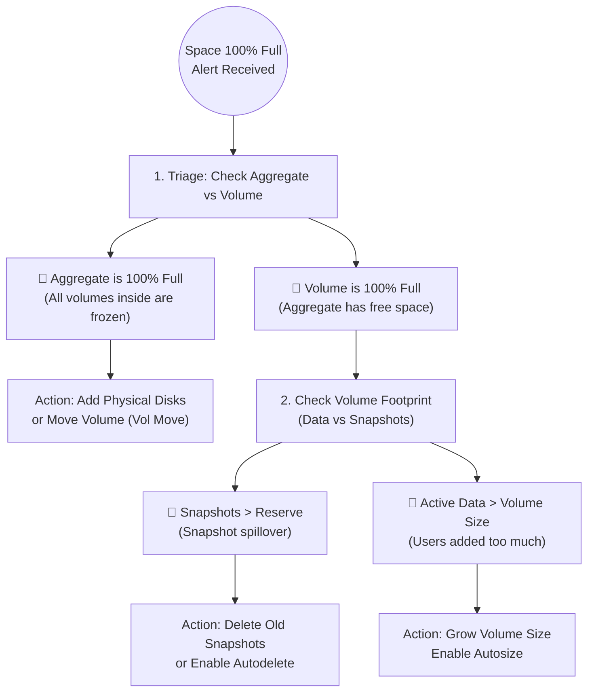

# 🚨 NetApp ONTAP: Emergency Space Recovery SOP (100% Full) 🛠️

When an alert fires that storage is 100% full, you must immediately determine the boundary of the issue. Is the physical disk pool (Aggregate) full, or just the logical container (Volume)? Are active files consuming the space, or are hidden Snapshots hoarding it? 

This SOP provides the exact, rapid-response steps to triage and resolve space exhaustion events.

> 🏷️ **Rule:** Replace placeholders like `<SVM>`, `<VOL>`, `<AGGR>`, and `<SNAP>` with your environment's details.

## 📑 Table of Contents
1. [🔍 Phase 1: Triage & Identification (Aggr vs Vol)](#phase-1)
2. [📸 Phase 2: Resolving Snapshot Space Exhaustion](#phase-2)
3. [📁 Phase 3: Resolving Volume Data Exhaustion](#phase-3)
4. [🧱 Phase 4: Resolving Aggregate Space Exhaustion](#phase-4)


---



---

<a id="phase-1"></a>
## 🔍 Phase 1: Triage & Identification
*Determine immediately if the crisis is at the physical hardware layer or the logical volume layer.*

```bash
# 1. Check if the underlying Aggregate is full
storage aggregate show -fields size,used,available,percent-used

# 2. Check if the specific Volume is full
volume show -vserver <SVM> -volume <VOL> -fields size,used,available,percent-used
```

> **🛠️ Action to Take:**
> * 👥 **Responsible Team:** **Storage Team**
> * **👀 What to Look For:** >   * If the **Aggregate** is >95% full, proceed directly to **Phase 4**. (You cannot grow a volume if the aggregate is full).
>   * If the Aggregate is fine, but the **Volume** is >98% full, run the footprint command to see *what* inside the volume is eating the space:
>     `volume show-footprint -vserver <SVM> -volume <VOL>`
>   * If `Volume Data Footprint` is huge, go to **Phase 3**.
>   * If `Snapshot Reserve` or `Snapshot Spill` is huge, go to **Phase 2**.

---

<a id="phase-2"></a>
## 📸 Phase 2: Resolving Snapshot Space Exhaustion
*The volume is full because users deleted or modified massive amounts of data, and the Snapshots are retaining the old copies, spilling over into the active data space.*

> **🛠️ Action to Take:**
> * 👥 **Responsible Team:** **Storage Team**
> * **🎯 Exact Actions:**
>   * **1. Delete Old Snapshots (Immediate Relief):**
>     List them: `volume snapshot show -vserver <SVM> -volume <VOL>`
>     Delete the oldest/largest: `volume snapshot delete -vserver <SVM> -volume <VOL> -snapshot <SNAP_NAME>`
>   * **2. Enable Snapshot Autodelete (Preventative):**
>     Tell ONTAP to automatically delete the oldest snapshots if the volume hits 85% full, preventing future outages.
>     ```bash
>     volume snapshot autodelete modify -vserver <SVM> -volume <VOL> -state on -trigger volume -target-free-space 15 -destroy-list oldest_first
>     ```
>   * **3. Increase Snapshot Reserve (Optional):**
>     If you *must* keep the snapshots, allocate more dedicated space for them (e.g., bump from 5% to 10%).
>     `volume modify -vserver <SVM> -volume <VOL> -percent-snapshot-space 10`

---

<a id="phase-3"></a>
## 📁 Phase 3: Resolving Volume Data Exhaustion
*The volume is full because users simply wrote too many active files (or a DB dump occurred). There is plenty of physical aggregate space available.*

> **🛠️ Action to Take:**
> * 👥 **Responsible Team:** **Storage Team** & **App/OS Team**
> * **🎯 Exact Actions:**
>   * **1. Grow the Volume Manually (Immediate Relief):**
>     Add 100GB to the volume instantly to restore application write access.
>     ```bash
>     volume size -vserver <SVM> -volume <VOL> -new-size +100GB
>     ```
>   * **2. Enable Volume Autosize (Preventative):**
>     Allow the volume to automatically grow in 10GB increments up to a 2TB maximum if it gets full again.
>     ```bash
>     volume autosize -vserver <SVM> -volume <VOL> -mode grow -maximum-size 2TB -grow-threshold-percent 85
>     ```
>   * **3. Clean Up (OS Team):** If the volume cannot be grown due to quota or cost policies, instruct the App/OS team to empty recycle bins or clear temp logs.

---

<a id="phase-4"></a>
## 🧱 Phase 4: Resolving Aggregate Space Exhaustion
*CRITICAL: If the physical Aggregate is 100% full, ALL volumes residing on it will go offline or become read-only. Growing a volume will not work.*

> **🛠️ Action to Take:**
> * 👥 **Responsible Team:** **Storage Team**
> * **🎯 Exact Actions:**
>   * **1. Move a Volume (Non-Disruptive Relief):**
>     Instantly start migrating a large volume to a different aggregate that has free space. Space will free up on the source as the move completes.
>     ```bash
>     volume move start -vserver <SVM> -volume <VOL_TO_MOVE> -destination-aggregate <DEST_AGGR>
>     ```
>   * **2. Add Physical Disks (Capacity Expansion):**
>     If no other aggregates have space, add spare disks to the full aggregate. *(Note: Ensure you are adding disks of the same type/speed).*
>     ```bash
>     storage aggregate add-disks -aggregate <AGGR> -diskcount 4
>     ```
>   * **3. Disable Thick Provisioning (Reclaim Space):**
>     Find volumes with `space-guarantee volume` and convert them to `none` (Thin Provisioning) to instantly release reserved, unused physical blocks back to the aggregate.
>     ```bash
>     volume modify -vserver <SVM> -volume <VOL> -space-guarantee none
>     ```

---

