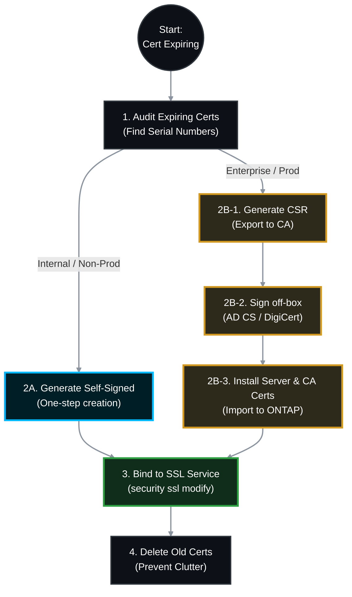

# 🔐 NetApp ONTAP: SSL Certificate Lifecycle Management SOP 🚀

SSL certificates for the Cluster Management interface and individual Storage Virtual Machines (SVMs) expire regularly. Failure to renew them breaks API integrations, SnapMirror authentications, Active Directory LDAP over SSL, and ONTAP System Manager GUI access.

This Standard Operating Procedure (SOP) provides the exact CLI workflows to securely renew certificates using either a **Self-Signed** approach (quick, internal only) or a **Trusted Certificate Authority (CA)** approach (Enterprise PKI/DigiCert).

> 🏷️ **Rule:** Replace placeholders like `<SVM_Name>`, `<FQDN>`, and `<Serial_Number>` with your environment's specific details.

---

## 📋 Table of Contents
1. [🕵️ Phase 1: Audit & Identify Expiring Certificates](#phase-1)
2. [🏗️ Phase 2A: The Self-Signed Renewal Process](#phase-2a)
3. [🏛️ Phase 2B: The Trusted CA Renewal Process (CSR)](#phase-2b)
4. [🔗 Phase 3: Bind the New Certificate to SSL](#phase-3)
5. [🗑️ Phase 4: Post-Renewal Cleanup](#phase-4)
6. [📚 Phase 5: Official NetApp Documentation Reference](#references)

---



---

<a id="phase-1"></a>

## 🕵️ Phase 1: Audit & Identify Expiring Certificates

*First, you must identify exactly which certificates are expiring and gather their current Serial Numbers to ensure you delete the correct ones later.*

> **🛠️ Action to Take:**
>
>   * 👥 **Responsible Team:** **Storage Team**
>   * **Execution:**
>     ```bash
>     # View all certificates expiring within the next 30 days
>     security certificate show -fields vserver,common-name,serial,expiration -expiration <30d
>     ```
>   * **Note:** Record the `serial` number of the expiring certificate. You will need it for Phase 4.

---

<a id="phase-2a"></a>

## 🏗️ Phase 2A: The Self-Signed Renewal Process

*Use this method for backend cluster communications, non-production SVMs, or environments that do not utilize a centralized Public Key Infrastructure (PKI).*

### 2A.1 Generate the Certificate

ONTAP will generate the private key and the public certificate simultaneously.

> **🛠️ Action to Take:**
>
>   * 👥 **Responsible Team:** **Storage Team**
>   * **Execution:**
>     ```bash
>     # Generate a new 365-day self-signed certificate
>     security certificate generate-self-signed -vserver <SVM_Name> -common-name <FQDN_or_IP> -size 2048 -days 365
>     ```
>   * **Output:** The CLI will display the `serial` number of the newly created certificate. **Write this down.** Skip to **Phase 3**.

---

<a id="phase-2b"></a>

## 🏛️ Phase 2B: The Trusted CA Renewal Process (CSR)

*Use this method for production SVMs, System Manager GUI access, or strict compliance environments. You will generate a request on ONTAP, sign it with your Security Team, and import the result.*

### 2B.1 Generate the Certificate Signing Request (CSR)

This creates a private key securely hidden inside ONTAP and generates a public CSR text block.

> **🛠️ Action to Take:**
>
>   * 👥 **Responsible Team:** **Storage Team**
>   * **Execution:**
>     ```bash
>     # Generate the CSR (Adjust State, Locality, and Org as needed)
>     security certificate generate-csr -vserver <SVM_Name> -common-name <FQDN_or_IP> -size 2048 -country US -state NY -locality "New York" -organization "MyCompany"
>     ```
>   * **Action:** Copy the output text block starting with `-----BEGIN CERTIFICATE REQUEST-----` and ending with `-----END CERTIFICATE REQUEST-----`.

### 2B.2 Sign the CSR (Off-Box)

>   * 👥 **Responsible Team:** **Security Team / Identity Mgmt**
>   * Provide the CSR text to your internal CA (e.g., Microsoft AD CS) or external CA (e.g., DigiCert).
>   * **Required Return:** You need the **Base64 encoded** Server Certificate, and the Root/Intermediate CA certificates.

### 2B.3 Install the Certificates into ONTAP

You must install the CA chain *before* installing the server certificate.

> **🛠️ Action to Take (Import Root/Intermediate CAs):**
>
>   * 👥 **Responsible Team:** **Storage Team**
>   * **Execution:** *(Skip if your Root CA is already installed on this SVM)*
>     ```bash
>     security certificate install -vserver <SVM_Name> -type server-ca
>     ```
>   * **Action:** Paste the Base64 Root CA text when prompted.

> **🛠️ Action to Take (Import the Server Certificate):**
>
>   * 👥 **Responsible Team:** **Storage Team**
>   * **Execution:**
>     ```bash
>     security certificate install -vserver <SVM_Name> -type server
>     ```
>   * **Action:** Paste the Base64 Server Certificate text when prompted. ONTAP will automatically marry this certificate to the hidden private key generated in Step 2B.1.
>   * **Output:** The CLI will output the new `serial` number. **Write this down.**

---

<a id="phase-3"></a>

## 🔗 Phase 3: Bind the New Certificate to SSL

*Generating or installing the certificate does nothing until you explicitly tell ONTAP's SSL service to use it.*

> **🛠️ Action to Take:**
>
>   * 👥 **Responsible Team:** **Storage Team**
>   * **Execution:**
>     ```bash
>     # Bind the new certificate using its Serial Number
>     security ssl modify -vserver <SVM_Name> -server-enabled true -client-enabled false -serial <NEW_Serial_Number>
>     ```
>   * **Impact:** Existing active CIFS/NFS connections are **not** disrupted. However, any open REST API sessions or System Manager GUI web browsers will instantly drop and require a page refresh/re-authentication.

---

<a id="phase-4"></a>

## 🗑️ Phase 4: Post-Renewal Cleanup

*Leaving expired certificates on the cluster triggers daily AutoSupport warnings and clutters the security logs.*

> **🛠️ Action to Take:**
>
>   * 👥 **Responsible Team:** **Storage Team**
>   * **Execution:**
>     ```bash
>     # Verify the old certificate is no longer in use
>     security certificate show -vserver <SVM_Name> -serial <OLD_Serial_Number>
>     
>     # Delete the old expired certificate
>     security certificate delete -vserver <SVM_Name> -common-name <FQDN_or_IP> -serial <OLD_Serial_Number> -type server
>     ```

---

<a id="references"></a>

## 📚 Phase 5: Official NetApp Documentation Reference

*All commands utilized in this SOP are sourced from the official NetApp ONTAP 9 Documentation Center.*

| Task | Official NetApp Documentation Reference |
| :--- | :--- |
| **Audit Certificates** | [Docs: security certificate show](https://docs.netapp.com/us-en/ontap-cli/security-certificate-show.html) |
| **Generate Self-Signed** | [Docs: security certificate generate-self-signed](https://docs.netapp.com/us-en/ontap-cli/security-certificate-generate-self-signed.html) |
| **Generate CSR** | [Docs: security certificate generate-csr](https://docs.netapp.com/us-en/ontap-cli/security-certificate-generate-csr.html) |
| **Install Certificate** | [Docs: security certificate install](https://docs.netapp.com/us-en/ontap-cli/security-certificate-install.html) |
| **Bind SSL / Modify** | [Docs: security ssl modify](https://docs.netapp.com/us-en/ontap-cli/security-ssl-modify.html) |
