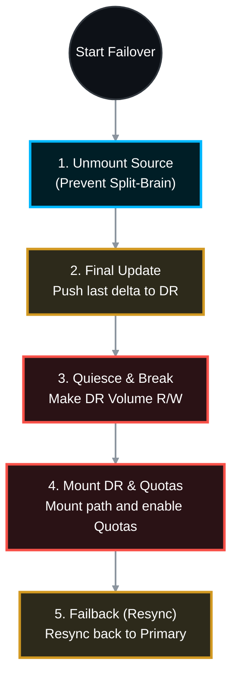

# 🔄 NetApp ONTAP: NFS Export Failover & Failback SOP 🛡️

Based on the command outputs provided in your images, your environment utilizes **Volume-level SnapMirror** with manual quota management on the destination side, as well as some **Vserver-level (SVM-DR)** relationships. 

This Standard Operating Procedure (SOP) is engineered for NetApp Managed Service Professionals. It maps exactly to your provided command structure while aligning with official NetApp ONTAP 9 disaster recovery best practices for NFS workloads.

> 🏷️ **Context Variables Used in this SOP:**
> * **Source SVM:** `YBALSVM039UPI`
> * **Source Volume:** `YBALVOL039UPI`
> * **Destination (DR) SVM:** `YBBRSVM039UPI`
> * **Destination (DR) Volume:** `YBALVOL039UPI`

---

## 📑 Table of Contents
1. [🚨 Phase 1: Planned Failover (Primary to DR)](#phase-1)
2. [⚙️ Phase 2: Quota & Namespace Initialization (DR Site)](#phase-2)
3. [🔄 Phase 3: Failback Preparation (Reverse Resync)](#phase-3)
4. [✅ Phase 4: Finalizing Failback (Restoring Primary)](#phase-4)

---



---

<a id="phase-1"></a>
## 🚨 Phase 1: Planned Failover (Primary to DR)
*This sequence transfers operations to the Disaster Recovery site. For a planned failover, NetApp best practice dictates unmounting the source first to ensure zero data loss and prevent split-brain scenarios.*

### 1.1 Unmount the Source Volume (Prevent Client I/O)
*Run on the Source Cluster:*
```bash
vol unmount -vserver YBALSVM039UPI -volume YBALVOL039UPI
```

### 1.2 Perform Final SnapMirror Update
*Run on the Destination Cluster:*
Ensure the absolute latest data is pushed to the DR site before breaking the mirror.
```bash
snapmirror update -destination-path YBBRSVM039UPI:YBALVOL039UPI
```
*(Wait for the transfer to complete by checking `snapmirror show -destination-path YBBRSVM039UPI:YBALVOL039UPI`)*

### 1.3 Quiesce the SnapMirror
*Run on the Destination Cluster:*
Pause any background transfers to ensure a clean break.
```bash
snapmirror quiesce -destination-path YBBRSVM039UPI:YBALVOL039UPI
```

### 1.4 Break the SnapMirror
*Run on the Destination Cluster:*
This transitions the DR volume from Read-Only (`DP`) to Read/Write (`RW`).
```bash
snapmirror break -destination-path YBBRSVM039UPI:YBALVOL039UPI
```

---

<a id="phase-2"></a>
## ⚙️ Phase 2: Quota & Namespace Initialization (DR Site)
*Because Volume-level SnapMirror does not automatically activate quotas on the destination, you must manually mount the volume and configure the quota rules as shown in your script.*

### 2.1 Mount the DR Volume
*Run on the Destination Cluster:*
Mount the volume into the DR SVM's namespace so NFS clients can access it.
```bash
vol mount -vserver YBBRSVM039UPI -volume YBALVOL039UPI -junction-path /YBALVOL039UPI
```

### 2.2 Create and Enable Quota Rules
*Run on the Destination Cluster:*
Apply the specific Qtree disk limits to prevent the volume from overfilling at the DR site.
```bash
# Create the quota policy rule
quota policy rule create -vserver YBBRSVM039UPI -policy-name default -volume YBALVOL039UPI -type tree -target YBALQTR039UPI -disk-limit 100GB -soft-disk-limit 80GB -threshold 70GB

# Turn the quota engine ON for the volume
quota on -vserver YBBRSVM039UPI -volume YBALVOL039UPI
```
*At this point, you instruct the network/application teams to update DNS or remount the NFS exports using the DR SVM's IP addresses.*

---

<a id="phase-3"></a>
## 🔄 Phase 3: Failback Preparation (Reverse Resync)
*When the primary site is restored, you must sync the data changes made at the DR site back to the original source. Your second image shows the `resync` commands for both Volume and Vserver levels.*

### 3.1 Establish the Reverse Resync
*Run on the Original Source Cluster:*
This command overwrites the original source volume with the updated data from the DR site.

**For Volume-Level SnapMirror:**
```bash
# Replace placeholders with your actual original source SVM/Vol and current DR SVM/Vol
snapmirror resync -source-path YBBRSVM039UPI:YBALVOL039UPI -destination-path YBALSVM039UPI:YBALVOL039UPI
```

**For Vserver-Level (SVM-DR) SnapMirror:**
*(If you are failing back an entire SVM at once, as shown in your second screenshot)*
```bash
# Example from your screenshot syntax
snapmirror resync -source-path <DR_SVM>: -destination-path YBALSVM019NGA01:
```

---

<a id="phase-4"></a>
## ✅ Phase 4: Finalizing Failback (Restoring Primary)
*Once the reverse resync is complete (`Status: Idle`), you must transition client access back to the primary site.*

### 4.1 Unmount DR and Final Update
1. Unmount the DR Volume to stop client I/O.
   ```bash
   vol unmount -vserver YBBRSVM039UPI -volume YBALVOL039UPI
   ```
2. Perform one final `snapmirror update` from the Original Source Cluster to catch the last few seconds of data.
   ```bash
   snapmirror update -destination-path YBALSVM039UPI:YBALVOL039UPI
   ```

### 4.2 Break Reverse Mirror & Remount Primary
*Run on the Original Source Cluster:*
```bash
snapmirror quiesce -destination-path YBALSVM039UPI:YBALVOL039UPI
snapmirror break -destination-path YBALSVM039UPI:YBALVOL039UPI

# Remount the primary volume
vol mount -vserver YBALSVM039UPI -volume YBALVOL039UPI -junction-path /YBALVOL039UPI
```

### 4.3 Re-establish Original Protection (Forward Resync)
*Run on the Destination (DR) Cluster:*
To ensure the primary site is protected again, resync the mirror back to its original direction.
```bash
snapmirror resync -source-path YBALSVM039UPI:YBALVOL039UPI -destination-path YBBRSVM039UPI:YBALVOL039UPI
```

Your environment is now completely failed back to the primary site, quotas are active, and DR replication is fully restored.
