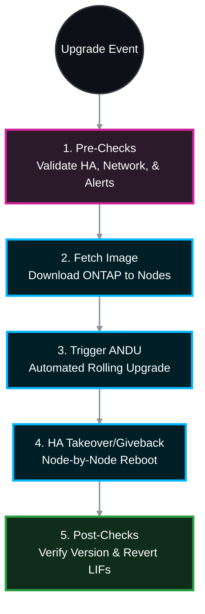

# 🚀 NetApp ONTAP: Enterprise Automated Non-Disruptive Upgrade (ANDU) SOP 🛠️

This Standard Operating Procedure (SOP) is strictly designed for Managed Service Professionals executing a NetApp ONTAP upgrade. It follows the official NetApp Automated Non-Disruptive Upgrade (ANDU) methodology, ensuring zero downtime for NAS and SAN clients.

## 📑 Table of Contents
1. [📝 Phase 1: Planning & Preparation (Days Before)](#phase-1)
2. [🔍 Phase 2: Pre-Upgrade Health Checks (Hours Before)](#phase-2)
3. [⚙️ Phase 3: Upgrade Execution (ANDU)](#phase-3)
4. [✅ Phase 4: Post-Upgrade Verification](#phase-4)

---




---

<a id="phase-1"></a>
## 📝 Phase 1: Planning & Preparation (Days Before)
*Upgrading ONTAP blindly is a major risk. Always validate the environment against NetApp's matrices.*

### 1.1 Generate an Upgrade Advisor Plan
* Log into **NetApp Active IQ Digital Advisor**.
* Generate an Upgrade Advisor report for the specific cluster. This validates if the jump (e.g., 9.8 to 9.12.1) is supported or requires an intermediate hop.

### 1.2 Verify Compatibility (IMT)
* Check the **NetApp Interoperability Matrix Tool (IMT)**.
* Verify that your host OS (Windows/VMware/Linux), multipathing software (MPIO), and switch firmware (Brocade/Cisco) are officially supported on the target ONTAP version.

### 1.3 Download the ONTAP Image
* Download the target ONTAP image (`.tgz` file) from the NetApp Support Site.
* Host the image on an internal HTTP or FTP server accessible by the NetApp cluster management LIF.

---

<a id="phase-2"></a>
## 🔍 Phase 2: Pre-Upgrade Health Checks (Hours Before)
*A cluster must be in perfect health before initiating an upgrade. If any of these checks fail, DO NOT proceed.*

### 2.1 Verify Cluster and Node Health
```bash
cluster show
```
* **Ideal Output:** All nodes show `Health: true` and `Eligibility: true`.

```bash
system health alert show
```
* **Ideal Output:** `This table is currently empty.` (Clear any active hardware or configuration alerts before proceeding).

### 2.2 Verify Storage Failover (HA) Status
*ANDU relies entirely on HA takeover and giveback.*
```bash
storage failover show
```
* **Ideal Output:** `Takeover Possible: true` and `State: Connected to <partner>`.

### 2.3 Verify Network Interface (LIF) Status
*Ensure no LIFs are stranded on a node that might reboot.*
```bash
network interface show -is-home false
```
* **Ideal Output:** `This table is currently empty.` (If LIFs are not home, run `network interface revert -vserver * -lif *`).

### 2.4 Verify Aggregate and Volume Space
*ONTAP needs space for the new image and snapshots during the upgrade.*
```bash
storage aggregate show -has-mroot true
```
* **Ideal Output:** Ensure root aggregates have at least 20-30% free space.

### 2.5 Trigger Pre-Upgrade AutoSupport & Backup
```bash
# Send a manual AutoSupport to NetApp logging the start of the upgrade
system node autosupport invoke -node * -type all -message "MAINT=Xh starting ONTAP upgrade"

# Create a manual cluster configuration backup
system configuration backup create -node * -backup-name pre_upgrade_backup_$(date +%Y%m%d)
```
* **Ideal Output:** Confirmation that the AutoSupport message was queued and the backup was created successfully.

---

<a id="phase-3"></a>
## ⚙️ Phase 3: Upgrade Execution (ANDU)
*NetApp's Automated Non-Disruptive Upgrade process will handle the rolling reboots, LIF migrations, and HA takeovers automatically.*

### 3.1 Load the ONTAP Image onto the Cluster
```bash
# Fetch the image from your internal web server
cluster image package get -url http://<your-web-server>/<ontap-image-name>.tgz
```
* **Ideal Output:** `Package download completed successfully.`

### 3.2 Validate the Upgrade (Dry Run)
*Always run the validation check to let ONTAP warn you of any blocking issues.*
```bash
cluster image update -version <Target_ONTAP_Version> -validate true
```
* **Ideal Output:** `Validation successful. No warnings or errors.` (If warnings appear, assess them. Errors must be resolved).

### 3.3 Execute the Automated Upgrade
*This command initiates the actual upgrade. It will migrate LIFs, perform a takeover, update the partner, reboot it, perform a giveback, and repeat for all nodes.*
```bash
cluster image update -version <Target_ONTAP_Version>
```
* **Ideal Output:** `Update started.`

### 3.4 Monitor the Upgrade Progress
*Open a second SSH session to the Service Processor (SP/BMC) or cluster IP to monitor the progress.*
```bash
# Check the overarching cluster update status
cluster image update show

# Watch the specific task progression (Takeover, Reboot, Giveback)
cluster image update progress show
```

---

<a id="phase-4"></a>
## ✅ Phase 4: Post-Upgrade Verification
*Once the `cluster image update show` command reports `Completed`, verify the cluster's stability.*

### 4.1 Verify Target ONTAP Version
```bash
version
```
* **Ideal Output:** Displays the new, target ONTAP version (e.g., `NetApp Release 9.12.1P1`).

```bash
cluster image show
```
* **Ideal Output:** Both the `Current Version` and `Default Version` show the new ONTAP release for all nodes.

### 4.2 Verify HA Status is Restored
```bash
storage failover show
```
* **Ideal Output:** `Takeover Possible: true`.

### 4.3 Revert Network Interfaces (LIFs)
*ANDU migrates LIFs away from rebooting nodes. We must return them to their home ports.*
```bash
# Revert all LIFs to their home nodes
network interface revert -vserver * -lif *

# Verify no LIFs are displaced
network interface show -is-home false
```
* **Ideal Output:** The second command should return `This table is currently empty.`

### 4.4 Verify SAN/NAS Protocol Health
```bash
# Check CIFS and NFS servers are running
vserver cifs show -status !up
vserver nfs show -status !up

# Check SAN (FCP/iSCSI) interfaces are online
network interface show -data-protocol fcp|iscsi -status-oper !up
```
* **Ideal Output:** All of these commands should return `This table is currently empty.` (Meaning nothing is down).

### 4.5 Send Post-Upgrade AutoSupport
```bash
system node autosupport invoke -node * -type all -message "MAINT=END ONTAP upgrade completed successfully"
```
* **Ideal Output:** AutoSupport queued successfully. 

The NetApp cluster is now successfully upgraded, highly available, and operating on the target ONTAP release!
