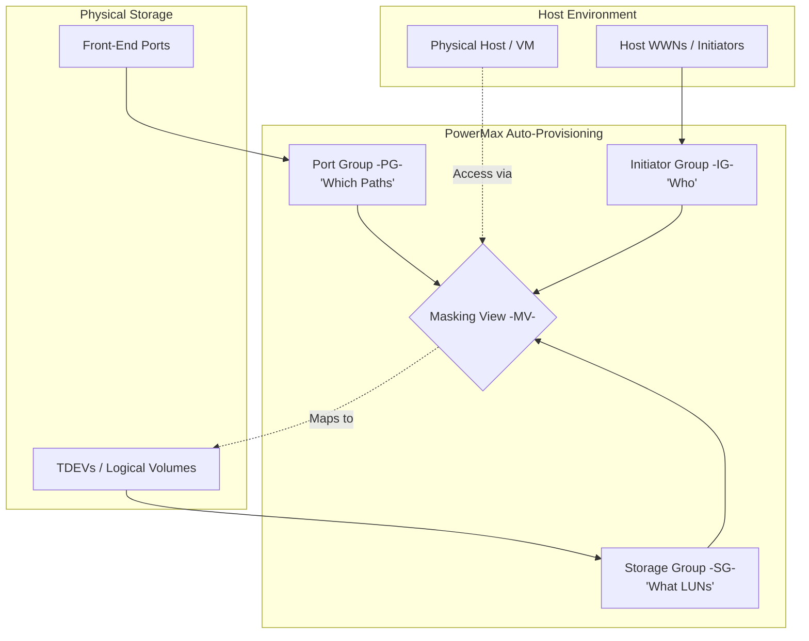

# 🚀 Standard Operating Procedure: PowerMax LUN Allocation

**System:** Dell EMC PowerMax  
**Management Tool:** Solutions Enabler (CLI) / Unisphere  
**Document Status:** Standardized Reference

---

## 📑 Table of Contents
* [1. 🎯 Purpose](#1-purpose)
* [2. 🔍 Pre-Provisioning: WWN Validation](#2-pre-provisioning-wwn-validation)
    * [2.1 🖥️ Array Side Check](#21-array-side-check)
    * [2.2 🔌 Switch Side Check](#22-switch-side-check)
* [3. 🗺️ Logical Architecture (Mermaid)](#3-logical-architecture-mermaid)
* [4. 🛠️ Provisioning Workflow (CLI)](#4-provisioning-workflow-cli)
    * [Step 1: 👤 Initiator Group (IG)](#step-1-initiator-group-ig)
    * [Step 2: 📦 Storage Group (SG)](#step-2-storage-group-sg)
    * [Step 3: ⚓ Port Group (PG)](#step-3-port-group-pg)
    * [Step 4: 🖼️ Masking View (MV)](#step-4-masking-view-mv)
* [5. 📊 Verification Summary](#5-verification-summary)

---

<a name="1-purpose"></a>
## 1. 🎯 Purpose
This SOP defines the standardized workflow for provisioning storage on a **Dell EMC PowerMax** array. Following the **Auto-Provisioning Groups** model ensures high availability, path redundancy, and consistent performance management.

---

<a name="2-pre-provisioning-wwn-validation"></a>
## 2. 🔍 Pre-Provisioning: WWN Validation
**Critical:** You must verify that the host HBAs (WWNs) are actively logged into the array fabric before attempting to add them to an Initiator Group.

<a name="21-array-side-check"></a>
### 2.1 🖥️ Array Side Check
Use this command to confirm the host is visible to the PowerMax Front-End ports:
> `symcfg -sid <SID> list -connections -v`

* **Status Check:** Ensure the `Logged In` status is **Yes**. If it is **No**, the host cannot "see" the storage even after masking.

<a name="22-switch-side-check"></a>
### 2.2 🔌 Switch Side Check
Verify the fabric login status on the SAN switch (Brocade/Cisco):
> `nodefind <WWN>`  
> *OR* > `portshow <Port_Number>`

---

<a name="3-logical-architecture-mermaid"></a>
## 3. 🗺️ Logical Architecture (Mermaid)
The following diagram represents how the logical components interact to present storage to a host.



---

## 4. 🛠️ Provisioning Workflow (CLI)

### Step 1: 👤 Initiator Group (IG) Creation

The IG identifies the host. Only add WWNs that passed the validation in Section 2.

1. **Create IG:** `symaccess -sid <SID> create -name <IG_Name> -type initiator`
2. **Add WWN:** `symaccess -sid <SID> -name <IG_Name> -type initiator add -wwn <WWN>`

### Step 2: 📦 Storage Group (SG) Creation

The SG contains the logical volumes (TDEVs) and assigns the Service Level.

1. **Create SG:** `symsg -sid <SID> create <SG_Name>`
2. **Create/Add LUNs:** `symsg -sid <SID> -sg <SG_Name> add dev -create -size <Size>GB -cap <Unit>`

### Step 3: ⚓ Port Group (PG) Creation

The PG defines which Front-End ports the host will use for data traffic.

1. **Create PG:** `symaccess -sid <SID> create -name <PG_Name> -type port`
2. **Add Ports:** `symaccess -sid <SID> -name <PG_Name> -type port add -dir <Dir> -port <Port>`

### Step 4: 🖼️ Masking View (MV) Creation

The MV is the "glue" that links the IG, SG, and PG to complete the allocation.

1. **Create View:** `symaccess -sid <SID> create view -name <MV_Name> -sg <SG_Name> -pg <PG_Name> -ig <IG_Name>`

---

## 5. 📊 Verification Summary

| Component | Emoji | Function | CLI Validation Command |
| --- | --- | --- | --- |
| **Login Check** | 📡 | Connectivity | `symcfg -sid <SID> list -connections` |
| **Initiator Group** | 👤 | Host Identity | `symaccess -sid <SID> show -name <IG_Name> -type initiator` |
| **Storage Group** | 📦 | LUN Container | `symsg -sid <SID> show <SG_Name>` |
| **Masking View** | ✅ | Final Presentation | `symaccess -sid <SID> show view <MV_Name>` |


```
